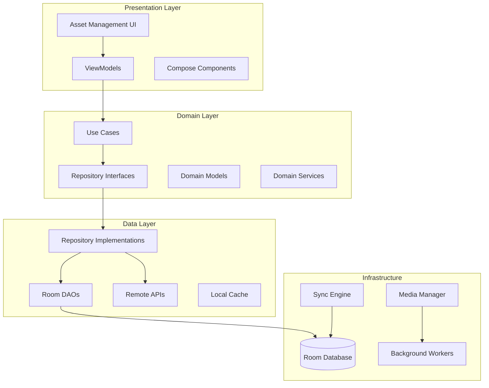
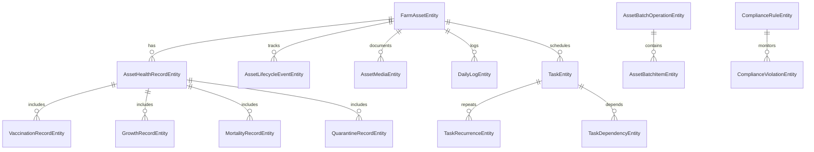

# Enhanced Farmer Asset Management System - Design Document

## Overview

The Enhanced Farmer Asset Management System extends the existing ROSTRY infrastructure to provide comprehensive individual asset tracking, advanced logging capabilities, intelligent task scheduling, and real-time performance analytics. This system transforms the current product-centric approach into a sophisticated asset lifecycle management platform that serves both enthusiast and commercial farm operations.

The design leverages existing infrastructure including `FarmAssetEntity`, `DailyLogEntity`, `TaskEntity`, health record entities, and the `MediaUploadManager` while introducing new components for enhanced functionality. The system maintains backward compatibility while providing scalable solutions for managing thousands of individual assets with complete traceability and regulatory compliance.

### Key Design Principles

- **Clean Architecture**: Separation of concerns with clear domain, data, and presentation layers
- **Offline-First**: All operations work without connectivity with intelligent sync
- **Scalability**: Efficient handling of thousands of assets with batch operations
- **Extensibility**: Modular design allowing easy addition of new asset types and features
- **Data Integrity**: Comprehensive audit trails and conflict resolution
- **Performance**: Optimized queries and background processing for responsive UI

## Architecture

### High-Level Architecture



### Enhanced Data Architecture

The system extends the existing data model with new entities and enhanced relationships:



## Components and Interfaces

### Core Domain Components

#### 1. Enhanced Asset Management

**AssetLifecycleManager**
```kotlin
interface AssetLifecycleManager {
    suspend fun createAsset(request: CreateAssetRequest): Result<FarmAssetEntity>
    suspend fun updateLifecycleStage(assetId: String, stage: LifecycleStage): Result<Unit>
    suspend fun graduateFromBatch(batchId: String, criteria: GraduationCriteria): Result<List<FarmAssetEntity>>
    suspend fun archiveAsset(assetId: String, reason: String): Result<Unit>
    suspend fun getAssetTimeline(assetId: String): Result<List<LifecycleEvent>>
}
```

**AssetTraceabilityService**
```kotlin
interface AssetTraceabilityService {
    suspend fun recordAcquisition(assetId: String, details: AcquisitionDetails): Result<Unit>
    suspend fun recordTransfer(assetId: String, details: TransferDetails): Result<Unit>
    suspend fun recordDisposition(assetId: String, details: DispositionDetails): Result<Unit>
    suspend fun generateTraceabilityReport(assetId: String): Result<TraceabilityReport>
    suspend fun validateTraceabilityChain(assetId: String): Result<ValidationResult>
}
```

#### 2. Advanced Daily Logging

**EnhancedDailyLogService**
```kotlin
interface EnhancedDailyLogService {
    suspend fun createBatchLog(request: BatchLogRequest): Result<List<DailyLogEntity>>
    suspend fun createIndividualLog(request: IndividualLogRequest): Result<DailyLogEntity>
    suspend fun attachMedia(logId: String, mediaItems: List<MediaItem>): Result<Unit>
    suspend fun validateLogEntry(request: LogRequest): ValidationResult
    suspend fun getLogHistory(assetId: String, dateRange: DateRange): Result<List<DailyLogEntity>>
}
```

**LogValidationEngine**
```kotlin
interface LogValidationEngine {
    fun validateRequiredFields(assetType: String, stage: LifecycleStage, log: LogRequest): ValidationResult
    fun validateDataRanges(log: LogRequest): ValidationResult
    fun validateBusinessRules(log: LogRequest, assetHistory: List<DailyLogEntity>): ValidationResult
}
```

#### 3. Intelligent Task Scheduling

**TaskSchedulingEngine**
```kotlin
interface TaskSchedulingEngine {
    suspend fun generateLifecycleTasks(assetId: String, stage: LifecycleStage): Result<List<TaskEntity>>
    suspend fun scheduleRecurringTask(template: TaskTemplate, recurrence: RecurrencePattern): Result<TaskEntity>
    suspend fun rescheduleTask(taskId: String, newDueDate: Long, reason: String): Result<Unit>
    suspend fun resolveSchedulingConflicts(tasks: List<TaskEntity>): Result<List<TaskEntity>>
    suspend fun generateWorkPlan(farmerId: String, dateRange: DateRange): Result<WorkPlan>
}
```

**TaskDependencyManager**
```kotlin
interface TaskDependencyManager {
    suspend fun addDependency(taskId: String, dependsOnTaskId: String): Result<Unit>
    suspend fun resolveDependencies(taskId: String): Result<List<TaskEntity>>
    suspend fun validateDependencyChain(taskId: String): Result<ValidationResult>
    suspend fun getBlockedTasks(farmerId: String): Result<List<TaskEntity>>
}
```

#### 4. Individual Health Records

**AssetHealthManager**
```kotlin
interface AssetHealthManager {
    suspend fun recordVaccination(assetId: String, vaccination: VaccinationRecord): Result<Unit>
    suspend fun recordTreatment(assetId: String, treatment: TreatmentRecord): Result<Unit>
    suspend fun recordGrowthMeasurement(assetId: String, measurement: GrowthMeasurement): Result<Unit>
    suspend fun initiateQuarantine(assetId: String, reason: String, protocol: QuarantineProtocol): Result<Unit>
    suspend fun recordMortality(assetId: String, details: MortalityDetails): Result<Unit>
    suspend fun getHealthSummary(assetId: String): Result<HealthSummary>
}
```

**VaccinationProtocolEngine**
```kotlin
interface VaccinationProtocolEngine {
    suspend fun generateVaccinationSchedule(assetId: String): Result<List<VaccinationScheduleItem>>
    suspend fun checkVaccinationCompliance(assetId: String): Result<ComplianceStatus>
    suspend fun getOverdueVaccinations(farmerId: String): Result<List<VaccinationAlert>>
    suspend fun updateProtocolForAssetType(assetType: String, protocol: VaccinationProtocol): Result<Unit>
}
```

#### 5. Media Management

**EnhancedMediaManager**
```kotlin
interface EnhancedMediaManager {
    suspend fun captureAndUpload(
        assetId: String,
        recordType: String,
        recordId: String,
        metadata: MediaMetadata
    ): Result<MediaItem>
    
    suspend fun batchUpload(mediaRequests: List<MediaUploadRequest>): Result<List<MediaItem>>
    suspend fun organizeMedia(criteria: MediaOrganizationCriteria): Result<MediaCollection>
    suspend fun searchMedia(query: MediaSearchQuery): Result<List<MediaItem>>
    suspend fun optimizeStorage(): Result<StorageOptimizationResult>
}
```

#### 6. Performance Analytics

**PerformanceAnalyticsEngine**
```kotlin
interface PerformanceAnalyticsEngine {
    suspend fun calculateRealTimeMetrics(farmerId: String): Result<FarmMetrics>
    suspend fun generateComplianceReport(farmerId: String, period: DateRange): Result<ComplianceReport>
    suspend fun detectPerformanceAnomalies(farmerId: String): Result<List<PerformanceAlert>>
    suspend fun generateTrendAnalysis(farmerId: String, metric: MetricType, period: DateRange): Result<TrendAnalysis>
    suspend fun benchmarkPerformance(farmerId: String, benchmarkType: BenchmarkType): Result<BenchmarkResult>
}
```

#### 7. Batch Operations

**BatchOperationManager**
```kotlin
interface BatchOperationManager {
    suspend fun createBatchOperation(request: BatchOperationRequest): Result<BatchOperation>
    suspend fun executeBatchOperation(operationId: String): Result<BatchOperationResult>
    suspend fun pauseBatchOperation(operationId: String): Result<Unit>
    suspend fun resumeBatchOperation(operationId: String): Result<Unit>
    suspend fun rollbackBatchOperation(operationId: String): Result<Unit>
    suspend fun getBatchOperationStatus(operationId: String): Result<BatchOperationStatus>
}
```

#### 8. Calendar Integration

**CalendarIntegrationService**
```kotlin
interface CalendarIntegrationService {
    suspend fun getUnifiedCalendarView(farmerId: String, dateRange: DateRange): Result<CalendarView>
    suspend fun detectSchedulingConflicts(farmerId: String, newEvent: CalendarEvent): Result<List<SchedulingConflict>>
    suspend fun rescheduleEvent(eventId: String, newDateTime: Long): Result<Unit>
    suspend fun syncWithExternalCalendar(farmerId: String, calendarProvider: CalendarProvider): Result<Unit>
    suspend fun generateWorkSchedule(farmerId: String, preferences: SchedulingPreferences): Result<WorkSchedule>
}
```

#### 9. Offline Sync

**OfflineSyncManager**
```kotlin
interface OfflineSyncManager {
    suspend fun queueOperation(operation: OfflineOperation): Result<Unit>
    suspend fun syncPendingOperations(): Result<SyncResult>
    suspend fun resolveConflicts(conflicts: List<DataConflict>): Result<ConflictResolution>
    suspend fun prioritizeSync(priorities: List<SyncPriority>): Result<Unit>
    suspend fun getOfflineStatus(): Result<OfflineStatus>
}
```

#### 10. Compliance Monitoring

**ComplianceMonitor**
```kotlin
interface ComplianceMonitor {
    suspend fun checkCompliance(farmerId: String, jurisdiction: String): Result<ComplianceStatus>
    suspend fun generateComplianceAlerts(farmerId: String): Result<List<ComplianceAlert>>
    suspend fun exportComplianceReport(farmerId: String, format: ExportFormat): Result<ExportResult>
    suspend fun updateComplianceRules(jurisdiction: String, rules: List<ComplianceRule>): Result<Unit>
    suspend fun scheduleComplianceChecks(farmerId: String): Result<Unit>
}
```

## Data Models

### Enhanced Entities

#### AssetLifecycleEventEntity
```kotlin
@Entity(tableName = "asset_lifecycle_events")
data class AssetLifecycleEventEntity(
    @PrimaryKey val eventId: String,
    val assetId: String,
    val farmerId: String,
    val eventType: String, // ACQUISITION, STAGE_CHANGE, TREATMENT, TRANSFER, DISPOSITION
    val fromStage: String?,
    val toStage: String?,
    val eventData: String, // JSON metadata
    val triggeredBy: String, // USER, SYSTEM, SCHEDULE
    val occurredAt: Long,
    val recordedAt: Long = System.currentTimeMillis(),
    val recordedBy: String,
    val notes: String?,
    val mediaItemsJson: String?,
    val dirty: Boolean = true,
    val syncedAt: Long?
)
```

#### AssetHealthRecordEntity
```kotlin
@Entity(tableName = "asset_health_records")
data class AssetHealthRecordEntity(
    @PrimaryKey val recordId: String,
    val assetId: String,
    val farmerId: String,
    val recordType: String, // VACCINATION, TREATMENT, GROWTH, QUARANTINE, MORTALITY
    val recordData: String, // JSON containing type-specific data
    val healthScore: Int, // 0-100
    val veterinarianId: String?,
    val veterinarianNotes: String?,
    val followUpRequired: Boolean = false,
    val followUpDate: Long?,
    val costInr: Double?,
    val mediaItemsJson: String?,
    val createdAt: Long = System.currentTimeMillis(),
    val updatedAt: Long = System.currentTimeMillis(),
    val dirty: Boolean = true,
    val syncedAt: Long?
)
```

#### TaskRecurrenceEntity
```kotlin
@Entity(tableName = "task_recurrences")
data class TaskRecurrenceEntity(
    @PrimaryKey val recurrenceId: String,
    val taskId: String,
    val pattern: String, // DAILY, WEEKLY, MONTHLY, CUSTOM
    val interval: Int, // Every N days/weeks/months
    val daysOfWeek: String?, // JSON array for weekly patterns
    val endDate: Long?,
    val maxOccurrences: Int?,
    val currentOccurrence: Int = 0,
    val lastGenerated: Long?,
    val nextDue: Long?,
    val isActive: Boolean = true,
    val createdAt: Long = System.currentTimeMillis(),
    val updatedAt: Long = System.currentTimeMillis()
)
```

#### AssetBatchOperationEntity
```kotlin
@Entity(tableName = "asset_batch_operations")
data class AssetBatchOperationEntity(
    @PrimaryKey val operationId: String,
    val farmerId: String,
    val operationType: String, // UPDATE, DELETE, MOVE, TREAT
    val selectionCriteria: String, // JSON criteria used to select assets
    val operationData: String, // JSON data for the operation
    val status: String, // PENDING, RUNNING, PAUSED, COMPLETED, FAILED, CANCELLED
    val totalItems: Int,
    val processedItems: Int = 0,
    val successfulItems: Int = 0,
    val failedItems: Int = 0,
    val errorLog: String?, // JSON array of errors
    val canRollback: Boolean = false,
    val rollbackData: String?, // JSON data needed for rollback
    val startedAt: Long?,
    val completedAt: Long?,
    val estimatedDuration: Long?,
    val createdAt: Long = System.currentTimeMillis(),
    val updatedAt: Long = System.currentTimeMillis()
)
```

#### ComplianceRuleEntity
```kotlin
@Entity(tableName = "compliance_rules")
data class ComplianceRuleEntity(
    @PrimaryKey val ruleId: String,
    val jurisdiction: String,
    val ruleType: String, // VACCINATION, RECORD_KEEPING, REPORTING, QUARANTINE
    val assetTypes: String, // JSON array of applicable asset types
    val ruleData: String, // JSON rule definition
    val isActive: Boolean = true,
    val effectiveFrom: Long,
    val effectiveUntil: Long?,
    val severity: String, // INFO, WARNING, CRITICAL
    val description: String,
    val reminderDays: Int?, // Days before deadline to remind
    val createdAt: Long = System.currentTimeMillis(),
    val updatedAt: Long = System.currentTimeMillis()
)
```

### Domain Models

#### AssetLifecycleStage
```kotlin
enum class AssetLifecycleStage {
    EMBRYO,
    CHICK,
    JUVENILE,
    ADULT,
    BREEDING,
    LAYING,
    RETIRED,
    QUARANTINED,
    DECEASED,
    SOLD,
    TRANSFERRED
}
```

#### PerformanceMetrics
```kotlin
data class PerformanceMetrics(
    val mortalityRate: Double,
    val vaccinationComplianceRate: Double,
    val averageGrowthRate: Double,
    val feedConversionRatio: Double,
    val healthScore: Double,
    val productivityIndex: Double,
    val complianceScore: Double,
    val calculatedAt: Long
)
```

#### BatchOperationRequest
```kotlin
data class BatchOperationRequest(
    val farmerId: String,
    val operationType: BatchOperationType,
    val selectionCriteria: AssetSelectionCriteria,
    val operationData: Map<String, Any>,
    val validateBeforeExecution: Boolean = true,
    val allowPartialSuccess: Boolean = true,
    val rollbackOnFailure: Boolean = false
)
```

## Correctness Properties

*A property is a characteristic or behavior that should hold true across all valid executions of a system-essentially, a formal statement about what the system should do. Properties serve as the bridge between human-readable specifications and machine-verifiable correctness guarantees.*

### Property Reflection

After analyzing all acceptance criteria, several properties can be consolidated to eliminate redundancy:

- Properties related to data completeness (vaccination records, treatment records, growth tracking) can be combined into comprehensive record integrity properties
- Multiple audit trail properties can be unified into a single comprehensive audit property
- Batch operation properties can be consolidated to cover selection, execution, and audit aspects
- Sync and offline properties can be combined to cover the complete offline-first workflow

### Property 1: Asset Creation Completeness

*For any* valid acquisition request, creating a new asset should result in a Farm_Asset record containing all required acquisition details, source information, and initial health status fields.

**Validates: Requirements 1.1**

### Property 2: Complete Asset Traceability

*For any* asset and any sequence of operations performed on it, the traceability chain should contain all health events, treatments, transfers, and state changes from acquisition through disposal.

**Validates: Requirements 1.2**

### Property 3: Automatic Lifecycle Progression

*For any* asset that reaches a growth milestone, the system should automatically update the lifecycle stage and generate all appropriate tasks for the new stage.

**Validates: Requirements 1.3**

### Property 4: Batch Graduation Integrity

*For any* batch meeting graduation criteria, the graduation process should create individual assets that preserve all relevant batch-level data while establishing proper parent-child relationships.

**Validates: Requirements 1.4**

### Property 5: Disposition Recording Completeness

*For any* asset being sold or disposed, the final disposition record should capture all required financial impact data while preserving complete historical records.

**Validates: Requirements 1.5**

### Property 6: Daily Log Data Completeness

*For any* daily log entry, all structured observation fields (weight, feed consumption, medication, symptoms, activity level, environmental conditions, photos) should be captured according to the asset type and lifecycle stage requirements.

**Validates: Requirements 2.1**

### Property 7: Batch Logging Consistency

*For any* batch logging operation applied to multiple assets, each selected asset should receive an identical log entry with asset-specific metadata correctly populated.

**Validates: Requirements 2.2**

### Property 8: Media Metadata Association

*For any* daily log created with media items, each media item should be automatically associated with proper metadata including timestamp, asset ID, and record type.

**Validates: Requirements 2.3**

### Property 9: Log Validation Enforcement

*For any* log submission attempt with missing required fields for the asset type and lifecycle stage, the system should reject the submission with appropriate validation errors.

**Validates: Requirements 2.4**

### Property 10: Offline Log Queuing

*For any* log entry created while offline, the entry should be queued locally and successfully synced when connectivity is restored.

**Validates: Requirements 2.5**

### Property 11: Lifecycle Task Generation

*For any* asset transitioning to a new lifecycle stage, the system should automatically generate all tasks defined in the protocol for that stage and asset type.

**Validates: Requirements 3.1**

### Property 12: Vaccination Reminder Timing

*For any* vaccination scheduled in the system, reminders should be created within the 3-hour flexibility window with proper escalation notifications.

**Validates: Requirements 3.2**

### Property 13: Recurring Task Scheduling

*For any* completed recurring task, the next occurrence should be automatically scheduled according to the defined recurrence pattern.

**Validates: Requirements 3.3**

### Property 14: Unified Calendar Integration

*For any* farm activities, tasks, vaccination schedules, growth milestones, and external appointments, all items should appear in the unified calendar view.

**Validates: Requirements 3.4**

### Property 15: Overdue Task Alerting

*For any* critical task that becomes overdue, escalating alerts should be generated and farm managers should be notified.

**Validates: Requirements 3.5**

### Property 16: Health Record Completeness

*For any* health-related event (vaccination, treatment, growth measurement, quarantine, mortality), the individual record should capture all required fields including batch codes, dosages, veterinarian notes, photos, and follow-up requirements as applicable.

**Validates: Requirements 4.1, 4.2, 4.3, 4.4, 4.5**

### Property 17: Media Capture with Metadata

*For any* photo or video captured in the system, automatic metadata tagging should include GPS coordinates, timestamp, and asset association.

**Validates: Requirements 5.1**

### Property 18: Resumable Upload Reliability

*For any* media upload that fails, the system should support resumption from the point of failure with automatic retry mechanisms.

**Validates: Requirements 5.2**

### Property 19: Media Organization and Search

*For any* media uploaded to the system, it should be searchable and filterable by asset, date, and record type.

**Validates: Requirements 5.3**

### Property 20: Media Quality Optimization

*For any* media file uploaded, compression and optimization should occur while maintaining sufficient quality for documentation purposes.

**Validates: Requirements 5.4**

### Property 21: Real-time Metrics Calculation

*For any* farm data changes, performance metrics (vaccination compliance rates, mortality percentages, growth performance, feed conversion ratios) should be recalculated and reflect the current state.

**Validates: Requirements 6.1**

### Property 22: Performance Threshold Alerting

*For any* performance metric that exceeds defined thresholds, alerts should be generated with recommended actions and historical context.

**Validates: Requirements 6.2**

### Property 23: Trend Analysis Accuracy

*For any* performance metric over a given time period, trend analysis should correctly compare current performance to historical data and industry benchmarks.

**Validates: Requirements 6.3**

### Property 24: Compliance Report Generation

*For any* compliance report request, the generated report should contain all required regulatory documentation with proper export capabilities.

**Validates: Requirements 6.4**

### Property 25: Batch Asset Selection

*For any* batch selection criteria (age, weight, health status, location), the system should return exactly those assets that match all specified criteria.

**Validates: Requirements 7.1**

### Property 26: Batch Operation Integrity

*For any* batch operation applied to selected assets, each individual asset should be updated correctly while maintaining record integrity.

**Validates: Requirements 7.2**

### Property 27: Batch Operation State Management

*For any* long-running batch operation, the system should support pause and resume functionality while maintaining accurate progress tracking.

**Validates: Requirements 7.3**

### Property 28: Batch Operation Validation and Rollback

*For any* batch operation, pre-execution validation should catch invalid operations, and rollback capability should be available for critical errors.

**Validates: Requirements 7.4**

### Property 29: Batch Operation Audit Trail

*For any* batch operation performed, complete audit logs should be maintained with individual asset change tracking.

**Validates: Requirements 7.5**

### Property 30: Calendar Conflict Detection

*For any* scheduling attempt that creates conflicts with existing calendar items, the system should detect conflicts and suggest alternative timing.

**Validates: Requirements 8.2**

### Property 31: Rescheduling Validation

*For any* task rescheduling operation, the system should validate task dependencies and asset availability before allowing the change.

**Validates: Requirements 8.3**

### Property 32: Work Plan Generation

*For any* requested time period, generated work plans should include proper resource allocation and time estimates for all scheduled activities.

**Validates: Requirements 8.4**

### Property 33: External Calendar Sync

*For any* external calendar integration, farm activities should sync while maintaining data privacy and security requirements.

**Validates: Requirements 8.5**

### Property 34: Offline Operation Queuing

*For any* data entry operation performed while offline, the operation should be queued locally with proper conflict resolution timestamps.

**Validates: Requirements 9.1**

### Property 35: Automatic Sync with Conflict Resolution

*For any* queued offline operations, when connectivity is restored, all operations should sync automatically with proper server-side conflict resolution.

**Validates: Requirements 9.2**

### Property 36: Critical Data Sync Prioritization

*For any* mix of offline data including health alerts, mortality records, and compliance entries, critical data should sync before non-critical data.

**Validates: Requirements 9.3**

### Property 37: Sync Conflict Resolution

*For any* sync conflicts that occur, the system should provide conflict resolution options with data comparison capabilities.

**Validates: Requirements 9.4**

### Property 38: Offline Data Integrity

*For any* extended offline period, local data integrity should be maintained with automatic backup creation.

**Validates: Requirements 9.5**

### Property 39: Immutable Audit Logs

*For any* asset modification, treatment, or disposition, immutable audit logs should be created with user attribution and timestamps, and these logs should never be modifiable after creation.

**Validates: Requirements 10.1**

### Property 40: Compliance Monitoring and Alerting

*For any* regulatory requirements by jurisdiction, the system should track compliance status and generate alerts for upcoming deadlines and missing documentation.

**Validates: Requirements 10.2**

### Property 41: Compliance Report Compilation

*For any* compliance report generation request, the system should compile all required documentation with digital signatures and export capabilities.

**Validates: Requirements 10.3**

### Property 42: Sensitive Data Encryption

*For any* sensitive data (health records, financial information, personal identifiers) stored in the system, the data should be encrypted both at rest and in transit.

**Validates: Requirements 10.4**

### Property 43: Data Retention and Archival

*For any* historical records beyond active management periods, the system should automatically archive data according to defined retention policies.

**Validates: Requirements 10.5**

### Property 44: Multi-format Data Parsing

*For any* valid asset data in CSV, JSON, or XML format, the parser should successfully convert it to Farm_Asset objects with proper validation.

**Validates: Requirements 11.1**

### Property 45: Import Error Reporting

*For any* invalid import data encountered, the parser should return descriptive error messages with line numbers and field specifications.

**Validates: Requirements 11.2**

### Property 46: Export Format Standardization

*For any* Farm_Asset objects and related records, the pretty printer should format them into standardized export formats suitable for regulatory submission.

**Validates: Requirements 11.3**

### Property 47: Serialization Round-trip Integrity

*For any* valid Farm_Asset object, parsing then printing then parsing should produce an equivalent object (round-trip property).

**Validates: Requirements 11.4**

### Property 48: Batch Import with Recovery

*For any* batch import operation, the system should provide progress tracking and support partial failure recovery.

**Validates: Requirements 11.5**

## Error Handling

### Error Categories and Strategies

#### 1. Data Validation Errors
- **Strategy**: Fail-fast validation with detailed error messages
- **Recovery**: User correction with field-level guidance
- **Examples**: Invalid weight values, missing required fields, format violations

#### 2. Network and Connectivity Errors
- **Strategy**: Graceful degradation with offline queuing
- **Recovery**: Automatic retry with exponential backoff
- **Examples**: Upload failures, sync timeouts, API unavailability

#### 3. Data Integrity Errors
- **Strategy**: Transaction rollback with audit logging
- **Recovery**: Manual intervention with data comparison tools
- **Examples**: Concurrent modification conflicts, referential integrity violations

#### 4. System Resource Errors
- **Strategy**: Resource management with user notification
- **Recovery**: Cleanup and retry with reduced resource usage
- **Examples**: Storage full, memory exhaustion, processing limits exceeded

#### 5. Business Logic Errors
- **Strategy**: Validation with business rule explanation
- **Recovery**: User guidance with alternative actions
- **Examples**: Invalid lifecycle transitions, scheduling conflicts, compliance violations

### Error Handling Patterns

#### Validation Error Response
```kotlin
data class ValidationError(
    val field: String,
    val code: String,
    val message: String,
    val suggestedAction: String?
)

data class ValidationResult(
    val isValid: Boolean,
    val errors: List<ValidationError> = emptyList()
)
```

#### Network Error Handling
```kotlin
sealed class NetworkResult<T> {
    data class Success<T>(val data: T) : NetworkResult<T>()
    data class Error<T>(val exception: Exception, val canRetry: Boolean) : NetworkResult<T>()
    data class Loading<T>(val progress: Float? = null) : NetworkResult<T>()
}
```

#### Batch Operation Error Handling
```kotlin
data class BatchOperationResult(
    val totalItems: Int,
    val successfulItems: Int,
    val failedItems: Int,
    val errors: List<BatchItemError>,
    val canRollback: Boolean
)

data class BatchItemError(
    val itemId: String,
    val error: String,
    val canRetry: Boolean
)
```

## Testing Strategy

### Dual Testing Approach

The Enhanced Farmer Asset Management System requires comprehensive testing using both unit tests and property-based tests to ensure correctness and reliability.

#### Unit Testing Focus Areas

Unit tests should focus on:
- **Specific Examples**: Concrete scenarios that demonstrate correct behavior
- **Edge Cases**: Boundary conditions and special cases
- **Integration Points**: Component interactions and data flow
- **Error Conditions**: Specific error scenarios and recovery mechanisms

**Key Unit Test Categories:**
- Entity validation and business rules
- Repository implementations with mock data
- Use case implementations with specific scenarios
- UI component behavior with known inputs
- Error handling with specific failure conditions

#### Property-Based Testing Configuration

**Library Selection**: Use Kotest Property Testing for Kotlin
- Mature library with excellent Android support
- Rich set of generators for complex data types
- Integration with existing test infrastructure

**Test Configuration:**
- **Minimum Iterations**: 100 per property test (due to randomization)
- **Timeout**: 30 seconds per property test
- **Shrinking**: Enabled for minimal failing examples
- **Seed Management**: Fixed seeds for reproducible failures

**Property Test Structure:**
Each property test must reference its design document property using the tag format:
```kotlin
@Test
fun `property test name`() = runTest {
    // Feature: asset-management, Property 1: Asset Creation Completeness
    checkAll<AssetCreationRequest> { request ->
        // Test implementation
    }
}
```

#### Test Data Generation

**Custom Generators:**
- `AssetGenerator`: Creates valid FarmAssetEntity instances
- `LogRequestGenerator`: Creates valid daily log requests
- `TaskGenerator`: Creates valid task entities with proper dependencies
- `MediaItemGenerator`: Creates valid media items with metadata
- `BatchOperationGenerator`: Creates valid batch operation requests

**Generator Constraints:**
- Respect business rules (e.g., birth dates before current date)
- Generate realistic data ranges (e.g., weights within biological limits)
- Maintain referential integrity (e.g., valid asset IDs for logs)
- Include edge cases (e.g., minimum/maximum values)

#### Integration Testing

**Database Integration:**
- Room database testing with in-memory databases
- Migration testing for schema changes
- Transaction behavior verification
- Concurrent access testing

**Network Integration:**
- Mock server testing for API interactions
- Offline/online transition testing
- Sync conflict resolution testing
- Upload/download reliability testing

**Background Processing:**
- Worker testing with test dispatchers
- Notification testing with mock managers
- Scheduling testing with test time sources
- Resource cleanup verification

#### Performance Testing

**Load Testing:**
- Batch operations with thousands of assets
- Media upload with large files
- Database queries with large datasets
- Memory usage under stress

**Responsiveness Testing:**
- UI responsiveness during background operations
- Database query performance benchmarks
- Sync performance with large datasets
- Search performance with complex queries

#### Test Organization

**Test Structure:**
```
test/
├── unit/
│   ├── domain/
│   ├── data/
│   └── presentation/
├── integration/
│   ├── database/
│   ├── network/
│   └── workers/
├── property/
│   ├── asset/
│   ├── logging/
│   ├── scheduling/
│   └── compliance/
└── performance/
    ├── load/
    └── stress/
```

**Test Naming Convention:**
- Unit tests: `should_[expected_behavior]_when_[condition]`
- Property tests: `property_[property_number]_[property_name]`
- Integration tests: `integration_[component]_[scenario]`

#### Continuous Testing

**Test Automation:**
- Pre-commit hooks for unit tests
- CI pipeline with full test suite
- Nightly property-based test runs
- Performance regression detection

**Test Metrics:**
- Code coverage targets: 80% minimum
- Property test coverage: All 48 properties
- Integration test coverage: All major workflows
- Performance benchmark tracking

This comprehensive testing strategy ensures that the Enhanced Farmer Asset Management System meets all requirements while maintaining high quality and reliability standards.