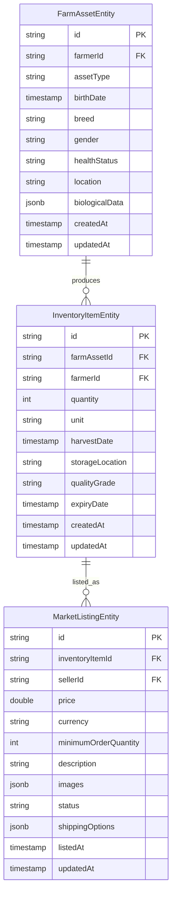

# Design Document: End-to-End Modularization

## Overview

This document provides the technical design for transforming ROSTRY from a hybrid monolith Android application into a hybrid-vertical modular architecture. The transformation addresses the current architecture's limitations where the `app` module owns large `data`, `domain`, and `ui` trees, creating tight coupling and limiting scalability.

### Current State

The ROSTRY application currently exhibits a hybrid monolith pattern:

- **App Module Bloat**: The `app` module contains ~100+ repositories, ~150+ ViewModels, extensive domain logic, and all UI screens
- **Tight Coupling**: Feature code, business logic, and data access are intermingled within the app module
- **Navigation Centralization**: All navigation routes are defined in a single `Routes.kt` file with a massive `AppNavHost`
- **Limited Modularity**: While some core modules exist (`core:designsystem`, `core:common`, `core:model`, `core:database`, `core:network`, `core:domain`) and feature modules (`feature:achievements`, `feature:leaderboard`, etc.), the majority of application logic remains in the app module
- **Dependency Injection Sprawl**: 30+ Hilt modules in `app/di/` providing dependencies for all features

### Target State

The target architecture implements a hybrid-vertical modular structure:

- **Thin App Shell**: The `app` module reduced to <2000 lines containing only Application class, MainActivity, root navigation composition, and manifest configuration
- **Core Modules**: Shared technical infrastructure (`core:common`, `core:designsystem`, `core:model`, `core:database`, `core:network`, `core:navigation`, `core:testing`)
- **Domain Modules**: Business-area contract modules (`domain:account`, `domain:commerce`, `domain:farm`, `domain:monitoring`, `domain:social`, `domain:admin`) defining interfaces and use cases
- **Data Modules**: Implementation modules (`data:account`, `data:commerce`, `data:farm`, `data:monitoring`, `data:social`, `data:admin`) providing concrete implementations
- **Feature Modules**: Vertical slice modules (`feature:login`, `feature:marketplace`, `feature:farm-management`, etc.) owning screens, UI state, ViewModels, and navigation entry points
- **Decentralized Navigation**: Each feature module registers its own navigation graph through a Navigation Registry
- **3-Tier Asset Model**: Implementation of ADR-004's FarmAssetEntity, InventoryItemEntity, and MarketListingEntity within the modularization program

### Transformation Strategy

The transformation follows a six-phase approach:

1. **Phase 0: Guardrails First** - Establish architectural tests and foundational infrastructure
2. **Phase 1: Shell and Navigation Extraction** - Create thin app shell and decentralized navigation
3. **Phase 2: Domain and Data Decoupling** - Separate business logic from app module
4. **Phase 3: ADR-004 Inside Modularization** - Implement 3-tier asset split
5. **Phase 4: Vertical Feature Migration Waves** - Migrate features in coordinated waves (A-F)
6. **Phase 5: App Shell Reduction** - Final cleanup to minimal shell

### Key Design Principles

- **Incremental Migration**: Each phase produces a shippable application
- **Compatibility Adapters**: Bridge old and new architectures during migration
- **Single Database**: Maintain Room database in single `core:database` module
- **Dependency Direction**: Features depend on domain contracts, data implements domain contracts
- **Automated Enforcement**: Architecture tests prevent regression


## Architecture

### Module Dependency Graph

```mermaid
graph TD
    App[app]
    
    %% Core Modules
    CoreCommon[core:common]
    CoreDesign[core:designsystem]
    CoreModel[core:model]
    CoreDB[core:database]
    CoreNetwork[core:network]
    CoreNav[core:navigation]
    CoreTest[core:testing]
    
    %% Domain Modules
    DomainAccount[domain:account]
    DomainCommerce[domain:commerce]
    DomainFarm[domain:farm]
    DomainMonitoring[domain:monitoring]
    DomainSocial[domain:social]
    DomainAdmin[domain:admin]
    
    %% Data Modules
    DataAccount[data:account]
    DataCommerce[data:commerce]
    DataFarm[data:farm]
    DataMonitoring[data:monitoring]
    DataSocial[data:social]
    DataAdmin[data:admin]
    
    %% Feature Modules
    FeatureLogin[feature:login]
    FeatureMarket[feature:marketplace]
    FeatureFarm[feature:farm-management]
    FeatureMonitor[feature:monitoring]
    FeatureSocial[feature:social-feed]
    FeatureAdmin[feature:admin-dashboard]
    
    %% App Shell Dependencies
    App --> FeatureLogin
    App --> FeatureMarket
    App --> FeatureFarm
    App --> FeatureMonitor
    App --> FeatureSocial
    App --> FeatureAdmin
    App --> CoreNav
    App --> CoreCommon
    
    %% Feature Dependencies
    FeatureLogin --> DomainAccount
    FeatureLogin --> CoreDesign
    FeatureLogin --> CoreNav
    
    FeatureMarket --> DomainCommerce
    FeatureMarket --> CoreDesign
    FeatureMarket --> CoreNav
    
    FeatureFarm --> DomainFarm
    FeatureFarm --> CoreDesign
    FeatureFarm --> CoreNav
    
    FeatureMonitor --> DomainMonitoring
    FeatureMonitor --> CoreDesign
    FeatureMonitor --> CoreNav
    
    FeatureSocial --> DomainSocial
    FeatureSocial --> CoreDesign
    FeatureSocial --> CoreNav
    
    FeatureAdmin --> DomainAdmin
    FeatureAdmin --> CoreDesign
    FeatureAdmin --> CoreNav
    
    %% Domain Dependencies
    DomainAccount --> CoreModel
    DomainCommerce --> CoreModel
    DomainFarm --> CoreModel
    DomainMonitoring --> CoreModel
    DomainSocial --> CoreModel
    DomainAdmin --> CoreModel
    
    %% Data Dependencies
    DataAccount --> DomainAccount
    DataAccount --> CoreDB
    DataAccount --> CoreNetwork
    
    DataCommerce --> DomainCommerce
    DataCommerce --> CoreDB
    DataCommerce --> CoreNetwork
    
    DataFarm --> DomainFarm
    DataFarm --> CoreDB
    DataFarm --> CoreNetwork
    
    DataMonitoring --> DomainMonitoring
    DataMonitoring --> CoreDB
    DataMonitoring --> CoreNetwork
    
    DataSocial --> DomainSocial
    DataSocial --> CoreDB
    DataSocial --> CoreNetwork
    
    DataAdmin --> DomainAdmin
    DataAdmin --> CoreDB
    DataAdmin --> CoreNetwork
    
    %% Core Dependencies
    CoreDB --> CoreModel
    CoreNetwork --> CoreModel
    CoreDesign --> CoreCommon
    CoreNav --> CoreCommon
    CoreTest --> CoreCommon
    
    %% Hilt Bindings (Data to App)
    App -.->|Hilt| DataAccount
    App -.->|Hilt| DataCommerce
    App -.->|Hilt| DataFarm
    App -.->|Hilt| DataMonitoring
    App -.->|Hilt| DataSocial
    App -.->|Hilt| DataAdmin
    
    style App fill:#e1f5ff
    style CoreCommon fill:#fff4e1
    style CoreDesign fill:#fff4e1
    style CoreModel fill:#fff4e1
    style CoreDB fill:#fff4e1
    style CoreNetwork fill:#fff4e1
    style CoreNav fill:#fff4e1
    style CoreTest fill:#fff4e1
    style DomainAccount fill:#e8f5e9
    style DomainCommerce fill:#e8f5e9
    style DomainFarm fill:#e8f5e9
    style DomainMonitoring fill:#e8f5e9
    style DomainSocial fill:#e8f5e9
    style DomainAdmin fill:#e8f5e9
    style DataAccount fill:#f3e5f5
    style DataCommerce fill:#f3e5f5
    style DataFarm fill:#f3e5f5
    style DataMonitoring fill:#f3e5f5
    style DataSocial fill:#f3e5f5
    style DataAdmin fill:#f3e5f5
    style FeatureLogin fill:#ffe0b2
    style FeatureMarket fill:#ffe0b2
    style FeatureFarm fill:#ffe0b2
    style FeatureMonitor fill:#ffe0b2
    style FeatureSocial fill:#ffe0b2
    style FeatureAdmin fill:#ffe0b2
```



### Architectural Layers

#### Layer 1: App Shell
- **Purpose**: Integration and bootstrapping
- **Contents**: Application class, MainActivity, root navigation composition, manifest
- **Size Target**: <2000 lines total
- **Dependencies**: Feature modules, core modules (navigation, common)

#### Layer 2: Feature Modules
- **Purpose**: Vertical slices of functionality
- **Contents**: Screens, ViewModels, UI state, navigation registration
- **Pattern**: `feature:{feature-name}`
- **Dependencies**: Domain modules (contracts), Core modules (design, navigation)
- **Examples**: `feature:login`, `feature:marketplace`, `feature:farm-management`

#### Layer 3: Domain Modules
- **Purpose**: Business logic contracts
- **Contents**: Repository interfaces, use case interfaces, domain models
- **Pattern**: `domain:{business-area}`
- **Dependencies**: Core modules (model only)
- **Constraint**: No Android framework dependencies (except annotations)
- **Examples**: `domain:account`, `domain:commerce`, `domain:farm`

#### Layer 4: Data Modules
- **Purpose**: Implementation of domain contracts
- **Contents**: Repository implementations, data sources, mappers
- **Pattern**: `data:{business-area}` (matches domain module)
- **Dependencies**: Domain modules, Core modules (database, network)
- **Hilt Binding**: Binds implementations to domain interfaces
- **Examples**: `data:account`, `data:commerce`, `data:farm`

#### Layer 5: Core Modules
- **Purpose**: Shared technical infrastructure
- **Pattern**: `core:{capability}`
- **Modules**:
  - `core:common` - Utilities, extensions, base classes
  - `core:designsystem` - UI components, theme, typography
  - `core:model` - Shared data models and DTOs
  - `core:database` - Room database, DAOs, entities
  - `core:network` - Retrofit, API definitions, network utilities
  - `core:navigation` - Navigation abstractions, registry interface
  - `core:testing` - Test utilities, fixtures, fakes

### Dependency Rules

The architecture enforces strict dependency rules:

1. **Feature → Domain**: Features depend only on domain contracts, never on data implementations
2. **Data → Domain**: Data modules implement domain contracts
3. **Domain → Core**: Domain modules depend only on `core:model`
4. **Feature → Core**: Features depend on `core:designsystem`, `core:navigation`, `core:common`
5. **Data → Core**: Data modules depend on `core:database`, `core:network`, `core:model`
6. **No Circular Dependencies**: Enforced by Gradle and architecture tests
7. **App Shell Isolation**: App module depends only on feature modules and core modules


## Components and Interfaces

### Navigation Infrastructure

#### Navigation Registry Interface

```kotlin
// core:navigation/src/main/kotlin/com/rio/rostry/core/navigation/NavigationRegistry.kt
package com.rio.rostry.core.navigation

import androidx.navigation.NavGraphBuilder
import androidx.navigation.NavHostController

/**
 * Registry for feature modules to register their navigation graphs.
 * Each feature module implements NavigationProvider and registers itself.
 */
interface NavigationRegistry {
    /**
     * Register a navigation provider for a feature.
     * @param provider The navigation provider to register
     */
    fun register(provider: NavigationProvider)
    
    /**
     * Get all registered navigation providers.
     * @return List of all registered providers
     */
    fun getProviders(): List<NavigationProvider>
    
    /**
     * Build all registered navigation graphs into the NavGraphBuilder.
     * @param navGraphBuilder The builder to add graphs to
     * @param navController The navigation controller for navigation actions
     */
    fun buildGraphs(navGraphBuilder: NavGraphBuilder, navController: NavHostController)
}

/**
 * Provider interface that each feature module implements.
 */
interface NavigationProvider {
    /**
     * Unique identifier for this feature's navigation.
     */
    val featureId: String
    
    /**
     * Build this feature's navigation graph.
     * @param navGraphBuilder The builder to add navigation destinations to
     * @param navController The navigation controller for navigation actions
     */
    fun buildGraph(navGraphBuilder: NavGraphBuilder, navController: NavHostController)
    
    /**
     * Get deep link patterns supported by this feature.
     * @return List of deep link URI patterns
     */
    fun getDeepLinks(): List<String> = emptyList()
}

/**
 * Default implementation of NavigationRegistry.
 */
class NavigationRegistryImpl : NavigationRegistry {
    private val providers = mutableListOf<NavigationProvider>()
    
    override fun register(provider: NavigationProvider) {
        providers.add(provider)
    }
    
    override fun getProviders(): List<NavigationProvider> = providers.toList()
    
    override fun buildGraphs(navGraphBuilder: NavGraphBuilder, navController: NavHostController) {
        providers.forEach { provider ->
            provider.buildGraph(navGraphBuilder, navController)
        }
    }
}
```

#### Navigation Routes

```kotlin
// core:navigation/src/main/kotlin/com/rio/rostry/core/navigation/NavigationRoute.kt
package com.rio.rostry.core.navigation

/**
 * Base interface for type-safe navigation routes.
 */
sealed interface NavigationRoute {
    val route: String
}

/**
 * Extension function to navigate with type safety.
 */
fun NavHostController.navigateTo(route: NavigationRoute) {
    navigate(route.route)
}
```

#### Feature Navigation Example

```kotlin
// feature:login/src/main/kotlin/com/rio/rostry/feature/login/navigation/LoginNavigation.kt
package com.rio.rostry.feature.login.navigation

import androidx.navigation.NavGraphBuilder
import androidx.navigation.NavHostController
import androidx.navigation.compose.composable
import com.rio.rostry.core.navigation.NavigationProvider
import com.rio.rostry.core.navigation.NavigationRoute
import com.rio.rostry.feature.login.LoginScreen
import com.rio.rostry.feature.login.PhoneAuthScreen

/**
 * Navigation routes for login feature.
 */
sealed class LoginRoute(override val route: String) : NavigationRoute {
    object Welcome : LoginRoute("login/welcome")
    object PhoneAuth : LoginRoute("login/phone")
    object OtpVerification : LoginRoute("login/otp/{phoneNumber}") {
        fun createRoute(phoneNumber: String) = "login/otp/$phoneNumber"
    }
}

/**
 * Navigation provider for login feature.
 */
class LoginNavigationProvider : NavigationProvider {
    override val featureId: String = "login"
    
    override fun buildGraph(navGraphBuilder: NavGraphBuilder, navController: NavHostController) {
        navGraphBuilder.apply {
            composable(LoginRoute.Welcome.route) {
                LoginScreen(
                    onNavigateToPhoneAuth = {
                        navController.navigate(LoginRoute.PhoneAuth.route)
                    }
                )
            }
            
            composable(LoginRoute.PhoneAuth.route) {
                PhoneAuthScreen(
                    onNavigateToOtp = { phoneNumber ->
                        navController.navigate(LoginRoute.OtpVerification.createRoute(phoneNumber))
                    },
                    onNavigateBack = {
                        navController.popBackStack()
                    }
                )
            }
            
            composable(LoginRoute.OtpVerification.route) { backStackEntry ->
                val phoneNumber = backStackEntry.arguments?.getString("phoneNumber") ?: ""
                OtpVerificationScreen(
                    phoneNumber = phoneNumber,
                    onVerificationSuccess = {
                        // Navigate to main app
                        navController.navigate("main") {
                            popUpTo("login") { inclusive = true }
                        }
                    }
                )
            }
        }
    }
    
    override fun getDeepLinks(): List<String> = listOf(
        "rostry://login",
        "https://rostry.app/login"
    )
}
```

### Domain Layer Interfaces

#### Repository Interface Pattern

```kotlin
// domain:account/src/main/kotlin/com/rio/rostry/domain/account/repository/AuthRepository.kt
package com.rio.rostry.domain.account.repository

import com.rio.rostry.core.model.Result
import com.rio.rostry.core.model.User
import kotlinx.coroutines.flow.Flow

/**
 * Repository contract for authentication operations.
 */
interface AuthRepository {
    /**
     * Observe the current authenticated user.
     * @return Flow emitting the current user or null if not authenticated
     */
    fun observeCurrentUser(): Flow<User?>
    
    /**
     * Sign in with phone number and OTP.
     * @param phoneNumber The phone number to authenticate
     * @param otp The one-time password
     * @return Result containing the authenticated user or error
     */
    suspend fun signInWithPhone(phoneNumber: String, otp: String): Result<User>
    
    /**
     * Sign in with Google credentials.
     * @param idToken The Google ID token
     * @return Result containing the authenticated user or error
     */
    suspend fun signInWithGoogle(idToken: String): Result<User>
    
    /**
     * Sign out the current user.
     * @return Result indicating success or error
     */
    suspend fun signOut(): Result<Unit>
    
    /**
     * Request OTP for phone number.
     * @param phoneNumber The phone number to send OTP to
     * @return Result containing verification ID or error
     */
    suspend fun requestOtp(phoneNumber: String): Result<String>
}
```

#### Use Case Interface Pattern

```kotlin
// domain:commerce/src/main/kotlin/com/rio/rostry/domain/commerce/usecase/CreateListingUseCase.kt
package com.rio.rostry.domain.commerce.usecase

import com.rio.rostry.core.model.Result
import com.rio.rostry.core.model.MarketListing

/**
 * Use case for creating a market listing.
 */
interface CreateListingUseCase {
    /**
     * Create a new market listing.
     * @param request The listing creation request
     * @return Result containing the created listing or error
     */
    suspend operator fun invoke(request: CreateListingRequest): Result<MarketListing>
}

data class CreateListingRequest(
    val inventoryItemId: String,
    val price: Double,
    val minimumOrderQuantity: Int,
    val description: String,
    val images: List<String>
)
```

### Data Layer Implementation

#### Repository Implementation Pattern

```kotlin
// data:account/src/main/kotlin/com/rio/rostry/data/account/repository/AuthRepositoryImpl.kt
package com.rio.rostry.data.account.repository

import com.google.firebase.auth.FirebaseAuth
import com.rio.rostry.core.model.Result
import com.rio.rostry.core.model.User
import com.rio.rostry.data.account.mapper.toUser
import com.rio.rostry.data.account.source.AuthRemoteDataSource
import com.rio.rostry.domain.account.repository.AuthRepository
import kotlinx.coroutines.flow.Flow
import kotlinx.coroutines.flow.map
import javax.inject.Inject

/**
 * Implementation of AuthRepository using Firebase Authentication.
 */
class AuthRepositoryImpl @Inject constructor(
    private val firebaseAuth: FirebaseAuth,
    private val remoteDataSource: AuthRemoteDataSource
) : AuthRepository {
    
    override fun observeCurrentUser(): Flow<User?> {
        return remoteDataSource.observeAuthState()
            .map { firebaseUser -> firebaseUser?.toUser() }
    }
    
    override suspend fun signInWithPhone(phoneNumber: String, otp: String): Result<User> {
        return try {
            val credential = remoteDataSource.createPhoneCredential(phoneNumber, otp)
            val authResult = firebaseAuth.signInWithCredential(credential).await()
            val user = authResult.user?.toUser()
            if (user != null) {
                Result.Success(user)
            } else {
                Result.Error(Exception("Failed to get user after sign in"))
            }
        } catch (e: Exception) {
            Result.Error(e)
        }
    }
    
    override suspend fun signInWithGoogle(idToken: String): Result<User> {
        return try {
            val credential = remoteDataSource.createGoogleCredential(idToken)
            val authResult = firebaseAuth.signInWithCredential(credential).await()
            val user = authResult.user?.toUser()
            if (user != null) {
                Result.Success(user)
            } else {
                Result.Error(Exception("Failed to get user after sign in"))
            }
        } catch (e: Exception) {
            Result.Error(e)
        }
    }
    
    override suspend fun signOut(): Result<Unit> {
        return try {
            firebaseAuth.signOut()
            Result.Success(Unit)
        } catch (e: Exception) {
            Result.Error(e)
        }
    }
    
    override suspend fun requestOtp(phoneNumber: String): Result<String> {
        return remoteDataSource.sendVerificationCode(phoneNumber)
    }
}
```

#### Hilt Binding Module

```kotlin
// data:account/src/main/kotlin/com/rio/rostry/data/account/di/AccountDataModule.kt
package com.rio.rostry.data.account.di

import com.rio.rostry.data.account.repository.AuthRepositoryImpl
import com.rio.rostry.domain.account.repository.AuthRepository
import dagger.Binds
import dagger.Module
import dagger.hilt.InstallIn
import dagger.hilt.components.SingletonComponent
import javax.inject.Singleton

/**
 * Hilt module for binding account data implementations.
 */
@Module
@InstallIn(SingletonComponent::class)
abstract class AccountDataModule {
    
    @Binds
    @Singleton
    abstract fun bindAuthRepository(
        impl: AuthRepositoryImpl
    ): AuthRepository
}
```

### Architecture Test Framework

```kotlin
// core:testing/src/main/kotlin/com/rio/rostry/core/testing/architecture/ArchitectureTest.kt
package com.rio.rostry.core.testing.architecture

import com.tngtech.archunit.core.domain.JavaClasses
import com.tngtech.archunit.core.importer.ClassFileImporter
import com.tngtech.archunit.core.importer.ImportOption
import com.tngtech.archunit.lang.syntax.ArchRuleDefinition.classes
import com.tngtech.archunit.lang.syntax.ArchRuleDefinition.noClasses
import org.junit.Before
import org.junit.Test

/**
 * Architecture tests enforcing module boundaries and dependency rules.
 */
class ModularArchitectureTest {
    
    private lateinit var classes: JavaClasses
    
    @Before
    fun setup() {
        classes = ClassFileImporter()
            .withImportOption(ImportOption.DoNotIncludeTests())
            .importPackages("com.rio.rostry")
    }
    
    @Test
    fun `feature modules should only depend on domain and core modules`() {
        noClasses()
            .that().resideInAPackage("..feature..")
            .should().dependOnClassesThat().resideInAPackage("..data..")
            .check(classes)
    }
    
    @Test
    fun `domain modules should not depend on data or feature modules`() {
        noClasses()
            .that().resideInAPackage("..domain..")
            .should().dependOnClassesThat().resideInAnyPackage("..data..", "..feature..")
            .check(classes)
    }
    
    @Test
    fun `data modules should only depend on domain and core modules`() {
        noClasses()
            .that().resideInAPackage("..data..")
            .should().dependOnClassesThat().resideInAPackage("..feature..")
            .check(classes)
    }
    
    @Test
    fun `domain modules should not depend on Android framework`() {
        noClasses()
            .that().resideInAPackage("..domain..")
            .should().dependOnClassesThat().resideInAnyPackage("android..", "androidx..")
            .because("Domain layer should be framework-independent")
            .check(classes)
    }
    
    @Test
    fun `app module should not contain repositories`() {
        noClasses()
            .that().resideInAPackage("..app..")
            .should().haveSimpleNameEndingWith("Repository")
            .orShould().haveSimpleNameEndingWith("RepositoryImpl")
            .check(classes)
    }
    
    @Test
    fun `app module should not contain use cases`() {
        noClasses()
            .that().resideInAPackage("..app..")
            .should().haveSimpleNameEndingWith("UseCase")
            .check(classes)
    }
    
    @Test
    fun `repositories should implement domain interfaces`() {
        classes()
            .that().haveSimpleNameEndingWith("RepositoryImpl")
            .should().implement(classNameMatching(".*Repository"))
            .check(classes)
    }
}
```


## Data Models

### 3-Tier Asset Model (ADR-004)

The 3-tier asset model separates farm management, inventory, and marketplace concerns:



#### FarmAssetEntity

```kotlin
// core:database/src/main/kotlin/com/rio/rostry/core/database/entity/FarmAssetEntity.kt
package com.rio.rostry.core.database.entity

import androidx.room.Entity
import androidx.room.PrimaryKey
import androidx.room.ColumnInfo
import androidx.room.TypeConverters
import com.rio.rostry.core.database.converter.JsonConverter
import java.time.Instant

/**
 * Farm asset entity representing biological/physical assets in production.
 * This is the private source of truth for farm management.
 */
@Entity(tableName = "farm_assets")
@TypeConverters(JsonConverter::class)
data class FarmAssetEntity(
    @PrimaryKey
    @ColumnInfo(name = "id")
    val id: String,
    
    @ColumnInfo(name = "farmer_id", index = true)
    val farmerId: String,
    
    @ColumnInfo(name = "asset_type")
    val assetType: AssetType,
    
    @ColumnInfo(name = "birth_date")
    val birthDate: Instant?,
    
    @ColumnInfo(name = "breed")
    val breed: String?,
    
    @ColumnInfo(name = "gender")
    val gender: String?,
    
    @ColumnInfo(name = "health_status")
    val healthStatus: HealthStatus,
    
    @ColumnInfo(name = "location")
    val location: String?,
    
    @ColumnInfo(name = "biological_data")
    val biologicalData: Map<String, Any>?,
    
    @ColumnInfo(name = "lifecycle_stage")
    val lifecycleStage: LifecycleStage,
    
    @ColumnInfo(name = "parent_male_id")
    val parentMaleId: String?,
    
    @ColumnInfo(name = "parent_female_id")
    val parentFemaleId: String?,
    
    @ColumnInfo(name = "created_at")
    val createdAt: Instant,
    
    @ColumnInfo(name = "updated_at")
    val updatedAt: Instant
)

enum class AssetType {
    BIRD,
    BATCH,
    EQUIPMENT,
    FEED,
    MEDICATION
}

enum class HealthStatus {
    HEALTHY,
    SICK,
    QUARANTINED,
    DECEASED,
    UNKNOWN
}

enum class LifecycleStage {
    CHICK,
    JUVENILE,
    ADULT,
    BREEDING,
    RETIRED,
    HARVESTED
}
```

#### InventoryItemEntity

```kotlin
// core:database/src/main/kotlin/com/rio/rostry/core/database/entity/InventoryItemEntity.kt
package com.rio.rostry.core.database.entity

import androidx.room.Entity
import androidx.room.PrimaryKey
import androidx.room.ColumnInfo
import androidx.room.ForeignKey
import java.time.Instant

/**
 * Inventory item entity representing allocatable stock derived from farm assets.
 * This is the bridge layer between farm management and marketplace.
 */
@Entity(
    tableName = "inventory_items",
    foreignKeys = [
        ForeignKey(
            entity = FarmAssetEntity::class,
            parentColumns = ["id"],
            childColumns = ["farm_asset_id"],
            onDelete = ForeignKey.CASCADE
        )
    ]
)
data class InventoryItemEntity(
    @PrimaryKey
    @ColumnInfo(name = "id")
    val id: String,
    
    @ColumnInfo(name = "farm_asset_id", index = true)
    val farmAssetId: String,
    
    @ColumnInfo(name = "farmer_id", index = true)
    val farmerId: String,
    
    @ColumnInfo(name = "quantity")
    val quantity: Int,
    
    @ColumnInfo(name = "unit")
    val unit: String,
    
    @ColumnInfo(name = "harvest_date")
    val harvestDate: Instant?,
    
    @ColumnInfo(name = "storage_location")
    val storageLocation: String?,
    
    @ColumnInfo(name = "quality_grade")
    val qualityGrade: QualityGrade,
    
    @ColumnInfo(name = "expiry_date")
    val expiryDate: Instant?,
    
    @ColumnInfo(name = "available_quantity")
    val availableQuantity: Int,
    
    @ColumnInfo(name = "reserved_quantity")
    val reservedQuantity: Int,
    
    @ColumnInfo(name = "created_at")
    val createdAt: Instant,
    
    @ColumnInfo(name = "updated_at")
    val updatedAt: Instant
)

enum class QualityGrade {
    PREMIUM,
    STANDARD,
    ECONOMY,
    UNGRADED
}
```

#### MarketListingEntity

```kotlin
// core:database/src/main/kotlin/com/rio/rostry/core/database/entity/MarketListingEntity.kt
package com.rio.rostry.core.database.entity

import androidx.room.Entity
import androidx.room.PrimaryKey
import androidx.room.ColumnInfo
import androidx.room.ForeignKey
import androidx.room.TypeConverters
import com.rio.rostry.core.database.converter.JsonConverter
import java.time.Instant

/**
 * Market listing entity representing assets actively listed for sale.
 * This is the public commercial layer for marketplace operations.
 */
@Entity(
    tableName = "market_listings",
    foreignKeys = [
        ForeignKey(
            entity = InventoryItemEntity::class,
            parentColumns = ["id"],
            childColumns = ["inventory_item_id"],
            onDelete = ForeignKey.CASCADE
        )
    ]
)
@TypeConverters(JsonConverter::class)
data class MarketListingEntity(
    @PrimaryKey
    @ColumnInfo(name = "id")
    val id: String,
    
    @ColumnInfo(name = "inventory_item_id", index = true)
    val inventoryItemId: String,
    
    @ColumnInfo(name = "seller_id", index = true)
    val sellerId: String,
    
    @ColumnInfo(name = "price")
    val price: Double,
    
    @ColumnInfo(name = "currency")
    val currency: String,
    
    @ColumnInfo(name = "minimum_order_quantity")
    val minimumOrderQuantity: Int,
    
    @ColumnInfo(name = "description")
    val description: String,
    
    @ColumnInfo(name = "images")
    val images: List<String>,
    
    @ColumnInfo(name = "status")
    val status: ListingStatus,
    
    @ColumnInfo(name = "shipping_options")
    val shippingOptions: Map<String, Any>?,
    
    @ColumnInfo(name = "category")
    val category: String,
    
    @ColumnInfo(name = "tags")
    val tags: List<String>,
    
    @ColumnInfo(name = "views_count")
    val viewsCount: Int,
    
    @ColumnInfo(name = "listed_at")
    val listedAt: Instant,
    
    @ColumnInfo(name = "updated_at")
    val updatedAt: Instant
)

enum class ListingStatus {
    DRAFT,
    ACTIVE,
    SOLD,
    EXPIRED,
    SUSPENDED
}
```

### Domain Models

```kotlin
// core:model/src/main/kotlin/com/rio/rostry/core/model/FarmAsset.kt
package com.rio.rostry.core.model

import java.time.Instant

/**
 * Domain model for farm asset.
 */
data class FarmAsset(
    val id: String,
    val farmerId: String,
    val assetType: AssetType,
    val birthDate: Instant?,
    val breed: String?,
    val gender: String?,
    val healthStatus: HealthStatus,
    val location: String?,
    val biologicalData: Map<String, Any>?,
    val lifecycleStage: LifecycleStage,
    val parentMaleId: String?,
    val parentFemaleId: String?,
    val createdAt: Instant,
    val updatedAt: Instant
)

/**
 * Domain model for inventory item.
 */
data class InventoryItem(
    val id: String,
    val farmAssetId: String,
    val farmerId: String,
    val quantity: Int,
    val unit: String,
    val harvestDate: Instant?,
    val storageLocation: String?,
    val qualityGrade: QualityGrade,
    val expiryDate: Instant?,
    val availableQuantity: Int,
    val reservedQuantity: Int,
    val createdAt: Instant,
    val updatedAt: Instant
)

/**
 * Domain model for market listing.
 */
data class MarketListing(
    val id: String,
    val inventoryItemId: String,
    val sellerId: String,
    val price: Double,
    val currency: String,
    val minimumOrderQuantity: Int,
    val description: String,
    val images: List<String>,
    val status: ListingStatus,
    val shippingOptions: Map<String, Any>?,
    val category: String,
    val tags: List<String>,
    val viewsCount: Int,
    val listedAt: Instant,
    val updatedAt: Instant
)
```

### Result Type

```kotlin
// core:model/src/main/kotlin/com/rio/rostry/core/model/Result.kt
package com.rio.rostry.core.model

/**
 * A generic class that holds a value with its loading status.
 */
sealed class Result<out T> {
    data class Success<T>(val data: T) : Result<T>()
    data class Error(val exception: Exception) : Result<Nothing>()
    object Loading : Result<Nothing>()
    
    val isSuccess: Boolean
        get() = this is Success
    
    val isError: Boolean
        get() = this is Error
    
    val isLoading: Boolean
        get() = this is Loading
}

/**
 * Extension to get data or null.
 */
fun <T> Result<T>.getOrNull(): T? = when (this) {
    is Result.Success -> data
    else -> null
}

/**
 * Extension to get data or throw exception.
 */
fun <T> Result<T>.getOrThrow(): T = when (this) {
    is Result.Success -> data
    is Result.Error -> throw exception
    is Result.Loading -> throw IllegalStateException("Result is still loading")
}
```


## Correctness Properties

A property is a characteristic or behavior that should hold true across all valid executions of a system—essentially, a formal statement about what the system should do. Properties serve as the bridge between human-readable specifications and machine-verifiable correctness guarantees.

### Property Reflection

After analyzing all acceptance criteria, the following redundancies were identified and consolidated:

- **Redundancy 1**: Requirements 1.4 and 3.2 both specify that the App_Shell should not contain feature screens, ViewModels, repositories, or use cases. These are combined into Property 1.
- **Redundancy 2**: Requirements 3.5 and 7.5 both specify that the App_Shell build configuration should depend only on Feature_Modules and Core_Modules. These are combined into Property 2.
- **Redundancy 3**: Requirements 6.3 and 9.2 both specify using Compatibility_Adapters during migration. These are combined into a single example test.
- **Redundancy 4**: Requirements 1.7 and 12.1 both specify that core:navigation should exist and provide navigation abstractions. These are combined into a single example test.
- **Redundancy 5**: Requirements 1.6 and 12.2 both specify that core:testing should exist and provide test utilities. These are combined into a single example test.

### Architecture Boundary Properties

### Property 1: App Shell Isolation

*For any* class in the app module, that class should not be a feature screen, ViewModel, repository, or use case implementation.

**Validates: Requirements 1.4, 3.2**

### Property 2: App Shell Dependency Constraint

*For any* dependency declared in the app module's build configuration, that dependency should be either a feature module or a core module, not a data module.

**Validates: Requirements 3.5, 7.5**

### Property 3: Feature Module Dependency Constraint

*For any* feature module, all of its dependencies should be either domain modules or core modules, never data modules.

**Validates: Requirements 1.1**

### Property 4: Domain Module Isolation

*For any* domain module, it should not depend on any data module or feature module.

**Validates: Requirements 1.2**

### Property 5: Data Module Dependency Constraint

*For any* data module, all of its dependencies should be either domain modules or core modules, never feature modules.

**Validates: Requirements 1.3**

### Property 6: Domain Framework Independence

*For any* class in a domain module, it should not import Android framework classes (android.* or androidx.*) except for annotation packages.

**Validates: Requirements 4.4**

### Property 7: Domain Interface Purity

*For any* domain module, all repository and use case types should be interfaces or abstract classes, not concrete implementations.

**Validates: Requirements 4.1**

### Property 8: Data Implementation Completeness

*For any* repository interface defined in a domain module, there should exist a corresponding implementation class in the matching data module that implements that interface.

**Validates: Requirements 4.2**

### Property 9: Hilt Binding Presence

*For any* repository implementation in a data module, there should exist a Hilt @Binds method that binds the implementation to its domain interface.

**Validates: Requirements 4.5**

### Property 10: Feature Module Ownership

*For any* feature module, it should contain at least one screen composable, and may contain ViewModels and navigation registration, demonstrating complete vertical slice ownership.

**Validates: Requirements 6.4**

### Navigation Properties

### Property 11: Navigation Registration Decoupling

*For any* feature module with navigation, registering its NavigationProvider with the NavigationRegistry should not require any code changes in the app module.

**Validates: Requirements 2.1**

### Property 12: Navigation Graph Composition

*For any* set of registered NavigationProviders, calling buildGraphs() on the NavigationRegistry should invoke buildGraph() on each provider exactly once.

**Validates: Requirements 2.2**

### Property 13: Deep Link Registration

*For any* NavigationProvider that declares deep links, those deep link patterns should be properly registered in the navigation system when the provider's graph is built.

**Validates: Requirements 2.4**

### Property 14: Navigation Registry Resilience

*For any* NavigationRegistry with multiple registered providers, removing one provider should not affect the ability of other providers to build their graphs successfully.

**Validates: Requirements 2.5**

### Property 15: Navigation Delegation

*For any* navigation action in the app shell, it should delegate to the NavigationRegistry rather than directly defining navigation destinations.

**Validates: Requirements 3.4**

### 3-Tier Asset Model Properties

### Property 16: Asset Transition Creates Inventory

*For any* FarmAssetEntity that transitions to harvested state, the system should create a corresponding InventoryItemEntity and update the FarmAssetEntity's lifecycle stage.

**Validates: Requirements 5.4**

### Property 17: Listing References Inventory

*For any* MarketListingEntity created, it should reference an existing InventoryItemEntity through a valid foreign key relationship.

**Validates: Requirements 5.5**

### Property 18: Referential Integrity Cascade

*For any* FarmAssetEntity that is deleted, all associated InventoryItemEntities should be deleted, and all associated MarketListingEntities should be deleted, maintaining referential integrity through cascade.

**Validates: Requirements 5.6**

### Module Naming Properties

### Property 19: Core Module Naming Convention

*For any* module in the core namespace, its name should follow the pattern "core:{capability}" where capability is in kebab-case.

**Validates: Requirements 11.1, 11.5**

### Property 20: Domain Module Naming Convention

*For any* module in the domain namespace, its name should follow the pattern "domain:{business_area}" where business_area is in kebab-case.

**Validates: Requirements 11.2, 11.5**

### Property 21: Data Module Naming Convention

*For any* module in the data namespace, its name should follow the pattern "data:{business_area}" where business_area matches a corresponding domain module and is in kebab-case.

**Validates: Requirements 11.3, 11.5**

### Property 22: Feature Module Naming Convention

*For any* module in the feature namespace, its name should follow the pattern "feature:{feature_name}" where feature_name is in kebab-case.

**Validates: Requirements 11.4, 11.5**

### Infrastructure Integration Properties

### Property 23: Hilt Usage Consistency

*For any* module that requires dependency injection, it should use Hilt annotations (@Inject, @Module, @InstallIn) rather than manual dependency construction.

**Validates: Requirements 10.1**

### Property 24: WorkManager Worker Location

*For any* background task defined in a feature module, it should be implemented as a WorkManager Worker class within that feature module, not in the app module.

**Validates: Requirements 10.6**

### Property 25: Compose UI Consistency

*For any* screen in a feature module, it should be implemented using Jetpack Compose @Composable functions rather than XML layouts.

**Validates: Requirements 10.4**

### Migration Compatibility Properties

### Property 26: Module Migration Independence

*For any* two feature modules being migrated in the same wave, neither should have a direct dependency on the other, allowing independent migration.

**Validates: Requirements 9.4**

### Property 27: Backward Compatibility During Migration

*For any* partially migrated module, both the old app-module-based code and new module-based code should be able to coexist and interoperate without runtime errors.

**Validates: Requirements 9.3**

### Database Properties

### Property 28: DAO Interface Availability

*For any* data module that requires database access, there should exist corresponding DAO interfaces in core:database that provide the necessary data access methods.

**Validates: Requirements 8.4**

### Property 29: Database Migration Centralization

*For any* schema change in the Room database, the migration should be defined in the core:database module's database class, not scattered across multiple modules.

**Validates: Requirements 8.5**


## Error Handling

### Migration Error Scenarios

#### Scenario 1: Circular Dependency Detection

**Error**: Feature module A depends on feature module B, which depends on feature module A.

**Detection**: Gradle build fails with circular dependency error.

**Resolution**:
1. Identify the shared functionality causing the circular dependency
2. Extract shared functionality to a new domain module or core module
3. Have both feature modules depend on the extracted module

**Prevention**: Architecture tests verify no feature-to-feature dependencies exist.

#### Scenario 2: Missing Domain Interface Implementation

**Error**: Domain interface defined but no data module provides implementation.

**Detection**: Hilt compilation fails with "No implementation found" error.

**Resolution**:
1. Create implementation class in corresponding data module
2. Add @Binds method in Hilt module to bind implementation to interface
3. Verify implementation is in correct data module matching domain module

**Prevention**: Property tests verify all domain interfaces have implementations.

#### Scenario 3: Navigation Provider Not Registered

**Error**: Feature navigation routes not accessible at runtime.

**Detection**: Navigation fails with "Unknown destination" error.

**Resolution**:
1. Verify NavigationProvider is created in feature module
2. Ensure provider is registered in Application.onCreate()
3. Check that buildGraph() properly defines all routes

**Prevention**: Integration tests verify all feature routes are accessible.

#### Scenario 4: Database Migration Failure

**Error**: App crashes on startup after schema change.

**Detection**: Room throws "Migration path not found" exception.

**Resolution**:
1. Define migration in core:database module
2. Add migration to database builder
3. Test migration with existing database versions
4. Provide fallback destructive migration for development

**Prevention**: Database migration tests verify all migration paths.

#### Scenario 5: Compatibility Adapter Leak

**Error**: Compatibility adapter remains after migration complete.

**Detection**: Architecture tests find adapter classes in final build.

**Resolution**:
1. Identify features still using adapter
2. Complete migration of dependent features
3. Remove adapter class and update references
4. Verify no compilation errors

**Prevention**: Automated cleanup checks in CI/CD pipeline.

### Error Recovery Strategies

#### Strategy 1: Incremental Rollback

If a phase migration causes critical issues:

1. **Identify Scope**: Determine which modules are affected
2. **Isolate Changes**: Use feature flags to disable new modules
3. **Rollback Commits**: Revert to last stable commit for affected modules
4. **Preserve Data**: Ensure database migrations are backward compatible
5. **Communicate**: Update team on rollback and remediation plan

#### Strategy 2: Compatibility Mode

If new and old code must coexist longer than planned:

1. **Extend Adapters**: Keep compatibility adapters active
2. **Dual Paths**: Maintain both old and new code paths
3. **Feature Flags**: Use flags to control which path is active
4. **Monitoring**: Track usage of old vs new paths
5. **Gradual Cutover**: Slowly increase traffic to new path

#### Strategy 3: Hotfix Procedure

For production issues during migration:

1. **Assess Impact**: Determine if issue is migration-related
2. **Quick Fix**: Apply minimal fix to affected module
3. **Test Isolation**: Verify fix doesn't break other modules
4. **Deploy**: Use staged rollout to minimize risk
5. **Root Cause**: Investigate and address underlying issue

### Validation and Testing

#### Pre-Migration Validation

Before starting each phase:

1. **Architecture Tests Pass**: All existing architecture tests pass
2. **Build Success**: Clean build completes without errors
3. **Test Suite Green**: All unit and integration tests pass
4. **Performance Baseline**: Establish performance metrics
5. **Dependency Audit**: Review and document current dependencies

#### Post-Migration Validation

After completing each phase:

1. **Architecture Tests Pass**: All architecture tests including new rules pass
2. **Build Success**: Clean build completes without errors or warnings
3. **Test Suite Green**: All tests pass including new module tests
4. **Performance Check**: Verify no performance regression
5. **Dependency Verification**: Confirm dependency graph matches design
6. **Manual Testing**: Smoke test critical user flows
7. **Code Review**: Peer review of migration changes

#### Continuous Validation

Throughout migration:

1. **CI/CD Pipeline**: Automated builds and tests on every commit
2. **Architecture Tests**: Run on every pull request
3. **Dependency Analysis**: Weekly dependency graph review
4. **Code Coverage**: Maintain or improve test coverage
5. **Static Analysis**: Lint and code quality checks


## Testing Strategy

### Dual Testing Approach

The testing strategy employs both unit tests and property-based tests as complementary approaches:

- **Unit Tests**: Verify specific examples, edge cases, and error conditions
- **Property Tests**: Verify universal properties across all inputs through randomization
- **Integration Tests**: Verify module interactions and navigation flows
- **Architecture Tests**: Verify structural rules and dependency constraints

Together, these provide comprehensive coverage where unit tests catch concrete bugs and property tests verify general correctness.

### Property-Based Testing

#### Framework Selection

**Kotlin**: Use [Kotest Property Testing](https://kotest.io/docs/proptest/property-based-testing.html)

```kotlin
// Example property test
class NavigationRegistryPropertyTest : StringSpec({
    "registering providers should allow retrieval" {
        checkAll<String, String> { featureId1, featureId2 ->
            val registry = NavigationRegistryImpl()
            val provider1 = TestNavigationProvider(featureId1)
            val provider2 = TestNavigationProvider(featureId2)
            
            registry.register(provider1)
            registry.register(provider2)
            
            val providers = registry.getProviders()
            providers shouldContain provider1
            providers shouldContain provider2
        }
    }
})
```

#### Configuration

- **Minimum Iterations**: 100 per property test (due to randomization)
- **Seed Management**: Use fixed seeds for reproducible failures
- **Shrinking**: Enable automatic shrinking to find minimal failing cases
- **Timeout**: 30 seconds per property test

#### Property Test Tagging

Each property test must reference its design document property:

```kotlin
/**
 * Feature: end-to-end-modularization
 * Property 11: Navigation Registration Decoupling
 * 
 * For any feature module with navigation, registering its NavigationProvider
 * with the NavigationRegistry should not require any code changes in the app module.
 */
@Test
fun `navigation registration does not require app module changes`() {
    // Test implementation
}
```

### Unit Testing Strategy

#### Focus Areas for Unit Tests

1. **Specific Examples**: Concrete scenarios that demonstrate correct behavior
   - Example: Login with valid credentials succeeds
   - Example: Creating listing with negative price fails

2. **Edge Cases**: Boundary conditions and special cases
   - Example: Empty navigation registry builds without errors
   - Example: Database migration from version 1 to version 2

3. **Error Conditions**: Failure scenarios and error handling
   - Example: Network timeout during authentication
   - Example: Invalid foreign key reference in database

4. **Integration Points**: Module boundaries and interactions
   - Example: Feature module can access domain repository
   - Example: Data module can write to database

#### Unit Test Organization

```
module/
├── src/
│   ├── main/kotlin/
│   └── test/kotlin/
│       ├── repository/          # Repository implementation tests
│       ├── usecase/             # Use case tests
│       ├── navigation/          # Navigation tests
│       └── integration/         # Integration tests
```

### Architecture Testing

#### ArchUnit Configuration

```kotlin
// app/src/test/kotlin/com/rio/rostry/architecture/ModularArchitectureTest.kt
class ModularArchitectureTest {
    
    private val importedClasses = ClassFileImporter()
        .withImportOption(ImportOption.DoNotIncludeTests())
        .importPackages("com.rio.rostry")
    
    @Test
    fun `feature modules should only depend on domain and core modules`() {
        noClasses()
            .that().resideInAPackage("..feature..")
            .should().dependOnClassesThat().resideInAPackage("..data..")
            .because("Feature modules should depend on domain contracts, not implementations")
            .check(importedClasses)
    }
    
    @Test
    fun `domain modules should not depend on Android framework`() {
        noClasses()
            .that().resideInAPackage("..domain..")
            .should().dependOnClassesThat().resideInAnyPackage("android..", "androidx..")
            .because("Domain layer should be framework-independent")
            .allowEmptyShould(true)
            .check(importedClasses)
    }
    
    @Test
    fun `repositories should implement domain interfaces`() {
        classes()
            .that().haveSimpleNameEndingWith("RepositoryImpl")
            .and().resideInAPackage("..data..")
            .should().implement(classNameMatching(".*Repository"))
            .andShould().notBeInterfaces()
            .check(importedClasses)
    }
    
    @Test
    fun `app module should not contain ViewModels`() {
        noClasses()
            .that().resideInAPackage("..app..")
            .should().haveSimpleNameEndingWith("ViewModel")
            .because("ViewModels should be in feature modules")
            .check(importedClasses)
    }
}
```

#### Dependency Graph Validation

```kotlin
// app/src/test/kotlin/com/rio/rostry/architecture/DependencyGraphTest.kt
class DependencyGraphTest {
    
    @Test
    fun `verify module dependency graph structure`() {
        val graph = ModuleDependencyGraph.fromGradleFiles()
        
        // App shell dependencies
        graph.module("app").shouldDependOn("feature:*")
        graph.module("app").shouldDependOn("core:*")
        graph.module("app").shouldNotDependOn("data:*")
        graph.module("app").shouldNotDependOn("domain:*")
        
        // Feature module dependencies
        graph.modules("feature:*").forEach { feature ->
            feature.shouldDependOn("domain:*")
            feature.shouldDependOn("core:designsystem")
            feature.shouldDependOn("core:navigation")
            feature.shouldNotDependOn("data:*")
        }
        
        // Data module dependencies
        graph.modules("data:*").forEach { data ->
            data.shouldDependOn("domain:*")
            data.shouldDependOn("core:database")
            data.shouldDependOn("core:network")
            data.shouldNotDependOn("feature:*")
        }
    }
}
```

### Integration Testing

#### Navigation Integration Tests

```kotlin
// app/src/androidTest/kotlin/com/rio/rostry/navigation/NavigationIntegrationTest.kt
@HiltAndroidTest
class NavigationIntegrationTest {
    
    @get:Rule
    val hiltRule = HiltAndroidRule(this)
    
    @get:Rule
    val composeTestRule = createAndroidComposeRule<MainActivity>()
    
    @Test
    fun `all feature routes should be accessible`() {
        // Given: App is launched
        composeTestRule.waitForIdle()
        
        // When: Navigate to each feature route
        val routes = listOf(
            "login/welcome",
            "marketplace/browse",
            "farm/dashboard",
            "monitoring/tasks"
        )
        
        routes.forEach { route ->
            // Then: Navigation succeeds without crash
            composeTestRule.runOnUiThread {
                navController.navigate(route)
            }
            composeTestRule.waitForIdle()
            
            // Verify we're on the expected destination
            navController.currentDestination?.route shouldBe route
        }
    }
    
    @Test
    fun `deep links should navigate to correct feature`() {
        // Given: Deep link URI
        val deepLink = Uri.parse("rostry://marketplace/listing/123")
        
        // When: Handle deep link
        val intent = Intent(Intent.ACTION_VIEW, deepLink)
        composeTestRule.activity.startActivity(intent)
        composeTestRule.waitForIdle()
        
        // Then: Should navigate to marketplace listing screen
        navController.currentDestination?.route shouldContain "marketplace/listing"
    }
}
```

#### Database Integration Tests

```kotlin
// core:database/src/androidTest/kotlin/com/rio/rostry/core/database/AssetLifecycleTest.kt
@RunWith(AndroidJUnit4::class)
class AssetLifecycleTest {
    
    private lateinit var database: AppDatabase
    private lateinit var farmAssetDao: FarmAssetDao
    private lateinit var inventoryDao: InventoryItemDao
    private lateinit var listingDao: MarketListingDao
    
    @Before
    fun setup() {
        val context = ApplicationProvider.getApplicationContext<Context>()
        database = Room.inMemoryDatabaseBuilder(context, AppDatabase::class.java)
            .allowMainThreadQueries()
            .build()
        farmAssetDao = database.farmAssetDao()
        inventoryDao = database.inventoryItemDao()
        listingDao = database.marketListingDao()
    }
    
    @After
    fun teardown() {
        database.close()
    }
    
    @Test
    fun `asset lifecycle transition creates inventory item`() = runBlocking {
        // Given: Farm asset in production
        val farmAsset = FarmAssetEntity(
            id = "asset-1",
            farmerId = "farmer-1",
            assetType = AssetType.BIRD,
            lifecycleStage = LifecycleStage.ADULT,
            // ... other fields
        )
        farmAssetDao.insert(farmAsset)
        
        // When: Transition to harvested
        val inventoryItem = InventoryItemEntity(
            id = "inventory-1",
            farmAssetId = farmAsset.id,
            farmerId = farmAsset.farmerId,
            quantity = 1,
            // ... other fields
        )
        inventoryDao.insert(inventoryItem)
        
        val updatedAsset = farmAsset.copy(lifecycleStage = LifecycleStage.HARVESTED)
        farmAssetDao.update(updatedAsset)
        
        // Then: Inventory item exists and references farm asset
        val retrievedInventory = inventoryDao.getById(inventoryItem.id)
        retrievedInventory shouldNotBe null
        retrievedInventory?.farmAssetId shouldBe farmAsset.id
        
        val retrievedAsset = farmAssetDao.getById(farmAsset.id)
        retrievedAsset?.lifecycleStage shouldBe LifecycleStage.HARVESTED
    }
    
    @Test
    fun `deleting farm asset cascades to inventory and listings`() = runBlocking {
        // Given: Complete asset lifecycle chain
        val farmAsset = createTestFarmAsset()
        farmAssetDao.insert(farmAsset)
        
        val inventoryItem = createTestInventoryItem(farmAsset.id)
        inventoryDao.insert(inventoryItem)
        
        val listing = createTestListing(inventoryItem.id)
        listingDao.insert(listing)
        
        // When: Delete farm asset
        farmAssetDao.delete(farmAsset)
        
        // Then: Inventory and listing are also deleted (cascade)
        inventoryDao.getById(inventoryItem.id) shouldBe null
        listingDao.getById(listing.id) shouldBe null
    }
}
```

### Test Coverage Requirements

#### Minimum Coverage Targets

- **Unit Tests**: 80% line coverage per module
- **Integration Tests**: All critical user flows covered
- **Architecture Tests**: All dependency rules verified
- **Property Tests**: All correctness properties tested

#### Coverage Reporting

```kotlin
// build.gradle.kts (root)
plugins {
    id("jacoco")
}

tasks.register("jacocoTestReport", JacocoReport::class) {
    dependsOn("testDebugUnitTest")
    
    reports {
        xml.required.set(true)
        html.required.set(true)
    }
    
    val fileFilter = listOf(
        "**/R.class",
        "**/R$*.class",
        "**/BuildConfig.*",
        "**/Manifest*.*",
        "**/*Test*.*",
        "android/**/*.*"
    )
    
    val debugTree = fileTree("${project.buildDir}/tmp/kotlin-classes/debug") {
        exclude(fileFilter)
    }
    
    sourceDirectories.setFrom(files("src/main/kotlin"))
    classDirectories.setFrom(files(debugTree))
    executionData.setFrom(fileTree(project.buildDir) {
        include("jacoco/testDebugUnitTest.exec")
    })
}
```

### Continuous Integration

#### CI Pipeline Stages

1. **Build**: Compile all modules
2. **Unit Tests**: Run all unit tests
3. **Architecture Tests**: Verify dependency rules
4. **Property Tests**: Run property-based tests
5. **Integration Tests**: Run integration tests on emulator
6. **Coverage**: Generate and publish coverage reports
7. **Static Analysis**: Run lint and detekt
8. **Deploy**: Build and deploy to internal testing track

#### GitHub Actions Workflow

```yaml
name: CI

on:
  push:
    branches: [ main, develop ]
  pull_request:
    branches: [ main, develop ]

jobs:
  build:
    runs-on: ubuntu-latest
    steps:
      - uses: actions/checkout@v3
      
      - name: Set up JDK 17
        uses: actions/setup-java@v3
        with:
          java-version: '17'
          distribution: 'temurin'
      
      - name: Grant execute permission for gradlew
        run: chmod +x gradlew
      
      - name: Build with Gradle
        run: ./gradlew build
      
      - name: Run unit tests
        run: ./gradlew testDebugUnitTest
      
      - name: Run architecture tests
        run: ./gradlew :app:testDebugUnitTest --tests "*ArchitectureTest"
      
      - name: Run property tests
        run: ./gradlew testDebugUnitTest --tests "*PropertyTest"
      
      - name: Generate coverage report
        run: ./gradlew jacocoTestReport
      
      - name: Upload coverage to Codecov
        uses: codecov/codecov-action@v3
        with:
          files: ./build/reports/jacoco/jacocoTestReport/jacocoTestReport.xml
      
      - name: Run lint
        run: ./gradlew lintDebug
      
      - name: Upload lint results
        uses: actions/upload-artifact@v3
        with:
          name: lint-results
          path: app/build/reports/lint-results-debug.html
```

