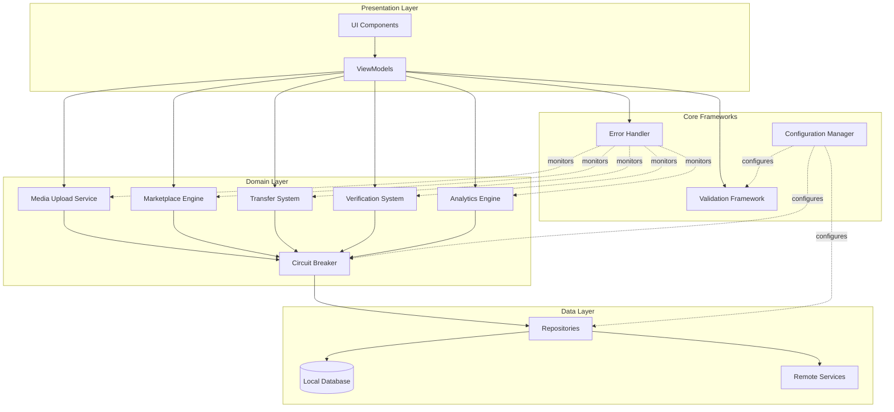

# Design Document: Production Readiness Gap Filling

## Overview

This design addresses critical production gaps, incomplete implementations, and technical debt in the ROSTRY Android application. The solution encompasses three foundational frameworks (Error Handling, Configuration Management, and Validation), completion of core features (Media Upload, Marketplace, Transfer, Verification, Analytics), implementation of resilience patterns (Circuit Breakers, Retry Logic, Graceful Degradation), removal of deprecated code, and enhancement of user experience through consistent error messaging, loading states, and accessibility compliance.

The design prioritizes production stability, maintainability, and user experience while ensuring all 25 requirements are addressed through scalable, testable implementations.

### Design Goals

1. **Production Stability**: Eliminate empty catch blocks, implement comprehensive error handling, and ensure graceful degradation
2. **Security Hardening**: Externalize all sensitive configuration, implement input validation, and prevent injection attacks
3. **Feature Completion**: Finish stub implementations for media uploads, marketplace recommendations, transfers, verification, and analytics
4. **System Resilience**: Implement circuit breakers, retry logic with exponential backoff, and atomic batch operations
5. **Code Quality**: Remove deprecated code, centralize configuration, and achieve 80%+ test coverage
6. **User Experience**: Provide consistent error messages, loading states, notifications, and accessibility compliance

## Architecture

### High-Level Architecture




### Architectural Principles

1. **Separation of Concerns**: Core frameworks (Error Handler, Configuration Manager, Validation Framework) are independent and reusable
2. **Dependency Injection**: All components use Hilt for dependency management
3. **Layered Architecture**: Clear separation between Presentation, Domain, and Data layers
4. **Resilience Patterns**: Circuit breakers wrap all external service calls
5. **Configuration-Driven**: All thresholds, timeouts, and business rules externalized
6. **Fail-Safe Defaults**: Graceful degradation with cached data or default values


## Components and Interfaces

### 1. Centralized Error Handler

The Error Handler provides consistent error logging, categorization, recovery, and user notification across the application.

#### Component Structure

```kotlin
// Error categories
enum class ErrorCategory {
    RECOVERABLE,      // Automatic recovery possible
    USER_ACTIONABLE,  // User can fix the issue
    FATAL            // Requires graceful degradation
}

// Error context for logging
data class ErrorContext(
    val timestamp: Long,
    val userId: String?,
    val operationName: String,
    val stackTrace: String,
    val additionalData: Map<String, Any> = emptyMap()
)

// Recovery strategy interface
interface RecoveryStrategy {
    suspend fun recover(error: Throwable, context: ErrorContext): Result<Unit>
}

// Main error handler interface
interface ErrorHandler {
    suspend fun handle(
        error: Throwable,
        operationName: String,
        recoveryStrategy: RecoveryStrategy? = null
    ): ErrorResult
    
    fun categorize(error: Throwable): ErrorCategory
    fun getUserMessage(error: Throwable): String
    fun shouldReport(error: Throwable): Boolean
}
```

#### Implementation Details


**Location**: `app/src/main/java/com/rio/rostry/domain/error/`

**Key Classes**:
- `CentralizedErrorHandler`: Main implementation with logging, categorization, and recovery
- `RecoveryStrategies`: Predefined recovery strategies (retry, cache fallback, default values)
- `ErrorLogger`: Structured logging with context preservation
- `ErrorReporter`: Integration with Firebase Crashlytics for fatal errors

**Integration Points**:
- Wraps all ViewModel operations
- Integrates with existing `UserFriendlyErrorHandler`
- Replaces all empty catch blocks
- Monitors Circuit Breaker failures

**Error Flow**:
1. Exception occurs in any layer
2. ErrorHandler.handle() called with operation context
3. Error categorized (Recoverable/User-Actionable/Fatal)
4. Recovery strategy executed if available
5. Error logged with full context
6. User-friendly message generated
7. Fatal errors reported to monitoring systems

### 2. Configuration Manager

Centralizes all configuration values with remote updates, validation, and type-safe access.

#### Component Structure

```kotlin
// Configuration schema
data class AppConfiguration(
    val security: SecurityConfig,
    val thresholds: ThresholdConfig,
    val timeouts: TimeoutConfig,
    val features: FeatureConfig
)

data class SecurityConfig(
    val adminIdentifiers: List<String>,
    val moderationBlocklist: List<String>,
    val allowedFileTypes: List<String>
)

data class ThresholdConfig(
    val storageQuotaMB: Int,
    val maxBatchSize: Int,
    val circuitBreakerFailureRate: Double,
    val hubCapacity: Int,
    val deliveryRadiusKm: Double
)

data class TimeoutConfig(
    val networkRequestSeconds: Int,
    val circuitBreakerOpenSeconds: Int,
    val retryDelaysSeconds: List<Int>
)

// Configuration manager interface
interface ConfigurationManager {
    suspend fun load(): Result<AppConfiguration>
    suspend fun refresh(): Result<Unit>
    fun get(): AppConfiguration
    fun validate(config: AppConfiguration): ValidationResult
}
```


#### Implementation Details

**Location**: `app/src/main/java/com/rio/rostry/domain/manager/`

**Key Classes**:
- `RemoteConfigurationManager`: Loads from Firebase Remote Config
- `ConfigurationValidator`: Schema validation with descriptive errors
- `ConfigurationCache`: Local caching with 5-minute refresh interval
- `ConfigurationDefaults`: Secure fallback values

**Configuration Sources** (Priority Order):
1. Firebase Remote Config (primary)
2. Local cache (if remote unavailable)
3. Secure defaults (if both fail)

**Validation Rules**:
- Admin identifiers must be valid email/phone formats
- Thresholds must be positive integers
- Timeouts must be reasonable (1-300 seconds)
- Feature flags must be boolean

**Integration Points**:
- Circuit Breaker uses timeout and threshold configs
- Validation Framework uses blocklist and file type configs
- All repositories use timeout configs
- Admin features use admin identifier configs

### 3. Validation Framework

Provides comprehensive input validation with sanitization, type checking, and descriptive error messages.

#### Component Structure

```kotlin
// Validation result
sealed class ValidationResult {
    object Valid : ValidationResult()
    data class Invalid(val errors: List<ValidationError>) : ValidationResult()
}

data class ValidationError(
    val field: String,
    val message: String,
    val code: String
)

// Validator interface
interface Validator<T> {
    fun validate(value: T): ValidationResult
}

// Main validation framework
interface ValidationFramework {
    fun <T> validate(value: T, validator: Validator<T>): ValidationResult
    fun sanitizeText(input: String): String
    fun validateFileUpload(file: File): ValidationResult
    fun validateForeignKey(entityType: String, id: String): ValidationResult
}
```


#### Implementation Details

**Location**: `app/src/main/java/com/rio/rostry/domain/validation/`

**Key Classes**:
- `CompositeValidator`: Combines multiple validators
- `TextInputValidator`: Validates and sanitizes text inputs
- `FileUploadValidator`: Validates file types, sizes, and content
- `EntityValidator`: Validates foreign key constraints
- `ProductEligibilityValidator`: Validates transfer eligibility
- `ExifDataValidator`: Validates image metadata

**Predefined Validators**:
- `EmailValidator`: RFC 5322 compliant email validation
- `PhoneValidator`: International phone number validation
- `CoordinateValidator`: Latitude/longitude validation
- `DateRangeValidator`: Date range validation
- `EnumValidator`: Enum value validation

**Sanitization Rules**:
- Remove SQL injection patterns
- Escape HTML special characters
- Trim whitespace
- Normalize Unicode
- Remove control characters

**Integration Points**:
- All ViewModels validate inputs before processing
- Transfer System validates product eligibility
- Verification System validates EXIF data
- Media Upload Service validates files
- All repositories validate foreign keys before batch operations

### 4. Media Upload Service

Handles image and video uploads with thumbnail generation, compression, and retry logic.

#### Component Structure

```kotlin
// Media upload request
data class MediaUploadRequest(
    val file: File,
    val mediaType: MediaType,
    val ownerId: String,
    val entityType: String,
    val entityId: String
)

enum class MediaType {
    IMAGE, VIDEO
}

// Upload result
sealed class UploadResult {
    data class Success(
        val mediaUrl: String,
        val thumbnailUrl: String,
        val metadata: MediaMetadata
    ) : UploadResult()
    
    data class Failure(val error: Throwable) : UploadResult()
}

data class MediaMetadata(
    val width: Int,
    val height: Int,
    val sizeBytes: Long,
    val format: String,
    val duration: Int? = null // For videos
)

// Service interface
interface MediaUploadService {
    suspend fun upload(request: MediaUploadRequest): UploadResult
    suspend fun generateThumbnail(file: File, mediaType: MediaType): File
    suspend fun compressImage(file: File, quality: Int = 85): File
}
```


#### Implementation Details

**Location**: `app/src/main/java/com/rio/rostry/domain/media/`

**Key Classes**:
- `MediaUploadServiceImpl`: Main upload orchestration
- `ThumbnailGenerator`: Image and video thumbnail generation
- `ImageCompressor`: Quality-preserving compression
- `MediaValidator`: File validation before upload
- `UploadRetryStrategy`: Exponential backoff retry logic

**Thumbnail Generation**:
- Images: Resize to 300x300px maintaining aspect ratio
- Videos: Extract first frame using MediaMetadataRetriever
- Fallback: Use default placeholder on failure
- Storage: Separate Firebase Storage path for thumbnails

**Compression Strategy**:
- Target quality: 85% JPEG
- Max dimension: 2048px
- Format: Convert to JPEG for consistency
- Preserve EXIF data for verification

**Retry Logic**:
- Max retries: 3
- Delays: 1s, 2s, 4s (exponential backoff)
- Retryable errors: Network timeouts, 5xx responses
- Non-retryable: 4xx errors, file validation failures

**Integration Points**:
- Wraps existing `MediaUploadWorker`
- Uses Circuit Breaker for Firebase Storage calls
- Integrates with Validation Framework for file checks
- Reports failures to Error Handler


### 5. Marketplace Engine

Handles product recommendations, hub assignment, and dispute resolution.

#### Component Structure

```kotlin
// Recommendation request
data class RecommendationRequest(
    val userId: String,
    val productId: String? = null,
    val limit: Int = 5
)

// Recommendation result
data class RecommendationResult(
    val products: List<Product>,
    val strategy: RecommendationStrategy
)

enum class RecommendationStrategy {
    PERSONALIZED,           // Based on user history
    RELATED,               // Based on current product
    FREQUENTLY_BOUGHT,     // Co-occurrence analysis
    POPULAR,              // Fallback to popular items
    DEFAULT               // System defaults
}

// Hub assignment
data class HubAssignment(
    val hubId: String,
    val distanceKm: Double,
    val capacity: Int,
    val currentLoad: Int
)

// Marketplace engine interface
interface MarketplaceEngine {
    suspend fun getRecommendations(request: RecommendationRequest): RecommendationResult
    suspend fun assignHub(productId: String, sellerLocation: GeoPoint): HubAssignment
    suspend fun createDispute(orderId: String, reason: String, evidence: List<String>): Dispute
    suspend fun resolveDispute(disputeId: String, resolution: DisputeResolution): Result<Unit>
}
```


#### Implementation Details

**Location**: `app/src/main/java/com/rio/rostry/marketplace/intelligence/`

**Key Classes**:
- `RecommendationEngine`: Personalized recommendation logic
- `HubAssignmentService`: Location-based hub assignment
- `DisputeManager`: Dispute workflow management
- `CoOccurrenceAnalyzer`: Frequently bought together analysis

**Recommendation Algorithm**:
1. Check user browsing history (last 30 days)
2. Check purchase history (all time)
3. Check user preferences (breed, price range, location)
4. Calculate similarity scores
5. Rank by score and filter by availability
6. Fallback to popular products if insufficient data

**Hub Assignment Algorithm**:
1. Calculate distance to all hubs using haversine formula
2. Filter hubs within 100km
3. Check hub capacity (from Configuration Manager)
4. Assign to nearest hub with available capacity
5. Flag for manual review if no hub available

**Dispute Resolution Workflow**:
1. Buyer creates dispute with evidence
2. Seller notified and can respond
3. Admin reviews both sides
4. Admin makes decision (refund/complete/partial)
5. Resolution executed automatically
6. All parties notified

**Integration Points**:
- Uses existing `RecommendationEngine` as foundation
- Integrates with `LocationUtils` for distance calculations
- Uses Configuration Manager for hub capacity thresholds
- Reports to Analytics Engine for tracking


### 6. Transfer System

Manages product transfers between users with search, conflict resolution, and analytics.

#### Component Structure

```kotlin
// Transfer search request
data class TransferSearchRequest(
    val userId: String,
    val query: String,
    val filters: TransferFilters
)

data class TransferFilters(
    val category: String? = null,
    val verificationStatus: VerificationStatus? = null,
    val minPrice: Double? = null,
    val maxPrice: Double? = null
)

// Recipient search
data class RecipientSearchRequest(
    val query: String,
    val excludeUserId: String
)

// Transfer conflict
data class TransferConflict(
    val field: String,
    val localValue: Any,
    val remoteValue: Any,
    val conflictType: ConflictType
)

enum class ConflictType {
    OWNERSHIP_MISMATCH,
    STATUS_MISMATCH,
    DATA_INCONSISTENCY
}

// Transfer system interface
interface TransferSystem {
    suspend fun searchProducts(request: TransferSearchRequest): List<Product>
    suspend fun searchRecipients(request: RecipientSearchRequest): List<User>
    suspend fun initiateTransfer(productId: String, recipientId: String): TransferResult
    suspend fun detectConflicts(transferId: String): List<TransferConflict>
    suspend fun resolveConflict(conflictId: String, selectedValue: Any): Result<Unit>
    suspend fun completeTransfer(transferId: String): Result<Unit>
}
```


#### Implementation Details

**Location**: `app/src/main/java/com/rio/rostry/domain/transfer/`

**Key Classes**:
- `TransferSystemImpl`: Main transfer orchestration
- `TransferSearchService`: Product and recipient search
- `ConflictDetector`: Identifies data conflicts
- `ConflictResolver`: Applies conflict resolutions
- `TransferAnalytics`: Tracks transfer metrics

**Product Search**:
- Filter by current user ownership
- Full-text search on name and description
- Filter by category, verification status, price range
- Sort by relevance, date, price

**Recipient Search**:
- Search by name, email, username
- Exclude current user from results
- Limit to verified users only
- Sort by relevance

**Conflict Detection**:
- Compare local and remote product data
- Check ownership records
- Validate verification status
- Identify data inconsistencies

**Transfer Completion**:
- Validate product eligibility
- Update ownership atomically
- Create audit trail entry
- Notify both parties
- Update analytics

**Integration Points**:
- Uses existing `TransferRepository` and `TransferWorkflowRepository`
- Integrates with Validation Framework for eligibility checks
- Uses Error Handler for failure recovery
- Reports to Analytics Engine


### 7. Verification System

Manages product verification workflows with draft merging and KYC completion.

#### Component Structure

```kotlin
// Verification draft
data class VerificationDraft(
    val draftId: String,
    val productId: String,
    val verifierId: String,
    val fields: Map<String, Any>,
    val status: DraftStatus,
    val createdAt: Long
)

enum class DraftStatus {
    PENDING, MERGED, DISCARDED
}

// Draft merge request
data class DraftMergeRequest(
    val productId: String,
    val draftIds: List<String>,
    val conflictResolutions: Map<String, Any> = emptyMap()
)

// KYC verification
data class KycVerification(
    val userId: String,
    val identityDocuments: List<String>,
    val farmLocation: GeoPoint,
    val farmPhotos: List<String>,
    val status: KycStatus
)

enum class KycStatus {
    PENDING, APPROVED, REJECTED, REQUIRES_REVIEW
}

// Verification system interface
interface VerificationSystem {
    suspend fun createDraft(productId: String, fields: Map<String, Any>): VerificationDraft
    suspend fun mergeDrafts(request: DraftMergeRequest): VerificationResult
    suspend fun validateVerificationStatus(productId: String): ValidationResult
    suspend fun submitKyc(verification: KycVerification): Result<Unit>
    suspend fun validateFarmLocation(location: GeoPoint): ValidationResult
}
```


#### Implementation Details

**Location**: `app/src/main/java/com/rio/rostry/domain/verification/`

**Key Classes**:
- `VerificationSystemImpl`: Main verification orchestration
- `DraftMerger`: Combines multiple drafts with conflict resolution
- `KycProcessor`: Handles enthusiast KYC workflow
- `LocationValidator`: Validates farm coordinates
- `VerificationAuditor`: Maintains audit trail

**Draft Merge Algorithm**:
1. Load all drafts for product
2. Identify conflicting fields
3. Apply user-provided resolutions
4. Validate merged result
5. Create final verification record
6. Mark drafts as merged
7. Notify stakeholders

**KYC Workflow**:
1. User submits identity documents
2. System validates document formats
3. User provides farm location and photos
4. System validates coordinates
5. Admin reviews submission
6. System updates user role on approval
7. User notified of decision

**Verification Status Validation**:
- Check verification record exists
- Validate all required fields present
- Check verification not expired
- Validate verifier credentials

**Integration Points**:
- Uses existing `VerificationDraftRepository`
- Integrates with Validation Framework for EXIF and location validation
- Uses Error Handler for failure recovery
- Sends notifications via notification system


### 8. Analytics Engine

Calculates profitability, generates reports, and provides dashboard metrics.

#### Component Structure

```kotlin
// Profitability calculation
data class ProfitabilityMetrics(
    val revenue: Double,
    val costs: Double,
    val profit: Double,
    val profitMargin: Double,
    val orderCount: Int,
    val period: TimePeriod
)

data class TimePeriod(
    val startDate: Long,
    val endDate: Long,
    val granularity: Granularity
)

enum class Granularity {
    DAILY, WEEKLY, MONTHLY, YEARLY
}

// Report export
data class ReportExportRequest(
    val reportType: ReportType,
    val format: ExportFormat,
    val filters: ReportFilters
)

enum class ReportType {
    PROFITABILITY, TRANSFERS, ORDERS, INVENTORY
}

enum class ExportFormat {
    CSV, PDF
}

// Analytics engine interface
interface AnalyticsEngine {
    suspend fun calculateProfitability(
        entityId: String,
        entityType: EntityType,
        period: TimePeriod
    ): ProfitabilityMetrics
    
    suspend fun getDashboardMetrics(userId: String): DashboardMetrics
    suspend fun exportReport(request: ReportExportRequest): File
    suspend fun aggregateMetrics(period: TimePeriod): Result<Unit>
}
```


#### Implementation Details

**Location**: `app/src/main/java/com/rio/rostry/domain/analytics/`

**Key Classes**:
- `AnalyticsEngineImpl`: Main analytics orchestration
- `ProfitabilityCalculator`: Revenue and cost calculations
- `ReportGenerator`: CSV and PDF report generation
- `MetricsAggregator`: Daily aggregation worker
- `DashboardService`: Real-time dashboard metrics

**Profitability Calculation**:
- Revenue: Sum of OrderItem prices for completed orders
- Costs: Sum of expenses and platform fees
- Profit: Revenue - Costs
- Profit Margin: (Profit / Revenue) * 100
- Handle missing OrderItems gracefully (use zero revenue)

**Report Generation**:
- CSV: Use OpenCSV library for structured data
- PDF: Use iText library for formatted reports
- Include charts and visualizations
- Support filtering by date, category, user

**Dashboard Metrics**:
- Order count (today, week, month)
- Revenue (today, week, month)
- Profit (today, week, month)
- Top products by revenue
- Recent transactions

**Aggregation Strategy**:
- Run daily at midnight via `AnalyticsAggregationWorker`
- Pre-calculate common metrics
- Store in aggregated tables for fast retrieval
- Refresh on-demand for real-time views

**Integration Points**:
- Uses existing analytics repositories
- Integrates with Order and Transaction repositories
- Uses Configuration Manager for thresholds
- Reports failures to Error Handler


### 9. Circuit Breaker

Implements resilience pattern for external service calls with state management.

#### Component Structure

```kotlin
// Circuit breaker states
enum class CircuitState {
    CLOSED,      // Normal operation
    OPEN,        // Rejecting requests
    HALF_OPEN    // Testing recovery
}

// Circuit breaker configuration
data class CircuitBreakerConfig(
    val failureThreshold: Double = 0.5,      // 50% failure rate
    val minimumRequests: Int = 10,            // Minimum calls before opening
    val openDurationMs: Long = 30_000,        // 30 seconds
    val halfOpenMaxCalls: Int = 1             // Test with 1 call
)

// Circuit breaker interface
interface CircuitBreaker {
    suspend fun <T> execute(
        operation: suspend () -> T,
        fallback: (suspend () -> T)? = null
    ): Result<T>
    
    fun getState(): CircuitState
    fun getMetrics(): CircuitMetrics
    fun reset()
}

data class CircuitMetrics(
    val state: CircuitState,
    val failureRate: Double,
    val totalCalls: Int,
    val failedCalls: Int,
    val lastStateChange: Long
)
```


#### Implementation Details

**Location**: `app/src/main/java/com/rio/rostry/data/resilience/`

**Key Classes**:
- `CircuitBreakerImpl`: State machine implementation
- `CircuitBreakerRegistry`: Manages multiple circuit breakers per service
- `CircuitBreakerMetrics`: Tracks success/failure rates
- `FallbackStrategy`: Defines fallback behaviors

**State Transitions**:
1. **CLOSED → OPEN**: When failure rate > 50% over 10 requests
2. **OPEN → HALF_OPEN**: After 30 seconds
3. **HALF_OPEN → CLOSED**: When test request succeeds
4. **HALF_OPEN → OPEN**: When test request fails

**Failure Detection**:
- Network timeouts
- HTTP 5xx responses
- Connection failures
- Thrown exceptions

**Fallback Strategies**:
- Return cached data
- Return default values
- Return empty results
- Throw descriptive error

**Integration Points**:
- Wraps all Firebase Storage calls
- Wraps all Firebase Firestore calls
- Wraps all HTTP API calls
- Uses Configuration Manager for thresholds
- Reports state changes to Error Handler


### 10. Breeding Compatibility System

Calculates genetic compatibility and provides breeding recommendations.

#### Component Structure

```kotlin
// Breeding pair evaluation
data class BreedingPair(
    val sireId: String,
    val damId: String
)

data class CompatibilityResult(
    val score: Double,              // 0.0 to 100.0
    val geneticIssues: List<GeneticIssue>,
    val expectedPhenotypes: Map<String, Double>,
    val inbreedingCoefficient: Double,
    val recommendations: List<String>
)

data class GeneticIssue(
    val type: IssueType,
    val severity: Severity,
    val description: String
)

enum class IssueType {
    INBREEDING, LETHAL_COMBINATION, SEX_LINKED_ISSUE
}

enum class Severity {
    LOW, MEDIUM, HIGH, CRITICAL
}

// Breeding compatibility interface
interface BreedingCompatibilitySystem {
    suspend fun evaluatePair(pair: BreedingPair): CompatibilityResult
    suspend fun suggestAlternatives(sireId: String, targetTraits: List<String>): List<String>
    suspend fun calculateInbreedingCoefficient(pair: BreedingPair): Double
}
```


#### Implementation Details

**Location**: `app/src/main/java/com/rio/rostry/domain/breeding/`

**Key Classes**:
- `BreedingCompatibilitySystemImpl`: Main compatibility logic
- `GeneticAnalyzer`: Analyzes genotypes for compatibility
- `PhenotypePredictor`: Predicts offspring phenotypes
- `InbreedingCalculator`: Calculates coefficient of inbreeding
- `PairingRecommender`: Suggests alternative pairings

**Compatibility Scoring**:
- Base score: 100
- Deduct for inbreeding (coefficient > 0.125): -30
- Deduct for lethal combinations: -50
- Deduct for sex-linked issues: -20
- Bonus for genetic diversity: +10

**Phenotype Prediction**:
- Use Punnett square for simple traits
- Consider sex-linked traits separately
- Calculate probability distribution
- Display as percentages

**Inbreeding Calculation**:
- Use Wright's coefficient formula
- Trace common ancestors up to 5 generations
- Warn if coefficient > 0.125 (12.5%)

**Alternative Suggestions**:
- Find birds with desired traits
- Exclude close relatives
- Rank by genetic diversity
- Limit to 5 suggestions

**Integration Points**:
- Uses existing genealogy repositories
- Integrates with genetics domain models
- Completes stub in `PhenotypeMapper`
- Performance target: < 2 seconds per evaluation


## Data Models

### Database Schema Changes

#### New Tables

**1. error_logs**
```sql
CREATE TABLE error_logs (
    id TEXT PRIMARY KEY,
    timestamp INTEGER NOT NULL,
    user_id TEXT,
    operation_name TEXT NOT NULL,
    error_category TEXT NOT NULL,
    error_message TEXT NOT NULL,
    stack_trace TEXT,
    additional_data TEXT,
    reported BOOLEAN DEFAULT 0,
    FOREIGN KEY (user_id) REFERENCES users(id)
);

CREATE INDEX idx_error_logs_timestamp ON error_logs(timestamp);
CREATE INDEX idx_error_logs_user ON error_logs(user_id);
CREATE INDEX idx_error_logs_category ON error_logs(error_category);
```

**2. configuration_cache**
```sql
CREATE TABLE configuration_cache (
    key TEXT PRIMARY KEY,
    value TEXT NOT NULL,
    value_type TEXT NOT NULL,
    last_updated INTEGER NOT NULL,
    source TEXT NOT NULL
);

CREATE INDEX idx_config_updated ON configuration_cache(last_updated);
```

**3. circuit_breaker_metrics**
```sql
CREATE TABLE circuit_breaker_metrics (
    service_name TEXT PRIMARY KEY,
    state TEXT NOT NULL,
    failure_rate REAL NOT NULL,
    total_calls INTEGER NOT NULL,
    failed_calls INTEGER NOT NULL,
    last_state_change INTEGER NOT NULL,
    last_updated INTEGER NOT NULL
);
```


**4. media_metadata**
```sql
CREATE TABLE media_metadata (
    media_id TEXT PRIMARY KEY,
    original_url TEXT NOT NULL,
    thumbnail_url TEXT NOT NULL,
    width INTEGER NOT NULL,
    height INTEGER NOT NULL,
    size_bytes INTEGER NOT NULL,
    format TEXT NOT NULL,
    duration INTEGER,
    compression_quality INTEGER,
    created_at INTEGER NOT NULL,
    FOREIGN KEY (media_id) REFERENCES media(id)
);
```

**5. hub_assignments**
```sql
CREATE TABLE hub_assignments (
    product_id TEXT PRIMARY KEY,
    hub_id TEXT NOT NULL,
    distance_km REAL NOT NULL,
    assigned_at INTEGER NOT NULL,
    seller_location_lat REAL NOT NULL,
    seller_location_lon REAL NOT NULL,
    FOREIGN KEY (product_id) REFERENCES products(id)
);

CREATE INDEX idx_hub_assignments_hub ON hub_assignments(hub_id);
```

**6. disputes**
```sql
CREATE TABLE disputes (
    id TEXT PRIMARY KEY,
    order_id TEXT NOT NULL,
    buyer_id TEXT NOT NULL,
    seller_id TEXT NOT NULL,
    reason TEXT NOT NULL,
    buyer_evidence TEXT,
    seller_evidence TEXT,
    admin_decision TEXT,
    status TEXT NOT NULL,
    created_at INTEGER NOT NULL,
    resolved_at INTEGER,
    FOREIGN KEY (order_id) REFERENCES orders(id),
    FOREIGN KEY (buyer_id) REFERENCES users(id),
    FOREIGN KEY (seller_id) REFERENCES users(id)
);

CREATE INDEX idx_disputes_order ON disputes(order_id);
CREATE INDEX idx_disputes_status ON disputes(status);
```


**7. transfer_analytics**
```sql
CREATE TABLE transfer_analytics (
    id TEXT PRIMARY KEY,
    transfer_id TEXT NOT NULL,
    sender_id TEXT NOT NULL,
    recipient_id TEXT NOT NULL,
    product_id TEXT NOT NULL,
    initiated_at INTEGER NOT NULL,
    completed_at INTEGER,
    duration_seconds INTEGER,
    had_conflicts BOOLEAN DEFAULT 0,
    FOREIGN KEY (transfer_id) REFERENCES transfers(id),
    FOREIGN KEY (sender_id) REFERENCES users(id),
    FOREIGN KEY (recipient_id) REFERENCES users(id),
    FOREIGN KEY (product_id) REFERENCES products(id)
);

CREATE INDEX idx_transfer_analytics_sender ON transfer_analytics(sender_id);
CREATE INDEX idx_transfer_analytics_product ON transfer_analytics(product_id);
CREATE INDEX idx_transfer_analytics_date ON transfer_analytics(initiated_at);
```

**8. profitability_metrics**
```sql
CREATE TABLE profitability_metrics (
    id TEXT PRIMARY KEY,
    entity_id TEXT NOT NULL,
    entity_type TEXT NOT NULL,
    period_start INTEGER NOT NULL,
    period_end INTEGER NOT NULL,
    revenue REAL NOT NULL,
    costs REAL NOT NULL,
    profit REAL NOT NULL,
    profit_margin REAL NOT NULL,
    order_count INTEGER NOT NULL,
    calculated_at INTEGER NOT NULL
);

CREATE INDEX idx_profitability_entity ON profitability_metrics(entity_id, entity_type);
CREATE INDEX idx_profitability_period ON profitability_metrics(period_start, period_end);
```


#### Modified Tables

**products table** - Add hub assignment fields:
```sql
ALTER TABLE products ADD COLUMN assigned_hub_id TEXT;
ALTER TABLE products ADD COLUMN hub_distance_km REAL;
```

**verification_drafts table** - Add merge tracking:
```sql
ALTER TABLE verification_drafts ADD COLUMN merged_at INTEGER;
ALTER TABLE verification_drafts ADD COLUMN merged_into TEXT;
```

**users table** - Add KYC fields:
```sql
ALTER TABLE users ADD COLUMN kyc_status TEXT DEFAULT 'PENDING';
ALTER TABLE users ADD COLUMN kyc_submitted_at INTEGER;
ALTER TABLE users ADD COLUMN kyc_reviewed_at INTEGER;
ALTER TABLE users ADD COLUMN farm_location_lat REAL;
ALTER TABLE users ADD COLUMN farm_location_lon REAL;
```

**notifications table** - Add preference tracking:
```sql
ALTER TABLE notifications ADD COLUMN user_preference_enabled BOOLEAN DEFAULT 1;
ALTER TABLE notifications ADD COLUMN batched BOOLEAN DEFAULT 0;
```

### Entity Models

**ErrorLog Entity**
```kotlin
@Entity(tableName = "error_logs")
data class ErrorLog(
    @PrimaryKey val id: String,
    val timestamp: Long,
    val userId: String?,
    val operationName: String,
    val errorCategory: String,
    val errorMessage: String,
    val stackTrace: String?,
    val additionalData: String?,
    val reported: Boolean = false
)
```


**ConfigurationCache Entity**
```kotlin
@Entity(tableName = "configuration_cache")
data class ConfigurationCache(
    @PrimaryKey val key: String,
    val value: String,
    val valueType: String,
    val lastUpdated: Long,
    val source: String
)
```

**CircuitBreakerMetrics Entity**
```kotlin
@Entity(tableName = "circuit_breaker_metrics")
data class CircuitBreakerMetricsEntity(
    @PrimaryKey val serviceName: String,
    val state: String,
    val failureRate: Double,
    val totalCalls: Int,
    val failedCalls: Int,
    val lastStateChange: Long,
    val lastUpdated: Long
)
```

**Dispute Entity**
```kotlin
@Entity(tableName = "disputes")
data class Dispute(
    @PrimaryKey val id: String,
    val orderId: String,
    val buyerId: String,
    val sellerId: String,
    val reason: String,
    val buyerEvidence: String?,
    val sellerEvidence: String?,
    val adminDecision: String?,
    val status: DisputeStatus,
    val createdAt: Long,
    val resolvedAt: Long?
)

enum class DisputeStatus {
    OPEN, SELLER_RESPONDED, UNDER_REVIEW, RESOLVED
}
```


## API Contracts and Interfaces

### Internal APIs

**Error Handler API**
```kotlin
interface ErrorHandler {
    // Handle error with context
    suspend fun handle(
        error: Throwable,
        operationName: String,
        recoveryStrategy: RecoveryStrategy? = null
    ): ErrorResult
    
    // Categorize error
    fun categorize(error: Throwable): ErrorCategory
    
    // Get user-friendly message
    fun getUserMessage(error: Throwable): String
    
    // Check if error should be reported
    fun shouldReport(error: Throwable): Boolean
}

data class ErrorResult(
    val handled: Boolean,
    val recovered: Boolean,
    val userMessage: String,
    val shouldRetry: Boolean
)
```

**Configuration Manager API**
```kotlin
interface ConfigurationManager {
    // Load configuration from remote
    suspend fun load(): Result<AppConfiguration>
    
    // Refresh configuration
    suspend fun refresh(): Result<Unit>
    
    // Get current configuration
    fun get(): AppConfiguration
    
    // Validate configuration
    fun validate(config: AppConfiguration): ValidationResult
    
    // Observe configuration changes
    fun observe(): Flow<AppConfiguration>
}
```


**Validation Framework API**
```kotlin
interface ValidationFramework {
    // Validate with custom validator
    fun <T> validate(value: T, validator: Validator<T>): ValidationResult
    
    // Sanitize text input
    fun sanitizeText(input: String): String
    
    // Validate file upload
    fun validateFileUpload(file: File): ValidationResult
    
    // Validate foreign key
    fun validateForeignKey(entityType: String, id: String): ValidationResult
    
    // Batch validation
    fun <T> validateBatch(items: List<T>, validator: Validator<T>): BatchValidationResult
}

data class BatchValidationResult(
    val valid: List<Int>,
    val invalid: Map<Int, List<ValidationError>>
)
```

**Circuit Breaker API**
```kotlin
interface CircuitBreaker {
    // Execute operation with circuit breaker
    suspend fun <T> execute(
        operation: suspend () -> T,
        fallback: (suspend () -> T)? = null
    ): Result<T>
    
    // Get current state
    fun getState(): CircuitState
    
    // Get metrics
    fun getMetrics(): CircuitMetrics
    
    // Reset circuit breaker
    fun reset()
    
    // Observe state changes
    fun observeState(): Flow<CircuitState>
}
```


### External APIs

**Firebase Remote Config Schema**
```json
{
  "security": {
    "adminIdentifiers": ["admin@rostry.com", "+1234567890"],
    "moderationBlocklist": ["spam", "inappropriate"],
    "allowedFileTypes": ["image/jpeg", "image/png", "video/mp4"]
  },
  "thresholds": {
    "storageQuotaMB": 500,
    "maxBatchSize": 100,
    "circuitBreakerFailureRate": 0.5,
    "hubCapacity": 1000,
    "deliveryRadiusKm": 50.0
  },
  "timeouts": {
    "networkRequestSeconds": 30,
    "circuitBreakerOpenSeconds": 30,
    "retryDelaysSeconds": [1, 2, 4]
  },
  "features": {
    "enableRecommendations": true,
    "enableDisputes": true,
    "enableBreedingCompatibility": true
  }
}
```

**Notification Payload Schema**
```json
{
  "type": "VERIFICATION_COMPLETE",
  "userId": "user123",
  "title": "Verification Complete",
  "body": "Your product has been verified",
  "data": {
    "productId": "prod456",
    "verificationId": "ver789"
  },
  "priority": "HIGH",
  "timestamp": 1234567890
}
```


## Integration Points

### 1. Error Handler Integration

**ViewModels**:
- Wrap all suspend functions with error handler
- Replace try-catch blocks with error handler calls
- Use recovery strategies for retryable operations

```kotlin
// Before
try {
    repository.saveData(data)
} catch (e: Exception) {
    // Empty or generic handling
}

// After
errorHandler.handle(
    error = runCatching { repository.saveData(data) }.exceptionOrNull() ?: return,
    operationName = "SaveData",
    recoveryStrategy = RetryStrategy(maxAttempts = 3)
)
```

**Workers**:
- Wrap worker operations with error handler
- Log all worker failures with context
- Use appropriate recovery strategies

**Repositories**:
- Wrap remote calls with error handler
- Provide context about data operation
- Enable automatic retry for transient failures

### 2. Configuration Manager Integration

**Application Startup**:
- Load configuration in `RostryApp.onCreate()`
- Validate configuration before proceeding
- Fail fast with descriptive error if invalid

**Circuit Breaker**:
- Read timeout and threshold configs
- Update circuit breaker parameters dynamically
- Refresh on configuration changes

**Validation Framework**:
- Read blocklist and file type configs
- Update validators on configuration changes
- Cache validated configs locally


### 3. Validation Framework Integration

**ViewModels**:
- Validate all user inputs before processing
- Display validation errors in UI
- Prevent submission of invalid data

```kotlin
// Example ViewModel integration
fun submitProduct(product: Product) {
    val validationResult = validationFramework.validate(
        product,
        ProductValidator()
    )
    
    when (validationResult) {
        is ValidationResult.Valid -> saveProduct(product)
        is ValidationResult.Invalid -> {
            _validationErrors.value = validationResult.errors
        }
    }
}
```

**Repositories**:
- Validate foreign keys before batch operations
- Validate data integrity before saves
- Return validation errors to callers

**File Uploads**:
- Validate file type and size before upload
- Sanitize file names
- Validate image dimensions

### 4. Circuit Breaker Integration

**Repository Layer**:
- Wrap all Firebase calls with circuit breaker
- Provide fallback strategies
- Monitor circuit breaker state

```kotlin
// Example repository integration
suspend fun getProducts(): List<Product> {
    return circuitBreaker.execute(
        operation = { firestore.collection("products").get() },
        fallback = { getCachedProducts() }
    ).getOrThrow()
}
```

**Service Layer**:
- Wrap external API calls
- Implement graceful degradation
- Log circuit breaker state changes


### 5. Media Upload Service Integration

**Product Creation Flow**:
- Validate images before upload
- Generate thumbnails asynchronously
- Display upload progress
- Handle upload failures gracefully

**Verification Flow**:
- Validate EXIF data before upload
- Compress images to reduce storage
- Generate thumbnails for quick preview
- Retry failed uploads automatically

**Existing MediaUploadWorker**:
- Refactor to use new MediaUploadService
- Maintain backward compatibility
- Migrate existing uploads gradually

### 6. Notification System Integration

**Event Triggers**:
- Verification complete → notify product owner
- Transfer received → notify recipient
- Order status change → notify buyer
- Lifecycle event → notify relevant users

**Notification Preferences**:
- Check user preferences before sending
- Batch notifications to avoid spam
- Respect quiet hours
- Allow per-category preferences

**Delivery**:
- Use existing `IntelligentNotificationService`
- Queue failed notifications for retry
- Track delivery status
- Provide notification history


## Security Considerations

### 1. Configuration Security

**Sensitive Data Protection**:
- Never commit admin identifiers to source control
- Store in Firebase Remote Config with restricted access
- Encrypt sensitive configuration values
- Rotate credentials regularly

**Access Control**:
- Limit Remote Config access to admins only
- Use Firebase Security Rules for protection
- Audit configuration changes
- Implement approval workflow for changes

### 2. Input Validation Security

**Injection Prevention**:
- Sanitize all text inputs
- Use parameterized queries for database operations
- Validate file uploads for malicious content
- Escape HTML in user-generated content

**File Upload Security**:
- Validate file types using magic numbers, not extensions
- Limit file sizes to prevent DoS
- Scan uploaded files for malware
- Store uploads in isolated storage

**Data Validation**:
- Validate all foreign keys before operations
- Check authorization before data access
- Validate data ranges and formats
- Prevent mass assignment vulnerabilities

### 3. Error Handling Security

**Information Disclosure**:
- Never expose stack traces to users
- Log sensitive data securely
- Sanitize error messages
- Use generic messages for security errors

**Error Logging**:
- Redact PII from logs
- Encrypt error logs at rest
- Limit log retention period
- Restrict log access to authorized personnel


### 4. Circuit Breaker Security

**Denial of Service Prevention**:
- Limit concurrent requests per user
- Implement rate limiting
- Use circuit breakers to prevent cascade failures
- Monitor for abuse patterns

**Fallback Security**:
- Validate cached data before use
- Ensure fallbacks don't bypass security
- Log fallback usage for audit
- Limit fallback data exposure

### 5. Authentication and Authorization

**Admin Operations**:
- Verify admin status from Configuration Manager
- Require re-authentication for sensitive operations
- Log all admin actions
- Implement least privilege principle

**Data Access**:
- Validate user ownership before operations
- Check permissions for all data access
- Implement row-level security
- Audit sensitive data access

## Performance Optimizations

### 1. Database Optimizations

**Indexing Strategy**:
- Index all foreign keys
- Index frequently queried fields
- Composite indexes for common queries
- Analyze query plans regularly

**Query Optimization**:
- Use pagination for large result sets
- Implement cursor-based pagination
- Cache frequently accessed data
- Use database views for complex queries

**Batch Operations**:
- Limit batch size to 100 items
- Use transactions for atomicity
- Validate before starting transaction
- Implement progress tracking


### 2. Caching Strategy

**Configuration Caching**:
- Cache configuration for 5 minutes
- Refresh in background
- Use stale-while-revalidate pattern
- Persist cache to disk

**Data Caching**:
- Cache frequently accessed data
- Implement LRU eviction policy
- Set appropriate TTLs
- Invalidate on updates

**Media Caching**:
- Cache thumbnails aggressively
- Use Coil's built-in caching
- Implement disk cache for offline access
- Clean up old cache periodically

### 3. Network Optimizations

**Request Batching**:
- Batch multiple requests when possible
- Use GraphQL for flexible queries
- Implement request deduplication
- Compress request payloads

**Retry Strategy**:
- Use exponential backoff
- Limit total retry time
- Cancel retries on user navigation
- Track retry metrics

**Connection Pooling**:
- Reuse HTTP connections
- Configure connection timeouts
- Limit concurrent connections
- Monitor connection health

### 4. UI Performance

**Loading States**:
- Show skeleton screens for better perceived performance
- Implement progressive loading
- Cache UI state across configuration changes
- Use lazy loading for lists

**Image Loading**:
- Load thumbnails first, then full images
- Use appropriate image sizes
- Implement placeholder images
- Prefetch images for next screen


## Correctness Properties

A property is a characteristic or behavior that should hold true across all valid executions of a system—essentially, a formal statement about what the system should do. Properties serve as the bridge between human-readable specifications and machine-verifiable correctness guarantees.

### Property 1: Error Handler Logs All Required Context

For any exception that occurs in the system, when the Error Handler processes it, the resulting error log must contain timestamp, user ID (if available), operation name, and stack trace.

**Validates: Requirements 1.1**

### Property 2: Error Handler Executes Recovery Strategies

For any exception with an associated recovery strategy, when the Error Handler processes it, the recovery strategy must be executed.

**Validates: Requirements 1.2**

### Property 3: Error Handler Categorizes Exceptions Correctly

For any exception, the Error Handler must categorize it as exactly one of: RECOVERABLE, USER_ACTIONABLE, or FATAL based on the exception type.

**Validates: Requirements 1.3**

### Property 4: Recoverable Errors Trigger Automatic Recovery

For any exception categorized as RECOVERABLE, the Error Handler must attempt automatic recovery without requiring user intervention.

**Validates: Requirements 1.4**

### Property 5: User-Actionable Errors Provide Specific Messages

For any exception categorized as USER_ACTIONABLE, the Error Handler must generate a specific, actionable error message (not generic "An error occurred").

**Validates: Requirements 1.5, 14.1**


### Property 6: Fatal Errors Trigger Complete Handling

For any exception categorized as FATAL, the Error Handler must log the error, notify monitoring systems, and initiate graceful degradation.

**Validates: Requirements 1.6**

### Property 7: Configuration Validation Detects Invalid Values

For any configuration object, the Configuration Manager's validation must return Invalid if any field violates its schema constraints, and Valid only if all fields are valid.

**Validates: Requirements 2.7**

### Property 8: User Input Validation Is Invoked

For any user input processed in ViewModels, the Validation Framework must be invoked before processing continues.

**Validates: Requirements 3.1**

### Property 9: Product Eligibility Validation Works Correctly

For any product in a transfer workflow, the Validation Framework must correctly validate eligibility criteria (ownership, verification status, not in active order).

**Validates: Requirements 3.2**

### Property 10: EXIF Data Validation Works Correctly

For any image in verification flows, the Validation Framework must validate EXIF data presence and correctness.

**Validates: Requirements 3.3**

### Property 11: Foreign Key Validation Prevents Invalid References

For any foreign key value, the Validation Framework must return Invalid if the referenced entity does not exist, and Valid if it does exist.

**Validates: Requirements 3.4, 4.3**


### Property 12: Invalid Input Returns Descriptive Errors

For any invalid input, the Validation Framework must return a ValidationError that includes the field name and a clear description of why validation failed.

**Validates: Requirements 3.5, 3.8, 14.5**

### Property 13: Text Sanitization Removes Injection Patterns

For any text input containing SQL injection patterns or HTML special characters, the sanitization function must remove or escape these patterns.

**Validates: Requirements 3.6**

### Property 14: File Validation Checks Type and Size

For any file upload, the Validation Framework must validate both file type (against allowed types) and file size (against maximum size).

**Validates: Requirements 3.7**

### Property 15: Sync Conflict Resolution Handles All Conflicts

For any synchronized entity with conflicts, the Sync Engine must resolve all conflicts according to defined resolution strategies.

**Validates: Requirements 4.2**

### Property 16: Referential Integrity Is Maintained

For any entity with relationships, the system must maintain referential integrity by validating all foreign key references.

**Validates: Requirements 4.6**

### Property 17: Cascade Rules Are Followed

For any parent entity deletion, the system must handle dependent entities according to the defined cascade rules (CASCADE, SET_NULL, RESTRICT).

**Validates: Requirements 4.7**


### Property 18: Image Thumbnails Are 300x300 Pixels

For any uploaded image, the generated thumbnail must have dimensions of 300x300 pixels (maintaining aspect ratio with padding if needed).

**Validates: Requirements 5.1**

### Property 19: Video Thumbnails Are Extracted

For any uploaded video, the Media Upload Service must extract a thumbnail from the first frame.

**Validates: Requirements 5.2**

### Property 20: Image Compression Maintains Quality

For any compressed image, the quality must be at least 85% of the original (measured by SSIM or similar metric).

**Validates: Requirements 5.3**

### Property 21: Image Validation Checks Dimensions and Format

For any image file, the Media Upload Service must validate both dimensions and file format before processing.

**Validates: Requirements 5.6**

### Property 22: Thumbnails Are Stored Separately

For any uploaded media, the thumbnail must be stored in a separate storage path from the original file.

**Validates: Requirements 5.7**

### Property 23: All Uploaded Images Have Thumbnails

For any uploaded image, the media record must reference either a generated thumbnail or a default placeholder thumbnail.

**Validates: Requirements 5.8**


### Property 24: Recommendations Use Browsing History

For any user with browsing history, product recommendations must include products related to their browsing history.

**Validates: Requirements 6.1**

### Property 25: Recommendations Use Purchase History

For any user with purchase history, product recommendations must include products related to their purchase history.

**Validates: Requirements 6.2**

### Property 26: Recommendations Use User Preferences

For any user with defined preferences (breed, price range, location), product recommendations must match these preferences.

**Validates: Requirements 6.3**

### Property 27: Frequently Bought Together Uses Co-occurrence

For any product, the "frequently bought together" recommendations must be based on order co-occurrence data (products bought together in past orders).

**Validates: Requirements 6.4**

### Property 28: Recommendations Return At Least 5 Products

For any product view with sufficient available products, the recommendation engine must return at least 5 related products.

**Validates: Requirements 6.5**

### Property 29: Recommendations Return Within 500ms

For any recommendation request, the response time must be less than 500 milliseconds.

**Validates: Requirements 6.8**


### Property 30: Hub Assignment Uses Nearest Hub

For any product listing, the hub assignment must be to the nearest hub (by haversine distance) that has available capacity.

**Validates: Requirements 7.1, 7.2**

### Property 31: Hub Assignment Considers Capacity

For any hub at full capacity, products must not be assigned to that hub even if it is the nearest.

**Validates: Requirements 7.3**

### Property 32: Hub Assignment Updates on Location Change

For any product whose seller location changes, the hub assignment must be recalculated and updated.

**Validates: Requirements 7.5**

### Property 33: Hub Assignment Is Validated Before Orders

For any order confirmation, the system must validate that the product has a valid hub assignment.

**Validates: Requirements 7.6**

### Property 34: Transfer Search Returns Only Owned Products

For any transfer product search, all returned products must be owned by the current user.

**Validates: Requirements 8.1**

### Property 35: Transfer Search Filters Work Correctly

For any transfer search with filters (name, category, verification status), all returned products must match the filter criteria.

**Validates: Requirements 8.2**


### Property 36: Recipient Search Matches Correctly

For any recipient search query, all returned users must match the query in name, email, or username.

**Validates: Requirements 8.3**

### Property 37: Recipient Search Excludes Current User

For any recipient search, the current user must not appear in the search results.

**Validates: Requirements 8.4**

### Property 38: Transfer Conflicts Show Detailed Information

For any transfer conflict, the displayed information must include the field name, local value, and remote value.

**Validates: Requirements 8.5**

### Property 39: Transfer Conflict Resolution Works

For any transfer conflict, users must be able to select a preferred value and the system must apply that selection.

**Validates: Requirements 8.6**

### Property 40: Transfer Completion Is Atomic

For any completed transfer, the ownership update must be atomic (either fully completed or fully rolled back, never partial).

**Validates: Requirements 8.7, 17.8**

### Property 41: Transfer Eligibility Is Validated

For any transfer initiation, the system must validate product eligibility (not in active order, verified, owned by sender).

**Validates: Requirements 8.8**


### Property 42: Verification Draft Merging Combines All Fields

For any set of verification drafts for a product, the merge operation must combine all fields from all drafts into the final verification record.

**Validates: Requirements 9.1**

### Property 43: Verification Status Is Validated Before Listing

For any product listing attempt, the system must validate that the product has a valid verification status.

**Validates: Requirements 9.2**

### Property 44: Farm Location Coordinates Are Validated

For any farm location submission, the system must validate that coordinates are valid latitude/longitude values.

**Validates: Requirements 9.4**

### Property 45: Verification Status Changes Trigger Notifications

For any verification status change, the system must send notifications to relevant stakeholders (product owner, verifier).

**Validates: Requirements 9.5, 19.1**

### Property 46: Duplicate Verifications Are Prevented

For any product, the system must prevent creation of duplicate verification records.

**Validates: Requirements 9.6**

### Property 47: Verification Draft Conflicts Prompt Resolution

For any verification draft merge with conflicts, the system must prompt the verifier to resolve conflicts before completing the merge.

**Validates: Requirements 9.7**


### Property 48: Verification Audit Trail Is Maintained

For any verification workflow, the system must maintain an audit trail of all status changes with timestamps and actors.

**Validates: Requirements 9.8**

### Property 49: Profitability Includes Revenue from OrderItems

For any profitability calculation, the revenue must be the sum of all OrderItem prices for completed orders in the period.

**Validates: Requirements 10.1**

### Property 50: Profitability Includes All Costs

For any profitability calculation, the costs must include all expenses and fees for the period.

**Validates: Requirements 10.2**

### Property 51: Profitability Aggregation Works Correctly

For any profitability calculation, the system must correctly aggregate by product, category, and time period as requested.

**Validates: Requirements 10.3**

### Property 52: Profit Margin Calculation Is Correct

For any profitability calculation, the profit margin must equal (profit / revenue) * 100.

**Validates: Requirements 10.4**

### Property 53: Dashboard Metrics Are Complete

For any dashboard generation, the metrics must include order count, revenue, and profit.

**Validates: Requirements 10.5**


### Property 54: Missing OrderItems Use Zero Revenue

For any profitability calculation with missing OrderItems, the system must use zero revenue for those items rather than failing.

**Validates: Requirements 10.8**

### Property 55: Circuit Breaker Monitors Failure Rates

For any external service call through a circuit breaker, the failure rate must be tracked and updated.

**Validates: Requirements 11.1**

### Property 56: Circuit Breaker Returns Fallback When Open

For any request while the circuit breaker is open, the system must return cached data or default values rather than attempting the request.

**Validates: Requirements 11.3**

### Property 57: Circuit Breaker Logs State Transitions

For any circuit breaker state transition, the system must log the transition with timestamp, old state, new state, and reason.

**Validates: Requirements 11.8**

### Property 58: Error Messages Are Specific

For any error, the displayed message must be specific to the error type (not generic "An error occurred").

**Validates: Requirements 14.1**

### Property 59: User-Actionable Errors Include Guidance

For any user-actionable error, the error message must include actionable guidance on how to resolve the issue.

**Validates: Requirements 14.2**


### Property 60: Validation Errors Show Field and Reason

For any validation error, the error message must display which field failed validation and why.

**Validates: Requirements 14.5**

### Property 61: Technical Details Are Not Shown to Users

For any error, the user-facing message must not contain stack traces, exception class names, or other technical details.

**Validates: Requirements 14.7**

### Property 62: Errors Are Logged While Showing User-Friendly Messages

For any error, the system must log detailed technical information while displaying a user-friendly message to the user.

**Validates: Requirements 14.8**

### Property 63: Retryable Status Codes Trigger Retries

For any HTTP response with status code 408, 429, 500, 502, 503, or 504, the system must retry the request.

**Validates: Requirements 16.3**

### Property 64: Non-Retryable Status Codes Do Not Trigger Retries

For any HTTP response with status code 400-499 (except 408 and 429), the system must not retry the request.

**Validates: Requirements 16.4**

### Property 65: Retry Attempts Are Logged

For any retry attempt, the system must log the attempt number and delay before the next retry.

**Validates: Requirements 16.6**


### Property 66: Successful Retries Are Logged

For any retry that succeeds, the system must log the successful retry before continuing normal operation.

**Validates: Requirements 16.7**

### Property 67: Batch Operations Use Transactions

For any batch database operation, all operations must be executed within a single transaction.

**Validates: Requirements 17.1**

### Property 68: Batch Failures Trigger Rollback

For any batch operation where any item fails, all operations in the batch must be rolled back.

**Validates: Requirements 17.2**

### Property 69: Batch Validation Occurs Before Transaction

For any batch operation, all items must be validated before the transaction begins.

**Validates: Requirements 17.3**

### Property 70: Batch Validation Failures Do Not Modify Database

For any batch operation that fails validation, the database must remain unchanged.

**Validates: Requirements 17.4**


### Property 71: Batch Operations Are Logged

For any batch operation, the system must log the start and completion with item counts.

**Validates: Requirements 17.5**

### Property 72: Batch Rollbacks Are Logged

For any batch operation rollback, the system must log the reason for the rollback.

**Validates: Requirements 17.6**

### Property 73: Batch Size Is Limited

For any batch operation, the system must reject batches larger than 100 items.

**Validates: Requirements 17.7**

### Property 74: Batch Operations Are Atomic

For any batch operation, the final database state must show either all changes applied or no changes applied (never partial).

**Validates: Requirements 17.8**

### Property 75: Verification Completion Triggers Notification

For any product verification completion, the system must send a notification to the product owner.

**Validates: Requirements 19.1**

### Property 76: Transfer Receipt Triggers Notification

For any transfer receipt, the system must send a notification to the recipient.

**Validates: Requirements 19.2**


### Property 77: Order Status Changes Trigger Notifications

For any order status change, the system must send a notification to the buyer.

**Validates: Requirements 19.3**

### Property 78: Lifecycle Events Trigger Notifications

For any lifecycle event, the system must send notifications to relevant users.

**Validates: Requirements 19.4**

### Property 79: Notification Preferences Are Respected

For any notification, if the user has disabled that notification type in preferences, the notification must not be sent.

**Validates: Requirements 19.6**

### Property 80: Notifications Are Batched

For any user with multiple pending notifications, the system must batch them to avoid overwhelming the user.

**Validates: Requirements 19.7**

### Property 81: Notifications Are Delivered Timely

For any notification, the delivery time must be within 60 seconds of the triggering event.

**Validates: Requirements 19.8**

### Property 82: Service Recovery Restores Functionality

For any service that recovers from unavailability, the system must automatically restore full functionality.

**Validates: Requirements 21.6**


### Property 83: Degradation Events Are Logged

For any service degradation, the system must log the event with affected services and timestamp.

**Validates: Requirements 21.8**

### Property 84: Transfer Analytics Track All Metrics

For any transfer, the analytics system must track sender, recipient, product, timing, and conflict information.

**Validates: Requirements 23.1, 23.2, 23.3, 23.4**

### Property 85: Breeding Compatibility Calculates Correctly

For any breeding pair, the compatibility score must be calculated based on inbreeding coefficient, genetic issues, and diversity.

**Validates: Requirements 24.1, 24.2, 24.3, 24.4**

### Property 86: Inbreeding Warnings Are Shown

For any breeding pair with inbreeding coefficient exceeding 0.125, the system must warn the user about inbreeding risks.

**Validates: Requirements 24.5**

### Property 87: Compatibility Scores Are Percentages

For any breeding pair, the compatibility score must be displayed as a percentage from 0% to 100%.

**Validates: Requirements 24.7**

### Property 88: Breeding Calculations Complete Quickly

For any breeding pair evaluation, the calculation must complete within 2 seconds.

**Validates: Requirements 24.8**


## Error Handling

### Error Categories

All errors in the system are categorized into three types:

1. **Recoverable Errors**: Automatically recoverable without user intervention
   - Network timeouts (retry with backoff)
   - Transient database locks (retry)
   - Temporary service unavailability (use cached data)

2. **User-Actionable Errors**: Require user action to resolve
   - Invalid input (show validation errors)
   - Insufficient permissions (prompt for authentication)
   - Missing required data (guide user to provide data)

3. **Fatal Errors**: Require graceful degradation
   - Unrecoverable database corruption
   - Critical service failures
   - Security violations

### Error Recovery Strategies

**Retry Strategy**:
- Max attempts: 3
- Delays: 1s, 2s, 4s (exponential backoff)
- Applicable to: Network errors, transient failures
- Cancellation: User navigation cancels retries

**Cache Fallback Strategy**:
- Use cached data when service unavailable
- Display staleness indicator to user
- Refresh in background when service recovers
- Applicable to: Recommendations, analytics, configuration

**Default Value Strategy**:
- Use secure default values when configuration unavailable
- Log fallback usage for monitoring
- Applicable to: Configuration, thresholds, timeouts

**Graceful Degradation Strategy**:
- Disable non-critical features
- Display degradation banner
- Maintain core workflows
- Applicable to: Service outages, circuit breaker open


### Error Logging

**Log Levels**:
- ERROR: Recoverable errors, user-actionable errors
- FATAL: Fatal errors requiring immediate attention
- WARN: Degraded functionality, fallback usage
- INFO: Normal operations, state transitions

**Log Context**:
- Timestamp (ISO 8601 format)
- User ID (if authenticated)
- Operation name
- Error category
- Stack trace (for technical logs only)
- Additional context (request parameters, state)

**Log Storage**:
- Local database for offline access
- Firebase Crashlytics for fatal errors
- Retention: 30 days local, 90 days remote
- PII redaction before storage

### User-Facing Error Messages

**Network Errors**:
- "Unable to connect. Please check your internet connection."
- Action: Retry button

**Validation Errors**:
- "Invalid [field name]: [specific reason]"
- Action: Fix input and resubmit

**Server Errors**:
- "Service temporarily unavailable. Please try again later."
- Action: Retry button

**Permission Errors**:
- "You don't have permission to perform this action."
- Action: Contact support or upgrade account

**Generic Fallback**:
- "Something went wrong. Please try again."
- Action: Retry button
- Note: Only used when specific message cannot be determined


## Testing Strategy

### Dual Testing Approach

The testing strategy employs both unit tests and property-based tests to ensure comprehensive coverage:

**Unit Tests**: Verify specific examples, edge cases, and error conditions
- Specific input/output examples
- Integration points between components
- Edge cases (empty lists, null values, boundary conditions)
- Error conditions (network failures, invalid data)

**Property-Based Tests**: Verify universal properties across all inputs
- Universal properties that hold for all inputs
- Comprehensive input coverage through randomization
- Minimum 100 iterations per property test
- Each property test references its design document property

Together, these approaches provide comprehensive coverage where unit tests catch concrete bugs and property tests verify general correctness.

### Property-Based Testing Configuration

**Library**: Use Kotest Property Testing for Kotlin
- Mature library with good Android support
- Supports custom generators
- Integrates with existing test infrastructure

**Configuration**:
```kotlin
PropertyTesting.defaultIterationCount = 100
PropertyTesting.defaultShrinkingMode = ShrinkingMode.Bounded(1000)
```

**Test Tagging**:
Each property test must include a comment referencing the design property:
```kotlin
// Feature: production-readiness-gap-filling, Property 1: Error Handler Logs All Required Context
@Test
fun `error handler logs all required context`() = runTest {
    checkAll(Arb.throwable(), Arb.string()) { error, operationName ->
        // Test implementation
    }
}
```


### Test Coverage Requirements

**Minimum Coverage**: 80% code coverage for all new implementations

**Coverage by Component**:
- Error Handler: 90% (critical component)
- Configuration Manager: 85%
- Validation Framework: 90% (security critical)
- Media Upload Service: 80%
- Marketplace Engine: 80%
- Transfer System: 80%
- Verification System: 80%
- Analytics Engine: 75%
- Circuit Breaker: 90% (critical component)
- Breeding Compatibility: 75%

### Unit Test Strategy

**Error Handler Tests**:
- Test each error category classification
- Test recovery strategy execution
- Test user message generation
- Test logging with context
- Test monitoring system integration

**Configuration Manager Tests**:
- Test loading from remote config
- Test validation of configuration schemas
- Test fallback to defaults
- Test refresh mechanism
- Test configuration caching

**Validation Framework Tests**:
- Test each validator type
- Test sanitization functions
- Test foreign key validation
- Test batch validation
- Test error message generation

**Media Upload Service Tests**:
- Test thumbnail generation for images
- Test thumbnail extraction for videos
- Test image compression
- Test retry logic
- Test fallback to placeholder


**Marketplace Engine Tests**:
- Test recommendation algorithms
- Test hub assignment logic
- Test distance calculations
- Test capacity checking
- Test dispute workflow

**Transfer System Tests**:
- Test product search and filtering
- Test recipient search
- Test conflict detection
- Test conflict resolution
- Test atomic ownership updates

**Verification System Tests**:
- Test draft merging
- Test conflict resolution
- Test KYC workflow
- Test location validation
- Test audit trail creation

**Analytics Engine Tests**:
- Test profitability calculations
- Test aggregation logic
- Test report generation (CSV, PDF)
- Test dashboard metrics
- Test handling of missing data

**Circuit Breaker Tests**:
- Test state transitions
- Test failure rate monitoring
- Test fallback execution
- Test timeout handling
- Test metrics tracking

**Breeding Compatibility Tests**:
- Test compatibility scoring
- Test inbreeding calculation
- Test phenotype prediction
- Test alternative suggestions
- Test performance (< 2 seconds)


### Integration Test Strategy

**End-to-End Workflows**:
- Complete media upload with thumbnail generation
- Complete transfer workflow with conflict resolution
- Complete verification workflow with draft merging
- Complete order workflow with dispute resolution
- Complete analytics report generation

**Service Integration**:
- Firebase Remote Config integration
- Firebase Storage integration with circuit breaker
- Firebase Firestore integration with circuit breaker
- Firebase Crashlytics integration
- Notification service integration

**Database Integration**:
- Batch operations with transactions
- Foreign key constraint validation
- Cascade delete operations
- Conflict resolution in sync
- Audit trail creation

### Performance Testing

**Load Testing**:
- Recommendation engine: 100 concurrent requests
- Hub assignment: 1000 products per minute
- Transfer search: 50 concurrent searches
- Analytics calculations: 10,000 orders
- Breeding compatibility: 100 concurrent evaluations

**Performance Targets**:
- Recommendation response: < 500ms
- Hub assignment: < 1 second
- Transfer search: < 2 seconds
- Analytics calculation: < 5 seconds
- Breeding compatibility: < 2 seconds
- Batch operations: < 10 seconds for 100 items


### Test Data Generation

**Property Test Generators**:
```kotlin
// Error generators
fun Arb.Companion.throwable(): Arb<Throwable> = arbitrary {
    listOf(
        IOException("Network error"),
        SocketTimeoutException("Timeout"),
        IllegalStateException("Invalid state"),
        SecurityException("Permission denied")
    ).random()
}

// Configuration generators
fun Arb.Companion.appConfiguration(): Arb<AppConfiguration> = arbitrary {
    AppConfiguration(
        security = SecurityConfig(
            adminIdentifiers = Arb.list(Arb.email(), 1..5).bind(),
            moderationBlocklist = Arb.list(Arb.string(), 0..10).bind(),
            allowedFileTypes = listOf("image/jpeg", "image/png", "video/mp4")
        ),
        thresholds = ThresholdConfig(
            storageQuotaMB = Arb.int(100..1000).bind(),
            maxBatchSize = Arb.int(50..200).bind(),
            circuitBreakerFailureRate = Arb.double(0.3..0.7).bind(),
            hubCapacity = Arb.int(500..2000).bind(),
            deliveryRadiusKm = Arb.double(20.0..100.0).bind()
        ),
        timeouts = TimeoutConfig(
            networkRequestSeconds = Arb.int(10..60).bind(),
            circuitBreakerOpenSeconds = Arb.int(15..60).bind(),
            retryDelaysSeconds = listOf(1, 2, 4)
        ),
        features = FeatureConfig(
            enableRecommendations = Arb.bool().bind(),
            enableDisputes = Arb.bool().bind(),
            enableBreedingCompatibility = Arb.bool().bind()
        )
    )
}

// Product generators
fun Arb.Companion.product(): Arb<Product> = arbitrary {
    Product(
        id = Arb.uuid().bind().toString(),
        name = Arb.string(10..50).bind(),
        ownerId = Arb.uuid().bind().toString(),
        category = Arb.enum<ProductCategory>().bind(),
        verificationStatus = Arb.enum<VerificationStatus>().bind(),
        price = Arb.double(10.0..1000.0).bind(),
        location = GeoPoint(
            Arb.double(-90.0..90.0).bind(),
            Arb.double(-180.0..180.0).bind()
        )
    )
}
```


### Mocking Strategy

**External Services**:
- Mock Firebase Remote Config for configuration tests
- Mock Firebase Storage for media upload tests
- Mock Firebase Firestore for repository tests
- Mock Firebase Crashlytics for error reporting tests
- Use MockK library for Kotlin mocking

**Test Doubles**:
- Fake repositories for ViewModel tests
- Fake configuration manager for component tests
- Fake error handler for integration tests
- In-memory database for repository tests

**Verification**:
- Verify error handler calls with correct parameters
- Verify notification service calls
- Verify analytics tracking calls
- Verify audit trail creation

### Continuous Integration

**CI Pipeline**:
1. Run unit tests on every commit
2. Run integration tests on pull requests
3. Run property tests nightly (due to longer execution time)
4. Generate coverage reports
5. Fail build if coverage < 80%

**Test Execution Time**:
- Unit tests: < 5 minutes
- Integration tests: < 15 minutes
- Property tests: < 30 minutes
- Total CI time: < 20 minutes (unit + integration)

**Test Reporting**:
- JUnit XML reports for CI integration
- HTML coverage reports
- Property test shrinking results
- Performance test results

