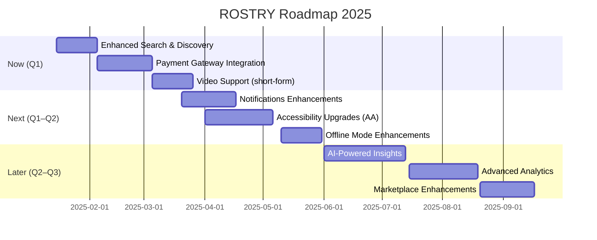

### Now / Next / Later (Summary)

| Horizon | Focus | Target |
|---------|-------|--------|
| **Now** | Enhanced Search & Discovery; Payment Gateway Integration; Video Support | Q1 2025 |
| **Next** | Notification Enhancements; Accessibility Improvements; Offline Mode Enhancements | Q1–Q2 2025 |
| **Later** | Advanced Analytics; Marketplace Enhancements; AI-Powered Insights; Multi-language support | Q2–Q3 2025 |

See detailed sections below for scope and metrics. Longer technical details will be consolidated into architecture docs over time.
# Timeline

# ROSTRY Product Roadmap

**Version:** 1.0  
**Last Updated:** 2025-01-15  
**Review Cycle:** Quarterly  

---

## Introduction

This roadmap outlines the planned features and improvements for ROSTRY. It represents our current vision and is subject to change based on user feedback, market conditions, and technical discoveries.

### How to Use This Document

- **Developers**: Understand upcoming work and architectural considerations
- **Contributors**: Identify areas where you can help
- **Users**: See what features are coming and when
- **Stakeholders**: Track product direction and milestones

### Feedback Process

We welcome your input! Share feedback through:
- GitHub Issues with the `enhancement` label
- GitHub Discussions in the Ideas category
- Direct communication with maintainers

**Disclaimer**: This roadmap is not a commitment. Timelines and features may change based on priorities, resources, and feedback.

---

## Vision and Goals

### Product Vision

ROSTRY aims to be the **leading platform for poultry farming management and marketplace**, combining:
- **Transparency**: Complete traceability from breeding to market
- **Community**: Connect farmers, enthusiasts, and buyers
- **Technology**: Leverage AI, IoT, and blockchain for farming excellence
- **Accessibility**: Mobile-first, offline-capable, multi-language support

### Strategic Goals

**2025 Goals**:
- 10,000+ monthly active users
- 95% feature completeness for core use cases
- <2 second app startup time
- 90%+ crash-free rate
- Expand to 3+ countries

**Long-term Goals**:
- Platform ecosystem with third-party integrations
- Industry-standard traceability solution
- Financial services for farmers
- Supply chain management integration

---

## Current Status (v1.0.0)

### Completed Features

**Authentication & User Management**:
- Phone number authentication
- Role-based access control (General, Farmer, Enthusiast)
- User profiles with detailed information
- Onboarding flows for all user types

**Social Platform**:
- Post creation and engagement (likes, comments, shares)
- Direct messaging and group chats
- Community groups and events
- Follow system and feed personalization
- Context-aware messaging
- Expert profiles and consultation booking

**Marketplace**:
- Product listings with rich media
- Auction system with bidding
- Shopping cart and wishlist
- Filter presets (Nearby, Traceable, Budget, Premium)
- Payment integration framework

**Secure Transfer System**:
- Ownership transfer with verification
- Guided transfer workflow
- Cloud Functions-based security
- Rate limiting and fraud detection
- Complete audit trail
- Dispute resolution framework

**Farm Monitoring**:
- Growth tracking and analytics
- Breeding management
- Quarantine management
- Mortality tracking
- Vaccination scheduling
- Hatching process monitoring
- Alert system with urgency levels

**Advanced Analytics**:
- Performance dashboards
- Financial tracking and ROI
- Breeding insights
- AI-powered recommendations
- Export functionality

**Infrastructure**:
- Offline-first architecture
- Room database with SQLCipher encryption
- Firebase integration (Auth, Firestore, Storage, Functions, FCM)
- WorkManager background jobs
- Comprehensive security measures

### Known Limitations

- **Payment Gateway**: Framework in place, full integration pending
- **Video Support**: Limited to basic playback
- **Search**: Basic filtering, advanced search coming
- **Internationalization**: English only currently
- **IoT Integration**: Not yet available

---

## Short-Term Roadmap (Q1 2025)

### High Priority

#### 1. Enhanced Search and Discovery
**Status**: Planning  
**Target**: February 2025  
**Effort**: 3 weeks

**Features**:
- Advanced search with multiple filters
- Full-text search across products, posts, users
- Search history and saved searches
- AI-powered search suggestions
- Fuzzy matching for typos
- Search result ranking by relevance

**Success Metrics**:
- 80%+ search success rate
- <500ms search response time
- 30%+ users use advanced filters

#### 2. Payment Gateway Integration
**Status**: In Progress  
**Target**: March 2025  
**Effort**: 4 weeks

**Features**:
- UPI integration (PhonePe, Google Pay, Paytm)
- Credit/Debit card support
- Wallet system for in-app balance
- Payment history and receipts
- Refund processing automation
- Multi-currency support

**Success Metrics**:
- 98%+ payment success rate
- Support for 5+ payment methods
- <10 second checkout time

#### 3. Video Content Support
**Status**: Planning  
**Target**: March 2025  
**Effort**: 3 weeks

**Features**:
- Video upload with compression
- Video streaming optimization
- Live streaming for expert sessions
- Video thumbnails and previews
- Video quality selection
- Bandwidth-aware playback

**Success Metrics**:
- Support videos up to 5 minutes
- 90%+ compression without quality loss
- Smooth playback on 3G+ networks

### Medium Priority

#### 4. Notification Enhancements
**Status**: Planning  
**Target**: Q1 2025

**Features**:
- Rich notifications with images and actions
- Notification preferences center
- In-app notification center with history
- Notification grouping and smart bundling
- Quiet hours configuration

#### 5. Accessibility Improvements
**Status**: Planning  
**Target**: Q1 2025

**Features**:
- Complete TalkBack/screen reader support
- Voice command integration
- High contrast theme
- Font size customization
- Keyboard navigation support
- WCAG 2.1 AA compliance

---

## Medium-Term Roadmap (Q2-Q3 2025)

### Major Features

#### 1. AI-Powered Insights
**Target**: Q2 2025  
**Effort**: 6 weeks

**Features**:
- Disease prediction from symptoms and photos
- Growth optimization recommendations
- Market price predictions using historical data
- Breeding recommendations based on genetics
- Feed efficiency optimization
- Mortality pattern analysis

**Technology**:
- TensorFlow Lite for on-device ML
- Cloud-based ML models for complex analysis
- Integration with ML Kit

#### 2. Multi-Language Support
**Target**: Q2 2025  
**Effort**: 4 weeks

**Languages**:
- Hindi (\u0939\u093f\u0902\u0926\u0940)
- Telugu (\u0c24\u0c46\u0c32\u0c41\u0c17\u0c41)
- Tamil (\u0ba4\u0bae\u0bbf\u0bb4\u0bcd)
- Kannada (\u0c95\u0ca8\u0ccd\u0ca8\u0ca1)
- Marathi (\u092e\u0930\u093e\u0920\u0940)

**Features**:
- RTL language support framework
- Localized content and terminology
- Region-specific content recommendations
- Language preference persistence

#### 3. Offline Mode Enhancements
**Target**: Q2 2025  
**Effort**: 3 weeks

**Features**:
- Improved sync conflict resolution UI
- Offline analytics and reporting
- Smart preloading of frequently accessed data
- Offline-first media caching
- Background sync optimization

#### 4. Advanced Analytics
**Target**: Q3 2025  
**Effort**: 5 weeks

**Features**:
- Predictive analytics dashboards
- Benchmark comparisons with community averages
- Custom report builder
- Scheduled report generation
- Export to PDF, Excel, CSV
- Data visualization improvements

#### 5. Marketplace Enhancements
**Target**: Q3 2025  
**Effort**: 4 weeks

**Features**:
- Bulk ordering for commercial buyers
- Subscription products (feed, supplies)
- Price negotiation system
- Verified seller program with badges
- Product recommendations engine
- Promoted listings for sellers

---

## Long-Term Roadmap (Q4 2025 and Beyond)

### Strategic Initiatives

#### 1. IoT Integration
**Target**: Q4 2025  
**Effort**: 8 weeks

**Features**:
- Smart sensor integration (temperature, humidity)
- Automated data collection from farm equipment
- Real-time alerts from IoT devices
- Integration with popular IoT platforms
- Dashboard for IoT device management

**Supported Devices**:
- Temperature and humidity sensors
- Automated feeders
- Water monitoring systems
- Camera systems for monitoring

#### 2. B2B Platform
**Target**: Q1 2026  
**Effort**: 10 weeks

**Features**:
- Wholesale marketplace for bulk transactions
- Bulk transfer system with escrow
- Business analytics and reporting
- Invoice generation and management
- B2B-specific pricing and negotiations
- Contract management

#### 3. Financial Services
**Target**: Q2 2026  
**Effort**: 12 weeks

**Features**:
- Microloans for farmers
- Insurance integration (livestock, crop)
- Credit scoring based on platform activity
- Financial planning tools
- Subsidy and grant discovery
- Partnership with financial institutions

#### 4. Supply Chain Management
**Target**: Q2 2026  
**Effort**: 8 weeks

**Features**:
- Feed supplier integration
- Veterinary services marketplace
- Equipment and supplies procurement
- Logistics and transportation coordination
- Inventory management
- Order tracking

#### 5. Blockchain Integration
**Target**: Q3 2026  
**Effort**: 10 weeks

**Features**:
- Immutable traceability records on blockchain
- Smart contracts for transfers and transactions
- Decentralized verification system
- NFT-based certificates of authenticity
- Transparent supply chain tracking

---

## Technical Roadmap

### Architecture Improvements

**Multi-Module Architecture** (Q2 2025):
- Feature modules for better separation
- Dynamic feature delivery
- Reduced app size and improved build times

**Compose Multiplatform Exploration** (Q3 2025):
- Investigate iOS app development with shared Compose UI
- Proof of concept for cross-platform components

**Backend Migration** (Q4 2025):
- Evaluate custom backend vs Firebase
- Microservices architecture design
- GraphQL API consideration

### Performance Optimization

**App Startup** (Q1 2025):
- Target: <2 seconds cold start
- Lazy initialization
- Startup profiling and optimization

**Memory Optimization** (Q2 2025):
- Memory leak detection and fixes
- Image loading optimization
- Database query optimization

**Battery Optimization** (Q2 2025):
- Background work optimization
- Network request batching
- Efficient location tracking

**Network Efficiency** (Q3 2025):
- Request deduplication
- Aggressive caching
- Delta sync for data updates

### Testing and Quality

**Code Coverage** (Q1-Q2 2025):
- Target: 90% coverage for core modules
- Increase unit test coverage
- Integration test suite expansion

**Automated UI Testing** (Q2 2025):
- End-to-end test scenarios
- Visual regression testing
- Accessibility testing automation

**Performance Regression Testing** (Q3 2025):
- Automated performance benchmarks
- CI/CD performance checks
- Performance monitoring dashboards

---

## Platform Expansion

### iOS App
**Target**: Q3 2025  
**Effort**: 16 weeks

**Approach**:
- Native iOS development with Swift and SwiftUI
- Shared backend and data contracts
- Feature parity with Android

**Phases**:
1. Core features (Q3 2025)
2. Advanced features (Q4 2025)
3. Platform-specific optimizations (Q1 2026)

### Web Platform
**Target**: Q4 2025  
**Effort**: 12 weeks

**Features**:
- Progressive Web App (PWA)
- Admin dashboard for management
- Analytics portal for farmers
- Marketplace browsing
- Responsive design for mobile and desktop

**Technology**:
- React or Vue.js
- Firebase integration
- Shared API with mobile apps

---

## Community and Ecosystem

### Developer Tools
**Target**: Q4 2025

**Features**:
- Public REST API with authentication
- SDK for third-party integrations
- Developer documentation portal
- Sandbox environment for testing
- API rate limiting and quotas

### Partner Integrations
**Target**: Ongoing

**Partnerships**:
- Government agricultural schemes integration
- Collaboration with agricultural universities
- Research institution data sharing
- NGO partnerships for farmer education
- Veterinary service networks

---

## Research and Innovation

### R&D Focus Areas

**Machine Learning Models**:
- Disease detection from images
- Growth pattern prediction
- Price forecasting
- Genetic trait analysis

**Computer Vision**:
- Automated bird counting
- Health assessment from photos
- Feed consumption monitoring
- Behavior analysis

**Natural Language Processing**:
- Chatbot for farmer queries
- Automated content moderation
- Sentiment analysis
- Multilingual support

**Blockchain Research**:
- Scalability solutions
- Cost-effective implementations
- Privacy-preserving techniques

**IoT Protocols**:
- Low-power sensor networks
- Edge computing for analytics
- Secure device communication

### Proof of Concepts

**AR for Farm Visualization** (Q3 2025):
- Augmented reality farm layouts
- Virtual farm tours
- AR-based training

**Drone Integration** (Q4 2025):
- Aerial farm monitoring
- Automated bird counting
- Health surveillance

**Satellite Imagery Analysis** (Q1 2026):
- Farm area measurement
- Vegetation health monitoring
- Weather pattern analysis

---

## Metrics and Success Criteria

### Key Performance Indicators

**User Metrics**:
- Monthly Active Users (MAU): 10,000 by end of 2025
- Daily Active Users (DAU): 3,000 by end of 2025
- DAU/MAU ratio: >30%
- User retention (30-day): >60%
- Average session duration: >5 minutes

**Engagement Metrics**:
- Posts per active user: >2/week
- Marketplace transactions: >100/week
- Transfer completions: >50/week
- Community group participation: >40%

**Technical Metrics**:
- App rating: >4.5 stars
- Crash-free rate: >99%
- App startup time: <2 seconds
- ANR rate: <0.5%
- API response time (p95): <500ms

**Business Metrics**:
- Transaction volume: Track GMV
- Revenue per user: Monitor trends
- Customer acquisition cost: Optimize
- Lifetime value: Increase

### Feature Success Metrics

Each feature will be measured by:
- **Adoption Rate**: % of users who try the feature
- **Retention Rate**: % who continue using it
- **User Satisfaction**: NPS or rating
- **Business Impact**: Revenue, engagement, or efficiency gain

---

## Risk and Dependencies

### Technical Risks

**Third-Party API Dependencies**:
- **Risk**: Firebase/cloud service outages or pricing changes
- **Mitigation**: Abstract dependencies, plan migration paths

**Platform Changes**:
- **Risk**: Android OS or policy changes breaking features
- **Mitigation**: Early adoption of beta releases, following best practices

**Security Vulnerabilities**:
- **Risk**: Data breaches or unauthorized access
- **Mitigation**: Regular security audits, penetration testing, quick patching

### Business Risks

**Market Competition**:
- **Risk**: Competitors with similar or better features
- **Mitigation**: Continuous innovation, unique value propositions, community building

**Regulatory Changes**:
- **Risk**: New regulations affecting data handling or marketplace operations
- **Mitigation**: Legal compliance team, proactive policy monitoring

**User Adoption**:
- **Risk**: Users resistant to new technology
- **Mitigation**: Comprehensive onboarding, training materials, community support

### Mitigation Strategies

**For each risk**:
1. Continuous monitoring of risk indicators
2. Regular review and update of mitigation plans
3. Contingency plans for high-impact risks
4. Communication plan for stakeholders

---

## Feedback and Iteration

### User Feedback Channels

**In-App Feedback**:
- Feedback button in settings
- Feature-specific feedback prompts
- Bug reporting system

**User Surveys**:
- Quarterly satisfaction surveys
- Feature request surveys
- Usability testing sessions

**Focus Groups**:
- Monthly sessions with power users
- Regional farmer groups
- Expert panels

**Analytics Data**:
- Usage patterns and trends
- Feature adoption rates
- Error and crash analysis

### Roadmap Updates

**Quarterly Reviews**:
- Assess progress against roadmap
- Reprioritize based on feedback and learnings
- Update timelines and scope

**Community Input**:
- Feature voting system
- Public roadmap discussions
- Contributor prioritization input

**Stakeholder Alignment**:
- Regular stakeholder meetings
- Transparent communication of changes
- Collaborative decision-making

---

## How to Contribute

We welcome community contributions to help us achieve this roadmap!

### Feature Requests

1. **Check existing issues** to avoid duplicates
2. **Use the feature request template** in GitHub Issues
3. **Provide detailed context** about the problem and proposed solution
4. **Be open to feedback** and alternative approaches

### Development Contributions

1. **Pick an item from the roadmap** that interests you
2. **Comment on related issues** to coordinate with maintainers
3. **Follow the contribution guidelines** in [CONTRIBUTING.md](CONTRIBUTING.md)
4. **Submit high-quality PRs** with tests and documentation

### Research and Design

Help with:
- User research and interviews
- UI/UX design and prototyping
- Technical architecture proposals
- Performance optimization

See [CONTRIBUTING.md](CONTRIBUTING.md) for detailed contribution guidelines.

---

## Appendix

### Glossary

**Technical Terms**:
- **Offline-first**: Architecture pattern prioritizing local data and syncing when online
- **MVVM**: Model-View-ViewModel architectural pattern
- **Clean Architecture**: Separation of concerns with clear boundaries
- **WorkManager**: Android library for deferrable background work

**Business Terms**:
- **GMV**: Gross Merchandise Value (total transaction value)
- **MAU/DAU**: Monthly/Daily Active Users
- **NPS**: Net Promoter Score (customer satisfaction metric)
- **ROI**: Return on Investment

### References

**Internal Documentation**:
- [Architecture Documentation](docs/architecture.md)
- [Feature Documentation](docs/README-docs.md)
- [Contributing Guidelines](CONTRIBUTING.md)
- [Changelog](CHANGELOG.md)

**External Resources**:
- [Android Development Best Practices](https://developer.android.com/topic/architecture)
- [Material Design Guidelines](https://m3.material.io/)
- [Firebase Documentation](https://firebase.google.com/docs)

---

**Last Updated**: 2025-01-15  
**Next Review**: 2025-04-15  
**Maintainers**: ROSTRY Product Team

---

*This roadmap is a living document and will be updated regularly based on progress, feedback, and changing priorities. Your input helps shape the future of ROSTRY!*
