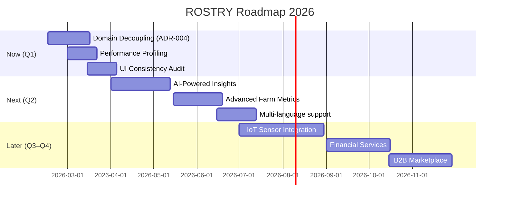

# ROSTRY Product Roadmap

📍 **Last Updated: 2026-03-01** | **Next Review: 2026-06-01**

## Now / Next / Later (Summary)

| Horizon | Focus | Target |
|---------|-------|--------|
| **Now** | 3-Tier Domain Decoupling (ADR-004); Performance Profiling; UI Consistency | Q1 2026 |
| **Next** | AI-Powered Insights; Advanced Farm Metrics; Multi-language support | Q2 2026 |
| **Later** | IoT Sensor Integration; Financial Services for Farmers; B2B Marketplace | Q3–Q4 2026 |

## Timeline

```mermaid
gantt
  title ROSTRY Roadmap 2026
  dateFormat  YYYY-MM-DD
  section Now (Q1)
  Domain Decoupling (ADR-004)    :now1, 2026-02-15, 30d
  Performance Profiling         :now2, 2026-03-01, 21d
  UI Consistency Audit          :now3, 2026-03-15, 21d
  section Next (Q2)
  AI-Powered Insights           :next1, 2026-04-01, 42d
  Advanced Farm Metrics         :next2, 2026-05-15, 35d
  Multi-language support        :next3, 2026-06-15, 28d
  section Later (Q3–Q4)
  IoT Sensor Integration        :later1, 2026-07-01, 60d
  Financial Services            :later2, 2026-09-01, 45d
  B2B Marketplace               :later3, 2026-10-15, 45d
```

---

## 2026 Goals

- **10,000+** monthly active users
- **95%** feature completeness for core use cases
- **<2 second** app startup time
- **99%+** crash-free rate
- Expand to **3+ countries**

---

## Completed (Q1-Q3 2025)

- **Enhanced Search & Discovery**: Advanced filtering and AI-powered suggestions (2025-02-15)
- **Payment Gateway Integration**: UPI and card support via internal framework (2025-03-10)
- **Video Content Support**: Compression and streaming optimization for short-form video (2025-04-05)
- **Digital Farm V2**: Interactive isometric visualization and management tools (2025-06-20)
- **Evidence-Based Order System**: Secure transaction workflow with audit trails (2025-08-15)

---

## Detailed Roadmap (2026)

### Q1 2026: Consolidation & Performance
#### 1. 3-Tier Domain Decoupling (ADR-004)
Scaling the data model to separate physical assets from commercial listings.
- **Success Criteria**: Zero data leakage between management/market domains; 40% reduction in ViewModel complexity.

#### 2. Performance Profiling
Optimizing app startup and canvas rendering (Digital Farm).
- **Success Criteria**: <2s cold start; stable 60fps during farm interaction.

### Q2 2026: Intelligence & Reach
#### 1. AI-Powered Insights
Disease prediction and growth optimization recommendations.
#### 2. Multi-Language Support
Expanding accessibility for rural farmers in regional languages.

### Q3-Q4 2026: Ecosystem Expansion
#### 1. IoT Sensor Integration
Real-time environmental monitoring for poultry sheds.
#### 2. Financial Services
Micro-insurance and credit scoring for active platform users.

---

*This roadmap is a living document. Feedback is welcome via GitHub Issues.*
