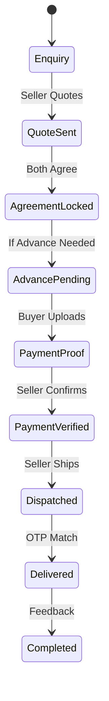

# ROSTRY Complete System Documentation for R&D Team

**Version:** 1.2.2
**Date:** 2026-01-13
**Security Level:** INTERNAL USE ONLY
**Status:** VALIDATED

---

## 1. Executive Summary

### Project Overview
ROSTRY is a production-ready, offline-first Android AgriTech application designed to revolutionize the poultry farming industry. It serves as a unified ecosystem connecting Farmers, Enthusiasts, and General users through a trust-based marketplace, comprehensive farm monitoring tools, and a secure social platform.

The system is built on specific principles:
-   **Trust & Transparency Check**: Evidence-based workflows for all transactions.
-   **Offline-First**: Complete functionality without internet, synchronizing when connected.
-   **Data-Driven**: Heavy reliance on analytics, lineage tracking, and performance metrics.
-   **Secure**: End-to-end encryption for data at rest and RBAC for all operations.
-   **Cost-Efficient**: "Thick Client, Smart Rules" architecture to run entirely on Firebase Free Tier (Spark Plan).

### Technology Stack Summary
-   **Architecture**: Clean Architecture (MVVM) + Single Activity
-   **UI**: Jetpack Compose + Material 3
-   **Database**: Room + SQLCipher (Version 65, 120+ Entities)
-   **Network/Cloud**: Firebase (Auth, Firestore, Storage, Functions, FCM)
-   **DI**: Hilt (21+ Modules)
-   **Async**: Coroutines + Flow + WorkManager (30+ Workers)
-   **Testing**: JUnit 5, MockK, Turbine, Robolectric

### Key Metrics
-   **Documentation**: 125+ Files (Consolidated here)
-   **Data Layer**: 57+ Repositories, 120+ Entities (Core), 40+ DAOs
-   **UI Layer**: 114+ ViewModels, 220+ Screens/Components
-   **Background**: 30+ Workers for sync and automation

---

## 2. System Architecture

### High-Level Architecture
ROSTRY follows the recommended Guide to App Architecture:
1.  **UI Layer**: Reacts to state changes, completely decoupled from logic.
2.  **Domain Layer**: Pure Kotlin business logic, Use Cases, and Models.
3.  **Data Layer**: Repositories mediating between Local (Room) and Remote (Firebase).
4.  **Admin Portal**: Specialized module for system administration, verification, and moderation.

### 3.5 Admin Portal & Verification
ROSTRY includes a specialized Admin Portal for managing user trust and system integrity.
-   **Access Control**: Strictly gated via `UserType.ADMIN` and `Permission.ADMIN_VERIFICATION`.
-   **Verification Workflow**:
    1.  Users submit KYC documents (Govt ID, Farm Photos).
    2.  Admins review submissions via `AdminVerificationScreen`.
    3.  `AdminVerificationViewModel` coordinates approval/rejection.
    4.  Updates propagate atomically to Firestore to trigger role upgrades.
    5.  **Feedback Loop**: Admin action triggers `PROFILE_SYNC` FCM message -> Client executes silent `UserRepository` refresh -> UI updates immediately.
-   **Integration**: Seamlessly embedded in `AppNavHost` with deep links from Profile and Settings screens.
-   **57+ Repositories** across multiple subdirectories including monitoring, social, and enthusiast-specific repositories
-   **Subdirectories**: monitoring/, social/, enthusiast/
-   **Key Repositories**: UserRepository, ProductRepository, OrderRepository, EvidenceOrderRepository, SocialRepository, TransferWorkflowRepository, FarmAssetRepository, VaccinationRepository, AnalyticsRepository, TraceabilityRepository, GamificationRepository, BreedingRepository, CommunityRepository, AuctionRepository, CartRepository, ChatRepository, CoinRepository, EnthusiastBreedingRepository, EnthusiastVerificationRepository, FamilyTreeRepository, FarmActivityLogRepository, FarmVerificationRepository, FeedbackRepository, HatchabilityRepository, InventoryRepository, InvoiceRepository, LikesRepository, LogisticsRepository, MarketListingRepository, PaymentRepository, ProductMarketplaceRepository, ReviewRepository, SaleCompletionService, StorageRepository, StorageUsageRepository, TraceabilityRepository, TrackingRepository, TransferRepository, TransferWorkflowRepository, VerificationDraftRepository, VirtualArenaRepository, WeatherRepository, WishlistRepository, BirdHealthRepository, FarmFinancialsRepository, FarmOnboardingRepository, RoleUpgradeMigrationRepository, OnboardingChecklistRepository, OrderManagementRepository, ReportGenerationRepository, TaskRepository, DailyLogRepository, GrowthRepository, MortalityRepository, QuarantineRepository, HatchingRepository, FarmPerformanceRepository, MessagingRepository, PedigreeRepository, BreedRepository


```mermaid
graph TD
    UI[UI Layer (Compose)] --> VM[ViewModel]
    VM --> UC[Domain Use Cases]
    UC --> Repo[Repository Interface]
    Repo --> Data[Data Layer Implementation]
    Data --> Local[Room Database (SQLCipher)]
    Data --> Remote[Firebase / REST API]
    Local <--> Sync[WorkManager Sync]
    Sync <--> Remote
```

### Dependency Injection
Hilt is used throughout. Key scopes:
-   `@Singleton`: Repositories, Database, Network Clients.
-   `@ActivityRetainedScoped`: User Session data.
-   `@ViewModelScoped`: Screen-specific logic.
-   **21+ DI Modules** organizing dependencies across the application
-   **RepositoryModule** binds all 57+ repository interfaces to implementations
-   **BaseViewModel** pattern for common error handling across 114+ ViewModels
-   **Entry Points** for accessing dependencies from non-Hilt classes
-   **Qualifiers** for distinguishing multiple implementations of the same type
-   **PaymentModule** for payment gateway binding
-   **MediaUploadInitializer** for media upload initialization
-   **AppEntryPoints** for accessing application-level dependencies

### Navigation Architecture
Single Activity `AppNavHost` managing feature graphs:
-   `AuthNavGraph`: Login, OTP, Onboarding.
-   `FarmerNavGraph`: Monitoring, Marketplace, Analytics.
-   `SocialNavGraph`: Feed, Messaging, Community.
-   `EnthusiastNavGraph`: Breeding, Collection, Shows.
-   **114+ ViewModels** across all feature packages
-   **StateFlow** is used consistently across all ViewModels for predictable state management
-   **SavedStateHandle** is utilized for process death survival and navigation arguments
-   **Paging 3** is integrated with StateFlow for efficient list loading
-   **combine** and **flatMapLatest** operators are used for complex state composition

### Offline-First Strategy
The **Room Database** is the Single Source of Truth.
1.  UI reads from Room `Flow`.
2.  User actions write to Room immediately (marking `dirty = true`).
3.  `WorkManager` picks up dirty records and pushes to Firebase.
4.  Remote changes are pulled and updating Room, triggering UI updates via Flow.

---

## 3. Technology Stack Deep Dive

### Frontend
-   **Jetpack Compose**: 100% Declarative UI.
-   **Material 3**: Theming, dynamic color support.
-   **Coil**: Image loading with memory caching.
-   **MPAndroidChart / Vico**: Complex analytics visualization.

### State Management
-   **StateFlow**: For UI state (Loading, Success, Error).
-   **SharedFlow**: For one-time events (Navigation, Snackbars).
-   **SavedStateHandle**: Process death survival.

### Backend & Cloud
### Backend & Cloud
-   **Firebase Authentication**: Google Sign-In (Primary), Email/Password. Phone Auth is currently **DISABLED** for Free Tier compliance.
-   **Cloud Firestore**: NoSQL DB for sync.
-   **Cloud Storage**: Evidence verification photos/docs (Videos disabled for Free Tier).
-   **Cloud Functions**: **DISABLED** (Logic moved to client/Firestore rules for Spark Plan compliance).
-   **FCM**: Push notifications for orders and social actions.

### Database
-   **Room**: Object Mapping.
-   **SQLCipher**: 256-bit AES encryption for `rostry.db`.
-   **Migrations**: Complex history from v1 to v65 (current).
-   **61+ Entity files** with 120+ entities across multiple subdirectories
-   **Repository Layer** with 57+ repositories across multiple subdirectories including monitoring, social, and enthusiast-specific repositories
-   **Subdirectories**: monitoring/, social/, enthusiast/
-   **Key Repositories**: UserRepository, ProductRepository, OrderRepository, EvidenceOrderRepository, SocialRepository, TransferWorkflowRepository, FarmAssetRepository, VaccinationRepository, AnalyticsRepository, TraceabilityRepository, GamificationRepository, BreedingRepository, CommunityRepository, AuctionRepository, CartRepository, ChatRepository, CoinRepository, EnthusiastBreedingRepository, EnthusiastVerificationRepository, FamilyTreeRepository, FarmActivityLogRepository, FarmVerificationRepository, FeedbackRepository, HatchabilityRepository, InventoryRepository, InvoiceRepository, LikesRepository, LogisticsRepository, MarketListingRepository, PaymentRepository, ProductMarketplaceRepository, ReviewRepository, SaleCompletionService, StorageRepository, StorageUsageRepository, TraceabilityRepository, TrackingRepository, TransferRepository, TransferWorkflowRepository, VerificationDraftRepository, VirtualArenaRepository, WeatherRepository, WishlistRepository, BirdHealthRepository, FarmFinancialsRepository, FarmOnboardingRepository, RoleUpgradeMigrationRepository, OnboardingChecklistRepository, OrderManagementRepository, ReportGenerationRepository, TaskRepository, DailyLogRepository, GrowthRepository, MortalityRepository, QuarantineRepository, HatchingRepository, FarmPerformanceRepository, MessagingRepository, PedigreeRepository, BreedRepository

---

## 4. Database Architecture

### Schema Overview
The database supports 6 core domains:
1.  **User/Profile**: `UserEntity`, `UserProfileEntity`.
2.  **Product/Farm**: `ProductEntity`, `BatchEntity`, `LineageEntity`.
3.  **Monitoring**: `GrowthRecord`, `VaccinationRecord`, `DailyLog`.
4.  **Social**: `PostEntity`, `CommentEntity`, `GroupEntity`.
5.  **Marketplace**: `OrderEntity`, `QuoteEntity`, `EvidenceEntity`.
6.  **System**: `SyncQueue`, `Notification`, `AuditLog`.

### SQLCipher Encryption
Configured in `DatabaseModule.kt`.
-   Passphrase generated/retrieved securely (Keystore).
-   All user data at rest is encrypted.
-   Performance overhead managed by async DAO access.

---

## 5. Feature Catalog

### 5.1 Authentication & User Management
-   **Multi-Role**: Users can switch between Farmer, Enthusiast, General.
-   **KYC**: Verification flow with manual admin approval.
-   **Session**: Token management with auto-refresh.

### 5.2 Social Platform
-   **Feeds**: Personalized content based on role.
-   **Community Hub**: Context-aware messaging (Consultation vs Inquiry).
-   **Groups**: Topic-based communities.
-   **Expert System**: Booking consultations with rated experts.

### 5.3 Marketplace & Evidence-Based Orders
A 10-state workflow ensures trust:
1.  **Enquiry** -> **Quote** -> **Agreement**.
2.  **Advance Payment** (w/ Proof) -> **Verified**.
3.  **Dispatch** (w/ Photos) -> **Delivery** (OTP/GPS).
4.  **Completed** (Audit Trail).

### 5.4 Secure Transfer System
-   Digital ownership transfer.
-   Requires agreement from both parties.
-   transfers lineage data (parents, genetics) with the asset.

### 5.5 Farm Monitoring
-   **Modules**: Growth, Vaccination, Mortality, Quarantine, Hatching, Breeding.
-   **Daily Logs**: Unified entry point for observations.
-   **Tasks**: Automated reminders generated by `LifecycleWorker`.
-   **FCR Calculator**: Feed conversion ratio analytics.
-   **Farm Activity Log**: Comprehensive farm activity tracking.
-   **Batch Management**: Batch creation, splitting, and tracking.

### 5.6 Digital Farm Visualization 2.0 (NEW - Enhanced)
-   **2.5D Isometric Engine**: Premium rendering with Z-ordering (~2040 lines).
-   **Zone-Based Layout**: Nursery, Breeding, Free Range, Grow-Out, Ready Display, Market zones.
-   **Day/Night Cycle**: Time-based sky rendering (morning golden, night dark blue + stars/moon).
-   **Weather Effects**: Rain particles with splash, wind-animated grass, overcast clouds.
-   **Flocking Algorithm**: Natural group movement using sine-wave oscillation.
-   **Age-Based Visuals**: Size progression (50%→100%), color lerping (yellow chicks → adult).
-   **Breeding Indicators**: Hen count badges, fertility hearts, DNA helix genetic badges.
-   **Building Placement**: 8 types (Coop, Brooder, Water Fountain, Feeder, Nesting Box, Perch, Dust Bath, Shade Shelter).
-   **Resource Management**: Feed/water/medicine bars with low-stock alerts.
-   **Daily Tasks**: 7 task types (Collect Eggs, Feed Birds, Weigh, Vaccinate, Clean, List, Complete Sale).
-   **Achievements**: Bronze/Silver/Gold milestone badges with pulsing animations.
-   **Performance Charts**: Mini line/bar/pie charts for farm metrics.
-   **Pedigree Tree**: 7-node ancestry visualization with father/mother/grandparent connections.
-   **Competitions**: 6 competition types (Best Breeder, Top Seller, Healthiest Flock, Egg Champion, Fastest Growth, Showcase).
-   **Leaderboards**: Ranked entries with gold/silver/bronze indicators.
-   **Farm Sharing**: Public showcase with reactions (Like, Love, Wow, Follow) and visitor tracking.
-   **Offline Mode**: Cached snapshots with 24-hour expiry for offline viewing.

### 5.7 Farm Asset Management
-   **Farm Asset List**: "My Farm" tab destination for asset management.
-   **Farm Asset Detail**: View/manage individual assets.
-   **Create Asset**: Add new farm assets.
-   **Create Listing from Asset**: Publish assets to marketplace.
-   **Create Auction from Asset**: Auction assets.
-   **Bird History**: Unified timeline for birds/batches.
-   **Asset Tracking**: Complete asset lifecycle tracking.

### 5.8 Evidence-Based Order System
-   **10-State Workflow**: Enquiry → Quote → Agreement → Advance Payment → Verification → Dispatch → Delivery → Completion.
-   **Payment Proof**: Verification with evidence upload.
-   **Delivery OTP**: Secure delivery confirmation.
-   **Dispute Resolution**: Order dispute handling.
-   **Order Tracking**: Complete order lifecycle tracking.
-   **Payment Verification**: Payment verification workflows.
-   **Review System**: Order and seller reviews.

### 5.7 Traceability & Lineage Tracking
-   **Family Tree**: Recursive traversal of parents (`PedigreeScreen`).
-   **Genetic Scoring**: Tracking distinct traits.
-   **QR Codes**: For rapid identification.
-   **Digital Certificates**: Ownership certificates with QR verification.

### 5.8 Analytics & Reporting
-   **Financials**: ROI, Expense tracking.
-   **Performance Charts**: Vico-powered weight/age visualizations.
-   **Export**: PDF/CSV generation for compliance.

### 5.9 Multi-Persona Discovery (NEW - v1.1)
-   **General User**:
    -   `DiscoverHomeScreen`: Curated sections (Near You, Festival, High-Rated).
    -   `ProductTrustChips`: Verified seller, age band, readiness indicators.
    -   `QuickContactBar`: Call, WhatsApp, In-app chat.
    -   `QuickOrderSheet`: Fast ordering with COD support.
-   **Farmer**:
    -   `GetTodayTasksUseCase`: Aggregated daily tasks.
    -   `TrustBadgeService`: Healthy Flock, Low Mortality, On-time badges.
    -   Enhanced Digital Farm with long-press actions.
-   **Enthusiast**:
    -   `PedigreeScreen`: Family tree visualization.
    -   `PerformanceChartSection`: Weight growth charts (Vico).
    -   `DigitalCertificateComposable`: QR-coded ownership certificates.
    -   `HallOfFameScreen`: Top birds by value and achievements.

### 5.10 Enthusiast Features
-   **Breeding Calculator**: Advanced breeding prediction algorithms.
-   **Performance Journal**: Detailed performance tracking.
-   **Virtual Arena**: Competitive virtual poultry events.
-   **Egg Collection**: Egg tracking and management.
-   **Hatchability Tracker**: Hatchability analysis and tracking.
-   **Egg Tray**: Visual grid of eggs with status.
-   **Rooster Card**: Shareable bird cards.
-   **Showcase Card**: Bird showcase functionality.
-   **Claim Transfer**: Transfer claiming functionality.
-   **Show Log**: Detailed show records.
-   **Pedigree Management**: Advanced lineage tracking.
-   **Digital Coop Features**: Specialized enthusiast features.

---

## 6. UI/UX Architecture

-   **Theme**: `RostryTheme` handles Light/Dark modes.
-   **Components**: 22+ Reusable atoms (Buttons, Cards, Inputs).
-   **Screens**: `Scaffold` based with consistent TopBar/BottomBar.
-   **Accessibility**: Semantics enabled, tested for TalkBack.
-   **114+ ViewModels** across all feature packages
-   **StateFlow** is used consistently across all ViewModels for predictable state management
-   **SavedStateHandle** is utilized for process death survival and navigation arguments
-   **Paging 3** is integrated with StateFlow for efficient list loading
-   **combine** and **flatMapLatest** operators are used for complex state composition
-   **BaseViewModel** pattern provides centralized error handling for all ViewModels

---

## 7. Data Flow & Workflows

### Order Lifecycle Flow


### Sync Flow
1.  **Local Write**: Entity saved, `dirty=1`.
2.  **Worker Trigger**: `SyncWorker` fires (OneTime or Periodic).
3.  **Push**: Read all `dirty=1`, POST to Firestore.
4.  **Ack**: If success, set `dirty=0`, update `syncedAt`.
5.  **Pull**: GET changes from Firestore `> last_synced_at`.
6.  **Merge**: Upsert to Room (Last-Write-Wins or customized).

---

## 8. Backend Integration

### Firestore Schema
-   `/users/{uid}`: Profile data.
-   `/farmers/{uid}/inventory/{id}`: Farm assets.
-   `/social_posts/{id}`: Global posts.
-   `/orders/{id}`: Transaction records.

### Cloud Functions
-   `onUserCreate`: Initialize generic profile.
-   `verifyTransaction`: Validate evidences.
-   `sanitizeContent`: Text analysis for posts.

---

## 9. Code Organization

```
app/src/main/java/com/rio/rostry/
├── data/
│   ├── database/ (Entity, Dao, AppDatabase)
│   ├── repository/ (Repo Impl)
│   └── remote/ (API, DTO)
├── domain/
│   ├── model/ (Pure Kotlin Classes)
│   ├── repository/ (Interfaces)
│   └── usecase/ (Business Logic)
├── di/ (Hilt Modules)
├── ui/
│   ├── common/ (Reusable Composables)
│   ├── farmer/ (Feature Screens)
│   ├── social/
│   └── theme/
├── workers/ (WorkManager)
└── utils/ (Extensions, Constants)
```

---

## 10. Implementation Patterns

### MVVM with Resource State
ViewModels expose `StateFlow<Resource<T>>` using the Resource sealed class.
```kotlin
sealed class Resource<out T> {
    object Loading : Resource<Nothing>()
    data class Success<T>(val data: T) : Resource<T>()
    data class Error(val message: String?, val exception: Exception? = null) : Resource<Nothing>()
}
```
- **114+ ViewModels** follow the BaseViewModel pattern with standardized error handling
- **StateFlow** is used consistently across all ViewModels for predictable state management
- **SavedStateHandle** is utilized for process death survival and navigation arguments
- **DataStore** is used for user preferences and settings
- **Paging 3** is integrated with StateFlow for efficient list loading
- **combine** and **flatMapLatest** operators are used for complex state composition
- **BaseViewModel** pattern provides centralized error handling for all ViewModels
- **Extension functions** for handling Resource types

### Repository Pattern
Repositories handle data strategies.
-   `fetchX()`: Returns `Flow<T>` from Room.
-   `refreshX()`: Triggers network sync.
-   **57+ repositories** across multiple subdirectories including monitoring, social, and enthusiast-specific repositories
-   **Subdirectories**: monitoring/, social/, enthusiast/
-   **Key Repositories**: UserRepository, ProductRepository, OrderRepository, EvidenceOrderRepository, SocialRepository, TransferWorkflowRepository, FarmAssetRepository, VaccinationRepository, AnalyticsRepository, TraceabilityRepository, GamificationRepository, BreedingRepository, CommunityRepository, AuctionRepository, CartRepository, ChatRepository, CoinRepository, EnthusiastBreedingRepository, EnthusiastVerificationRepository, FamilyTreeRepository, FarmActivityLogRepository, FarmVerificationRepository, FeedbackRepository, HatchabilityRepository, InventoryRepository, InvoiceRepository, LikesRepository, LogisticsRepository, MarketListingRepository, PaymentRepository, ProductMarketplaceRepository, ReviewRepository, SaleCompletionService, StorageRepository, StorageUsageRepository, TraceabilityRepository, TrackingRepository, TransferRepository, TransferWorkflowRepository, VerificationDraftRepository, VirtualArenaRepository, WeatherRepository, WishlistRepository, BirdHealthRepository, FarmFinancialsRepository, FarmOnboardingRepository, RoleUpgradeMigrationRepository, OnboardingChecklistRepository, OrderManagementRepository, ReportGenerationRepository, TaskRepository, DailyLogRepository, GrowthRepository, MortalityRepository, QuarantineRepository, HatchingRepository, FarmPerformanceRepository, MessagingRepository, PedigreeRepository, BreedRepository

---

## 11. Background Processing (WorkManager)

**Catalog (Complete List of 30+):**
1.  `SyncWorker`: Core data synchronization (8-hour intervals reduced from 6h for quota optimization).
2.  `OutboxSyncWorker`: Handles all message delivery and batched operations.
3.  `PullSyncWorker`: Fetches remote changes.
4.  `MediaUploadWorker`: Resumable upload for large evidence files.
5.  `LifecycleWorker`: Daily check for age-based transitions (Chick -> Juvenile).
6.  `VaccinationReminderWorker`: Generates tasks for due vaccines.
7.  `FarmPerformanceWorker`: Aggregates weekly stats.
8.  `OutgoingMessageWorker`: Flushes chat queue (now replaced by OutboxSyncWorker).
9.  `TransferTimeoutWorker`: SLA enforcement for transfers.
10. `ModerationWorker`: Content scanning and moderation.
11. `AnalyticsAggregationWorker`: Daily metrics aggregation.
12. `ReportingWorker`: Report generation.
13. `EvidenceOrderWorker`: Quote expiry, payment reminders, delivery confirmations.
14. `PrefetchWorker`: Content caching under safe conditions.
15. `CommunityEngagementWorker`: Personalized recommendations every 12 hours.
16. `QuarantineReminderWorker`: Health monitoring alerts.
17. `PersonalizationWorker`: AI-driven recommendations.
18. `StorageQuotaMonitorWorker`: Storage usage tracking.
19. `AuctionCloserWorker`: Automatic auction completion.
20. `AutoBackupWorker`: Automatic data backup.
21. `DatabaseMaintenanceWorker`: Database optimization.
22. `RoleUpgradeMigrationWorker`: Role-based data migration.
23. `VerificationUploadWorker`: Verification document processing.
24. `OrderStatusWorker`: Order status updates.
25. `LegacyProductMigrationWorker`: One-time migration from old architecture.
26. `EnthusiastPerformanceWorker`: Enthusiast performance metrics.
27. `NotificationFlushWorker`: Batch notification delivery.
28. `FarmMonitoringWorker`: Daily health checks and alerts.
29. `DailyLogWorker`: Daily log processing.
30. `TaskWorker`: Task management and scheduling.

---

## 12. Security Implementation

-   **Authentication**: Firebase Admin SDK verifies tokens.
-   **RBAC**: Role checks in Domain Use Cases and Firestore Rules.
-   **Encryption**: SQLCipher for local DB.
-   **Pinning**: Certificate pinning for API calls.
-   **Root Detection**: App refuses to run on rooted devices (configurable).

---

## 13. Testing Strategy

**Pyramid**:
-   **Unit (80%)**: ViewModels (Turbine), UseCases (MockK).
-   **Integration (15%)**: Room DAOs (in-memory), Repositories (MockWebServer).
-   **UI (5%)**: Compose Test Rule (Espresso-like interactions).

**Tools**: JUnit 5, MockK, Coroutines-Test, Turbine, Jacoco.

---

## 14. Build & Deployment

-   **Gradle**: Kotlin DSL (`build.gradle.kts`).
-   **Versioning**: Semantic (Major.Minor.Patch).
-   **ProGuard**: Custom rules for Reflection (Gson/Retrofit).
-   **Flavors**: `dev` (Debug, Staging API), `prod` (Release, Live API).

---

## 15. Performance Optimization

-   **Lazy Loading**: Pagination (Paging 3) for feeds and lists.
-   **Image Caching**: Coil default policy + custom eviction.
-   **Database**: Indexed columns for frequently queried fields (`farmerId`, `status`).

---

## 16. API Reference

### Repository Contracts (Key)
-   `ProductRepository`
    -   `getProducts(): Flow<List<Product>>`
    -   `getProduct(id): Flow<Product>`
    -   `saveProduct(product)`
-   `OrderRepository`
    -   `createEnquiry(items)`
    -   `submitEvidence(orderId, type, content)`
    -   `verifyDelivery(otp)`

---

## 17. Code Examples

### ViewModel Example
```kotlin
@HiltViewModel
class ProductViewModel @Inject constructor(
    private val getProducts: GetProductsUseCase
) : ViewModel() {
    val uiState = getProducts()
        .map { UiState.Success(it) }
        .catch { emit(UiState.Error(it.message)) }
        .stateIn(viewModelScope, SharingStarted.WhileSubscribed(5000), UiState.Loading)
}
```

### Entity Example
```kotlin
@Entity(tableName = "products")
data class ProductEntity(
    @PrimaryKey val id: String,
    val name: String,
    @ColumnInfo(index = true) val farmerId: String,
    val isActive: Boolean = true
)
```

---

## 18. Roadmap & Future Plans

### Q1 2026
-   **Search**: Enhanced discovery with filters.
-   **Payments**: Full Gateway Integration.
-   **Video**: Short-form content support.

### Q2 2026
-   **AI Insights**: Disease prediction models.
-   **Localization**: Support for 5 Indic languages.

### Long Term
-   **IoT**: Sensor integration.
-   **Blockchain**: Immutable lineage ledger.

---

## 19. Troubleshooting Guide

-   **Sync Issues**: Check `SyncQueue` table. Ensure `dirty` flags are clearing.
-   **Build Failures**: Run `./gradlew clean`. Check KSP generated versions.
-   **Encryption Errors**: Verify `passphrase` is accessible in Keystore.

---

## 20. Appendices

-   **Glossary**: MVVM, DAO, DTO, OTP, RBAC.
-   **File Index**: See `docs/CODEBASE_STRUCTURE.md`.
