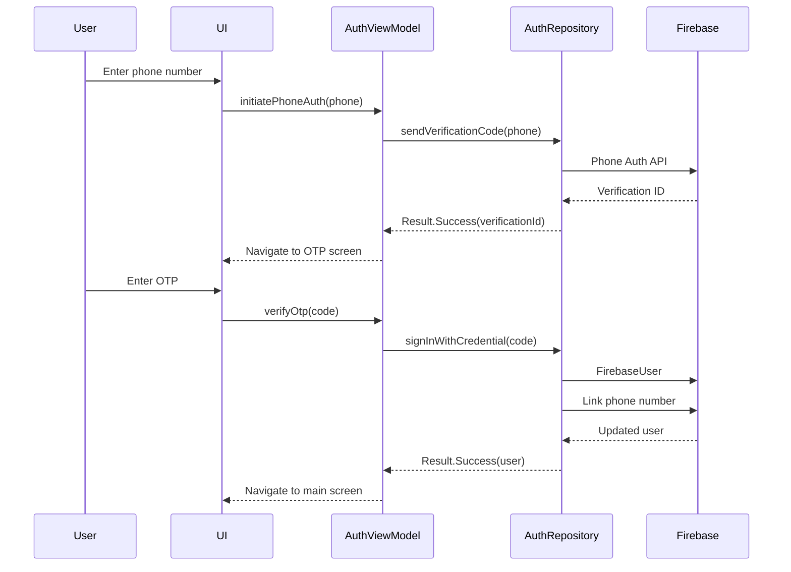
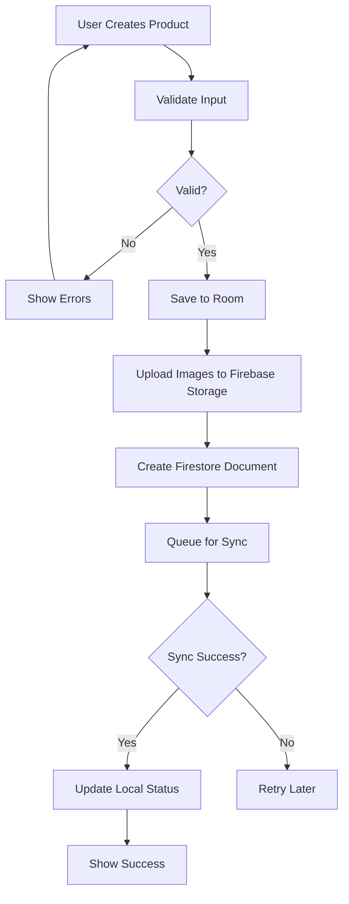
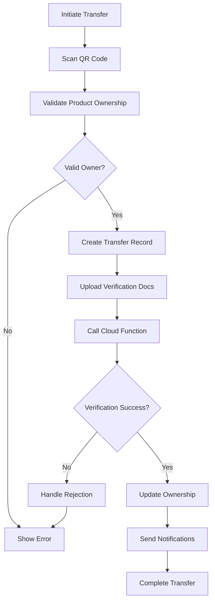
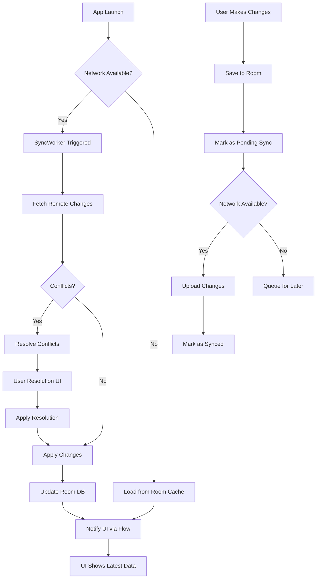
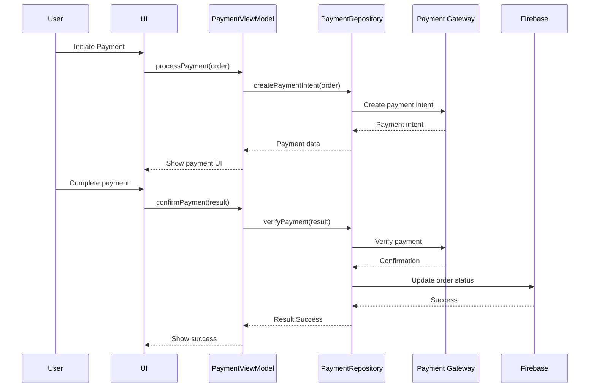
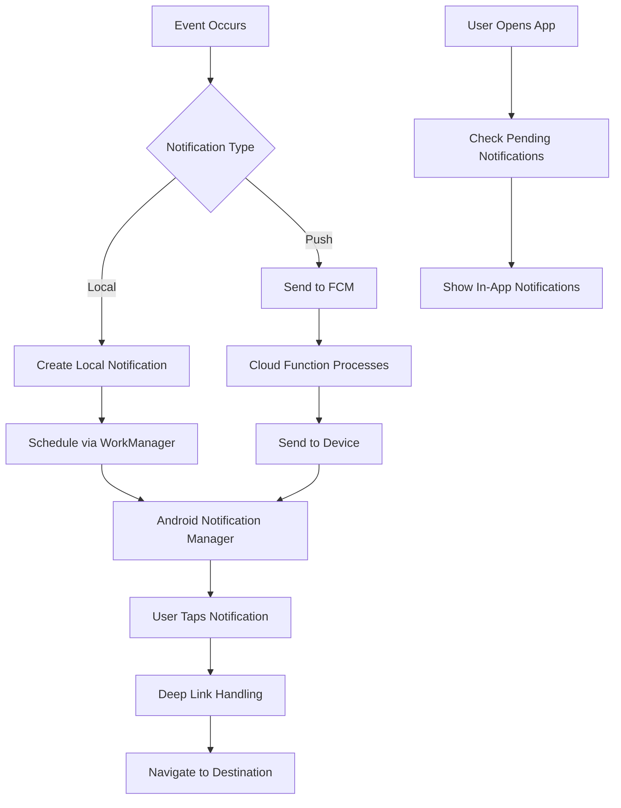

# ROSTRY System Blueprint (SINF - System Information and Functionality)

## 1. Executive Summary

- **Project Overview:** ROSTRY is a comprehensive poultry management platform integrating social networking, marketplace commerce, and farm management features to connect farmers, enthusiasts, and consumers.
- **Stakeholders:** Farmers (producers), Enthusiasts (hobbyists/breeders), General Users (consumers), Experts (consultants).
- **Technology Stack:** Android (Kotlin, Jetpack Compose, Material 3), Firebase (Auth, Firestore, Storage, Functions, App Check), Room with SQLCipher, Hilt DI, WorkManager, Google Maps Platform.
- **Current Version/Status:** Version 1.0 (Production Ready). See `CHANGELOG.md` for release history.
- **Quick Navigation**: Markdown links to key sections like `[System Architecture](#2-system-architecture)`, `[Codebase Structure](#3-codebase-structure)`, `[Feature Catalog](#4-feature-catalog)`, `[Explore features](#4-1-explore-features)`, `[Data Flow Diagrams](#5-data-flow-diagrams)`, `[API Documentation (Marketplace Logic example)](#6-api-documentation)`
- **Updated Counts:** 114+ ViewModels, 57+ Repositories, 30+ Workers, 61+ Entity files, 21 DI Modules

## 2. System Architecture

ROSTRY follows clean architecture with clear layer separation.

graph TB
    subgraph "Presentation Layer"
        UI[Jetpack Compose UI]
        VM[ViewModels]
        NAV[Navigation Graph]
    end
    
    subgraph "Domain Layer"
        UC[Use Cases]
        REPO[Repositories]
    end
    
    subgraph "Data Layer"
        ROOM[(Room Database<br/>SQLCipher)]
        FIRE[(Firebase Services)]
        API[(REST APIs)]
    end
    
    subgraph "Infrastructure"
        HILT[Hilt DI]
        WM[WorkManager]
        SEC[Security Utils]
    end
    
    UI --> VM
    VM --> UC
    UC --> REPO
    REPO --> ROOM
    REPO --> FIRE
    REPO --> API
    VM --> NAV
    HILT --> VM
    HILT --> REPO
    WM --> REPO
    SEC --> REPO
```

### Layer-by-Layer Breakdown

#### UI Layer (Presentation)
- **Framework**: Jetpack Compose with Material 3
- **Structure**: Feature-based packages under `ui/` (auth, marketplace, monitoring, enthusiast, farmer, social, traceability, transfer, etc.)
- **Components**: Reusable components in `ui/components/`, theme in `ui/theme/`
- **Navigation**: Centralized in `ui/navigation/` with role-aware routing
- **State Management**: StateFlow for reactive UI updates
- **Count**: 114+ ViewModels across all feature packages
- **Key Features**: Digital Farm (2.5D isometric engine with weather effects and flocking algorithm), Evidence-Based Order System, Transfer Workflow, Community Hub, Farm Monitoring (growth, vaccination, mortality, quarantine, breeding, hatching), Traceability with lineage tracking, Analytics Dashboard, Gamification with achievements, AI Personalization

#### ViewModel Layer
- **Purpose**: Business logic coordination and state management
- **Pattern**: MVVM with SavedStateHandle for process death survival
- **Injection**: Hilt-assisted injection
- **Communication**: StateFlow for UI state, SharedFlow for events
- **Base Class**: All ViewModels extend BaseViewModel for centralized error handling
- **Count**: 114+ ViewModels across all feature packages
- **State Management**: Uses Resource sealed class for success/loading/error states
- **Error Handling**: Centralized error handling via BaseViewModel pattern

#### Repository Layer
- **Purpose**: Data orchestration and business logic encapsulation
- **Pattern**: Interface + Implementation for testability
- **Responsibilities**: Sync coordination, validation, error handling
- **Integration**: Room DAOs, Firebase services, Retrofit APIs
- **Count**: 57+ repositories across multiple subdirectories
- **Subdirectories**: monitoring/, social/, enthusiast/
- **Key Repositories**: UserRepository, ProductRepository, OrderRepository, EvidenceOrderRepository, SocialRepository, TransferWorkflowRepository, FarmAssetRepository, VaccinationRepository, AnalyticsRepository, TraceabilityRepository, GamificationRepository, BreedingRepository, CommunityRepository, AuctionRepository, CartRepository, ChatRepository, CoinRepository, EnthusiastBreedingRepository, EnthusiastVerificationRepository, FamilyTreeRepository, FarmActivityLogRepository, FarmVerificationRepository, FeedbackRepository, HatchabilityRepository, InventoryRepository, InvoiceRepository, LikesRepository, LogisticsRepository, MarketListingRepository, PaymentRepository, ProductMarketplaceRepository, ReviewRepository, SaleCompletionService, StorageRepository, StorageUsageRepository, TraceabilityRepository, TrackingRepository, TransferRepository, TransferWorkflowRepository, VerificationDraftRepository, VirtualArenaRepository, WeatherRepository, WishlistRepository, BirdHealthRepository, FarmFinancialsRepository, FarmOnboardingRepository, RoleUpgradeMigrationRepository, OnboardingChecklistRepository, OrderManagementRepository, ReportGenerationRepository, TaskRepository, DailyLogRepository, GrowthRepository, MortalityRepository, QuarantineRepository, HatchingRepository, FarmPerformanceRepository, MessagingRepository, PedigreeRepository, BreedRepository

#### Data Layer
- **Local**: Room database with SQLCipher encryption
- **Remote**: Firebase Firestore, Storage, Auth, Functions
- **Sync**: Offline-first with conflict resolution
- **APIs**: Retrofit for external services

### Fetcher System Architecture
- **Purpose**: Centralized data fetching infrastructure with caching, deduplication, and health monitoring
- **Core Components**:
  - `FetcherRegistry`: Central registry for all fetchers with type-safe registration
  - `FetcherCoordinator`: Orchestrates fetch operations, manages cache interactions
  - `RequestCoalescer`: Deduplicates concurrent requests for same data
  - `ContextualLoader`: Handles contextual data loading with priority management
  - `FetcherHealthCheck`: Monitors fetcher performance and availability
- **Design Pattern**: Strategy pattern with pluggable fetcher implementations
- **Caching**: Integrated with CacheManager for intelligent caching strategies
- **Concurrency**: Thread-safe request coalescing to prevent duplicate network calls
- **Error Handling**: Built-in retry mechanisms and circuit breaker patterns
- **Metrics**: Performance monitoring and health metrics collection
- **Integration**: Seamlessly integrated with Repository layer for transparent caching
- **Benefits**: Reduced network overhead, improved performance, enhanced reliability

### Dependency Injection Structure
- **Framework**: Hilt with SingletonComponent, ViewModelScoped, ActivityRetainedScoped
- **Modules**: 21+ modules including AnalyticsModule, AppEntryPoints, AppModule, AuthModuleNew, CoilModule, DatabaseModule, HttpModule, LocationModule, LoveabilityModule, MediaUploadInitializer, NetworkModule, NotifModule, PlacesModule, RemoteModule, RepositoryModule, SessionModule, UpgradeModule, UtilsModule, VerificationModule, ViewModelModule, WorkerBaseHelper
- **Qualifiers**: @LocalDataSource, @RemoteDataSource for multi-implementation binding
- **Testing**: TestInstallIn for mock injection
- **Entry Points**: AppEntryPoints for accessing dependencies from non-Hilt classes
- **Payment Module**: Separate PaymentModule for payment gateway binding

### Navigation Architecture
- **Graph**: Single activity with Compose Navigation
- **Routes**: Centralized in Routes.kt with deep link support
- **Guards**: Role-based access control for destinations
- **State**: Navigation state preserved across configuration changes

### Background Processing Architecture
- **Framework**: WorkManager for reliable deferred execution
- **Workers**: 30+ specialized workers including SyncWorker, OutboxSyncWorker, PullSyncWorker, FarmMonitoringWorker, VaccinationReminderWorker, LifecycleWorker, ModerationWorker, TransferTimeoutWorker, AnalyticsAggregationWorker, MediaUploadWorker, EvidenceOrderWorker, PrefetchWorker, CommunityEngagementWorker, QuarantineReminderWorker, PersonalizationWorker, StorageQuotaMonitorWorker, AuctionCloserWorker, AutoBackupWorker, DatabaseMaintenanceWorker, RoleUpgradeMigrationWorker, VerificationUploadWorker, ReportingWorker, FarmPerformanceWorker, OrderStatusWorker, LegacyProductMigrationWorker, EnthusiastPerformanceWorker, NotificationFlushWorker
- **Scheduling**: Periodic and one-time work with constraints
- **Integration**: Hilt injection, progress reporting, chaining
- **Sync Strategy**: 8-hour intervals for Room/Firebase sync (reduced from 6h for quota optimization)

### Security Architecture
- **Authentication**: Firebase Auth with phone OTP, multi-provider support
- **Authorization**: Role-based access control (RBAC) with Permission enums
- **Data Protection**: SQLCipher encryption, certificate pinning
- **Device Security**: Root detection, secure key storage
- **Network**: HTTPS-only, Firebase security rules

---

## 3. Codebase Structure

**Scope:** This section provides high-level codebase organization and architectural patterns. For detailed package contents, file locations, and navigation guidance, refer to `docs/CODEBASE_STRUCTURE.md`.

The ROSTRY codebase follows a clean architecture with feature-based organization in the UI layer and layer-based organization in the data layer.

#### Root Structure
```
ROSTRY/
├── app/src/main/java/com/rio/rostry/     # Main application code
├── app/src/main/res/                     # Android resources
├── app/src/test/                         # Unit tests
├── app/src/androidTest/                  # Integration tests
├── docs/                                 # Documentation
├── firebase/                             # Firebase configuration
├── gradle/                               # Build configuration
└── [config files]
```

The overall architectural organization is feature-based in the UI layer and layer-based in the data layer. Key architectural patterns include MVVM, Repository pattern, and offline-first design.

Top-level package categories:

- `ui/`: UI layer with Compose screens and ViewModels, organized by features
- `data/`: Data layer including repositories, database, and synchronization
- `di/`: Hilt dependency injection modules
- `domain/`: Domain layer with use cases and business logic
- `workers/`: WorkManager background jobs

For detailed package-by-package breakdown with file descriptions and navigation guidance, see `docs/CODEBASE_STRUCTURE.md`

### 3.2 Database Schema

#### Complete Entity List (61+ Entity files with 120+ entities)
**User Management:**
- UserEntity, UserProfileEntity, UserPreferencesEntity

**Products & Marketplace:**
- ProductEntity, ProductImageEntity, ProductTrackingEntity
- OrderEntity, OrderItemEntity, PaymentEntity, RefundEntity
- AuctionEntity, BidEntity, CartEntity, WishlistEntity

**Social Platform:**
- PostEntity, CommentEntity, LikeEntity, ShareEntity
- MessageEntity, ThreadEntity, GroupEntity, EventEntity
- ExpertProfileEntity, BookingEntity

**Farm Monitoring:**
- FarmEntity, FlockEntity, VaccinationRecordEntity
- GrowthRecordEntity, MortalityRecordEntity, HatchingRecordEntity
- AlertEntity, QuarantineEntity

**Transfers & Traceability:**
- TransferEntity, TransferVerificationEntity, DisputeEntity
- AuditLogEntity, FamilyTreeEntity, CertificationEntity

**Analytics & Gamification:**
- AnalyticsDailyEntity, ReportEntity, DashboardSnapshotEntity
- AchievementEntity, BadgeEntity, ReputationEntity

**System:**
- SessionEntity, NotificationEntity, FeedbackEntity
- ModerationReportEntity, RateLimitEntity

**Additional Entities:**
- SocialEntities.kt - Social platform entities (posts, comments, follows, messages)
- EvidenceOrderEntities.kt - Order quotes, payments, delivery confirmations, evidence, disputes, audit logs
- FarmAssetEntity - Farm assets management
- DailyLogEntity - Daily logs
- TaskEntity - Task management
- CommunityEntities.kt - Community features
- AnalyticsEntities.kt - Analytics tables
- TraceabilityEntities.kt - Traceability tables
- TransferWorkflowEntities.kt - Transfer workflow tables
- EnthusiastBreedingEntities.kt - Enthusiast breeding entities
- FarmMonitoringEntities.kt - Farm monitoring entities
- NewFarmMonitoringEntities.kt - New farm monitoring entities
- InvoiceEntities.kt - Invoice entities
- GamificationEntities.kt - Gamification entities
- FarmProfileEntity - Farm profile
- FarmTimelineEventEntity - Farm timeline events
- FarmVerificationEntity - Farm verification
- EnthusiastVerificationEntity - Enthusiast verification
- CoinEntity, CoinLedgerEntity - Coin system
- InventoryItemEntity - Inventory items
- DeliveryHubEntity - Delivery hubs
- CompetitionEntryEntity - Competition entries
- DailyBirdLogEntity - Daily bird logs
- DashboardCacheEntity - Dashboard cache
- EventRsvpEntity - Event RSVPs
- FarmActivityLogEntity - Farm activity logs
- GeneticAnalysisEntity - Genetic analysis
- IoTDataEntity, IoTDeviceEntity - IoT entities
- MarketListingEntity - Market listings
- MyVotesEntity - My votes
- OutboxEntity - Outbox
- ProductFtsEntity - Product full-text search
- RateLimitEntity - Rate limits
- ShowRecordEntity - Show records
- StorageQuotaEntity - Storage quota
- SyncStateEntity - Sync state
- UploadTaskEntity - Upload tasks
- VerificationDraftEntity, VerificationRequestEntity - Verification entities
- BreedEntity, BreedingPairEntity - Breeding entities
- BatchSummaryEntity - Batch summaries

#### Entity Relationships and Foreign Keys
- Users → Products (seller relationship)
- Products → Orders (many-to-many via OrderItem)
- Posts → Comments (parent-child hierarchy)
- Transfers → Products (ownership changes)
- FamilyTree → Products (lineage tracking)
- Users → Achievements (gamification)

#### Migration History (v1 to v40)
- **v1-v5**: Core entities (User, Product, Order)
- **v6-v10**: Social features (Post, Comment, Group)
- **v11-v15**: Farm monitoring (Vaccination, Growth tracking)
- **v16-v20**: Community features (ThreadMetadata, Recommendations)
- **v21-v25**: Transfer system (TransferEntity, Dispute)
- **v26-v30**: Analytics (AnalyticsDaily, Reports)
- **v31-v35**: Gamification (Achievements, Badges)
- **v36-v40**: Performance optimizations and indexes

#### Indexes and Performance Optimizations
- Composite indexes on (user_id, created_at) for feed queries
- Full-text search indexes on product descriptions
- Spatial indexes for location-based searches
- Foreign key indexes for join performance

#### SQLCipher Encryption Setup
- Passphrase derived from Android Keystore
- AES-256 encryption for all data at rest
- Re-encryption capability on passphrase change
- Secure key storage with biometric fallback

### 3.3 Firebase Structure

#### Firestore Collections and Documents
- **users/{userId}**: User profiles with role and verification status
- **products/{productId}**: Product listings with media URLs and metadata
- **transfers/{transferId}**: Transfer records with verification data
- **social/posts/{postId}**: Posts with subcollections for comments
- **analytics/daily/{date}**: Aggregated analytics data
- **notifications/{userId}/inbox**: User notification queue

#### Storage Bucket Organization
- **products/**: Product images and videos
- **profiles/**: User profile pictures
- **transfers/**: Transfer verification documents
- **exports/**: Generated reports and exports

#### Cloud Functions
- **verifyTransfer**: Secure transfer validation
- **processPayment**: Payment processing and verification
- **sendNotification**: FCM notification dispatching
- **moderateContent**: Automated content moderation

#### Security Rules
```javascript
match /users/{userId} {
  allow read, write: if request.auth != null && request.auth.uid == userId;
}

match /products/{productId} {
  allow read: if request.auth != null;
  allow create, update, delete: if request.auth != null && 
    resource.data.sellerId == request.auth.uid;
}
```

#### FCM Notification Structure
- **Data Messages**: Background updates with custom data
- **Notification Messages**: User-visible alerts with actions
- **Topics**: Role-based notification channels
- **Deep Links**: Direct navigation to app sections

---

## 4. Feature Catalog

### 4.1 Authentication & User Management
- **Phone OTP Authentication**: Firebase Auth with SMS verification
- **Multi-Provider Auth**: Google, Email/Password, Phone support
- **Role-Based Access Control**: General, Farmer, Enthusiast roles with permissions
- **User Profiles**: Detailed profiles with verification status and trust scores
- **Session Management**: Persistent sessions with automatic refresh
- **Verification System**: KYC process with document upload and admin approval

### 4.2 Social Platform
- **Posts, Comments, Likes, Shares**: Full social media functionality
- **Direct Messaging and Group Chats**: Context-aware messaging system
- **Community Groups and Events**: Organized community engagement
- **Follow System and Feed Personalization**: AI-powered content recommendations
- **Context-Aware Messaging**: Intelligent conversation threading
- **Expert Profiles and Consultation Booking**: Professional services marketplace
- **Moderation System**: Automated and manual content moderation
- **Leaderboards**: Community engagement rankings
- **Live Broadcasting**: Real-time community events

### 4.3 Marketplace
- **Product Listings with Rich Media**: Image/video support with metadata
- **Auction System with Bidding**: Real-time bidding with notifications
- **Shopping Cart and Wishlist**: E-commerce functionality
- **Filter Presets**: Nearby, Traceable, Budget, Premium filters
- **Payment Integration Framework**: UPI, cards, wallets support
- **Order Management**: Complete order lifecycle tracking
- **Evidence-Based Orders**: 10-state workflow ensuring trust
- **Marketplace Sandbox**: QA/demo environment for product validation

### 4.4 Secure Transfer System
- **Ownership Transfer with Verification**: Guided workflow with checks
- **QR Code Scanning**: Easy transfer initiation
- **Cloud Functions-Based Security**: Server-side validation
- **Rate Limiting and Fraud Detection**: Anti-abuse measures
- **Complete Audit Trail**: Immutable transfer history
- **Dispute Resolution**: Mediation and resolution system
- **Transfer Code System**: Secure transfer initiation codes

### 4.5 Farm Monitoring
- **Growth Tracking and Analytics**: Performance metrics and trends
- **Breeding Management**: Lineage and breeding records
- **Quarantine Management**: Isolation tracking and protocols
- **Mortality Tracking**: Loss recording and analysis
- **Vaccination Scheduling**: Automated reminders and tracking
- **Hatching Process Monitoring**: Incubation and hatchery management
- **Alert System with Urgency Levels**: Critical health notifications
- **Daily Logging**: Comprehensive farm activity recording
- **Task Management**: Automated reminders for farm activities
- **FCR Calculator**: Feed conversion ratio analytics
- **Farm Activity Log**: Comprehensive farm activity tracking
- **Batch Management**: Batch creation, splitting, and tracking

### 4.6 Traceability
- **Lineage Tracking and Family Trees**: Genetic history visualization
- **Product Tracking Throughout Lifecycle**: End-to-end traceability
- **Certification and Verification**: Authenticity guarantees
- **QR Code Generation for Products**: Easy verification access
- **Lineage Proof Export**: PDF generation for lineage verification
- **Transfer Chain Tracking**: Complete ownership history

### 4.7 Analytics & Reporting
- **Performance Dashboards**: Role-specific analytics views
- **Financial Tracking and ROI**: Revenue and profitability metrics
- **Breeding Insights**: Genetic performance analysis
- **AI-Powered Recommendations**: Predictive insights
- **Export Functionality**: CSV, PDF report generation
- **Data Visualization**: Charts and graphs for trends
- **Monthly Reports**: Comprehensive monthly farm performance reports
- **Vico Chart Library**: Advanced charting for performance metrics

### 4.8 Gamification
- **Achievement System**: Goal-based rewards
- **Badges and Rewards**: Visual recognition system
- **Reputation Scoring**: Community trust metrics
- **Leaderboards**: Competitive rankings
- **Hall of Fame**: Top performers recognition

### 4.9 AI Personalization
- **Content Recommendations**: Personalized feed algorithm
- **User Interest Tracking**: Behavior analysis
- **Personalized Feed**: Customized content delivery
- **Expert Matching**: AI-powered consultant recommendations
- **Predictive Analytics**: Disease prediction models

### 4.10 Enhanced Explore Experience
- **Interactive Map View**: Geographic discovery of nearby farmers
- **Profile Navigation**: Seamless transition from map pins to farmer profiles
- **Educational Content**: Curated guides and resources
- **Help Me Choose**: Guided wizard for finding suitable breeds

### 4.11 Digital Farm Features
- **2.5D Isometric Engine**: Premium rendering with Z-ordering (~2040 lines)
- **Zone-Based Layout**: Nursery, Breeding, Free Range, Grow-Out, Ready Display, Market zones
- **Day/Night Cycle**: Time-based sky rendering (morning golden, night dark blue + stars/moon)
- **Weather Effects**: Rain particles with splash, wind-animated grass, overcast clouds
- **Flocking Algorithm**: Natural group movement using sine-wave oscillation
- **Age-Based Visuals**: Size progression (50%→100%), color lerping (yellow chicks → adult)
- **Breeding Indicators**: Hen count badges, fertility hearts, DNA helix genetic badges
- **Building Placement**: 8 types (Coop, Brooder, Water Fountain, Feeder, Nesting Box, Perch, Dust Bath, Shade Shelter)
- **Resource Management**: Feed/water/medicine bars with low-stock alerts
- **Daily Tasks**: 7 task types (Collect Eggs, Feed Birds, Weigh, Vaccinate, Clean, List, Complete Sale)
- **Achievements**: Bronze/Silver/Gold milestone badges with pulsing animations
- **Performance Charts**: Mini line/bar/pie charts for farm metrics
- **Pedigree Tree**: 7-node ancestry visualization with father/mother/grandparent connections
- **Competitions**: 6 competition types (Best Breeder, Top Seller, Healthiest Flock, Egg Champion, Fastest Growth, Showcase)
- **Leaderboards**: Ranked entries with gold/silver/bronze indicators
- **Farm Sharing**: Public showcase with reactions (Like, Love, Wow, Follow) and visitor tracking
- **Offline Mode**: Cached snapshots with 24-hour expiry for offline viewing
- **Search & Filtering (V2)**: Text search with zone filter, matched birds highlighted with cyan glow ring, non-matched dimmed to 25%
- **Zone Labels (V2)**: Colored banners on canvas with emoji + name + bird count per zone
- **Bird Physical IDs (V2)**: `birdCode` tags displayed below each bird when zoom > 1.8x; dark green pill with white text

### 4.12 Enthusiast Features
- **Breeding Calculator**: Advanced breeding prediction algorithms
- **Performance Journal**: Detailed performance tracking
- **Virtual Arena**: Competitive virtual poultry events
- **Egg Collection**: Egg tracking and management
- **Hatchability Tracker**: Hatchability analysis and tracking
- **Egg Tray**: Visual grid of eggs with status
- **Rooster Card**: Shareable bird cards
- **Showcase Card**: Bird showcase functionality
- **Claim Transfer**: Transfer claiming functionality
- **Show Log**: Detailed show records
- **Pedigree Management**: Advanced lineage tracking
- **Digital Coop Features**: Specialized enthusiast features
- **Bird Studio V2**: Advanced appearance customization with 6 new dimensions (Stance, Sheen, NeckStyle, BreastShape, SkinColor, HeadShape), universal breed presets for 15+ breeds, randomize function, and real-time canvas rendering of all properties

### 4.13 Farm Asset Management
- **Farm Asset List**: "My Farm" tab destination for asset management
- **Farm Asset Detail**: View/manage individual assets
- **Create Asset**: Add new farm assets
- **Create Listing from Asset**: Publish assets to marketplace
- **Create Auction from Asset**: Auction assets
- **Bird History**: Unified timeline for birds/batches
- **Asset Tracking**: Complete asset lifecycle tracking

### 4.14 Evidence-Based Order System
- **10-State Workflow**: Enquiry → Quote → Agreement → Advance Payment → Verification → Dispatch → Delivery → Completion
- **Payment Proof**: Verification with evidence upload
- **Delivery OTP**: Secure delivery confirmation
- **Dispute Resolution**: Order dispute handling
- **Order Tracking**: Complete order lifecycle tracking
- **Payment Verification**: Payment verification workflows
- **Review System**: Order and seller reviews

---

## 5. Data Flow Diagrams

### Authentication Flow


### Product Creation and Listing Flow


### Transfer Workflow


### Sync and Offline-First Flow


### Payment Flow


### Notification Flow


---

## 6. API Documentation

### Firebase API Usage
- **Authentication**: Firebase Auth for phone OTP and multi-provider login
- **Firestore**: Real-time database for products, users, transfers, social data
- **Storage**: File uploads for images, videos, documents
- **Functions**: Server-side logic for transfers, payments, moderation
- **FCM**: Push notifications with data payloads

### Retrofit REST APIs
- **Marketplace API**: Product search, pricing, logistics
- **Analytics API**: External data for AI recommendations
- **Compliance API**: KYC validation (framework ready)

### Internal API Contracts
- **Repository Interfaces**: Standardized data access patterns
- **Use Cases**: Business logic encapsulation
- **DTOs**: Data transfer objects for API communication

### Data Transfer Objects (DTOs)
```kotlin
data class ProductDto(
    val id: String,
    val name: String,
    val price: Double,
    val images: List<String>,
    val sellerId: String,
    val createdAt: Long
)

data class TransferDto(
    val id: String,
    val productId: String,
    val fromUserId: String,
    val toUserId: String,
    val status: TransferStatus,
    val verificationDocuments: List<String>
)
