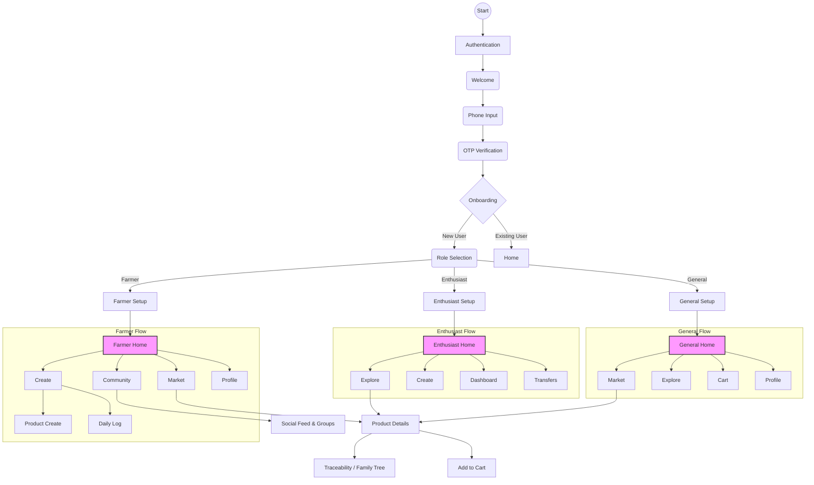

# ROSTRY Application Flow

This document provides a comprehensive overview of the application flow for ROSTRY, detailing the user journeys, role-based navigation, and key feature interactions.

## 1. Overview
ROSTRY is a comprehensive platform connecting farmers, enthusiasts, and general users in the poultry and livestock ecosystem. It combines social networking, marketplace commerce, farm management/monitoring, and supply chain traceability.

> **Note on Navigation Routes:**
> All route strings are defined centrally in `app/src/main/java/com/rio/rostry/ui/navigation/Routes.kt`.
> References in this document (e.g., `home/farmer`) correspond to constants like `Routes.FarmerNav.HOME`. Always consult `Routes.kt` as the source of truth when implementing or modifying navigation.

## 2. User Roles
The application caters to three distinct user personas, each with a tailored experience:
*   **General User**: Consumers looking to explore products, buy from the marketplace, and view traceability info.
*   **Farmer**: Producers managing farms, livestock, sales, and compliance.
*   **Enthusiast**: Hobbyists or small-scale keepers focused on breeding, collecting, and community interaction.

## 3. Authentication & Onboarding Flow
All users start here to establish their identity and role.

### Authentication
1.  **Welcome Screen** (`auth/welcome`): Entry point.
2.  **Phone Input** (`auth/phone`): User enters mobile number.
3.  **OTP Verification** (`auth/otp/{verificationId}`): Verifies the phone number.
4.  **Phone Verified** (`auth/phone_verify`): Success state.

### Onboarding
After authentication, users are guided through setup:
1.  **General Onboarding** (`onboard/general`): Basic profile setup.
2.  **Role Selection**: Users choose their primary role (Farmer, Enthusiast, General).
    *   **Farmer Setup** (`onboard/farmer`): Farm details, location verification (`verify/farmer/location`).
    *   **Enthusiast Setup** (`onboard/enthusiast`): Interests, KYC verification (`verify/enthusiast/kyc`).
    *   **Farm Setup** (Optional): Adding initial birds (`onboard/farm/bird`) or batches (`onboard/farm/batch`).
3.  **User Setup** (`onboard/user_setup`): Finalizing account details.

## 4. Navigation Structure
The application uses a role-based bottom navigation bar for the main interface.

### Farmer Flow
*   **Home** (`home/farmer`): Dashboard with farm overview, alerts, and quick actions.
*   **Market** (`farmer/market`): Marketplace for selling products and viewing listings.
*   **Create** (`farmer/create`): Central hub for adding products, logging events, or creating posts.
*   **Community** (`farmer/community`): Access to social groups, events, and expert advice.
*   **Profile** (`farmer/profile`): User and farm profile management.

### Enthusiast Flow
*   **Home** (`home/enthusiast`): Personalized feed and updates.
*   **Explore** (`enthusiast/explore`): Discover breeds, breeders, and content.
*   **Create** (`enthusiast/create`): Log activities, create posts, or list items.
*   **Dashboard** (`enthusiast/dashboard`): Monitoring and analytics for their collection.
*   **Transfers** (`enthusiast/transfers`): Manage incoming/outgoing livestock transfers.

### General User Flow
(Typically no bottom bar, or a simplified version)
*   **Home** (`home/general`): Marketplace highlights and educational content.
*   **Market** (`general/market`): Browse and purchase products.
*   **Explore** (`general/explore`): View traceability stories and community content.
*   **Cart** (`general/cart`): Manage shopping cart.
*   **Profile** (`general/profile`): Order history and settings.

## 5. Key Feature Flows

### Marketplace & Commerce
*   **Product Discovery**: Users browse `product/market` or `product/explore`.
*   **Product Details** (`product/{productId}`): View specs, price, and seller info.
*   **Cart & Checkout**: Add items -> `product/cart` -> Checkout process.
*   **Orders**: Track status via `order/{orderId}`.

### Traceability & Lineage
*   **Traceability View** (`traceability/{productId}`): The core transparency feature.
*   **Family Tree** (`product/{productId}/family_tree`): Visual lineage of livestock.
*   **Lineage Preview** (`lineage/{productId}`): Quick view, often via QR scan.
*   **QR Scan** (`scan/qr`): Scans physical tags to open Traceability or Transfer flows.

### Farm Management & Monitoring
*   **Dashboard** (`monitoring/dashboard`): High-level health and production metrics.
*   **Daily Logs** (`monitoring/daily_log`): Routine data entry (feed, water, etc.).
*   **Specific Modules**:
    *   Vaccination (`monitoring/vaccination`)
    *   Mortality (`monitoring/mortality`)
    *   Quarantine (`monitoring/quarantine`)
    *   Breeding & Hatching (`monitoring/breeding`, `monitoring/hatching`)
    *   Growth Tracking (`monitoring/growth`)
*   **Tasks** (`monitoring/tasks`): To-do list for farm operations.

### Social & Community
*   **Feed** (`social/feed`): Main social stream (posts, updates).
*   **Groups** (`social/groups`): Interest-based communities.
*   **Events** (`social/events`): Calendar of meetups or webinars.
*   **Messaging**:
    *   Direct Threads (`messages/{threadId}`)
    *   Group Chats (`group/{groupId}/chat`)

### Transfers & Compliance
*   **Transfer List** (`transfer/list`): History of movements.
*   **Create Transfer** (`transfer/create`): Initiate a move/sale.
*   **Verify Transfer** (`transfer/{transferId}/verify`): Receiver confirms acceptance.
*   **Compliance** (`compliance/{productId}`): Regulatory checks and documentation.

## 6. Settings & Utilities
*   **Settings** (`settings`): App preferences, notifications.
*   **Address Selection** (`settings/address_selection`): Managing delivery/farm locations.
*   **Sync Status** (`sync/status`): Checking offline/online data synchronization.
*   **Analytics**: Detailed reports for Farmers (`analytics/farmer`) and Enthusiasts (`analytics/enthusiast`).

## 7. Visual Flow Diagram (Mermaid)

