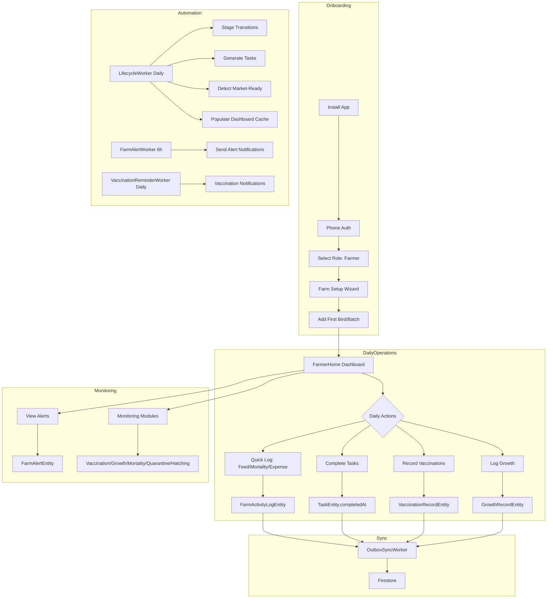
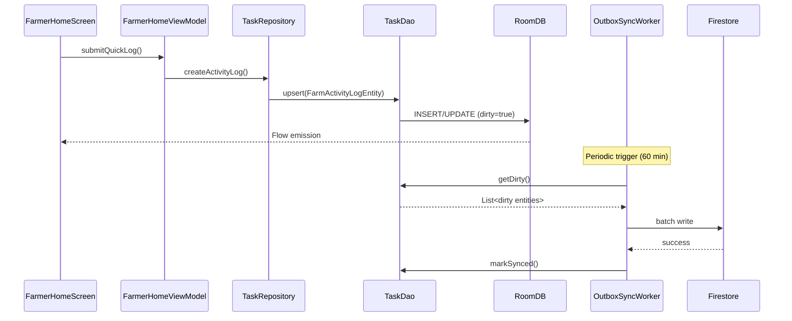
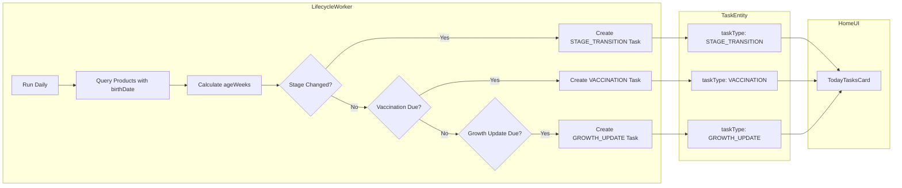

# ROSTRY Farmer Core Blueprint — Ground Truth + Re-Engineering Plan

**Version**: 1.1  
**Date**: 2025-12-30  
**Author**: System Analyst  
**Status**: Active Analysis  

> **👉 Developer Execution Guide**: See [FARMER_CORE_EXECUTION_GUIDE.md](./FARMER_CORE_EXECUTION_GUIDE.md) for sprint-by-sprint implementation tasks with exact file paths and code changes.

---

## Farmer Core Contract (v1.1 Non-Negotiables)

These requirements are **release gates** — every item must pass before pilot release:

### 1. Offline-First
- Every farmer action MUST write to Room immediately and update UI via Flow
- UI MUST never block on network operations
- `dirty=true` records queue for background sync

### 2. Sync Later
- Background workers push `dirty=true` records to Firestore
- Sync completion marks `dirty=false` and sets `syncedAt`
- Sync failures retry without blocking user flows

### 3. No Broken Routes
- Every route in Farmer bottom nav MUST have a real destination
- Every in-app button callback MUST navigate correctly
- No "unclear" or "verify" status allowed at release

### 4. One Asset Truth
- `FarmAssetEntity` = authoritative for farmer farm inventory
- `ProductEntity` = authoritative only for marketplace listing lifecycle
- Bridge via `sourceAssetId` — listings link back to assets

---

## Executive Summary

This document captures the **ground truth** of the current ROSTRY Farmer experience and proposes a **re-engineering blueprint** to stabilize core flows. The analysis focuses exclusively on the Farmer persona, emphasizing offline-first reliability and rural constraints.

---

# PHASE A — CAPTURE GROUND TRUTH

## A1) Navigation & Routes Snapshot

### Farmer Navigation Configuration

| Property | Value |
|----------|-------|
| **Start Destination** | `FarmerNav.HOME` → `"home/farmer"` |
| **Role** | `UserType.FARMER` |

### Bottom Navigation Items

| Route | Label | Status |
|-------|-------|--------|
| `home/farmer` | Home | ✅ OK |
| `farmer/farm_assets` | My Farm | ⚠️ NEW - Verify |
| `farmer/market` | Market | ✅ OK |
| `analytics/farmer` | Analytics | ⚠️ Unknown |
| `farmer/profile` | Profile | ✅ OK |

### Farmer-Accessible Routes (Farm Management Core)

| Route | Screen | Entry Points | Params | Expected | Actual | Status |
|-------|--------|--------------|--------|----------|--------|--------|
| `home/farmer` | FarmerHomeScreen | Bottom Nav | None | Dashboard with KPIs, tasks, alerts | Shows dashboard widgets | ✅ OK |
| `farmer/farm_assets` | FarmAssetListScreen | Bottom Nav | None | List of farm assets | Shows assets with filter | ⚠️ NEW |
| `farmer/asset/{assetId}` | FarmAssetDetailScreen | Asset click | assetId | Asset details + actions | Unknown | ❓ VERIFY |
| `farmer/create_asset` | Asset creation | FAB on list | None | Create new asset | Unknown | ❓ VERIFY |
| `farmer/create` | FarmerCreateScreen | FAB on home | prefillProductId? | Bird/batch creation wizard | 41KB - Complex | ⚠️ HEAVY |
| `farmer/digital_farm` | DigitalFarmScreen | Dashboard card | None | Visual farm representation | 28KB composable | ⚠️ HEAVY |

### Monitoring Routes (Farmer-Accessible)

| Route | Screen | Entry Points | Params | Expected | Actual | Status |
|-------|--------|--------------|--------|----------|--------|--------|
| `monitoring/vaccination` | VaccinationScheduleScreen | Dashboard/Tasks | filter?, productId? | Vaccine schedule + add | 23KB - Works | ✅ OK |
| `monitoring/mortality` | MortalityTrackingScreen | Dashboard | filter? | Death records + add | 14KB | ✅ OK |
| `monitoring/quarantine` | QuarantineManagementScreen | Dashboard | filter? | Quarantine records | 22KB | ✅ OK |
| `monitoring/growth` | GrowthTrackingScreen | Dashboard | filter?, productId? | Growth records + chart | 14KB | ✅ OK |
| `monitoring/hatching` | HatchingProcessScreen | Dashboard | filter? | Hatching batches | 20KB | ✅ OK |
| `monitoring/daily_log` | DailyLogScreen | Dashboard | None | Daily log entries | 28KB - Complex | ⚠️ HEAVY |
| `monitoring/daily_log/{productId}` | DailyLogScreen | Bird detail | productId | Logs for specific bird | Passes param | ✅ OK |
| `monitoring/tasks` | TasksScreen | Dashboard | filter? | Task list (Due/Overdue/Done) | 5KB - Lightweight | ✅ OK |
| `monitoring/farm_log` | FarmLogScreen | Dashboard/Profile | None | Farm activity log | 12KB | ✅ OK |

### Navigation Issues Identified

| Issue ID | Route | Problem | Severity |
|----------|-------|---------|----------|
| NAV-001 | `farmer/asset/{assetId}` | Route defined but screen integration unclear | MEDIUM |
| NAV-002 | `farmer/create_asset` | Route defined, screen implementation not verified | MEDIUM |
| NAV-003 | `farmer/create` | Heavy 55KB ViewModel - may cause ANR on low-end devices | HIGH |
| NAV-004 | `monitoring/daily_log` | Heavy 28KB screen with many dependencies | MEDIUM |

---

## A2) Data Model Snapshot (Farmer Domain Only)

### Core Asset Entity: `ProductEntity`

| Property | Type | Purpose | Sync |
|----------|------|---------|------|
| **Table** | `products` | Main bird/batch record | ✅ Yes |
| **Primary Key** | `productId: String` | UUID | - |
| **Foreign Key** | `sellerId → UserEntity.userId` | Owner reference | - |
| **Key Columns** | name, description, category, quantity, birthDate, breed, gender, healthStatus, stage, isBatch | Core attributes | - |
| **Dirty Flag** | `dirty: Boolean` | Pending sync | ✅ |
| **Indices** | sellerId, category, status | Query optimization | - |

### Farm Asset Entity: `FarmAssetEntity` (NEW - Phase 1)

| Property | Type | Purpose | Sync |
|----------|------|---------|------|
| **Table** | `farm_assets` | Dedicated farm inventory | ⚠️ Unknown |
| **Primary Key** | `assetId: String` | UUID | - |
| **Foreign Key** | `farmerId → UserEntity.userId` | Owner reference | - |
| **Key Columns** | name, assetType, category, status, quantity, birthDate, breed, healthStatus | Farm-specific | - |
| **Dirty Flag** | `dirty: Boolean` | Pending sync | ⚠️ |
| **Indices** | farmerId, assetType, status | Query optimization | - |

### ⚠️ DATA MODEL CONFUSION IDENTIFIED

| Entity | Table | Purpose | Overlap Risk |
|--------|-------|---------|--------------|
| `ProductEntity` | `products` | Birds/batches (legacy, marketplace-coupled) | HIGH |
| `FarmAssetEntity` | `farm_assets` | Farm inventory (new, pure farm) | HIGH |

**Problem**: Two entities serve similar purposes. `ProductEntity` has marketplace fields (`price`, `status`). `FarmAssetEntity` is pure farm management. **Migration path unclear.**

### Daily/Activity Logging Entities

#### `DailyLogEntity`

| Property | Value |
|----------|-------|
| **Table** | `daily_logs` |
| **Primary Key** | `logId: String` |
| **Foreign Keys** | `productId → products`, `farmerId` (implicit) |
| **Key Columns** | logDate, weightGrams, feedKg, medicationJson, symptomsJson, notes |
| **Sync Columns** | dirty, syncedAt, mergedAt, mergeCount |
| **Indices** | productId, farmerId, logDate, createdAt, mergedAt |

#### `FarmActivityLogEntity`

| Property | Value |
|----------|-------|
| **Table** | `farm_activity_logs` |
| **Primary Key** | `activityId: String` |
| **Foreign Keys** | `farmerId`, `productId` (optional) |
| **Key Columns** | activityType (EXPENSE/SANITATION/MAINTENANCE/MEDICATION/MORTALITY/FEED/WEIGHT), amountInr, quantity, category, notes |
| **Sync Columns** | dirty, syncedAt |
| **Indices** | farmerId, activityType, createdAt, productId |

**Purpose Distinction**: `DailyLogEntity` = per-product daily metrics. `FarmActivityLogEntity` = farm-level activities (expenses, sanitation, etc).

### Monitoring Entities

#### `GrowthRecordEntity`

| Table | `growth_records` |
|-------|------------------|
| PK | `recordId` |
| FK | `productId → products` |
| Columns | week, weightGrams, heightCm, photoUrl, healthStatus, milestone |
| Sync | dirty, syncedAt |
| Indices | productId, week, farmerId, createdAt |

#### `QuarantineRecordEntity`

| Table | `quarantine_records` |
|-------|---------------------|
| PK | `quarantineId` |
| FK | `productId → products` |
| Columns | reason, protocol, status (ACTIVE/RECOVERED/TRANSFERRED), healthScore |
| Sync | dirty, syncedAt |
| Indices | productId, status, farmerId, startedAt |

#### `MortalityRecordEntity`

| Table | `mortality_records` |
|-------|---------------------|
| PK | `deathId` |
| FK | `productId → products` (SET_NULL) |
| Columns | causeCategory (ILLNESS/PREDATOR/ACCIDENT/OTHER), quantity, financialImpactInr |
| Sync | dirty, syncedAt |
| Indices | productId, causeCategory, farmerId, occurredAt |

#### `VaccinationRecordEntity`

| Table | `vaccination_records` |
|-------|----------------------|
| PK | `vaccinationId` |
| FK | `productId → products` |
| Columns | vaccineType, scheduledAt, administeredAt, costInr |
| Sync | dirty, syncedAt |
| Indices | productId, vaccineType, scheduledAt, farmerId |

#### `HatchingBatchEntity` / `HatchingLogEntity`

| Table | `hatching_batches` / `hatching_logs` |
|-------|--------------------------------------|
| Purpose | Incubation tracking |
| Columns | eggsCount, temperatureC, humidityPct, eventType |
| Sync | dirty, syncedAt |

### Task & Alert Entities

#### `TaskEntity`

| Table | `tasks` |
|-------|---------|
| PK | `taskId` |
| FK | `productId → products` (CASCADE) |
| Columns | farmerId, taskType (VACCINATION/GROWTH_UPDATE/QUARANTINE_CHECK/etc), title, dueAt, completedAt, priority, recurrence |
| Sync | dirty, syncedAt, mergedAt, mergeCount |
| Indices | farmerId, productId, taskType, dueAt, completedAt, mergedAt |

#### `FarmAlertEntity`

| Table | `farm_alerts` |
|-------|--------------|
| PK | `alertId` |
| Columns | farmerId, alertType (VACCINATION_DUE/QUARANTINE_UPDATE/MORTALITY_SPIKE/HATCHING_DUE), severity (INFO/WARNING/URGENT), message, actionRoute, isRead |
| Sync | dirty, syncedAt |
| Indices | farmerId, isRead, createdAt |

### Dashboard Cache Entities

#### `DashboardCacheEntity`

| Table | `dashboard_cache` |
|-------|------------------|
| PK | `cacheId` |
| Columns | farmerId, totalBirds, totalBatches, pendingVaccines, overdueVaccines, avgFcr, totalMortalityThisMonth, healthyCount, quarantinedCount, alertCount |
| Purpose | Pre-computed stats for instant dashboard loading |
| Unique Index | farmerId |

#### `FarmerDashboardSnapshotEntity`

| Table | `farmer_dashboard_snapshots` |
|-------|------------------------------|
| PK | `snapshotId` |
| Columns | farmerId, weekStartAt, weekEndAt, revenueInr, ordersCount, hatchSuccessRate, mortalityRate, vaccinationCompletionRate, productsReadyToListCount |
| Purpose | Weekly KPI snapshots |
| Sync | dirty, syncedAt |
| Indices | farmerId, weekStartAt |

#### `BatchSummaryEntity`

| Table | `batch_summaries` |
|-------|------------------|
| PK | `batchId` |
| Columns | farmerId, batchName, currentCount, avgWeightGrams, totalFeedKg, fcr, ageWeeks |
| Purpose | Lightweight batch aggregates (syncs to Firestore) |
| Sync | dirty, syncedAt |

---

## A3) Worker Snapshot (Farmer Reliability)

### `LifecycleWorker`

| Property | Value |
|----------|-------|
| **Trigger** | Periodic (1 day) |
| **Schedule** | `PeriodicWorkRequestBuilder(1, TimeUnit.DAYS)` |
| **Inputs** | None (queries ProductDao directly) |
| **DB Writes** | ProductEntity (ageWeeks, stage), TaskEntity, FarmAlertEntity, LifecycleEventEntity, DashboardCacheEntity |
| **Key Functions** | Stage transitions, batch split detection, vaccination task generation, market-ready detection, dashboard cache population |
| **Failure Mode** | `Result.retry()` on exception |
| **Observed Issues** | Heavy dependency injection (14 DAOs), may timeout on large farms |

### `VaccinationReminderWorker`

| Property | Value |
|----------|-------|
| **Trigger** | Periodic (1 day, 3h flex) |
| **Schedule** | Random initial delay 0-180 min |
| **Inputs** | Current user ID from FirebaseAuth |
| **DB Writes** | TaskEntity (metadata update for notifiedAt) |
| **Key Functions** | Send vaccination due notifications via IntelligentNotificationService |
| **Failure Mode** | `Result.retry()` on exception |
| **Observed Issues** | Depends on authenticated user - skips if logged out |

### `FarmPerformanceWorker`

| Property | Value |
|----------|-------|
| **Trigger** | Periodic (7 days) |
| **Schedule** | Weekly KPI computation |
| **Inputs** | Current user ID |
| **DB Writes** | FarmerDashboardSnapshotEntity |
| **Key Functions** | Aggregates weekly KPIs: revenue, mortality rate, vaccination completion, hatch success |
| **Failure Mode** | `Result.retry()` on exception |
| **Observed Issues** | Multiple DAO queries - may be slow on large datasets |

### `FarmAlertWorker`

| Property | Value |
|----------|-------|
| **Trigger** | Periodic (6 hours) |
| **Schedule** | Every 6 hours |
| **Inputs** | Current user ID |
| **DB Writes** | None (sends notifications via FarmAlertNotificationService) |
| **Key Functions** | Checks overdue vaccinations, quarantine updates, batch splits, hatching due, mortality spikes |
| **Failure Mode** | `Result.retry()` on exception |
| **Observed Issues** | Relies on FarmAlertNotificationService - verify notification channel setup |

### `SyncWorker` / `OutboxSyncWorker`

| Property | SyncWorker | OutboxSyncWorker |
|----------|------------|------------------|
| **Trigger** | One-time (called by SyncManager) | Periodic (60 min) |
| **Constraints** | None | NetworkType.CONNECTED, BatteryNotLow |
| **Key Function** | Sync all dirty data | Sync pending changes with notification |
| **Quota Check** | Yes (skips if exceeded) | No |
| **Failure Mode** | failure() on exception | retry() on exception |

### Worker Issues Summary

| ID | Worker | Issue | Severity |
|----|--------|-------|----------|
| WRK-001 | LifecycleWorker | 14 DAO dependencies - heavy initialization | HIGH |
| WRK-002 | VaccinationReminderWorker | Skips if user logged out - may miss reminders | MEDIUM |
| WRK-003 | FarmPerformanceWorker | Weekly only - dashboard may show stale data | LOW |
| WRK-004 | All Workers | No offline queue verification after sync | MEDIUM |

---

## A4) Screen-Level Behavior Snapshot

### FarmerHomeScreen

| Property | Value |
|----------|-------|
| **File** | `FarmerHomeScreen.kt` (43KB, 912 lines) |
| **ViewModel** | `FarmerHomeViewModel.kt` (28KB, 556 lines) |
| **Entry** | Bottom navigation "Home" |

**Steps to Reach**: Launch app → Authenticate → Role = FARMER → Navigate to `home/farmer`

**Data Displayed**:
- Header with greeting
- KPI cards (from DashboardCache)
- TodayTasksCard (from TaskDao)
- Alert banners (from FarmAlertDao)
- Quick actions (Add Bird, Add Batch)
- Fetcher cards (monitoring module shortcuts)
- HarvestTriggerCard (market-ready batches)

**Action Buttons**:
- FAB → Opens QuickLogBottomSheet
- "Add Bird" → Navigates to `onboard/farm/bird`
- "Add Batch" → Navigates to `onboard/farm/batch`
- Module cards → Navigate to monitoring routes

**Known Issues**:
| ID | Issue | Steps to Reproduce | Severity |
|----|-------|-------------------|----------|
| HOME-001 | Heavy combine operation (28 flows) | Open home with large farm | HIGH |
| HOME-002 | KPI cards may show stale data | Open immediately after app install | MEDIUM |

### FarmAssetListScreen

| Property | Value |
|----------|-------|
| **File** | `FarmAssetListScreen.kt` (5KB, 140 lines) |
| **ViewModel** | `FarmAssetListViewModel.kt` (3KB) |
| **Entry** | Bottom navigation "My Farm" |

**Steps to Reach**: Bottom nav → "My Farm" tab

**Data Displayed**:
- Filter chips (Birds, Batches)
- LazyColumn of FarmAssetEntity items
- Each item shows: name, type badge, breed, age, quantity

**Action Buttons**:
- FAB → `onAddAsset` callback (route unclear)
- Item click → `onAssetClick(assetId)` (route unclear)

**Known Issues**:
| ID | Issue | Steps to Reproduce | Severity |
|----|-------|-------------------|----------|
| ASSET-001 | Uses FarmAssetEntity but LifecycleWorker uses ProductEntity | Add bird via different paths | HIGH |
| ASSET-002 | Navigation callbacks not wired in AppNavHost | Click FAB or item | CRITICAL |

### FarmLogScreen

| Property | Value |
|----------|-------|
| **File** | `FarmLogScreen.kt` (12KB, 298 lines) |
| **ViewModel** | `FarmLogViewModel.kt` (3KB) |
| **Entry** | Dashboard card, Profile screen |

**Steps to Reach**: Home → "Farm Log" card or Profile → "View Activity"

**Data Displayed**:
- Summary card (total expenses)
- Filter chips (All, Mortality, Feed, Expense, Weight, Vaccination, etc)
- LazyColumn of FarmActivityLogEntity items

**Action Buttons**:
- Item click → Navigate to bird detail if productId present
- Filter chips → Filter by activity type

**Known Issues**:
| ID | Issue | Steps to Reproduce | Severity |
|----|-------|-------------------|----------|
| FLOG-001 | Empty state if no QuickLog entries | New user opens Farm Log | LOW |
| FLOG-002 | `onBirdClick` may fail if ProductEntity deleted | Click old log entry | MEDIUM |

### TasksScreen

| Property | Value |
|----------|-------|
| **File** | `TasksScreen.kt` (5KB, 112 lines) |
| **ViewModel** | `TasksViewModel.kt` |
| **Entry** | Dashboard "Tasks" card |

**Steps to Reach**: Home → "View All Tasks" or Monitoring → Tasks

**Data Displayed**:
- Tab bar: Due, Overdue, Completed
- LazyColumn of TaskEntity items
- Sync status badge per task

**Action Buttons**:
- Checkbox → Mark complete
- Row click → Navigate to product if productId present

**Known Issues**:
| ID | Issue | Steps to Reproduce | Severity |
|----|-------|-------------------|----------|
| TASK-001 | No snooze UI despite model support | Try to snooze a task | LOW |
| TASK-002 | "View all tasks" button in TodayTasksCard has empty onClick | Click "View all X tasks" | MEDIUM |

### Monitoring Screens

| Screen | File | Status | Notes |
|--------|------|--------|-------|
| VaccinationScheduleScreen | 24KB | ✅ Functional | Tab-based, add dialog |
| GrowthTrackingScreen | 14KB | ✅ Functional | Chart + list |
| MortalityTrackingScreen | 14KB | ✅ Functional | Add mortality dialog |
| QuarantineManagementScreen | 22KB | ✅ Functional | Status management |
| HatchingProcessScreen | 21KB | ✅ Functional | Batch management |
| DailyLogScreen | 28KB | ⚠️ Heavy | Complex form, photo upload |

---

# PHASE B — RE-ENGINEER BLUEPRINT

## B1) Farmer End-to-End Operating Flow

### Main Farmer Journey



### Data Flow: UI → ViewModel → UseCase → Repo → Room → Worker → Firestore



### Task Generation Loop



## B2) Minimal Stable Farmer Modules (MVP Definition)

### Must Have (P0 - Launch Blockers)

| Module | Scope | Acceptance Criteria |
|--------|-------|-------------------|
| **Bird/Batch Creation** | Add individual bird or batch with breed, birthDate | Creates ProductEntity with proper fields |
| **Quick Log** | One-tap mortality, feed, expense, weight logging | Persists FarmActivityLogEntity, offline-safe |
| **Task Display** | Show due/overdue tasks from TaskEntity | Updates in real-time, mark complete works |
| **Dashboard KPIs** | Total birds, pending vaccines, mortality rate | Uses DashboardCacheEntity for performance |
| **Vaccination Tracking** | Schedule + administer vaccinations | Creates VaccinationRecordEntity |
| **Offline-First Sync** | All writes queue locally, sync when online | OutboxSyncWorker flushes dirty entities |

### Should Have (P1 - First Sprint After Launch)

| Module | Scope |
|--------|-------|
| Growth Tracking | Weekly weight/height records with chart |
| Mortality Tracking | Death records with cause categorization |
| Quarantine Management | Isolate sick birds, track recovery |
| Farm Log View | Full activity history with filters |
| Alert Notifications | Push notifications for overdue tasks |

### Defer (P2 - Later Sprints)

| Module | Reason |
|--------|--------|
| FarmAssetEntity migration | Need to resolve entity duplication first |
| Digital Farm visuals | Heavy UI, not core flow |
| Hatching process | Complex, lower priority |
| Market-ready detection | Requires stable asset model |
| Analytics dashboard | Needs data history first |

## B3) Fix Plan (Concrete, Prioritized)

### Top 15 Bugs/Failures

| # | ID | Issue | Severity | Blocks |
|---|-----|-------|----------|--------|
| 1 | ASSET-002 | FarmAssetListScreen navigation not wired | CRITICAL | My Farm tab unusable |
| 2 | ASSET-001 | ProductEntity vs FarmAssetEntity confusion | HIGH | Data integrity |
| 3 | HOME-001 | 28-flow combine in FarmerHomeViewModel | HIGH | ANR on low-end devices |
| 4 | NAV-003 | FarmerCreateViewModel 55KB - heavy | HIGH | Creation flow slow |
| 5 | WRK-001 | LifecycleWorker 14 DAO dependencies | HIGH | Worker initialization |
| 6 | TASK-002 | TodayTasksCard "View all" empty onClick | MEDIUM | Task navigation broken |
| 7 | WRK-002 | VaccinationReminderWorker skips if logged out | MEDIUM | Missed reminders |
| 8 | FLOG-002 | FarmLog click with deleted product | MEDIUM | Navigation crash |
| 9 | HOME-002 | Stale KPI data on first load | MEDIUM | Poor first impression |
| 10 | NAV-001 | Asset detail route unclear | MEDIUM | Asset flow incomplete |
| 11 | NAV-002 | Create asset route unclear | MEDIUM | Asset creation blocked |
| 12 | WRK-003 | Weekly dashboard snapshot - stale data | LOW | Outdated KPIs |
| 13 | TASK-001 | No snooze UI | LOW | Feature incomplete |
| 14 | FLOG-001 | Empty state for new users | LOW | UX polish |
| 15 | NAV-004 | DailyLogScreen heavy (28KB) | LOW | Performance |

### Fix Approach

#### Priority 1: Navigation/Routes Stabilization

**Fix #1 (ASSET-002)**: Wire FarmAssetListScreen in AppNavHost
```kotlin
// In AppNavHost.kt - Add composable routes:
composable(Routes.FarmerNav.FARM_ASSETS) {
    FarmAssetListScreen(
        onNavigateBack = { navController.popBackStack() },
        onAssetClick = { assetId -> navController.navigate(Routes.Builders.assetDetails(assetId)) },
        onAddAsset = { navController.navigate(Routes.FarmerNav.CREATE_ASSET) }
    )
}

composable(Routes.FarmerNav.ASSET_DETAILS) { backStackEntry ->
    val assetId = backStackEntry.arguments?.getString("assetId") ?: return@composable
    FarmAssetDetailScreen(
        assetId = assetId,
        onNavigateBack = { navController.popBackStack() }
    )
}
```

**Fix #6 (TASK-002)**: Wire TodayTasksCard "View all" navigation
```kotlin
// In TodayTasksCard.kt line 135:
TextButton(
    onClick = { onNavigateToTasks() }, // Add callback parameter
    modifier = Modifier.fillMaxWidth()
)
```

#### Priority 2: Data Model Clarity

**Fix #2 (ASSET-001)**: Decision required - choose ONE of:
- **Option A**: Migrate FarmAssetEntity → ProductEntity (keep ProductEntity as single source)
- **Option B**: Migrate ProductEntity → FarmAssetEntity (clean break from marketplace coupling)
- **Option C**: Keep both with clear separation (FarmAsset for farm, Product for marketplace)

**Recommended**: Option C with bridge table. ProductEntity for marketplace listings derived from FarmAssetEntity.

#### Priority 3: Performance Optimization

**Fix #3 (HOME-001)**: Split FarmerHomeViewModel flows
```kotlin
// Replace 28-way combine with:
// 1. Pre-computed DashboardCacheEntity for KPIs
// 2. Separate TaskFlow for tasks only
// 3. Separate AlertFlow for alerts only
// 4. Lazy loading for non-critical sections
```

**Fix #4 (NAV-003)**: Lazy-load FarmerCreateScreen sections
```kotlin
// Use LazyColumn instead of Column
// Load image picker only when step reached
// Pre-validate before showing submit
```

#### Priority 4: Worker Reliability

**Fix #5 (WRK-001)**: Lazy inject DAOs in LifecycleWorker
```kotlin
// Use Lazy<Dao> pattern or split into smaller workers:
// - StageTransitionWorker
// - TaskGenerationWorker
// - DashboardCacheWorker
```

**Fix #7 (WRK-002)**: Add offline task queue for reminders
```kotlin
// Check for pending notifications on app launch
// Send missed notifications even if worker skipped
```

#### Priority 5: Dashboard Snapshots

**Fix #9 (HOME-002)**: Trigger initial cache population
```kotlin
// In FarmerHomeViewModel.init:
if (dashboardCache == null) {
    viewModelScope.launch(Dispatchers.IO) {
        // Inline compute for first load
        computeQuickDashboard(farmerId)
    }
}
```

### Implementation Order

| Sprint | Focus | Fixes |
|--------|-------|-------|
| Sprint 1 | Navigation | #1 (ASSET-002), #6 (TASK-002), #10 (NAV-001), #11 (NAV-002) |
| Sprint 2 | Data Model | #2 (ASSET-001 decision + migration) |
| Sprint 3 | Performance | #3 (HOME-001), #4 (NAV-003), #15 (NAV-004) |
| Sprint 4 | Workers | #5 (WRK-001), #7 (WRK-002), #12 (WRK-003) |
| Sprint 5 | Polish | #8, #9, #13, #14 |

---

## B4) Acceptance Criteria (Testable Checklists)

### Offline-First Scenario Tests

| Test ID | Scenario | Steps | Expected |
|---------|----------|-------|----------|
| OFF-001 | Add bird offline | Airplane mode → Add bird → Verify saved | ProductEntity created with dirty=true |
| OFF-002 | Quick log offline | Airplane mode → Log mortality → Verify | FarmActivityLogEntity created |
| OFF-003 | Sync on reconnect | Add items offline → Enable network → Wait 60min | dirty=false, syncedAt populated |
| OFF-004 | Conflict resolution | Edit same bird on two devices → Sync | Last-write-wins by updatedAt |

### Process Death Tests

| Test ID | Scenario | Steps | Expected |
|---------|----------|-------|----------|
| PD-001 | Bird creation wizard | Start wizard → Force stop → Reopen | SavedStateHandle restores step + data |
| PD-002 | Quick log mid-entry | Open sheet → Select type → Force stop → Reopen | Sheet state lost (acceptable) |
| PD-003 | Dashboard on restore | Open home → Force stop → Reopen | Dashboard reloads from cache |

### DB Integrity Tests

| Test ID | Scenario | Steps | Expected |
|---------|----------|-------|----------|
| DB-001 | Foreign key cascade | Delete user → Check products | Products deleted (FK CASCADE) |
| DB-002 | Orphan task cleanup | Delete product → Check tasks | Tasks deleted (FK CASCADE) |
| DB-003 | Migration integrity | Upgrade app version → Verify data | No data loss, schema updated |

### Worker Reliability Tests

| Test ID | Scenario | Steps | Expected |
|---------|----------|-------|----------|
| WRK-T01 | LifecycleWorker runs | Wait 24h → Check dashboard cache | DashboardCacheEntity updated |
| WRK-T02 | Vaccination reminder | Create due vaccine → Wait day → Check notifications | Notification received |
| WRK-T03 | Sync retry | Fail sync → Wait 1min → Check retry | OutboxSyncWorker retries |

### Smoke Test Checklist (Manual)

| # | Flow | Steps | Pass Criteria |
|---|------|-------|---------------|
| 1 | **Login** | Open app → Phone auth → OTP | Reaches FarmerHome |
| 2 | **Add Bird** | FAB → Add Bird → Fill form → Save | Bird appears in list |
| 3 | **Quick Log** | FAB → Quick Log → Select Mortality → Enter count → Submit | Entry in Farm Log |
| 4 | **View Tasks** | Home → Today's Tasks card visible → Click checkbox | Task marked complete |
| 5 | **Vaccination** | Monitoring → Vaccination → Add → Schedule → Save | Record created |
| 6 | **Growth** | Monitoring → Growth → Select bird → Add weight → Save | Chart updates |
| 7 | **Farm Log** | Profile → Farm Log → Filter by type | Filters work |
| 8 | **Offline Mode** | Airplane on → Quick Log → Airplane off | Syncs after reconnect |
| 9 | **App Restart** | Use app → Force stop → Reopen | No crash, data intact |
| 10 | **Process Death** | Open create screen → Enable "Don't keep activities" → Navigate away → Return | State restored |

---

## Appendix: File References

### Key Files to Modify

| Priority | File | Purpose |
|----------|------|---------|
| P0 | `AppNavHost.kt` | Wire missing routes |
| P0 | `FarmerHomeViewModel.kt` | Optimize combine |
| P1 | `LifecycleWorker.kt` | Split / optimize |
| P1 | `FarmAssetEntity.kt` | Clarify vs ProductEntity |
| P2 | `FarmerCreateViewModel.kt` | Lazy loading |

### Files Already Analyzed

| File | Lines | Purpose |
|------|-------|---------|
| Routes.kt | 709 | Navigation routes |
| FarmerHomeScreen.kt | 912 | Home dashboard UI |
| FarmerHomeViewModel.kt | 556 | Home state management |
| LifecycleWorker.kt | 491 | Daily automation |
| FarmLogScreen.kt | 298 | Activity log UI |
| TasksScreen.kt | 112 | Task list UI |
| QuickLogBottomSheet.kt | 246 | Quick logging UI |
| ProductEntity.kt | 136 | Bird/batch model |
| FarmAssetEntity.kt | 83 | Farm asset model |
| TaskEntity.kt | 56 | Task model |
| FarmActivityLogEntity.kt | 45 | Activity log model |

---

## Next Steps

1. **Immediate**: Fix ASSET-002 (wire FarmAssetListScreen routes)
2. **This Week**: Decision on ProductEntity vs FarmAssetEntity
3. **This Sprint**: Navigation stabilization (Sprint 1 fixes)
4. **Next Sprint**: Performance optimization (Sprint 3 fixes)

---

*Document generated: 2025-12-30*
*Last updated: 2025-12-30*
