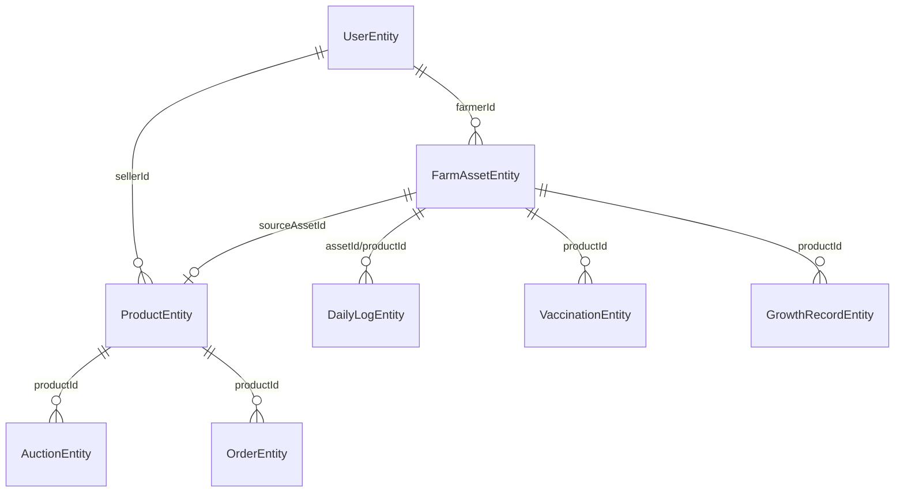
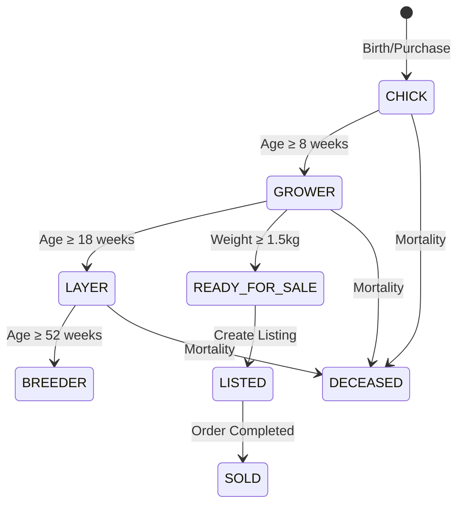
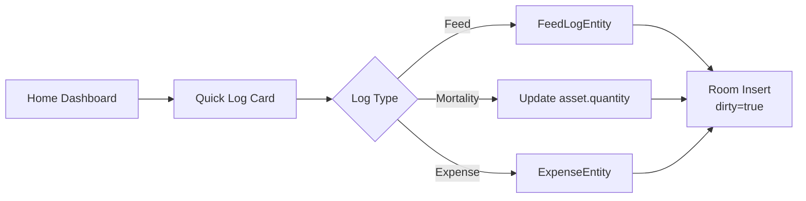
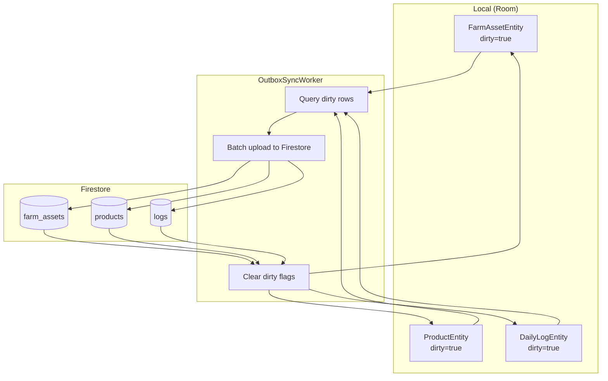

# Farmer System Blueprint V2

> **Last Updated:** 2026-01-02  
> **Status:** Authoritative Reference  
> **Scope:** Bird Listing, Record Keeping, Lifecycle Management

---

## 1. Authoritative Data Model

### 1.1 Core Entity: FarmAssetEntity

The **Single Source of Truth** for all farm inventory. All birds, batches, equipment, and livestock originate here.

```kotlin
@Entity(tableName = "farm_assets")
data class FarmAssetEntity(
    @PrimaryKey val assetId: String,
    val farmerId: String,              // Owner FK → users.userId
    val name: String,                  // "Batch 203 - Layers"
    
    // Classification
    val assetType: String,             // FLOCK, BATCH, ANIMAL, EQUIPMENT
    val category: String,              // "Chicken", "Goat", "Tools"
    val status: String,                // ACTIVE, QUARANTINED, ARCHIVED, SOLD
    
    // Lifecycle Data
    val birthDate: Long?,
    val ageWeeks: Int?,
    val breed: String?,
    val gender: String?,               // MALE, FEMALE, MIXED
    val healthStatus: String,          // HEALTHY, SICK, RECOVERING
    
    // Quantity & Metrics
    val quantity: Double,              // Current headcount
    val initialQuantity: Double,       // For mortality %
    val weightGrams: Double?,
    
    // Marketplace Bridge
    val listedAt: Long?,               // When listed for sale
    val listingId: String?,            // → products.productId
    val soldAt: Long?,
    val soldToUserId: String?,
    
    // Sync
    val dirty: Boolean = false,
    val createdAt: Long,
    val updatedAt: Long
)
```

### 1.2 Bridge Contract: FarmAsset → Product



**Key Fields in ProductEntity:**

| Field | Type | Purpose |
|-------|------|---------|
| `sourceAssetId` | String? | Links to `FarmAssetEntity.assetId` |
| `status` | String | `private` = farm-only, `available` = marketplace |
| `isPublic` | Boolean | Computed: `status != "private"` |

### 1.3 Entity Relationships

| From | To | Relationship | Notes |
|------|-----|--------------|-------|
| `FarmAssetEntity` | `ProductEntity` | 1:0..1 | Asset may have one listing |
| `FarmAssetEntity` | `DailyLogEntity` | 1:N | Via `productId` (legacy) |
| `FarmAssetEntity` | `TaskEntity` | 1:N | Generated tasks |
| `ProductEntity` | `AuctionEntity` | 1:0..1 | Optional auction |
| `ProductEntity` | `OrderEntity` | 1:N | Sales history |

### 1.4 Migration Strategy

**Current State:** `ProductEntity` serves dual purpose (farm + market).

**Target State:** Clean separation where:
- `FarmAssetEntity` = Farm inventory (always private)
- `ProductEntity` = Marketplace listing (optional, requires verification)

**Migration Path:**
1. `LegacyProductMigrationWorker` creates `FarmAssetEntity` from existing products
2. Sets `sourceAssetId` on `ProductEntity` to link back
3. Future creates go through `FarmAssetEntity` first

---

## 2. Lifecycle State Machine

### 2.1 Stage Definitions



| Stage | Age Range | Weight Trigger | Actions |
|-------|-----------|----------------|---------|
| CHICK | 0-8 weeks | — | Vaccination alerts, daily care tasks |
| GROWER | 8-18 weeks | — | Growth tracking, weight checks |
| LAYER | 18-52 weeks | — | Egg production logs |
| BREEDER | 52+ weeks | — | Breeding pair management |
| READY_FOR_SALE | Any | ≥1500g | Marketplace eligibility notification |

### 2.2 Automation: LifecycleWorker

```kotlin
// Runs daily at 4 AM
class LifecycleWorker : CoroutineWorker {
    override suspend fun doWork(): Result {
        val now = System.currentTimeMillis()
        
        // 1. Update age for all assets
        productDao.updateAgeWeeks(now)
        
        // 2. Detect stage transitions
        detectStageTransitions(now)
        
        // 3. Generate daily tasks
        generateFarmerTasks(now)
        
        // 4. Detect market-ready batches
        detectMarketReadyBatches(now)
        
        // 5. Populate dashboard caches
        populateDashboardCaches(now)
        
        return Result.success()
    }
    
    private suspend fun detectMarketReadyBatches(now: Long) {
        // Criteria: Age >= 6 weeks AND weight >= 1500g
        val readyBatches = productDao.getMarketReadyBatches()
        readyBatches.forEach { batch ->
            taskDao.insert(TaskEntity(
                type = "HARVEST_READY",
                title = "Batch ready for sale",
                productId = batch.productId,
                dueAt = now
            ))
        }
    }
}
```

### 2.3 Stage Transition Triggers

| Current | Next | Trigger | Auto/Manual |
|---------|------|---------|-------------|
| CHICK | GROWER | `ageWeeks >= 8` | Auto |
| GROWER | LAYER | `ageWeeks >= 18` | Auto |
| GROWER | READY_FOR_SALE | `weightGrams >= 1500` | Auto (alert) |
| Any | LISTED | User creates listing | Manual |
| LISTED | SOLD | Order completed | Auto |

---

## 3. End-to-End Workflows

### 3.1 Flow A: Create Farm Asset

```mermaid
flowchart TD
    A[Farmer taps "Add Bird/Batch"] --> B[OnboardFarmBirdScreen]
    B --> C{Enter Details}
    C --> D[Save to Room<br/>dirty=true]
    D --> E[Navigate to Assets List]
    E --> F{Network Available?}
    F -->|Yes| G[OutboxSyncWorker<br/>syncs to Firestore]
    F -->|No| H[Queue for later sync]
```

**Steps:**
1. **Entry Point:** FAB on Home → "Add Bird" / "Add Batch"
2. **User Action:** Fill form (breed, quantity, birth date)
3. **DB Write:** `FarmAssetEntity` saved with `dirty=true`
4. **Worker Trigger:** `OutboxSyncWorker` checks dirty flags
5. **Offline Behavior:** UI updates instantly, sync queued

**Performance Target:** Save completes in <100ms

### 3.2 Flow B: Daily Record Keeping

#### Quick Log (Farm-Level)



**Entry Points:**
- `TodayTasksCard` → Quick log buttons
- `QuickLogBottomSheet` → Full form

#### Detailed Log (Bird/Batch-Level)

**Route:** `monitoring/daily_log/{productId}`

**Actions:**
- Weight measurement
- Health notes
- Photo upload
- Custom fields

### 3.3 Flow C: Monitoring & Tasks

#### Task Generation

```kotlin
class TaskGenerator {
    fun generateDailyTasks(farmerId: String) {
        // Vaccination due today
        val vaccDue = vaccinationDao.getDueTodayForFarmer(farmerId)
        vaccDue.forEach { createTask(TaskType.VACCINATION, it) }
        
        // Weighing schedule (weekly)
        val needsWeighing = productDao.getForWeighingCheck(farmerId)
        needsWeighing.forEach { createTask(TaskType.WEIGHT_CHECK, it) }
        
        // Feed logging reminder
        createTask(TaskType.FEED_LOG, farmerId)
    }
}
```

#### Vaccination Record Flow

1. `VaccinationEntity` saved with `nextDueDate`
2. `LifecycleWorker` scans for due vaccinations daily
3. Creates `TaskEntity` for farmer's task list
4. Updates `FarmAssetEntity.lastVaccinationDate` on completion

### 3.4 Flow D: Verified Listing (Marketplace)

```mermaid
flowchart TD
    A[Asset Detail Screen] --> B{isVerified?}
    B -->|No| C[Show "Verify to List" Banner]
    C --> D[Navigate to Verification Flow]
    B -->|Yes| E[Show "Create Listing" Button]
    E --> F[CreateListingScreen<br/>Pre-filled from asset]
    F --> G{Submit}
    G --> H[Create ProductEntity<br/>sourceAssetId = asset.assetId<br/>status = "available"]
    H --> I[Mark asset as LISTED]
    I --> J[OutboxSyncWorker syncs]
```

**Verification Check:**
```kotlin
fun canCreateListing(): Boolean {
    val user = userRepository.getCurrentUser() ?: return false
    return user.verificationStatus == VerificationStatus.VERIFIED
}
```

---

## 4. Navigation & Route Map

### 4.1 Farmer Routes Table

| Route | Screen | ViewModel | Entry Point |
|-------|--------|-----------|-------------|
| `home/farmer` | `FarmerHomeScreen` | `FarmerHomeViewModel` | Bottom Nav |
| `farmer/market` | `FarmerMarketScreen` | `FarmerMarketViewModel` | Bottom Nav |
| `farmer/create` | `FarmerCreateScreen` | `FarmerCreateViewModel` | FAB |
| `farmer/community` | `FarmerCommunityScreen` | — | Bottom Nav |
| `farmer/profile` | `FarmerProfileScreen` | — | Bottom Nav |
| `farmer/farm_assets` | `FarmAssetListScreen` | `FarmAssetListViewModel` | Home Card |
| `farmer/asset/{assetId}` | `FarmAssetDetailScreen` | `FarmAssetDetailViewModel` | Asset List Item |
| `farmer/create_asset` | `FarmerCreateScreen` | `FarmerCreateViewModel` | FAB on Assets |
| `farmer/create_listing/{assetId}` | `CreateListingScreen` | `CreateListingViewModel` | Asset Detail |
| `farmer/create_auction/{assetId}` | `CreateAuctionScreen` | `CreateAuctionViewModel` | Asset Detail |
| `farmer/digital_farm` | `DigitalFarmScreen` | — | Home Card |

### 4.2 Monitoring Routes

| Route | Screen | Purpose |
|-------|--------|---------|
| `monitoring/daily_log` | `DailyLogScreen` | All logs |
| `monitoring/daily_log/{productId}` | `DailyLogScreen` | Per-bird logs |
| `monitoring/vaccination` | `VaccinationScreen` | Vaccine tracking |
| `monitoring/mortality` | `MortalityScreen` | Death records |
| `monitoring/breeding` | `BreedingFlowScreen` | Breeding pairs |
| `monitoring/hatching` | `HatchingProcessScreen` | Incubation |
| `monitoring/tasks` | `TasksScreen` | Today's tasks |
| `monitoring/farm_log` | `FarmLogScreen` | Activity history |

### 4.3 Entry Point Matrix

| Screen | Entry Points |
|--------|--------------|
| `FarmAssetListScreen` | Home "My Farm" card, Market "Create Listing" |
| `DailyLogScreen` | Home "Quick Log", Asset Detail |
| `CreateListingScreen` | Asset Detail → "Create Listing" |
| `CreateAuctionScreen` | Asset Detail → Gavel icon |
| `TasksScreen` | Home "Today's Tasks" card |

---

## 5. Reliability & Sync Strategy

### 5.1 Offline-First Rules

| Rule | Implementation |
|------|----------------|
| **UI Never Waits** | All reads from Room, not Firestore |
| **Optimistic Updates** | Write to Room immediately, sync later |
| **Dirty Flag** | `dirty=true` marks unsynced rows |
| **Queue-Based Sync** | `OutboxSyncWorker` processes queue |

### 5.2 Sync Architecture



### 5.3 Sync Worker Configuration

```kotlin
class OutboxSyncWorker : CoroutineWorker {
    companion object {
        fun schedule(context: Context) {
            val request = PeriodicWorkRequestBuilder<OutboxSyncWorker>(
                15, TimeUnit.MINUTES  // Every 15 min
            ).setConstraints(
                Constraints.Builder()
                    .setRequiredNetworkType(NetworkType.CONNECTED)
                    .build()
            ).build()
            
            WorkManager.getInstance(context)
                .enqueueUniquePeriodicWork("OutboxSyncWorker", KEEP, request)
        }
        
        fun scheduleImmediateSync(context: Context) {
            val request = OneTimeWorkRequestBuilder<OutboxSyncWorker>().build()
            WorkManager.getInstance(context).enqueue(request)
        }
    }
}
```

### 5.4 Conflict Resolution

| Scenario | Resolution |
|----------|------------|
| Local edit while offline | Local wins, synced on reconnect |
| Cloud update during offline | Last-write-wins (updatedAt comparison) |
| Concurrent edits (rare) | Server timestamp wins |

### 5.5 Firebase Free Tier Optimization

| Strategy | Implementation |
|----------|----------------|
| **Batch Writes** | Group up to 500 docs per commit |
| **Read Caching** | Room is primary; Firestore for sync only |
| **Selective Sync** | Only sync `dirty=true` rows |
| **Debounced Writes** | 15-min periodic, not on every change |
| **Pagination** | Limit queries to 50 docs |

---

## 6. Acceptance Criteria

### 6.1 Smoke Tests

| # | Test Case | Expected Result |
|---|-----------|-----------------|
| 1 | Create bird offline | Saved to Room, appears in list |
| 2 | Sync after reconnect | OutboxSyncWorker uploads dirty rows |
| 3 | Quick log feed | DailyLogEntity created with dirty=true |
| 4 | Mortality log | Asset quantity decremented |
| 5 | Create listing (verified) | ProductEntity with sourceAssetId |
| 6 | Create listing (unverified) | "Verify to List" prompt shown |
| 7 | Lifecycle worker | Tasks generated at 4 AM |
| 8 | Stage transition | CHICK → GROWER at 8 weeks |
| 9 | Market-ready detection | Alert for weight ≥ 1500g |
| 10 | Dashboard load | Cached data loads in <2s |

### 6.2 Performance Limits

| Metric | Target | Measurement |
|--------|--------|-------------|
| Dashboard load | <2s | First contentful paint |
| Daily log save | <100ms | Button to success |
| Asset list scroll | 60fps | No jank |
| Offline write | <50ms | Room insert time |
| Sync batch | 500 docs | Per Firestore batch |

### 6.3 Error Handling

| Scenario | Handling |
|----------|----------|
| Network timeout | Retry with exponential backoff |
| Firestore quota hit | Queue for next period |
| Room write failure | Show snackbar, log to Timber |
| Worker failure | `Result.retry()` with backoff |

---

## Appendix: Quick Reference

### Entity Quick Lookup

```
FarmAssetEntity → Farm inventory (birds, batches)
ProductEntity   → Marketplace listing (optional)
DailyLogEntity  → Feed, mortality, expense logs
TaskEntity      → Generated to-dos
```

### Key DAOs

```kotlin
FarmAssetDao    // getAssetsByFarmer(), markAsListed()
ProductDao      // findBySourceAsset(), hasListingForAsset()
TaskDao         // getPendingForFarmer(), markComplete()
DailyLogDao     // getLogsForProduct(), aggregateFeed()
```

### Worker Schedule

| Worker | Frequency | Purpose |
|--------|-----------|---------|
| `LifecycleWorker` | Daily 4 AM | Tasks, caches, alerts |
| `OutboxSyncWorker` | Every 15 min | Sync dirty rows |
| `AuctionCloserWorker` | Every 15 min | Close expired auctions |
