# Glass Box Farm Profile Blueprint

> **Last Updated:** 2026-01-02  
> **Status:** Authoritative Reference  
> **Philosophy:** "Action is Trust" — Every farm action builds public credibility

---

## Core Concept: The Glass Box Effect

The Glass Box system transforms internal farm management into public trust signals. When a farmer logs "Vaccinated Batch A with Lasota," the system:

1. **Records** the action privately (Room database)
2. **Filters** sensitive data (hides cost, keeps health action)
3. **Publishes** a trust-building event to the farm's public timeline
4. **Aggregates** into trust metrics ("100% Vaccination Rate")

```mermaid
flowchart LR
    subgraph "Farmer (Private)"
        A[Log Vaccination<br/>Cost: ₹500] --> B[Room Database]
    end
    
    subgraph "Privacy Filter"
        B --> C{isPublic?}
        C -->|Hide Cost| D[Strip Sensitive Data]
    end
    
    subgraph "Public Timeline"
        D --> E[Timeline Event<br/>"Vaccinated against Newcastle"]
        E --> F[Trust Score<br/>+10 points]
    end
    
    subgraph "Buyer View"
        F --> G[🛡️ Fully Vaccinated Badge]
    end
```

---

## 1. The "Glass Box" Data Model

### 1.1 FarmProfileEntity (NEW)

The public-facing farm profile, synced to Firestore for discovery.

```kotlin
@Entity(tableName = "farm_profiles")
data class FarmProfileEntity(
    @PrimaryKey val farmerId: String,
    
    // Identity
    val farmName: String,
    val farmBio: String? = null,
    val logoUrl: String? = null,
    val coverPhotoUrl: String? = null,
    
    // Location
    val locationName: String? = null,      // "Batangas, Philippines"
    val barangay: String? = null,
    val municipality: String? = null,
    val province: String? = null,
    val latitude: Double? = null,
    val longitude: Double? = null,
    
    // Verification & Trust
    val isVerified: Boolean = false,
    val verifiedAt: Long? = null,
    val memberSince: Long,                  // Account creation date
    val farmEstablished: Long? = null,      // When farm actually started
    
    // Trust Metrics (Pre-computed)
    val trustScore: Int = 0,                // 0-100
    val totalBirdsSold: Int = 0,
    val totalOrdersCompleted: Int = 0,
    val avgResponseTimeMinutes: Int? = null,
    val vaccinationRate: Int? = null,       // 0-100%
    val returningBuyerRate: Int? = null,    // 0-100%
    
    // Badges (JSON array of earned badges)
    val badgesJson: String = "[]",          // ["VERIFIED", "FULLY_VACCINATED", "5_STAR_SELLER"]
    
    // Contact
    val whatsappNumber: String? = null,
    val isWhatsappEnabled: Boolean = true,
    val isCallEnabled: Boolean = true,
    
    // Visibility
    val isPublic: Boolean = true,           // Global profile visibility
    val showLocation: Boolean = true,
    val showSalesHistory: Boolean = true,
    val showTimeline: Boolean = true,
    
    // Sync
    val updatedAt: Long = System.currentTimeMillis(),
    val dirty: Boolean = true
)
```

### 1.2 FarmTimelineEventEntity (NEW)

Aggregates internal logs for public display with privacy filtering applied.

```kotlin
@Entity(
    tableName = "farm_timeline_events",
    indices = [Index("farmerId"), Index("createdAt"), Index("eventType")]
)
data class FarmTimelineEventEntity(
    @PrimaryKey val eventId: String,
    val farmerId: String,
    
    // Event Content
    val eventType: String,                  // VACCINATION, SANITATION, MILESTONE, SALE, BATCH_ADDED
    val title: String,                      // "Vaccination Complete"
    val description: String,                // "Batch A vaccinated against Newcastle Disease"
    val iconType: String? = null,           // "vaccine", "spray", "trophy"
    val imageUrl: String? = null,           // Optional photo
    
    // Source Linkage (for audit, not public)
    val sourceType: String? = null,         // "VACCINATION_RECORD", "FARM_ACTIVITY_LOG"
    val sourceId: String? = null,           // Links to original record
    
    // Trust Impact
    val trustPointsEarned: Int = 0,         // Points added to trust score
    
    // Visibility
    val isPublic: Boolean = true,           // Farmer can hide specific events
    
    // Timing
    val eventDate: Long,                    // When the action occurred
    val createdAt: Long = System.currentTimeMillis(),
    val dirty: Boolean = true
)
```

### 1.3 Privacy Mapping Rules

| Source Entity | Public Fields | Hidden Fields | Timeline Title |
|---------------|---------------|---------------|----------------|
| `VaccinationRecord` | vaccine name, date | cost, supplier | "Vaccinated against {disease}" |
| `FarmActivityLog (SANITATION)` | description, date | cost | "Farm disinfected with {product}" |
| `FarmActivityLog (FEED)` | date, quantity | cost, supplier | "Fed {quantity}kg to flock" |
| `FarmActivityLog (MORTALITY)` | date, notes | count, cost | "Farm health monitoring" |
| `FarmAssetEntity (created)` | breed, quantity | cost | "Added {qty} {breed} chicks" |
| `OrderEntity (completed)` | buyer feedback | price, buyer ID | "Completed sale to buyer" |

### 1.4 Trust Score Calculation

```kotlin
data class TrustMetrics(
    val vaccinationRate: Int,      // % of flocks with up-to-date vaccinations
    val responseTime: Int,         // Average minutes to respond to inquiries
    val completionRate: Int,       // % of orders successfully completed
    val accountAge: Int,           // Months since registration
    val activityLevel: Int,        // Logs per week
    val verificationStatus: Boolean
)

fun calculateTrustScore(metrics: TrustMetrics): Int {
    var score = 0
    
    // Vaccination (30 points max)
    score += (metrics.vaccinationRate * 0.3).toInt()
    
    // Response Time (20 points max)
    score += when {
        metrics.responseTime < 30 -> 20
        metrics.responseTime < 60 -> 15
        metrics.responseTime < 120 -> 10
        else -> 5
    }
    
    // Completion Rate (25 points max)
    score += (metrics.completionRate * 0.25).toInt()
    
    // Account Age (10 points max)
    score += minOf(metrics.accountAge, 10)
    
    // Activity Level (10 points max)
    score += minOf(metrics.activityLevel * 2, 10)
    
    // Verification Bonus (5 points)
    if (metrics.verificationStatus) score += 5
    
    return minOf(score, 100)
}
```

### 1.5 Trust Badges

| Badge | Criteria | Icon |
|-------|----------|------|
| `VERIFIED` | Government ID + Location verified | ✓ |
| `FULLY_VACCINATED` | All active flocks vaccinated | 💉 |
| `FAST_RESPONDER` | Avg response < 1 hour | ⚡ |
| `TOP_SELLER` | 50+ completed orders | ⭐ |
| `VETERAN_FARMER` | Member for 2+ years | 🏆 |
| `ECO_FRIENDLY` | Uses organic practices (self-declared) | 🌿 |

---

## 2. Farmer Workflow: "Manage Once, Show Everywhere"

### 2.1 Flow A: The "Farm Action" Dome

A central FAB on Farmer Home provides quick access to all farm actions.

```mermaid
flowchart TD
    A[Farmer Home] --> B((FAB Action Button))
    B --> C{Select Action}
    
    C --> D[📋 Log Mortality]
    C --> E[🌾 Add Feed]
    C --> F[💉 Vaccinate]
    C --> G[🧹 Disinfect]
    C --> H[🐣 Add Birds]
    C --> I[💰 Log Sale]
    
    D & E & F & G & H & I --> J[Quick Log Form<br/>Status-Update Style]
    J --> K[Save to Room<br/>dirty=true]
    K --> L{isPublic?}
    L -->|Yes| M[Create Timeline Event]
    L -->|No| N[Private Only]
    M --> O[Update Trust Score]
```



#### UX: Status-Update Style Input

```
┌─────────────────────────────────────┐
│  What did you do today?             │
├─────────────────────────────────────┤
│  🐔 Batch A                    ▼    │
├─────────────────────────────────────┤
│  ┌─────┐ ┌─────┐ ┌─────┐ ┌─────┐   │
│  │ 💉  │ │ 🧹  │ │ 🌾  │ │ ⚖️  │   │
│  │Vacc │ │Clean│ │Feed │ │Weigh│   │
│  └─────┘ └─────┘ └─────┘ └─────┘   │
├─────────────────────────────────────┤
│  "Gave Lasota vaccine today"        │
│                                     │
├─────────────────────────────────────┤
│  📷 Add Photo    ☐ Share to Profile │
│                                     │
│         [ Post Update ]             │
└─────────────────────────────────────┘
```

### 2.2 Flow B: Automatic Profile Generation


#### Milestone Events (Auto-Generated)

| Milestone | Trigger | Timeline Post |
|-----------|---------|---------------|
| Farm Started | `memberSince` date | "🎉 {Farm} joined ROSTRY!" |
| First Batch | First `FarmAssetEntity` created | "🐣 Added first batch of birds!" |
| First Sale | First `OrderEntity` completed | "💰 Completed first sale!" |
| 100 Birds Sold | `totalBirdsSold >= 100` | "🏆 Reached 100 birds sold!" |
| 1 Year Anniversary | `memberSince + 1 year` | "🎂 Celebrating 1 year on ROSTRY!" |

---

## 3. Public Farm Profile (Consumer View)

### 3.1 Profile Layout

```
┌─────────────────────────────────────────────────┐
│  ┌──────┐  SANTOS POULTRY FARM        ✓ Verified│
│  │ LOGO │  📍 Batangas, Philippines             │
│  └──────┘  🗓️ Member since Jan 2024             │
├─────────────────────────────────────────────────┤
│  "We raise healthy, free-range chickens with    │
│   love and care. Family-owned since 2020."      │
├─────────────────────────────────────────────────┤
│  ┌─────────────────────────────────────────────┐│
│  │  Trust Score: 92/100  ⭐⭐⭐⭐⭐            ││
│  │  💉 Fully Vaccinated  ⚡ Fast Responder     ││
│  │  🏆 Top Seller (127 sales)                  ││
│  └─────────────────────────────────────────────┘│
├─────────────────────────────────────────────────┤
│  📞 Call    💬 WhatsApp    📦 View Listings    │
├─────────────────────────────────────────────────┤
│                FARM JOURNEY                      │
├─────────────────────────────────────────────────┤
│  📅 Today                                        │
│  ├─ 💉 Vaccinated Batch C against Newcastle    │
│  └─ 🧹 Coop disinfected with Virkon-S          │
│                                                  │
│  📅 Yesterday                                    │
│  ├─ 🐣 New batch: 200 Rhode Island Red chicks  │
│  └─ ⭐ Buyer feedback: "Great quality birds!"  │
│                                                  │
│  📅 3 days ago                                   │
│  └─ 💰 Completed sale: 50 birds                │
└─────────────────────────────────────────────────┘
```

### 3.2 Timeline Event Types

| Type | Icon | Color | Example |
|------|------|-------|---------|
| `VACCINATION` | 💉 | Green | "Vaccinated against Newcastle Disease" |
| `SANITATION` | 🧹 | Blue | "Farm disinfected with Virkon-S" |
| `BATCH_ADDED` | 🐣 | Yellow | "Added 200 Rhode Island Red chicks" |
| `SALE_COMPLETED` | 💰 | Gold | "Completed sale to satisfied buyer" |
| `BUYER_FEEDBACK` | ⭐ | Orange | "Great quality birds!" |
| `MILESTONE` | 🏆 | Purple | "Reached 100 birds sold!" |
| `WEIGHT_CHECK` | ⚖️ | Gray | "Batch A avg weight: 1.8kg" |

### 3.3 Social Proof Section

```kotlin
data class SocialProofItem(
    val buyerInitials: String,        // "JD" (anonymized)
    val productDescription: String,   // "50 Rhode Island Red"
    val rating: Int?,                 // 1-5 stars
    val comment: String?,             // "Great quality!"
    val purchaseDate: Long
)
```

---

## 4. Reliability & Privacy Controls

### 4.1 Privacy Toggle Matrix

| Activity Type | Default Public | Sensitive Data Hidden |
|---------------|----------------|----------------------|
| Vaccination | ✅ Yes | Cost, Supplier |
| Sanitation | ✅ Yes | Cost, Product Brand |
| Feed Log | ✅ Yes | Cost, Quantity |
| Weight Check | ✅ Yes | Individual weights |
| Mortality | ❌ No | Everything |
| Expenses | ❌ No | Everything |
| Sales | ✅ Yes | Price, Buyer Name |

### 4.2 Farmer Privacy Settings

```kotlin
data class FarmPrivacySettings(
    val shareVaccinationLogs: Boolean = true,
    val shareSanitationLogs: Boolean = true,
    val shareFeedLogs: Boolean = false,        // Default off
    val shareWeightData: Boolean = true,
    val shareSalesActivity: Boolean = true,
    val shareMortalityData: Boolean = false,   // Always off by default
    val shareExpenseData: Boolean = false,     // Always off
    val showExactLocation: Boolean = false,    // Show only municipality
    val showPhoneNumber: Boolean = true
)
```

### 4.3 Offline Queueing

```mermaid
flowchart TD
    A[Farmer Posts Update] --> B{Network Available?}
    B -->|No| C[Save to Room<br/>dirty=true, synced=false]
    C --> D[Show Locally<br/>with "Pending" badge]
    D --> E[NetworkCallback triggers]
    E --> F[TimelineWorker syncs]
    F --> G[Update synced=true]
    G --> H[Remove "Pending" badge]
    
    B -->|Yes| I[Save to Room]
    I --> J[Immediate Firestore sync]
```

---

## 5. Navigation & Architecture

### 5.1 Route Map

| Route | Screen | Access |
|-------|--------|--------|
| `farmer/profile/edit` | Edit Farm Profile | Farmer only |
| `farmer/profile/preview` | Preview Public Profile | Farmer only |
| `farmer/profile/privacy` | Privacy Settings | Farmer only |
| `social/farm/{farmerId}` | Public Farm Profile | Anyone |
| `farmer/timeline` | Full Timeline View | Farmer only |

### 5.2 Architecture


### 5.3 Key Components

```kotlin
// FarmProfileRepository
interface FarmProfileRepository {
    fun observeProfile(farmerId: String): Flow<FarmProfileEntity?>
    suspend fun updateProfile(profile: FarmProfileEntity): Resource<Unit>
    suspend fun calculateTrustScore(farmerId: String): Int
    suspend fun syncToFirestore(farmerId: String): Resource<Unit>
}

// TimelineRepository
interface TimelineRepository {
    fun observeTimeline(farmerId: String): Flow<List<FarmTimelineEventEntity>>
    suspend fun createEvent(event: FarmTimelineEventEntity): Resource<Unit>
    suspend fun toggleEventVisibility(eventId: String, isPublic: Boolean)
    suspend fun generateFromActivityLog(log: FarmActivityLogEntity)
}
```

---

## 6. Implementation Checklist

### Phase 1: Data Layer
- [ ] Create `FarmProfileEntity`
- [ ] Create `FarmTimelineEventEntity`
- [ ] Add DAOs for both entities
- [ ] Add to AppDatabase entities list
- [ ] Create Room migration

### Phase 2: Repository Layer
- [ ] Implement `FarmProfileRepository`
- [ ] Implement `TimelineRepository`
- [ ] Add privacy filter logic
- [ ] Add trust score calculation

### Phase 3: Worker Integration
- [ ] Add `TimelineWorker` for event generation
- [ ] Integrate with `LifecycleWorker` for milestone detection
- [ ] Add trust score recalculation

### Phase 4: UI
- [ ] Create `FarmProfileEditScreen`
- [ ] Create `PublicFarmProfileScreen`
- [ ] Add timeline component
- [ ] Add privacy settings screen

### Phase 5: Navigation
- [ ] Add routes to `Routes.kt`
- [ ] Integrate screens in `AppNavHost`

---

## Appendix: Quick Reference

### Entity Summary

| Entity | Purpose | Synced |
|--------|---------|--------|
| `FarmProfileEntity` | Public farm identity | Yes |
| `FarmTimelineEventEntity` | Public activity timeline | Yes |
| `FarmActivityLogEntity` | Private farm logs | Yes (filtered) |
| `VaccinationRecord` | Private health records | No |

### Trust Score Formula

```
Trust = (Vaccination% × 0.3) + ResponseTime + (Completion% × 0.25) 
        + AccountAge + ActivityLevel + VerificationBonus
```

### Privacy Defaults

```
Public by default: Vaccination, Sanitation, Sales, Milestones
Private by default: Mortality, Expenses, Exact Location
```
