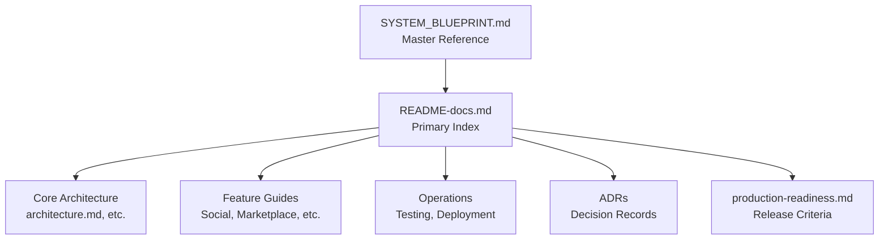

# ROSTRY Documentation Index

📍 **This is the primary documentation index.** For high-level system overview, see `../SYSTEM_BLUEPRINT.md`. For quick setup, see `../QUICK_START.md`.

The documentation folder consolidates deep-dive guides to help new and existing contributors understand the system architecture, feature domains, and operational requirements.

**Last Updated**: 2026-03-01
**Documentation Version**: 5.0

📘 **NEW: Complete System Reference** - See `ROSTRY_COMPLETE_RND_DOCUMENTATION.md` for the comprehensive R&D Master Document.

## Table of Contents

- [Getting Started](#getting-started)
- [Core Architecture](#core-architecture)
- [API & Development Standards](#api--development-standards)
- [Feature Guides](#feature-guides)
- [Operations & Testing](#operations--testing)
- [Architecture Decisions (ADRs)](#architecture-decisions-adrs)
- [Documentation Quality](#documentation-quality)
- [Developer Resources](#developer-resources)

## Audience-Based Navigation

### For New Developers
- `../QUICK_START.md` — 5-minute setup
- `developer-onboarding.md` — First week guide
- `demo_quick_start.md` — Explore the app via demo mode
- `architecture.md` — High-level overview
- `code-style-quick-reference.md` — Essential coding standards

### For Contributors
- `architecture.md` — Patterns, layers, data flow
- `../CODE_STYLE.md` — Style guide
- `../CHEAT_SHEET.md` — Commands and patterns
- `testing-strategy.md` — Testing approach
- `database-migrations.md` — Migration best practices
- `../CODE_OF_CONDUCT.md` — **NEW** Community standards

### For R&D / Architecture
- `architecture.md` — Big picture
- `state-management.md`, `dependency-injection.md`, `error-handling.md` — Focused guides
- `adrs/` — Architecture decisions
- `../SYSTEM_BLUEPRINT.md` — System overview for stakeholders

### For Product Managers / Stakeholders
- `ROSTRY_COMPLETE_RND_DOCUMENTATION.md` — The Master R&D Documentation (Single Source of Truth)
- `../SYSTEM_BLUEPRINT.md` — High-level system overview
- `../ROADMAP.md` — Feature roadmap and priorities
- `production-readiness.md` — **NEW** Production readiness checklist
- `analytics-dashboard.md` — Key metrics and insights

## System Reference (SINF)

| Document | Description | Status |
|----------|-------------|--------|
| `ROSTRY_COMPLETE_RND_DOCUMENTATION.md` | **R&D Master Document.** The comprehensive technical reference. | ✅ Master |
| `ROSTRY_RND_QUICK_REFERENCE.md` | **R&D Cheat Sheet.** Quick links and common commands. | ✅ New |
| `../SYSTEM_BLUEPRINT.md` | **System Blueprint.** High-level architecture. | ✅ Stable |
| `production-readiness.md` | **Production Readiness.** Criteria for v1.0. | ✅ New |

## Core Architecture

| Document | Description | Status |
|----------|-------------|--------|
| `PROJECT_OVERVIEW.md` | **Enterprise overview** with architecture, modules, features | ✅ NEW |
| `CODEBASE_STRUCTURE.md` | Complete code navigation map | ✅ Updated |
| `architecture.md` | Layers, navigation, background jobs, diagrams | ✅ Up-to-date |
| `state-management.md` | StateFlow, hoisting, SavedStateHandle | ✅ Up-to-date |
| `dependency-injection.md` | Hilt modules, scopes, testing | ✅ Up-to-date |

## Architecture Decisions (ADRs)

| ADR | Title | Status |
|-----|-------|--------|
| `adrs/adr-001-database-encryption.md` | Database encryption with SQLCipher | Accepted |
| `adrs/adr-002-offline-first-sync.md` | Offline-first strategy and conflict policy | Accepted |
| `adrs/adr-003-worker-scheduling.md` | WorkManager scheduling strategy | Accepted |
| `adrs/adr-004-farm-market-decoupling.md` | **NEW** Farm vs. Market Domain Decoupling | Accepted |

## Developer Resources

### External References
- `../CONTRIBUTING.md` — Contribution workflow
- `../CODE_STYLE.md` — Code style guide
- `../CODE_OF_CONDUCT.md` — **NEW** Code of Conduct
- `../CHANGELOG.md` — Release notes
- `../SECURITY.md` — Security policy

## Documentation Hierarchy Map

```mermaid
flowchart TD
    S[SYSTEM_BLUEPRINT.md<br/>Master Reference] --> A[README-docs.md<br/>Primary Index]
    A --> B[Core Architecture<br/>architecture.md, etc.]
    A --> C[Feature Guides<br/>Social, Marketplace, etc.]
    A --> D[Operations<br/>Testing, Deployment]
    A --> E[ADRs<br/>Decision Records]
    A --> P[production-readiness.md<br/>Release Criteria]
```

## Archive

Detailed planning and investigation documents are maintained in `archive/` for historical context.