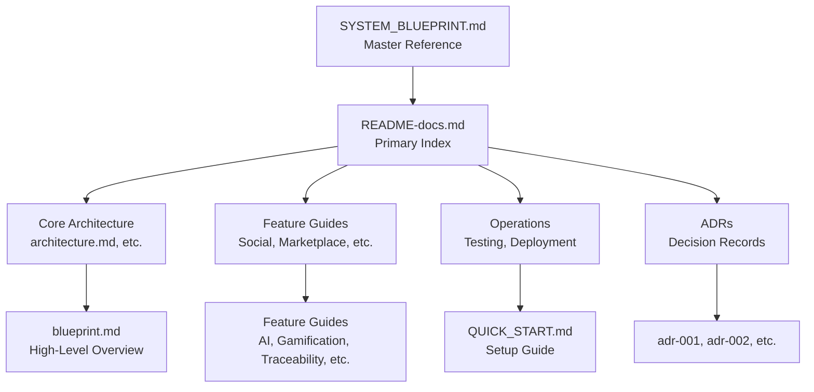

# ROSTRY Documentation Index

📍 **This is the primary documentation index.** For high-level system overview, see `../SYSTEM_BLUEPRINT.md`. For quick setup, see `../QUICK_START.md`.

The documentation folder consolidates deep-dive guides to help new and existing contributors understand the system architecture, feature domains, and operational requirements.

**Last Updated**: 2026-02-06
**Documentation Version**: 4.3

📘 **NEW: Complete System Reference** - See `../ROSTRY_COMPLETE_RND_DOCUMENTATION.md` for the comprehensive R&D Master Document that provides end-to-end coverage of the entire codebase, including architecture, detailed features, and implementation patterns.

## Table of Contents

- [Getting Started](#getting-started)
- [Core Architecture](#core-architecture)
- [API & Development Standards](#api--development-standards)
- [Feature Guides](#feature-guides)
- [Operations & Testing](#operations--testing)
- [Architecture Decisions (ADRs)](#architecture-decisions-adrs)
- [Documentation Quality](#documentation-quality)
- [How to Use This Documentation](#how-to-use-this-documentation)

## Audience-Based Navigation

### For New Developers
- `../QUICK_START.md` — 5-minute setup
- `developer-onboarding.md` — First week guide
- `demo_quick_start.md` — Explore the app via demo mode
- `architecture.md` — High-level overview
- `code-style-quick-reference.md` — Essential coding standards

### For Contributors
- `architecture.md` — Patterns, layers, data flow
- `../CODE_STYLE.md` — Style guide
- `../CHEAT_SHEET.md` — Commands and patterns
- `testing-strategy.md` — Testing approach
- `database-migrations.md` — Migration best practices

### For R&D / Architecture
- `architecture.md` — Big picture
- `state-management.md`, `dependency-injection.md`, `error-handling.md` — Focused guides
- `adrs/` — Architecture decisions
- `../SYSTEM_BLUEPRINT.md` — System overview for stakeholders

### For Product Managers / Stakeholders
- `../ROSTRY_COMPLETE_RND_DOCUMENTATION.md` — The Master R&D Documentation (Single Source of Truth)
- `../SYSTEM_BLUEPRINT.md` — High-level system blueprint
- `../SYSTEM_BLUEPRINT.md` — High-level system overview
- `../ROADMAP.md` — Feature roadmap and priorities
- `analytics-dashboard.md` — Key metrics and insights

## System Reference (SINF)

| Document | Description | Status |
|----------|-------------|--------|
| `../ROSTRY_COMPLETE_RND_DOCUMENTATION.md` | **R&D Master Document.** The comprehensive technical reference for the R&D team. Covers EVERY aspect of the system in detail. | ✅ Master |
| `../ROSTRY_RND_QUICK_REFERENCE.md` | **R&D Cheat Sheet.** Quick links, common commands, and API reference. | ✅ New |
| `../SYSTEM_BLUEPRINT.md` | **System Blueprint.** High-level architecture and functional breakdown. | ✅ Stable |

## Updated Counts
- **114+ ViewModels** across all feature packages
- **57+ Repositories** across multiple subdirectories
- **30+ Workers** for background processing
- **61+ Entity files** with 120+ entities
- **21 DI Modules** for dependency injection

## Documentation Hierarchy

To avoid drift, ROSTRY documentation follows a strict hierarchy:

1.  **ROSTRY_COMPLETE_RND_DOCUMENTATION.md** (Master): The detailed, technical source of truth for the R&D team.
2.  **SYSTEM_BLUEPRINT.md** (Blueprint): High-level system definition and functional requirements.
2.  **architecture.md** (Implementation): Developers' guide to code organization, patterns, and infrastructure. Updates here should align with the Blueprint.
3.  **CODEBASE_STRUCTURE.md** (Navigation): Map of files and packages for code exploration.
4.  **Feature Guides**: Specific implementation details for sub-systems (e.g., `social-platform.md`).

When updating architecture, start with `SYSTEM_BLUEPRINT.md`, then cascade changes to `architecture.md` and specific guides.

## Core Architecture

Understanding the ROSTRY implementation details:

| Document | Description | Status |
|----------|-------------|--------|
| `PROJECT_OVERVIEW.md` | **Enterprise overview** with architecture, modules, features | ✅ NEW |
| `CODEBASE_STRUCTURE.md` | Complete code navigation map | ✅ Updated |
| `architecture.md` | Layers, navigation, background jobs, integrations, diagrams | ✅ Up-to-date |
| `state-management.md` | StateFlow, hoisting, SavedStateHandle, DataStore | ✅ Up-to-date |
| `dependency-injection.md` | Hilt modules, scopes, testing, qualifiers | ✅ Up-to-date |
| `error-handling.md` | Result pattern, repository/UI mapping, logging, Crashlytics | ✅ Up-to-date |
| `data-contracts.md` | Room schema, Firebase collections, Retrofit APIs, validation | ✅ Up-to-date |
| `fetcher-system.md` | Fetcher system architecture, data retrieval patterns, caching strategies | ✅ Complete |
| `cache-management.md` | Cache management implementation, strategies, and best practices | ✅ Complete |
| `data-layer-architecture.md` | Data layer architecture, repository patterns, and data flow | ✅ Complete |
| `data-sources-integration.md` | Data sources integration, API connectivity, and data synchronization | ✅ Complete |
| `api-integration-guide.md` | API integration patterns, Retrofit setup, interceptors, error handling | ✅ Complete |

---

## API & Development Standards

Essential guides for developers working on ROSTRY:

| Document | Description | Audience |
|----------|-------------|----------|
| `api-documentation.md` | KDoc standards, Dokka configuration, documentation requirements | All developers |
| `api-integration-guide.md` | API integration patterns, Retrofit setup, interceptors, error handling | All developers |
| `firebase-setup.md` | Complete Firebase configuration, security rules, Cloud Functions | Developers, DevOps |
| `database-migrations.md` | Room migration guide, schema evolution, testing migrations | Backend developers |
| `ci-cd.md` | GitHub Actions workflows, deployment automation, pipeline configuration | DevOps, Contributors |
| `api-keys-setup.md` | Secure API key management, environment configuration | All developers |

## Feature Guides

### Social & Community

| Document | Description |
|----------|-------------|
| `social-platform.md` | Feed, messaging, groups, events, community engagement hub |
| `ui/social-components.md` | UI components for social features (Profile, Messaging) |

| `user-experience-guidelines.md` | UX patterns, components, wizards, tooltips, animations |

### Marketplace & Transactions

| Document | Description |
|----------|-------------|
| `transfer-workflow.md` | Ownership transfer lifecycle, verifications, disputes, automation |
| `payments-refunds.md` | Payment flow, refunds, UPI, validation, error handling |
| `marketplace-architecture.md` | Marketplace architecture, product visibility, filtering logic |
| `logistics-tracking.md` | Order lifecycle, hubs, routing, real-time tracking |

### Farm Management

| Document | Description |
|----------|-------------|
| `farm-monitoring.md` | Monitoring modules, workers, analytics, alerts |
| `digital-farm.md` | Digital Farm interactive visualization (v2.2 with Lite Mode) |
| `FARMER_LITE_DIGITAL_FARM_STRATEGY.md` | **NEW** Farmer Lite Mode performance optimization |
| `analytics-dashboard.md` | Role-specific dashboards, data pipelines, AI recommendations |
| `enthusiast-role-guide.md` | Enthusiast features, Digital Farm, breeding management |
| `explore-features.md` | Explore tab features, map view, educational content |
| `ui/explore-components.md` | UI components for explore screens (Map, Avatar Cards) |

### Infrastructure

| Document | Description |
|----------|-------------|
| `rbac-permissions.md` | RBAC model, guards, enforcement, testing |
| `media-pipeline.md` | Media compression, upload, caching, display |
| `feature-toggles.md` | Feature flags, A/B testing, lifecycle |
| `notification-system.md` | FCM integration, channels, preferences, deep links |
| `api-integration-guide.md` | API integration patterns, Retrofit setup, interceptors |
| `fetcher-system.md` | Fetcher system architecture, data retrieval, caching |
| `cache-management.md` | Cache management implementation and strategies |
| `data-layer-architecture.md` | Data layer architecture, repository patterns |
| `data-sources-integration.md` | Data sources integration, API connectivity |
| `security-encryption.md` | SQLCipher, biometrics, sessions, audit logging |
| `background-jobs.md` | WorkManager workers, constraints, monitoring |
| `performance-optimization.md` | Performance best practices and profiling |
| `maps-places-integration.md` | Maps and location services integration |
| `ai-personalization.md` | AI-powered recommendations and personalization |
| `gamification.md` | Achievement system, rewards, and progression |
| `traceability.md` | Lineage tracking and family trees |
| `worker-catalog.md` | Comprehensive catalog of WorkManager workers |
| `export-utilities.md` | CSV and PDF export utilities |

## Operations & Testing

| Document | Description | Status |
|----------|-------------|--------|
| `testing-strategy.md` | Unit, integration, UI testing approaches | ✅ Up-to-date |
| `troubleshooting.md` | Common issues and fixes | ⚠️ Expanding |
| `deployment.md` | Deployment procedures and checklists | ✅ Up-to-date |
| `testing-cookbook.md` | Common testing patterns for ViewModels, Repositories, Workers, and UI | ✅ New |
| `release-checklist.md` | Pre/post release steps and rollback plan | ✅ Up-to-date |

## Architecture Decisions (ADRs)

Decision records documenting key architectural choices:

| ADR | Title | Status |
|-----|-------|--------|
| `adrs/adr-001-database-encryption.md` | Database encryption with SQLCipher | Accepted |
| `adrs/adr-002-offline-first-sync.md` | Offline-first strategy and conflict policy | Accepted |
| `adrs/adr-003-worker-scheduling.md` | WorkManager scheduling strategy | Accepted |

## Developer Resources

### External References
- `../CONTRIBUTING.md` — Contribution workflow, testing, and reviews
- `../CODE_STYLE.md` — Comprehensive code style guide
- `../CHANGELOG.md` — Release notes and change history
- `api/` — Generated API docs (Dokka output)
- `images/` — Architecture diagrams and screenshots

## How to Use This Documentation

### For New Developers
1. **Start here**: `../QUICK_START.md`
2. **Understand architecture**: `architecture.md`
3. **Learn patterns**: `../CODE_STYLE.md`
4. **Contribute**: `../CONTRIBUTING.md`

### For Feature Development

1. **Review relevant feature guide** (e.g., `social-platform.md` for community features)
2. **Check UX guidelines**: `user-experience-guidelines.md`
3. **Update data contracts**: `data-contracts.md` if schema changes
4. **Add tests**: Follow `testing-strategy.md`
5. **Document decisions**: Create ADR if architectural change

### For Troubleshooting

1. **Check**: `troubleshooting.md` for common issues
2. **Review**: Feature-specific docs for domain knowledge
3. **Search**: Existing issues and PRs in repository

### For Release Preparation
1. **Test**: Follow `testing-strategy.md`
2. **Review**: Security checklist in `security-encryption.md`
3. **Update**: `../CHANGELOG.md`
4. **Checklist**: `release-checklist.md`
5. **Deploy**: `deployment.md`

## Documentation Hierarchy Map

```mermaid
flowchart TD
    S[SYSTEM_BLUEPRINT.md<br/>Master Reference] --> A[README-docs.md<br/>Primary Index]
    A --> B[Core Architecture<br/>architecture.md, etc.]
    A --> C[Feature Guides<br/>Social, Marketplace, etc.]
    A --> D[Operations<br/>Testing, Deployment]
    A --> E[ADRs<br/>Decision Records]
    B --> F[blueprint.md<br/>High-Level Overview]
    C --> G[Feature Guides<br/>AI, Gamification, Traceability, etc.]
    D --> H[QUICK_START.md<br/>Setup Guide]
    E --> I[adr-001, adr-002, etc.]
```

## Common Tasks Quick Reference

| Task | Relevant Documentation |
|------|------------------------|
| Understanding complete system | SYSTEM_BLUEPRINT.md, architecture.md, README-docs.md |
| Adding a new screen | `architecture.md`, `user-experience-guidelines.md`, `CODE_STYLE.md` |
| Database migration | `database-migrations.md`, `data-contracts.md`, `architecture.md` |
| Background worker | `background-jobs.md`, `architecture.md` |
| Firebase setup/integration | `firebase-setup.md`, `api-integration.md`, `data-contracts.md` |
| Adding tests | `testing-strategy.md`, `CODE_STYLE.md` |
| UX component | `user-experience-guidelines.md`, `CODE_STYLE.md` |
| Security feature | `security-encryption.md`, `rbac-permissions.md` |
| API documentation | `api-documentation.md`, `api-integration-guide.md`, `CODE_STYLE.md` |
| CI/CD pipeline | `ci-cd.md`, `deployment.md` |
| API key management | `api-keys-setup.md`, `firebase-setup.md` |
| API integration | `api-integration.md`, `api-integration-guide.md`, `fetcher-system.md` |
| Data layer architecture | `data-layer-architecture.md`, `data-sources-integration.md`, `cache-management.md` |
| AI recommendations | `ai-personalization.md`, `analytics-dashboard.md` |
| Gamification features | `gamification.md`, `user-experience-guidelines.md` |
| Traceability tracking | `traceability.md`, `farm-monitoring.md` |

## Documentation Standards

When updating documentation:

- **Keep it current**: Update docs with code changes
- **Be specific**: Include code examples and screenshots
- **Cross-reference**: Link to related documents
- **Create ADRs**: Document significant architectural decisions
- **Use consistent formatting**: Follow markdown best practices
- **Include diagrams**: Use Mermaid for architecture diagrams

---

## Documentation Quality

All documentation should meet these quality standards:

### Quality Checklist

When creating or updating documentation:

**Content**:
- [ ] Metadata included (Version, Last Updated, Audience)
- [ ] Table of contents for docs >200 lines
- [ ] Clear purpose statement
- [ ] Target audience identified
- [ ] Prerequisites listed (if applicable)

**Structure**:
- [ ] Logical section organization
- [ ] Consistent heading hierarchy
- [ ] Code examples with syntax highlighting
- [ ] Screenshots/diagrams where helpful
- [ ] Cross-references to related docs

**Technical Accuracy**:
- [ ] Code examples are runnable
- [ ] File paths are correct
- [ ] Commands are tested
- [ ] Links are valid
- [ ] No outdated information

**Clarity**:
- [ ] Written in clear, concise language
- [ ] Technical jargon explained
- [ ] Examples provided for complex concepts
- [ ] Common pitfalls documented
- [ ] Troubleshooting section included

**Maintenance**:
- [ ] Document version updated
- [ ] Last updated date current
- [ ] Breaking changes highlighted
- [ ] Deprecation warnings included
- [ ] Migration guides provided (if needed)

### Documentation Types

**Reference Documentation**:
- API documentation (KDoc + Dokka)
- Data contracts and schemas
- Configuration files

**Guides**:
- How-to guides for specific tasks
- Step-by-step tutorials
- Best practices

**Explanations**:
- Architecture decisions (ADRs)
- Design patterns
- System overview

**Quick Reference**:
- Cheat sheets
- Command reference
- Quick start guides

## Contributing to Documentation

See `CONTRIBUTING.md` for:
- When to update documentation
- Documentation file structure
- KDoc requirements for code
- Pull request process

---

**Questions or improvements?** Open an issue or PR with documentation suggestions.