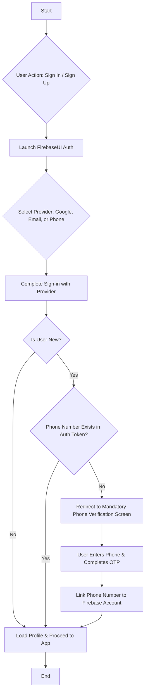
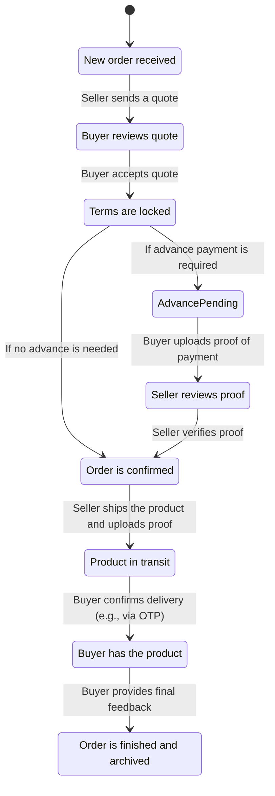
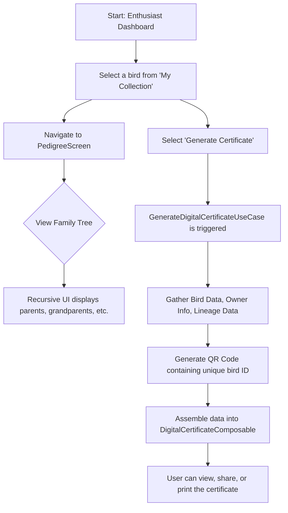

# ROSTRY - System Flowcharts and Algorithms

This document provides a comprehensive visualization of the core user flows and underlying algorithms within the ROSTRY application. It is intended for the R&D team to analyze, rethink, and upgrade features.

---

## 1. User Authentication & Onboarding Flow

This flow outlines the process for both new and returning users, emphasizing the mandatory phone verification step for new sign-ups.

### Flowchart



### Algorithm: User Authentication & Onboarding

This algorithm describes the process from the user initiating a sign-in to being granted access to the main application. The core security requirement is that all users must have a verified phone number linked to their account.

**Assumptions:**
- FirebaseUI is configured with Google, Email/Password, and Phone providers.
- Firestore security rules require a `phone_number` claim for new user profile creation.

**Steps:**

1.  **Initiate Sign-in:** The user presses the "Sign In" or "Sign Up" button.
2.  **Launch FirebaseUI:** The application launches the FirebaseUI authentication activity.
3.  **Provider Selection:** The user selects their preferred authentication method (e.g., Google).
4.  **Authentication:** The user completes the sign-in flow with the selected provider.
5.  **Post-Authentication Check:** Upon a successful sign-in callback from FirebaseUI, the application receives a `FirebaseUser` object.
6.  **New User Detection:**
    -   Check the user's metadata: `firebaseUser.metadata.creationTimestamp == firebaseUser.metadata.lastSignInTimestamp`.
    -   If `true`, the user is considered **new**. Proceed to Step 7.
    -   If `false`, the user is **returning**. Proceed to Step 9.
7.  **Phone Verification Check (New User):**
    -   Check if `firebaseUser.phoneNumber` is null or empty.
    -   If a phone number **exists** (e.g., they signed in directly with Phone Auth), proceed to Step 9.
    -   If a phone number is **missing**, the user must link one. Proceed to Step 8.
8.  **Mandatory Phone Linking:**
    -   Navigate the user to the `PhoneVerificationScreen`.
    -   The user inputs their phone number and submits.
    -   The app initiates Firebase's phone OTP verification flow.
    -   Upon successful OTP validation, the phone credential is linked to the existing user's Firebase account.
9.  **Profile Finalization:**
    -   With a verified phone number now guaranteed to be part of the user's auth token, create or update the user's profile document in the `/users/{userId}` collection in Firestore.
    -   This step succeeds because the security rules are now met.
10. **Grant Access:**
    -   Navigate the user to the main application dashboard or home screen.

---

## 2. Offline-First Data Synchronization Flow

This flow details the application's core data synchronization strategy, where the local Room database is the single source of truth and all data changes are eventually consistent with the remote Firestore backend.

### Flowchart

```mermaid
graph TD
    subgraph User Action (Offline)
        A[User creates/updates data] --> B[Write to Room Database];
        B --> C[Mark record as 'dirty=true'];
        C --> D[UI observes Room Flow & updates instantly];
    end

    subgraph Background Sync (When Connected)
        E[WorkManager triggers SyncWorker] --> F{Network available?};
        F -- No --> G[Wait/Retry Later];
        F -- Yes --> H[Read all 'dirty=true' records from Room];
        H --> I[Push changes to Firestore];
        I --> J{Push successful?};
        J -- Yes --> K[Update local records to 'dirty=false'];
        J -- No --> L[Log error, retry later];

        M[SyncWorker also triggers pull] --> N[Get 'last_synced_at' timestamp];
        N --> O[Fetch changes from Firestore > timestamp];
        O --> P[Merge remote changes into Room DB];
        P --> Q[Update 'last_synced_at' timestamp];
        Q --> D;
    end

    A --> E;
```

### Algorithm: Data Synchronization

This algorithm is divided into two primary operations: pushing local changes to the remote server and pulling remote changes to the local database.

#### Part 1: Push (Local to Remote)

This process ensures that any changes made by the user while online or offline are eventually sent to the server.

1.  **Data Modification:** A user performs an action that creates, updates, or deletes data (e.g., adding a new chicken to their farm).
2.  **Local Write:** The `Repository` immediately writes this change to the local Room database. The entity being saved has a boolean flag, `isDirty`, which is set to `true`.
3.  **Immediate UI Update:** The UI, which is observing a `Flow` of data from the Room database, updates instantly to reflect the change. The user perceives the action as complete.
4.  **Enqueue Sync Work:** A `OneTimeWorkRequest` for the `SyncWorker` is enqueued with `WorkManager`. This request can have constraints, such as requiring network connectivity.
5.  **Sync Execution:** `WorkManager` executes the `SyncWorker` when its constraints are met.
6.  **Fetch Dirty Data:** The worker queries all local tables for records where `isDirty = true`.
7.  **Push to Remote:** The worker iterates through the dirty records and sends them to the appropriate Firestore collections.
8.  **Acknowledge Success:** Upon successful confirmation from Firestore for each record, the worker updates the corresponding record in the Room database, setting `isDirty = false` and updating a `syncedAt` timestamp.

#### Part 2: Pull (Remote to Local)

This process keeps the local data up-to-date with changes from the server, such as an order status being updated by another user.

1.  **Trigger:** The pull process is initiated by a `PeriodicWorkRequest` (e.g., every 4 hours) or can be triggered on-demand by a high-priority Firebase Cloud Messaging (FCM) message.
2.  **Get Last Sync Time:** The `SyncWorker` retrieves the `last_synced_at` timestamp from a persistent local store (like `DataStore`). This timestamp indicates the last time data was successfully fetched.
3.  **Fetch Remote Changes:** The worker makes a query to Firestore to get all documents in relevant collections that have been modified after the `last_synced_at` timestamp.
4.  **Merge Data:** The worker receives a list of data transfer objects (DTOs) from Firestore.
5.  **Local Upsert:** It iterates through the DTOs and performs an "upsert" (insert or update) operation into the Room database. This ensures new records are created and existing ones are updated.
6.  **Update Sync Time:** After all changes have been successfully merged, the worker updates the `last_synced_at` timestamp in `DataStore` to the time of the current fetch.
7.  **Automatic UI Update:** Since the UI is always observing the Room database, it automatically reflects the newly pulled data without any further action required.

---

## 3. General User - Product Discovery & Quick Order Flow

This flow is designed for a "General" user whose primary goal is to find and purchase a product for consumption with minimal steps.

### Flowchart

```mermaid
graph TD
    A[Start: DiscoverHomeScreen] --> B[View Curated Sections: Near You, High-Rated];
    B --> C{User selects a product};
    C --> D[Navigate to ProductDetailScreen];
    D --> E[View Product Info & Trust Chips];
    E --> F[User clicks 'Quick Order'];
    F --> G[Show QuickOrderSheet (Bottom Sheet)];
    G --> H[User confirms quantity, address];
    H --> I[Submit Order (Default: COD)];
    I --> J[Create Order locally with 'status=Enquiry', 'dirty=true'];
    J --> K[Show 'Order Placed' Confirmation];
    K --> L[End];
```

### Algorithm: Product Discovery & Quick Order

This algorithm prioritizes speed and simplicity for the "General" user persona.

**User Persona:** General User (Buyer, focused on consumption).
**Goal:** Find a suitable product and place an order quickly.

**Steps:**

1.  **Entry Point:** The user, having selected the "General" persona, lands on the `DiscoverHomeScreen`.
2.  **Curated Data Loading:** The `ViewModel` fetches several curated lists of products from the local Room database. These lists are powered by `UseCases` that apply specific business logic, such as:
    *   `GetProductsNearYouUseCase`: Uses the device's last known location to find sellers within a 50km radius.
    *   `GetTopRatedProductsUseCase`: Filters products from sellers with an average rating above 4.5.
3.  **Discovery & Selection:** The user browses these lists and taps a product card to view more details.
4.  **View Details:** The application navigates to the `ProductDetailScreen`. Here, the UI displays key information and "Trust Chips" (e.g., "Verified Seller," "Low Mortality Rate"). The logic for these chips is handled by a `TrustBadgeService` that checks the seller's aggregated performance data.
5.  **Initiate Quick Order:** The user taps the "Quick Order" button. This action is designed to be the primary call-to-action on the screen.
6.  **Display Order Form:** A modal bottom sheet (`QuickOrderSheet`) is presented. This UI component is optimized for speed:
    *   It is pre-filled with the product's details.
    *   The quantity defaults to 1.
    *   The user's default delivery address is pre-selected.
    *   The payment method defaults to "Cash on Delivery" (COD) to minimize friction.
7.  **Order Submission:** The user confirms the details and taps "Place Order."
8.  **Local Order Creation:** The `OrderRepository` is called to create the order. It immediately:
    *   Creates a new `OrderEntity` in the local Room database.
    *   Sets the initial status to `ENQUIRY`.
    *   Marks the new record with `isDirty = true`.
9.  **User Feedback:** The bottom sheet is dismissed, and a confirmation snackbar or toast is shown to the user. From the user's perspective, the order is placed instantly.
10. **Background Sync:** The change is now pending in the sync queue. The `SyncWorker`, as described in Flow 2, will automatically pick up this new order and push it to the seller via Firestore the next time it runs with a network connection.

---

## 4. Farmer - Marketplace Order Lifecycle Flow

This is a trust-based, multi-state workflow that involves both the Buyer and the Farmer (Seller). Each state change is an atomic transaction that is often backed by evidence.

### Flowchart (State Machine)



### Algorithm: Evidence-Based Order State Machine

This algorithm details the responsibilities of the Farmer (Seller) and the Buyer at each stage of the order lifecycle.

**User Personas:** Farmer (Seller), General User/Enthusiast (Buyer).
**Goal:** Ensure a transparent and trustworthy transaction for both parties.

**States & Transitions:**

1.  **ENQUIRY:**
    *   **Trigger:** A Buyer places a "Quick Order" (as in Flow 3).
    *   **Farmer's Action:** Receives a notification. Reviews the enquiry in their dashboard. Taps "Send Quote."
    *   **Logic:** The Farmer fills in the final price, delivery charges, and expected delivery date. Submitting this moves the order to the next state.
    *   **State Change:** `status` -> `QUOTE_SENT`.

2.  **QUOTE_SENT:**
    *   **Trigger:** The order's status is updated.
    *   **Buyer's Action:** Receives a notification with the quote. Reviews the terms. Taps "Accept Quote."
    *   **Logic:** If the Buyer accepts, the order terms are locked. A check is performed to see if the seller requires an advance payment.
    *   **State Change:** `status` -> `AGREEMENT_LOCKED`.

3.  **AGREEMENT_LOCKED:**
    *   **Trigger:** The Buyer accepts the quote.
    *   **Logic (Automated):** The system checks the `order.requiresAdvance` flag.
    *   **State Change:**
        *   If `true`, `status` -> `ADVANCE_PENDING`.
        *   If `false`, `status` -> `PAYMENT_VERIFIED` (skips payment steps).

4.  **ADVANCE_PENDING:**
    *   **Trigger:** The order requires an advance payment.
    *   **Buyer's Action:** Taps "Upload Payment Proof." Submits a screenshot or transaction ID as evidence.
    *   **Logic:** A new `EvidenceEntity` is created, linked to the order, with `type = PAYMENT_PROOF`. This entity is marked `isDirty = true` and uploaded by `MediaUploadWorker`.
    *   **State Change:** `status` -> `PAYMENT_PROOF`.

5.  **PAYMENT_PROOF:**
    *   **Trigger:** The Buyer has submitted their payment evidence.
    *   **Farmer's Action:** Receives a notification. Reviews the evidence. Taps "Verify Payment."
    *   **Logic:** This action is critical for trust. A `Cloud Function (verifyTransaction)` could be triggered in the future for automated checks.
    *   **State Change:** `status` -> `PAYMENT_VERIFIED`.

6.  **PAYMENT_VERIFIED:**
    *   **Trigger:** Payment is confirmed. This is the green light for the Farmer to proceed.
    *   **Farmer's Action:** Prepares the product for shipping. Taps "Dispatch Order."
    *   **Logic:** The Farmer may be required to upload dispatch evidence (e.g., a photo of the packaged goods).
    *   **State Change:** `status` -> `DISPATCHED`.

7.  **DISPATCHED:**
    *   **Trigger:** The product is in transit.
    *   **Buyer's Action:** Awaits delivery. Upon receipt, confirms delivery.
    *   **Logic:** Confirmation can be a simple button tap ("I have received the item") or a more secure OTP that the delivery person enters into their own app.
    *   **State Change:** `status` -> `DELIVERED`.

8.  **DELIVERED:**
    *   **Trigger:** The Buyer has the product.
    *   **Buyer's Action:** Inspects the product. Taps "Complete Order." Optionally leaves a rating and review for the Farmer.
    *   **Logic:** This is the final step from the Buyer's perspective.
    *   **State Change:** `status` -> `COMPLETED`.

9.  **COMPLETED:**
    *   **Trigger:** The Buyer finalizes the transaction.
    *   **Logic (Automated):** The order is now considered finished. It is moved from the active orders list to the order history.
    *   **Final State:** The order is archived for record-keeping.

---

## 5. Farmer - Farm Monitoring & Task Management Flow

This flow covers the Farmer's daily routine of logging farm data and acting on system-generated tasks.

### Flowchart

```mermaid
graph TD
    subgraph Daily Tasks
        A[Start: Farmer Dashboard] --> B[View 'Today's Tasks' list];
        B --> C{Task Type?};
        C -- Manual --> D[Farmer completes task (e.g., vaccinates flock)];
        C -- System-Generated --> D;
        D --> E[Mark task as 'Done' in UI];
        E --> F[Update TaskEntity: 'isComplete=true', 'dirty=true'];
    end

    subgraph Manual Data Entry
        A --> G[Select 'Add Daily Log'];
        G --> H{Log Type?};
        H -- Growth --> I[Enter weight/height for a batch];
        H -- Vaccination --> J[Record vaccine administered];
        I --> K[Save GrowthRecordEntity, 'dirty=true'];
        J --> K[Save VaccinationRecordEntity, 'dirty=true'];
    end

    subgraph Automated Task Generation (Background)
        L[WorkManager runs daily periodic workers] --> M{Worker Type?};
        M -- LifecycleWorker --> N[Check bird ages];
        M -- VaccinationReminderWorker --> O[Check vaccine schedules];
        N --> P{Age milestone reached?};
        O --> Q{Vaccine due?};
        P -- Yes --> R[Create TaskEntity: 'Move to juvenile pen'];
        Q -- Yes --> S[Create TaskEntity: 'Administer vaccine X'];
        R --> B;
        S --> B;
    end
```

### Algorithm: Farm Monitoring & Task Management

This system is designed to simplify farm management by combining manual data entry with proactive, automated task generation.

#### Part 1: Manual Data Logging

1.  **Entry Point:** From the main dashboard, the Farmer navigates to the "Add Daily Log" section.
2.  **Select Log Type:** The Farmer chooses the type of data to record (e.g., "Growth," "Vaccination," "Mortality").
3.  **Data Input:** The Farmer fills out a specific form for the selected log type, associating the record with a specific batch or product.
4.  **Local Save:** Upon saving, the `Repository` creates the appropriate entity (e.g., `GrowthRecordEntity`), sets its `isDirty` flag to `true`, and saves it to the local Room database. The UI provides immediate confirmation.
5.  **Background Sync:** The `SyncWorker` will later push this record to Firestore.

#### Part 2: Automated Task Generation & Management

This process runs in the background to create tasks for the farmer, ensuring important events are not missed.

1.  **Scheduled Workers:** `WorkManager` is configured to run several `PeriodicWorkRequest`s, typically once every 24 hours.
2.  **`LifecycleWorker` Logic:**
    *   **Query:** Fetches all `ProductEntity` or `BatchEntity` records from the local Room database.
    *   **Evaluate:** For each entity, it calculates the current age based on its `dateOfBirth`.
    *   **Create Task:** If the age crosses a predefined milestone (e.g., 28 days for moving from chick to juvenile), it checks if a corresponding "move" task has already been created. If not, it creates a new `TaskEntity` with a description like "Move Batch #B52 to juvenile pen" and saves it to Room.
3.  **`VaccinationReminderWorker` Logic:**
    *   **Query:** Fetches all batches and their associated `VaccinationSchedule`s.
    *   **Evaluate:** For each vaccine in the schedule, it compares the due date with the current date.
    *   **Create Task:** If a vaccine is due today or is overdue and not yet logged as completed, it creates a new `TaskEntity` (e.g., "Administer Gumboro vaccine for Batch #B52").
4.  **Task Aggregation & Display:**
    *   **`GetTodayTasksUseCase`:** This is the core logic for the farmer's dashboard. It queries the `TaskEntity` table for all records where `dueDate` is today and `isComplete` is `false`.
    *   **UI Display:** The `FarmerDashboardViewModel` calls this `UseCase` and observes the resulting `Flow`. The list of tasks is displayed prominently to the user.
5.  **Task Completion:**
    *   When a Farmer completes a task, they mark it as "Done" in the UI.
    *   This action updates the corresponding `TaskEntity` in Room, setting `isComplete = true` and `isDirty = true`.
    *   The `SyncWorker` will later update this status in Firestore, maintaining a complete record of farm activities.

---

## 6. Enthusiast - Lineage & Certificate Management Flow

This flow caters to the "Enthusiast" user, who is focused on breed quality, lineage tracking, and proof of ownership.

### Flowchart



### Algorithm: Lineage & Certificate Management

This system provides high-value features for serious breeders and enthusiasts, focusing on data visualization and verifiable ownership.

**User Persona:** Enthusiast (Breeder, focused on quality and records).
**Goal:** Track genetic history and generate official ownership documents.

#### Part 1: Pedigree Visualization

1.  **Entry Point:** The Enthusiast user selects a specific, high-value bird from their collection screen.
2.  **Navigate to Pedigree:** The user navigates to the `PedigreeScreen`, passing the unique ID of the selected bird.
3.  **Fetch Lineage Data:**
    *   The `PedigreeViewModel` calls the `GetLineageUseCase`, providing the bird's ID.
    *   The `UseCase` performs a recursive fetch from the `LineageRepository`.
4.  **Recursive Fetch Algorithm:**
    *   `function getParents(birdId)`:
        *   **Base Case:** If `birdId` is null or recursion depth > 5, return.
        *   **Query:** Fetch the `LineageEntity` where `childId == birdId`.
        *   **Result:** This entity contains `fatherId` and `motherId`.
        *   **Recurse:** Call `getParents(fatherId)` and `getParents(motherId)`.
        *   **Build Tree:** Assemble the results into a hierarchical data structure (a tree).
5.  **UI Rendering:**
    *   The `PedigreeScreen` uses a specialized Composable that takes the lineage tree as input.
    *   It recursively draws nodes and connecting lines to represent the family tree, allowing the user to visually trace the bird's ancestry.

#### Part 2: Digital Certificate Generation

1.  **Initiate Generation:** From the bird's detail screen, the Enthusiast taps "Generate Certificate."
2.  **Trigger UseCase:** This action invokes the `GenerateDigitalCertificateUseCase`.
3.  **Data Aggregation:** The `UseCase` gathers all necessary information:
    *   **Bird Details:** Fetches the `ProductEntity` for the bird's name, breed, date of birth, etc.
    *   **Owner Details:** Fetches the current owner's `UserProfileEntity`.
    *   **Key Lineage:** Fetches the immediate parents (`fatherId`, `motherId`) to display on the certificate.
4.  **QR Code Generation:**
    *   A unique string is created, typically containing the bird's ID and the owner's ID (e.g., `{"birdId": "...", "ownerId": "..."}`).
    *   This string is passed to a QR code generation library (like ZXing) to create a bitmap image of the QR code. This QR code can be scanned by others to verify the bird's details in the app.
5.  **Assemble Certificate UI:**
    *   The aggregated data and the generated QR code image are passed as state to the `DigitalCertificateComposable`.
    *   This Composable is a print-layout-styled UI that arranges the information in an official-looking format, including the app's branding, the bird's photo, and the QR code.
6.  **Display & Share:**
    *   The `DigitalCertificateComposable` is displayed on the screen.
    *   The user is given options to:
        *   **Share:** The app can convert the Composable's content into an image (PNG/JPEG) or a PDF and share it via the standard Android share sheet.
        *   **Print:** The app can use Android's printing framework to send the certificate to a printer.

---
