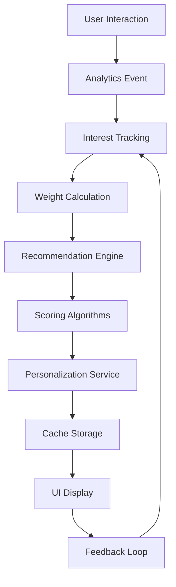

Title: AI and Personalization
Version: 1.0
Last Updated: 2025-10-29
Audience: Developers, Contributors

## Table of Contents
- [Overview](#overview)
- [Components](#components)
- [Data Flow](#data-flow)
- [Implementation Details](#implementation-details)
- [Configuration](#configuration)
- [Usage Examples](#usage-examples)
- [Testing](#testing)
- [Future Enhancements](#future-enhancements)

# AI and Personalization

## Overview

The AI and personalization system in ROSTRY enhances user engagement by providing intelligent recommendations and personalized content delivery. This system leverages user behavior data, product interactions, and community activities to create tailored experiences for farmers, enthusiasts, and general users.

**Implementation Status**: Core recommendation engine and data models are implemented. PersonalizationWorker and UI integration are in active development.

### Purpose

The primary purpose of the AI/personalization system is to:
- Improve user discovery of relevant products, posts, and community connections
- Increase platform engagement through personalized content feeds
- Boost marketplace conversions by surfacing relevant products
- Foster community interactions by connecting users with similar interests

### Key Features

- **Intelligent Recommendations**: Algorithm-driven suggestions for products, posts, mentors, and connections
- **User Interest Tracking**: Dynamic learning of user preferences based on interactions
- **Personalized Content Filtering**: Ranking and ordering of content based on user profiles
- **Background Processing**: Automated updates via WorkManager for fresh recommendations
- **Multi-Type Recommendations**: Support for products, posts, mentors, connections, groups, events, experts

### Architecture Overview

The system follows a layered architecture:
- **Data Layer**: Entities for recommendations and user interests stored in Room database
- **Service Layer**: RecommendationEngine for scoring, PersonalizationService for caching and ranking
- **Worker Layer**: PersonalizationWorker for scheduled background updates
- **UI Layer**: ViewModels and screens that consume personalized data

Components communicate through repositories and services, ensuring offline-first capabilities and efficient caching.

## Components

### RecommendationEngine

The RecommendationEngine is the core component responsible for generating various types of recommendations using scoring algorithms and multiple data sources.

#### How It Generates Recommendations

The engine uses a combination of collaborative filtering, content-based matching, and trending analysis to generate recommendations. It processes user data, product catalogs, and social interactions to compute relevance scores.

#### Scoring Algorithm

Recommendations are scored using weighted factors:
- **Similarity Score**: Based on breed, age, price range, and category matching (up to 50 points for breed, 25 for age, etc.)
- **Popularity Score**: Derived from engagement metrics like views, likes, and purchases
- **Personalization Score**: User-specific boosts for verified sellers, traceable products, and preferences
- **Trending Score**: Time-weighted engagement within recent periods

#### Data Sources

- Product catalog from ProductRepository
- Social data from SocialRepository
- Order history from OrderRepository
- Analytics data from AnalyticsRepository
- User interaction logs

### PersonalizationService

The PersonalizationService manages user interest tracking, preference learning, and content filtering with intelligent caching.

#### User Interest Tracking

Tracks user interactions across the platform:
- Product views and purchases
- Post engagements (likes, comments, shares)
- Search queries and filter usage
- Community group participation
- Expert consultations

#### Preference Learning

Learns user preferences through:
- Implicit feedback from browsing patterns
- Explicit preferences from profile settings
- Behavioral clustering based on similar users
- Time-based decay of older interactions

#### Content Filtering

Applies personalized ranking to:
- Product listings in marketplace
- Posts in social feed
- Community recommendations
- Notification delivery timing

### PersonalizationWorker

The PersonalizationWorker handles background job scheduling for data aggregation and recommendation updates.

#### Background Job Scheduling

- Scheduled as periodic work using WorkManager
- Runs every 12 hours with network connectivity constraints (see CHANGELOG for provenance)
- Uses exponential backoff for retry logic (10-minute initial delay)

#### Data Aggregation

Aggregates data from multiple sources:
- User interaction events
- Product engagement metrics
- Social activity patterns
- Analytics data points

#### Update Frequency

- Recommendations refreshed every 12 hours
- Cache TTL of 5 minutes for real-time personalization
- Incremental updates to avoid full recomputation

### CommunityRecommendationEntity

Data model for storing personalized recommendations in the database.

```kotlin
@Entity(tableName = "community_recommendations")
data class CommunityRecommendationEntity(
    @PrimaryKey val recommendationId: String,
    val userId: String,
    val type: String, // "MENTOR", "CONNECTION", etc.
    val targetId: String, // ID of recommended item
    val score: Double,
    val reason: String,
    val createdAt: Long,
    val expiresAt: Long
)
```

### UserInterestEntity

Tracks user interests with weighting for personalization.

```kotlin
@Entity(tableName = "user_interests")
data class UserInterestEntity(
    @PrimaryKey val interestId: String,
    val userId: String,
    val category: String, // "BREED", "PRODUCT_TYPE", etc.
    val value: String, // Specific interest value
    val weight: Double, // 0.0 to 1.0
    val lastUpdated: Long,
    val interactionCount: Int
)
```

## Data Flow

### User Interaction Capture

User interactions are captured throughout the app:
- Product views trigger analytics events
- Social engagements update interest weights
- Search queries refine preference profiles
- Purchase history influences collaborative filtering

### Interest Weight Calculation

Interest weights are calculated dynamically:
- Initial weight based on interaction type (view: 0.1, purchase: 1.0)
- Time decay reduces older interactions (half-life of 30 days)
- Frequency boosts repeated interests
- Category clustering groups related interests

### Recommendation Generation Pipeline

1. **Data Collection**: Gather user interactions and content metadata
2. **Preprocessing**: Normalize and filter relevant data
3. **Scoring**: Apply recommendation algorithms
4. **Ranking**: Sort by relevance and personalization factors
5. **Caching**: Store results with TTL for performance
6. **Delivery**: Serve to UI components

### Data Flow Diagram



## Implementation Details

### Key Classes and Responsibilities

- **RecommendationEngine**: Core recommendation logic, scoring methods
- **PersonalizationService**: Caching, ranking, notification logic
- **PersonalizationWorker**: Background scheduling and data aggregation
- **CommunityEngagementService**: Data aggregation methods for community features
- **CommunityRepository**: Database operations for recommendations and interests

### Database Schema

#### community_recommendations Table

| Column | Type | Description |
|--------|------|-------------|
| recommendationId | TEXT PRIMARY KEY | Unique recommendation ID |
| userId | TEXT | Target user ID |
| type | TEXT | Recommendation type (MENTOR, CONNECTION, etc.) |
| targetId | TEXT | ID of recommended item |
| score | REAL | Recommendation score |
| reason | TEXT | Human-readable reason |
| createdAt | INTEGER | Creation timestamp |
| expiresAt | INTEGER | Expiration timestamp |

#### user_interests Table

| Column | Type | Description |
|--------|------|-------------|
| interestId | TEXT PRIMARY KEY | Unique interest ID |
| userId | TEXT | User ID |
| category | TEXT | Interest category |
| value | TEXT | Specific interest value |
| weight | REAL | Interest weight (0.0-1.0) |
| lastUpdated | INTEGER | Last update timestamp |
| interactionCount | INTEGER | Number of interactions |

### Repository Methods

#### CommunityRepository

```kotlin
suspend fun getRecommendationsForUser(userId: String): List<CommunityRecommendationEntity>
suspend fun insertRecommendation(recommendation: CommunityRecommendationEntity)
suspend fun updateUserInterest(interest: UserInterestEntity)
suspend fun getUserInterests(userId: String): List<UserInterestEntity>
```

#### PersonalizationRepository

```kotlin
suspend fun getPersonalizedProducts(userId: String): List<ProductEntity>
suspend fun rankPostsForUser(userId: String, posts: List<PostEntity>): List<PostEntity>
suspend fun clearUserCache(userId: String)
```

### ViewModel Integration

ViewModels consume recommendations through repository calls:

```kotlin
class MarketplaceViewModel @Inject constructor(
    private val personalizationRepository: PersonalizationRepository
) : ViewModel() {
    
    fun getPersonalizedProducts(userId: String): Flow<List<ProductEntity>> {
        return personalizationRepository.getPersonalizedProducts(userId)
    }
}
```

Screens observe these flows and display ranked content accordingly.

## Configuration

### Recommendation Types

- **MENTORS**: Expert farmers for guidance
- **CONNECTIONS**: Similar users for networking
- **GROUPS**: Relevant community groups
- **EVENTS**: Upcoming farming events
- **EXPERTS**: Specialized consultants
- **POSTS**: Interesting social content

### Scoring Parameters and Weights

- Breed matching: 50 points
- Age similarity: 25 points
- Price range: 15 points
- Category match: 10 points
- Verified seller: 15 points
- Traceable product: 10 points
- Fresh listing: 5 points
- Location proximity: variable (0-10)

### Worker Scheduling

- Frequency: Every 12 hours (see CHANGELOG)
- Constraints: Requires network connectivity
- Backoff: Exponential, starting at 10 minutes
- Battery optimization: Respects device power settings

### Performance Considerations

- Cache TTL: 5 minutes to balance freshness and performance
- Batch processing: Recommendations computed in background
- Memory limits: Cache size capped at 100 entries per user
- Database optimization: Indices on userId and timestamps

## Usage Examples

### Fetching Recommendations for a User

```kotlin
val recommendationEngine = RecommendationEngine(productRepository, socialRepository, orderRepository, analyticsRepository)

val recommendations = recommendationEngine.recommendationsFor(userId = "user123")
// Returns list of Recommendation objects with scores and reasons
```

### Tracking User Interests

```kotlin
val personalizationService = PersonalizationService(analyticsRepository, sessionManager, recommendationEngine)

// Service automatically tracks interests through user interactions
// Manual tracking example:
personalizationService.personalizeFor("user123")
```

### Customizing Recommendation Scoring

```kotlin
// In RecommendationEngine.similarProducts()
val scored = products.map { product ->
    var similarityScore = 0.0
    
    // Custom breed matching with higher weight
    if (product.breed == targetProduct.breed) {
        similarityScore += 60.0 // Increased from 50.0
    }
    
    // Add custom factors
    if (product.location == userLocation) {
        similarityScore += 20.0
    }
    
    // ... rest of scoring logic
}
```

### Code Examples from Implementation

From RecommendationEngine.kt:

```kotlin
suspend fun personalizedForUser(userId: String, limit: Int = 10): List<Recommendation> {
    val productsResource = productRepository.getAllProducts().first()
    val products = (productsResource as? Resource.Success)?.data ?: return emptyList()
    
    val scored = products.map { product ->
        var personalizedScore = 0.0
        
        personalizedScore += (product.productId.hashCode().absoluteValue % 50) * 0.5
        if (!product.sellerId.isNullOrBlank()) {
            personalizedScore += 15.0
        }
        if (product.familyTreeId != null) {
            personalizedScore += 10.0
        }
        if (product.price in 1000.0..10000.0) {
            personalizedScore += 20.0
        }
        
        Recommendation(
            id = product.productId,
            title = product.name,
            score = personalizedScore,
            kind = Recommendation.Kind.PRODUCT,
            reason = "Recommended for you",
            imageUrl = product.imageUrls.firstOrNull(),
            price = product.price,
            sellerRating = calculateSellerRating(product.sellerId),
            type = RecommendationType.PERSONALIZED
        )
    }
    
    return scored.sortedByDescending { it.score }.take(limit)
}
```

## Testing

### Testing the Recommendation Engine

Use unit tests to verify scoring algorithms:

```kotlin
@Test
fun `similarProducts returns products with breed match first`() {
    val engine = RecommendationEngine(mockProductRepo, mockSocialRepo, mockOrderRepo, mockAnalyticsRepo)
    
    val similar = runBlocking { engine.similarProducts("product123") }
    
    assertTrue(similar.first().score >= 50.0) // Breed match score
}
```

### Mock Data for Testing

Create mock repositories with predictable data:

```kotlin
val mockProducts = listOf(
    ProductEntity(
        productId = "p1",
        name = "Broiler Chicken",
        breed = "Cobb",
        price = 1500.0,
        sellerId = "seller1"
    ),
    ProductEntity(
        productId = "p2", 
        name = "Layer Hen",
        breed = "Leghorn",
        price = 1200.0,
        sellerId = "seller2"
    )
)
```

### Performance Testing Considerations

- Benchmark recommendation generation time (< 100ms for 100 products)
- Memory usage during caching operations
- Database query performance with large datasets
- Worker execution time and battery impact

## Future Enhancements

### Planned Improvements

Based on ROADMAP.md, AI-Powered Insights are planned for Q2 2025, including:
- Disease prediction from symptoms and photos
- Growth optimization recommendations
- Market price predictions
- Breeding recommendations based on genetics

### Machine Learning Integration Possibilities

- TensorFlow Lite models for on-device recommendations
- Cloud-based ML for complex pattern recognition
- User clustering for collaborative filtering
- Natural language processing for content analysis

### Advanced Personalization Features

- Contextual recommendations based on time/location
- A/B testing for recommendation algorithms
- Cross-platform personalization sync
- Privacy-preserving federated learning
