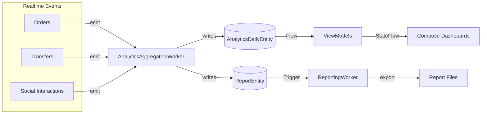

# Analytics Dashboard Guide

## Overview
ROSTRY delivers role-specific analytics views to empower different user segments (general buyers, farmers, enthusiasts). Dashboards aggregate telemetry from orders, transfers, social engagement, and farm operations stored in Room tables (`AnalyticsDailyEntity`, `ReportEntity`, etc.) and synthesized by background workers.

## Key Components
- **UI Screens** (`ui/analytics/`)
  - `GeneralDashboardScreen.kt`: Summaries for mixed-role users (orders, spend, engagement suggestions).
  - `FarmerDashboardScreen.kt`: Farm-centric metrics (production output, transfer health, compliance alerts).
  - `EnthusiastDashboardScreen.kt`: Hobbyist engagement with community, marketplace watchlist.
  - `ReportsScreen.kt`: Detailed breakdown with filters and export actions.
- **ViewModels** (`GeneralDashboardViewModel.kt`, `FarmerDashboardViewModel.kt`, `EnthusiastDashboardViewModel.kt`, `ReportsViewModel.kt`)
  - Inject analytics repositories, expose `StateFlow` dashboards, orchestrate loading/error states.
- **Repository Layer** (`data/repository/analytics/`)
  - Responsible for merging Room analytics tables with real-time Firestore metrics.
  - Provides domain models consumed by dashboards (totals, trendlines, suggestions, forecast data).
- **Room Entities**
  - `AnalyticsDailyEntity`: Persisted daily KPI snapshots (orders, revenue, conversion, adoption).
  - `ReportEntity`: Serialized report definitions and metadata for export history.
- **Background Workers**
  - `AnalyticsAggregationWorker`: Runs daily to compute aggregated metrics across orders, transfers, social actions.
  - `ReportingWorker`: Weekly job to generate PDF/JSON exports and store artifacts for `ReportsScreen`.

## Data Flow
1. Real-time events captured via repositories (order placements, transfer completions, social interactions) update transactional tables.
2. `AnalyticsAggregationWorker` aggregates metrics into `AnalyticsDailyEntity` and triggers repository caches.
3. ViewModels subscribe to `Flow` streams combining analytics tables with latest remote signals (e.g., Firestore triggers) for prompt UI updates.
4. `ReportsScreen` queries `ReportEntity` for historical exports and triggers `ReportingWorker` for new snapshots.

### Diagram

## Extension Points
- Plug additional data sources (farm monitoring, AI recommendations) by extending analytics repository mappers.
- Integrate chart components (e.g., MPAndroidChart) in dedicated Compose wrappers for richer visualization.
- Add drill-down navigation to specific entities (orders, transfers) by augmenting `Routes` definitions.
- Provide multi-format exports (CSV, PDF) by extending `reportFormat` metadata and `ReportingWorker` outputs.

## Testing
- Use `AnalyticsRepository` fake implementations to unit test ViewModels with deterministic flows.
- Validate aggregation logic with integration tests using in-memory Room and seeded sample events.
- Ensure workers respect WorkManager constraints via Robolectric or instrumentation tests.
