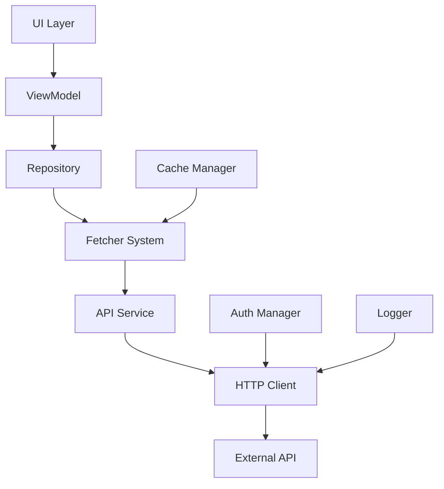

# API Integration Guide

## Overview

This guide provides comprehensive instructions for integrating with external APIs and internal services in the ROSTRY application. It covers setup, configuration, authentication, error handling, and best practices for API communication.

## Table of Contents

- [API Architecture](#api-architecture)
- [Setup and Configuration](#setup-and-configuration)
- [Authentication](#authentication)
- [Making API Calls](#making-api-calls)
- [Error Handling](#error-handling)
- [Caching Strategy](#caching-strategy)
- [Rate Limiting](#rate-limiting)
- [Security Considerations](#security-considerations)
- [Testing API Integrations](#testing-api-integrations)
- [Monitoring and Logging](#monitoring-and-logging)
- [Troubleshooting](#troubleshooting)

## API Architecture

### Core Components

The ROSTRY API integration system consists of several key components:

1. **HttpClient**: Configured with interceptors, timeouts, and retry policies
2. **Retrofit**: Type-safe HTTP client for REST APIs
3. **Converter**: JSON serialization/deserialization with Gson
4. **Interceptor**: Authentication, logging, and request modification
5. **Repository Layer**: Abstracts API calls and handles data transformation
6. **Fetcher System**: Centralized data fetching with caching and deduplication

### Architecture Diagram



## Setup and Configuration

### HTTP Client Configuration

The HTTP client is configured in `HttpModule.kt`:

```kotlin
@Module
@InstallIn(SingletonComponent::class)
object HttpModule {
    
    @Provides
    @Singleton
    fun provideOkHttpClient(
        authInterceptor: AuthInterceptor,
        loggingInterceptor: HttpLoggingInterceptor
    ): OkHttpClient {
        return OkHttpClient.Builder()
            .connectTimeout(30, TimeUnit.SECONDS)
            .readTimeout(30, TimeUnit.SECONDS)
            .writeTimeout(30, TimeUnit.SECONDS)
            .addInterceptor(authInterceptor)
            .addInterceptor(loggingInterceptor)
            .addInterceptor(RateLimitInterceptor())
            .cache(createCache())
            .build()
    }
    
    private fun createCache(): Cache {
        val cacheSize = 10 * 1024 * 1024L // 10 MB
        return Cache(File(context.cacheDir, "http_cache"), cacheSize)
    }
}
```

### Retrofit Configuration

Retrofit is configured with Gson converter and base URL:

```kotlin
@Module
@InstallIn(SingletonComponent::class)
object NetworkModule {
    
    @Provides
    @Singleton
    fun provideRetrofit(
        okHttpClient: OkHttpClient,
        gsonConverterFactory: GsonConverterFactory
    ): Retrofit {
        return Retrofit.Builder()
            .baseUrl("https://api.rostry.com/")
            .client(okHttpClient)
            .addConverterFactory(gsonConverterFactory)
            .build()
    }
    
    @Provides
    @Singleton
    fun provideGson(): Gson {
        return GsonBuilder()
            .setFieldNamingPolicy(FieldNamingPolicy.LOWER_CASE_WITH_UNDERSCORES)
            .registerTypeAdapter(DateTime::class.java, DateTimeAdapter())
            .create()
    }
    
    @Provides
    @Singleton
    fun provideGsonConverterFactory(gson: Gson): GsonConverterFactory {
        return GsonConverterFactory.create(gson)
    }
}
```

## Authentication

### API Key Authentication

For services requiring API key authentication:

```kotlin
class ApiKeyInterceptor(private val apiKeyProvider: ApiKeyProvider) : Interceptor {
    override fun intercept(chain: Interceptor.Chain): Response {
        val originalRequest = chain.request()
        val newUrl = originalRequest.url.newBuilder()
            .addQueryParameter("apiKey", apiKeyProvider.getApiKey())
            .build()
        
        val newRequest = originalRequest.newBuilder()
            .url(newUrl)
            .build()
        
        return chain.proceed(newRequest)
    }
}
```

### OAuth/Bearer Token Authentication

For services requiring OAuth tokens:

```kotlin
class AuthInterceptor @Inject constructor(
    private val tokenManager: TokenManager
) : Interceptor {
    
    override fun intercept(chain: Interceptor.Chain): Response {
        val originalRequest = chain.request()
        
        val token = tokenManager.getAccessToken()
        if (token != null) {
            val newRequest = originalRequest.newBuilder()
                .header("Authorization", "Bearer $token")
                .build()
            
            return chain.proceed(newRequest)
        }
        
        return chain.proceed(originalRequest)
    }
}
```

### Firebase Authentication Integration

For Firebase-based authentication:

```kotlin
class FirebaseAuthInterceptor @Inject constructor(
    private val firebaseAuth: FirebaseAuth
) : Interceptor {
    
    override fun intercept(chain: Interceptor.Chain): Response {
        val currentUser = firebaseAuth.currentUser
        if (currentUser != null) {
            // Get ID token for the request
            val tokenTask = currentUser.getIdToken(false)
            Tasks.await(tokenTask)
            
            val idToken = tokenTask.result?.token
            if (idToken != null) {
                val newRequest = chain.request().newBuilder()
                    .header("Authorization", "Bearer $idToken")
                    .build()
                
                return chain.proceed(newRequest)
            }
        }
        
        return chain.proceed(chain.request())
    }
}
```

## Making API Calls

### Defining API Service Interfaces

Create interfaces for your API endpoints:

```kotlin
interface WeatherApiService {
    @GET("weather/current")
    suspend fun getCurrentWeather(
        @Query("location") location: String,
        @Query("units") units: String = "metric"
    ): ApiResponse<WeatherData>
    
    @GET("weather/forecast")
    suspend fun getForecast(
        @Query("location") location: String,
        @Query("days") days: Int = 7
    ): ApiResponse<ForecastData>
}

interface PaymentApiService {
    @POST("payments/process")
    suspend fun processPayment(
        @Body paymentRequest: PaymentRequest
    ): ApiResponse<PaymentResponse>
    
    @GET("payments/{paymentId}/status")
    suspend fun getPaymentStatus(
        @Path("paymentId") paymentId: String
    ): ApiResponse<PaymentStatus>
}
```

### Repository Implementation

Implement repository patterns that use the API services:

```kotlin
@Singleton
class WeatherRepositoryImpl @Inject constructor(
    private val weatherApiService: WeatherApiService,
    private val cacheManager: CacheManager
) : WeatherRepository {
    
    override suspend fun getCurrentWeather(location: String): Resource<WeatherData> {
        return safeApiCall {
            // Check cache first
            val cached = cacheManager.get<WeatherData>("weather_$location")
            if (cached != null) {
                return@safeApiCall cached
            }
            
            // Fetch from API
            val response = weatherApiService.getCurrentWeather(location)
            
            // Cache for 15 minutes
            cacheManager.put("weather_$location", response, CachePolicy(ttl = 15.minutes))
            
            response
        }
    }
    
    override suspend fun getForecast(location: String, days: Int): Resource<ForecastData> {
        return safeApiCall {
            weatherApiService.getForecast(location, days)
        }
    }
}
```

### Using Fetcher System for API Integration

Integrate with the fetcher system for centralized data fetching:

```kotlin
@Singleton
class WeatherRepositoryImpl @Inject constructor(
    private val fetcherCoordinator: FetcherCoordinator,
    private val weatherApiService: WeatherApiService
) : WeatherRepository {
    
    override suspend fun getCurrentWeather(location: String): Resource<WeatherData> {
        val request = ClientRequest(
            key = "weather_$location",
            fetcher = { weatherApiService.getCurrentWeather(location) },
            cachePolicy = CachePolicy(
                strategy = CacheStrategy.CACHE_FIRST,
                ttl = 15.minutes
            )
        )
        
        return fetcherCoordinator.fetch(request)
    }
}
```

## Error Handling

### API Response Wrapper

Use a sealed class to handle different response states:

```kotlin
sealed class ApiResponse<out T> {
    data class Success<T>(val data: T) : ApiResponse<T>()
    data class Error(val code: Int, val message: String) : ApiResponse<Nothing>()
    object Loading : ApiResponse<Nothing>()
}

// Alternative using Resource pattern
sealed class Resource<out T> {
    data class Success<T>(val data: T) : Resource<T>()
    data class Error(val message: String, val exception: Exception? = null) : Resource<Nothing>()
    object Loading : Resource<Nothing>()
}
```

### Safe API Call Wrapper

Create a safe wrapper for API calls with error handling:

```kotlin
suspend fun <T> safeApiCall(apiCall: suspend () -> T): Resource<T> {
    return try {
        Resource.Success(apiCall())
    } catch (e: HttpException) {
        Resource.Error(
            message = "HTTP Error: ${e.code()} - ${e.message()}",
            exception = e
        )
    } catch (e: IOException) {
        Resource.Error(
            message = "Network Error: ${e.message}",
            exception = e
        )
    } catch (e: JsonEncodingException) {
        Resource.Error(
            message = "JSON Parsing Error: ${e.message}",
            exception = e
        )
    } catch (e: Exception) {
        Resource.Error(
            message = "Unexpected Error: ${e.message}",
            exception = e
        )
    }
}
```

### Error Interceptor

Implement an error interceptor for handling specific HTTP errors:

```kotlin
class ErrorInterceptor : Interceptor {
    override fun intercept(chain: Interceptor.Chain): Response {
        val response = chain.proceed(chain.request())
        
        when (response.code) {
            401 -> {
                // Unauthorized - token may be expired
                // Trigger token refresh or redirect to login
                handleUnauthorized(response)
            }
            403 -> {
                // Forbidden - insufficient permissions
                handleForbidden(response)
            }
            429 -> {
                // Too many requests - implement rate limiting
                handleRateLimit(response)
            }
            500, 502, 503, 504 -> {
                // Server errors - implement retry logic
                handleServerError(response)
            }
        }
        
        return response
    }
    
    private fun handleUnauthorized(response: Response) {
        // Handle unauthorized access
        // Could trigger token refresh or logout
    }
    
    private fun handleForbidden(response: Response) {
        // Handle forbidden access
    }
    
    private fun handleRateLimit(response: Response) {
        // Handle rate limiting
        // Could implement exponential backoff
    }
    
    private fun handleServerError(response: Response) {
        // Handle server errors
        // Could implement retry with backoff
    }
}
```

## Caching Strategy

### HTTP Caching

Enable HTTP caching in the OkHttp client:

```kotlin
private fun createCache(): Cache {
    val cacheSize = 10 * 1024 * 1024L // 10 MB
    return Cache(File(context.cacheDir, "http_cache"), cacheSize)
}

// Add cache interceptor
.addInterceptor(HttpCacheInterceptor())
```

### Custom Caching with CacheManager

Use the application's CacheManager for custom caching:

```kotlin
@Singleton
class ProductRepositoryImpl @Inject constructor(
    private val productService: ProductService,
    private val cacheManager: CacheManager
) : ProductRepository {
    
    override suspend fun getProducts(): Resource<List<Product>> {
        return safeApiCall {
            // Try cache first
            val cached = cacheManager.get<List<Product>>("products")
            if (cached != null) {
                return@safeApiCall cached
            }
            
            // Fetch from API
            val products = productService.getProducts()
            
            // Cache the result
            cacheManager.put("products", products, CachePolicy(ttl = 5.minutes))
            
            products
        }
    }
}
```

### Cache Policy Configuration

Define different cache policies for different use cases:

```kotlin
data class CachePolicy(
    val strategy: CacheStrategy,
    val ttl: Duration,
    val maxSize: Int = DEFAULT_MAX_SIZE,
    val evictionPolicy: EvictionPolicy = EvictionPolicy.LRU
)

enum class CacheStrategy {
    CACHE_FIRST,      // Return cached data, fetch fresh in background
    NETWORK_FIRST,    // Always fetch from network, cache result
    STALE_WHILE_REVALIDATE,  // Return stale cache while fetching fresh
    CACHE_ONLY,       // Only return cached data
    NETWORK_ONLY      // Skip cache, always fetch from network
}
```

## Rate Limiting

### Rate Limit Interceptor

Implement rate limiting to prevent API abuse:

```kotlin
class RateLimitInterceptor : Interceptor {
    private val requestCounts = mutableMapOf<String, MutableList<Long>>()
    private val lock = Mutex()
    
    override fun intercept(chain: Interceptor.Chain): Response {
        val request = chain.request()
        val host = request.url.host
        
        // Check rate limit for this host
        if (isRateLimited(host)) {
            throw IOException("Rate limit exceeded for $host")
        }
        
        // Record request
        recordRequest(host)
        
        return chain.proceed(request)
    }
    
    private fun isRateLimited(host: String): Boolean {
        val currentTime = System.currentTimeMillis()
        val windowStart = currentTime - TIME_WINDOW_MS
        
        val requests = requestCounts[host] ?: emptyList()
        val validRequests = requests.filter { it > windowStart }
        
        return validRequests.size >= MAX_REQUESTS_PER_WINDOW
    }
    
    private fun recordRequest(host: String) {
        val currentTime = System.currentTimeMillis()
        val requests = requestCounts.getOrPut(host) { mutableListOf() }
        
        // Clean up old requests
        requests.removeAll { it < System.currentTimeMillis() - TIME_WINDOW_MS }
        
        // Add current request
        requests.add(currentTime)
    }
    
    companion object {
        private const val MAX_REQUESTS_PER_WINDOW = 10
        private const val TIME_WINDOW_MS = 60_000L // 1 minute
    }
}
```

### API-Specific Rate Limiting

Some APIs have specific rate limits that should be respected:

```kotlin
class WeatherApiRateLimiter {
    private val lastRequestTime = mutableMapOf<String, Long>()
    private val lock = Mutex()
    
    suspend fun canMakeRequest(apiKey: String): Boolean {
        lock.withLock {
            val lastTime = lastRequestTime[apiKey] ?: 0L
            val currentTime = System.currentTimeMillis()
            
            // Weather API allows 1 request per second per key
            return currentTime - lastTime >= 1000L
        }
    }
    
    suspend fun recordRequest(apiKey: String) {
        lock.withLock {
            lastRequestTime[apiKey] = System.currentTimeMillis()
        }
    }
}
```

## Security Considerations

### Certificate Pinning

For production environments, implement certificate pinning:

```kotlin
val certificatePinner = CertificatePinner.Builder()
    .add("api.rostry.com", "sha256/AAAAAAAAAAAAAAAAAAAAAAAAAAAAAAAAAAAAAAAAAAA=")
    .add("api.rostry.com", "sha256/BBBBBBBBBBBBBBBBBBBBBBBBBBBBBBBBBBBBBBBBBBB=")
    .build()

okHttpClientBuilder.certificatePinner(certificatePinner)
```

### API Key Security

Never hardcode API keys in the source code:

```kotlin
// Use BuildConfig or secure storage
class ApiKeyProvider {
    fun getApiKey(): String {
        return BuildConfig.API_KEY.takeIf { it.isNotEmpty() }
            ?: loadFromSecureStorage()
    }
    
    private fun loadFromSecureStorage(): String {
        // Load from encrypted shared preferences or keystore
        TODO("Implement secure storage loading")
    }
}
```

### Data Encryption

Encrypt sensitive data in transit and at rest:

```kotlin
// For sensitive API calls, use additional encryption
class EncryptedApiService {
    suspend fun sendSensitiveData(data: String): ApiResponse<String> {
        val encryptedData = encrypt(data)
        return apiService.sendEncryptedData(encryptedData)
    }
    
    private fun encrypt(data: String): String {
        // Implement encryption using AES or similar
        TODO("Implement encryption")
    }
}
```

## Testing API Integrations

### Mock Web Server

Use MockWebServer for testing API integrations:

```kotlin
class ApiServiceTest {
    @get:Rule
    val mockWebServer = MockWebServer()
    
    private lateinit var apiService: ApiService
    
    @Before
    fun setUp() {
        val retrofit = Retrofit.Builder()
            .baseUrl(mockWebServer.url("/"))
            .addConverterFactory(GsonConverterFactory.create())
            .build()
        
        apiService = retrofit.create(ApiService::class.java)
    }
    
    @Test
    fun `getWeather returns success response`() = runTest {
        // Given
        val weatherJson = """
            {
                "temperature": 25,
                "humidity": 60,
                "location": "Bangalore"
            }
        """.trimIndent()
        
        mockWebServer.enqueue(MockResponse()
            .setBody(weatherJson)
            .addHeader("Content-Type", "application/json"))
        
        // When
        val response = apiService.getCurrentWeather("Bangalore")
        
        // Then
        assertTrue(response is ApiResponse.Success)
        assertEquals(25, (response as ApiResponse.Success).data.temperature)
    }
}
```

### Integration Testing

Test the full integration with repositories:

```kotlin
@HiltAndroidTest
class WeatherRepositoryTest {
    @get:Rule
    val hiltRule = HiltAndroidRule(this)
    
    @Inject
    lateinit var weatherRepository: WeatherRepository
    
    @Inject
    lateinit var cacheManager: CacheManager
    
    @Test
    fun `getCurrentWeather fetches from API and caches result`() = runTest {
        // Given
        val location = "Bangalore"
        
        // When
        val result = weatherRepository.getCurrentWeather(location)
        
        // Then
        assertTrue(result is Resource.Success)
        
        // Verify cache was updated
        val cached = cacheManager.get<WeatherData>("weather_$location")
        assertNotNull(cached)
    }
}
```

## Monitoring and Logging

### API Call Logging

Log API calls for debugging and monitoring:

```kotlin
class LoggingInterceptor : Interceptor {
    override fun intercept(chain: Interceptor.Chain): Response {
        val request = chain.request()
        val startTime = System.currentTimeMillis()
        
        Timber.d("API Call: ${request.method} ${request.url}")
        
        val response = chain.proceed(request)
        val duration = System.currentTimeMillis() - startTime
        
        Timber.d("API Response: ${response.code} (${duration}ms)")
        
        if (!response.isSuccessful) {
            Timber.w("API Error: ${response.code} - ${request.url}")
        }
        
        return response
    }
}
```

### Performance Monitoring

Track API performance metrics:

```kotlin
class ApiPerformanceTracker {
    private val apiMetrics = mutableMapOf<String, MutableList<Long>>()
    
    fun recordApiCall(endpoint: String, durationMs: Long) {
        val durations = apiMetrics.getOrPut(endpoint) { mutableListOf() }
        durations.add(durationMs)
        
        // Log slow API calls
        if (durationMs > SLOW_CALL_THRESHOLD) {
            Timber.w("Slow API call: $endpoint took ${durationMs}ms")
        }
    }
    
    fun getAverageResponseTime(endpoint: String): Double? {
        return apiMetrics[endpoint]?.average()
    }
    
    companion object {
        private const val SLOW_CALL_THRESHOLD = 2000L // 2 seconds
    }
}
```

## Troubleshooting

### Common Issues

#### 1. SSL Certificate Errors
- **Issue**: `javax.net.ssl.SSLHandshakeException`
- **Solution**: Check certificate pinning configuration or update certificates

#### 2. Timeout Errors
- **Issue**: `java.net.SocketTimeoutException`
- **Solution**: Increase timeout values or check network connectivity

#### 3. 401 Unauthorized
- **Issue**: API returns 401 status
- **Solution**: Check authentication token validity and refresh if needed

#### 4. 429 Rate Limited
- **Issue**: API returns 429 status
- **Solution**: Implement proper rate limiting or increase limits with provider

#### 5. JSON Parsing Errors
- **Issue**: `com.google.gson.JsonSyntaxException`
- **Solution**: Check API response format and update data models accordingly

### Debugging Tips

1. **Enable Logging**: Add logging interceptors to see request/response details
2. **Use Network Profiler**: Android Studio's network profiler to inspect traffic
3. **Mock Services**: Use MockWebServer to isolate API issues
4. **Check Headers**: Verify all required headers are being sent
5. **Validate URLs**: Ensure base URLs and endpoints are correct
6. **Test Connectivity**: Verify network connectivity and permissions

### Performance Optimization

1. **Batch Requests**: Combine multiple requests when possible
2. **Use Caching**: Implement appropriate caching strategies
3. **Compress Data**: Enable gzip compression for large payloads
4. **Connection Pooling**: Reuse HTTP connections
5. **Background Processing**: Perform API calls on background threads
6. **Pagination**: Use pagination for large datasets

---

## Conclusion

This guide provides a comprehensive approach to API integration in the ROSTRY application. Following these patterns and best practices will ensure reliable, secure, and performant API communication throughout the application.

For specific API documentation, refer to the individual service documentation and the repository contracts outlined in `api-documentation.md`.