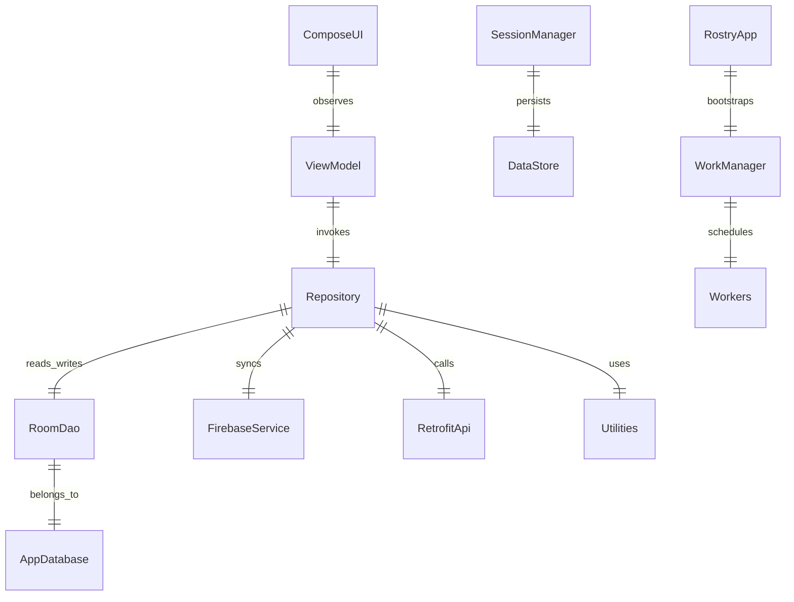
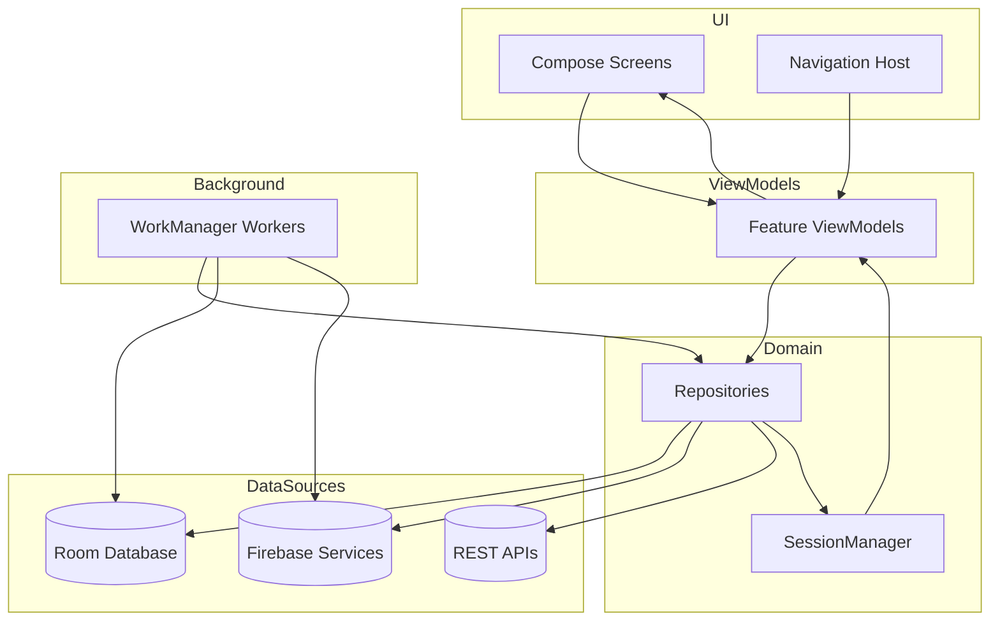
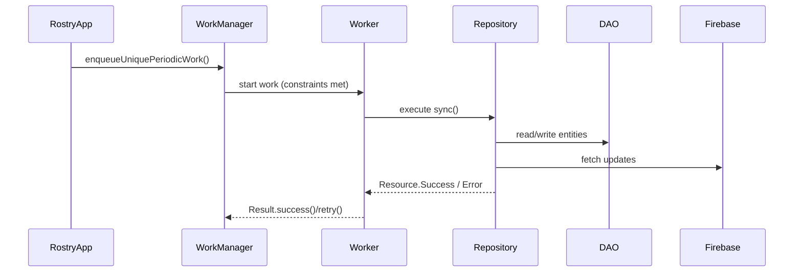

# ROSTRY Architecture Overview

## 1. Solution Snapshot
- **Platform**: Android, Kotlin, Jetpack Compose UI.
- **Primary Pattern**: MVVM with distinct UI, ViewModel, Repository, and Data layers.
- **State Management**: `StateFlow`/`SharedFlow`, SavedStateHandle, and DataStore-backed session state.
- **Dependency Injection**: Hilt modules in `app/src/main/java/com/rio/rostry/di/` bind interfaces to implementations, provide singletons, and integrate WorkManager.
- **Persistence**: Room database defined in `data/database/AppDatabase.kt` (SQLCipher encrypted) plus Firebase services for cloud data.

## 2. Layered Architecture
```
┌───────────────┐
│   Compose UI  │  `ui/...`
└───────────────┘
         │
         ▼
┌───────────────┐
│   ViewModels  │  `ui/<feature>/*ViewModel.kt`
└───────────────┘
         │
         ▼
┌───────────────┐
│ Repositories  │  `data/repository/`
└───────────────┘
         │
         ▼
┌───────────────┐
│ Data Sources  │  Room (DAOs), Firebase, Retrofit APIs, utilities
└───────────────┘
```

### UI Layer (`ui/`)
- Composables in feature packages (e.g., `ui/analytics/`, `ui/social/`, `ui/traceability/`).
- `MainActivity.kt` hosts `AppNavHost()` within `ROSTRYTheme`.
- Navigation centralized in `ui/navigation/Routes.kt` and `AppNavHost.kt` with deep-link support and role-aware routing.

### ViewModel Layer (`ui/...ViewModel.kt`)
- Extend `BaseViewModel` or `ViewModel` with Hilt injection.
- Expose `StateFlow` or `PagingData` streams and navigation events (e.g., `ui/auth/AuthViewModel.kt`).
- Coordinate with repositories and SavedStateHandle for persistence across process death.

### Repository Layer (`data/repository/`)
- Encapsulate business logic, data orchestration, validation, and synchronization.
- Example: `TransferWorkflowRepositoryImpl` manages initiation, verification, disputes, audits, and notifications for transfers.
- Social, analytics, logistics, payments, and marketplace domains each have dedicated repositories.

### Data Layer
- **Room**: Entities and DAOs in `data/database/entity/` and `data/database/dao/`. `AppDatabase` registers over 60 tables plus converters and migrations.
- **Network**: Retrofit clients, Firebase Auth/Firestore/Storage/Functions/Realtime Database.
- **Utilities**: Validation, analytics, notifications, compression, encryption wrappers (`utils/`).

## 3. Navigation & Session Flow
- `StartViewModel` evaluates session validity via `SessionManager` (`session/SessionManager.kt`) and routes to auth or home destinations based on `UserType`.
- Authentication is phone-OTP driven using Firebase; successful bootstrap caches profile and records session metadata.
- Role-based homes (`HomeGeneralScreen`, `HomeFarmerScreen`, `HomeEnthusiastScreen`) drive feature-specific navigation.

## 4. Background Jobs & Synchronization
- `RostryApp.kt` schedules workers on startup:
  - **Sync** (`SyncWorker`) every 6 hours for Room/Firebase harmonization.
  - **Lifecycle** (`LifecycleWorker`) for milestone reminders.
  - **Transfer Timeout** (`TransferTimeoutWorker`) for SLA enforcement.
  - **Moderation** (`ModerationWorker`) for content scanning.
  - **Outgoing Messaging** (`OutgoingMessageWorker`) to flush queued DMs.
  - **Analytics Aggregation** & **Reporting** workers for dashboards.
  - **Prefetch** (`PrefetchWorker`) for content caching under safe conditions.
- Workers leverage Hilt WorkManager integration and operate with network/battery constraints and custom WorkRequest cadence defined in each worker file.

## 5. External Integrations
- **Firebase**: Auth, Firestore, Storage, Functions, Realtime Database, Cloud Messaging, Crashlytics, Performance Monitoring.
- **Retrofit**: HTTP APIs for marketplace/analytics endpoints (configured in `di/HttpModule.kt`).
- **Coil & ExoPlayer**: Media loading/streaming.
- **WorkManager, Paging, DataStore**: Jetpack libraries for offline-first patterns.
- **SQLCipher & Security Crypto**: Encrypted Room database support.

## 6. Key Cross-Cutting Concerns
- **Analytics**: Aggregation pipeline storing daily metrics in Room (`AnalyticsDailyEntity`) with dashboards under `ui/analytics/`.
- **Traceability**: Graph-based lineage using `FamilyTreeEntity`, `TransferEntity`, and visualization in `FamilyTreeView`.
- **Compliance & Trust**: Verification utilities, audit logs, disputes, and trust scoring in transfer workflows.
- **Notifications**: Abstractions `TransferNotifier` and `SocialNotifier` produce system-level alerts; actual delivery integrates with Firebase Messaging.

## 7. Mermaid System Context Diagram


## 8. Detailed Diagrams

### 8.1 System Context


### 8.2 Subsystem Interaction


### 8.3 Background Scheduling Lifecycle


### 8.4 Exporting Diagrams
For environments without native Mermaid support, render diagrams to images using:
- **Mermaid CLI**: `npx @mermaid-js/mermaid-cli -i docs/architecture.md -o docs/images/`
- **VS Code Extension**: "Markdown Preview Mermaid Support" → right-click → *Export Diagram*.
Store exports under `docs/images/` and reference them via Markdown ``.

## 9. Future Considerations
- Split monolithic `AppDatabase.kt` into feature-specific modules if size impacts maintainability.
- Consider documenting each migration in dedicated ADRs to track schema evolution.
- Evaluate per-feature module separation (Gradle feature modules) for build performance and encapsulation.
