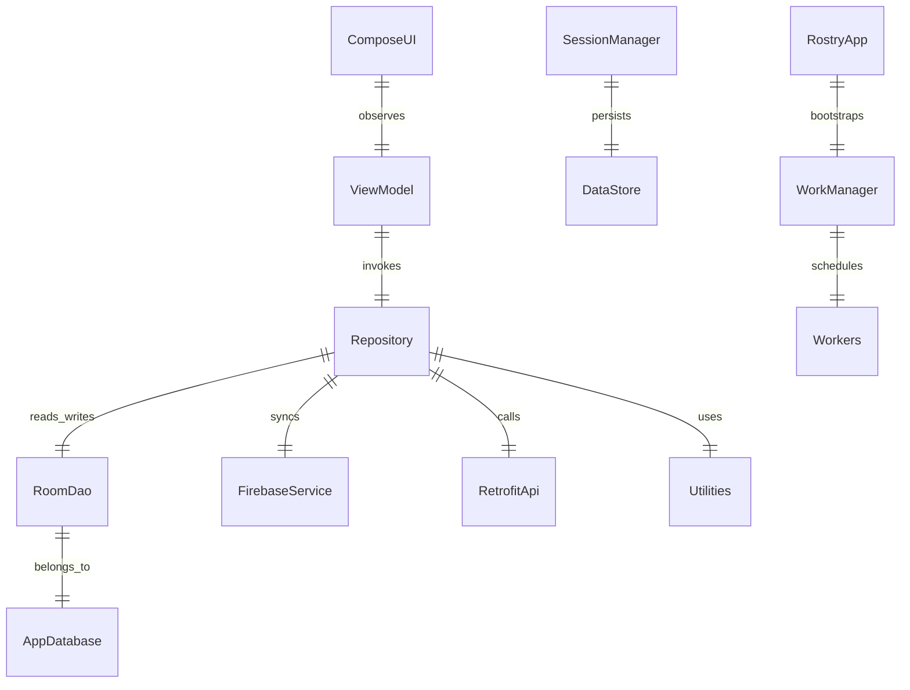
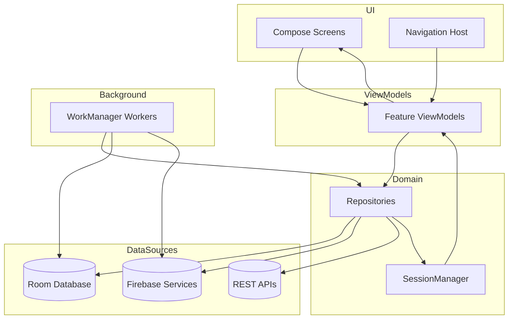
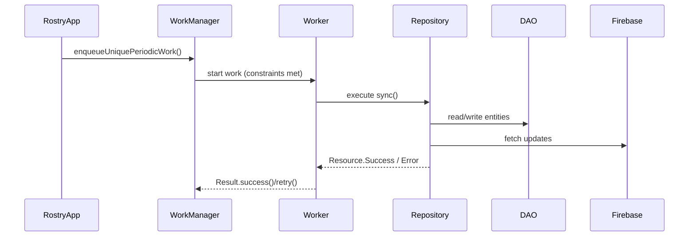
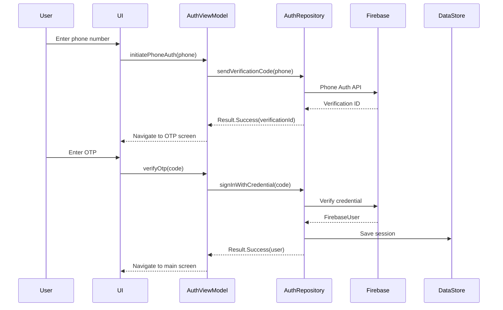
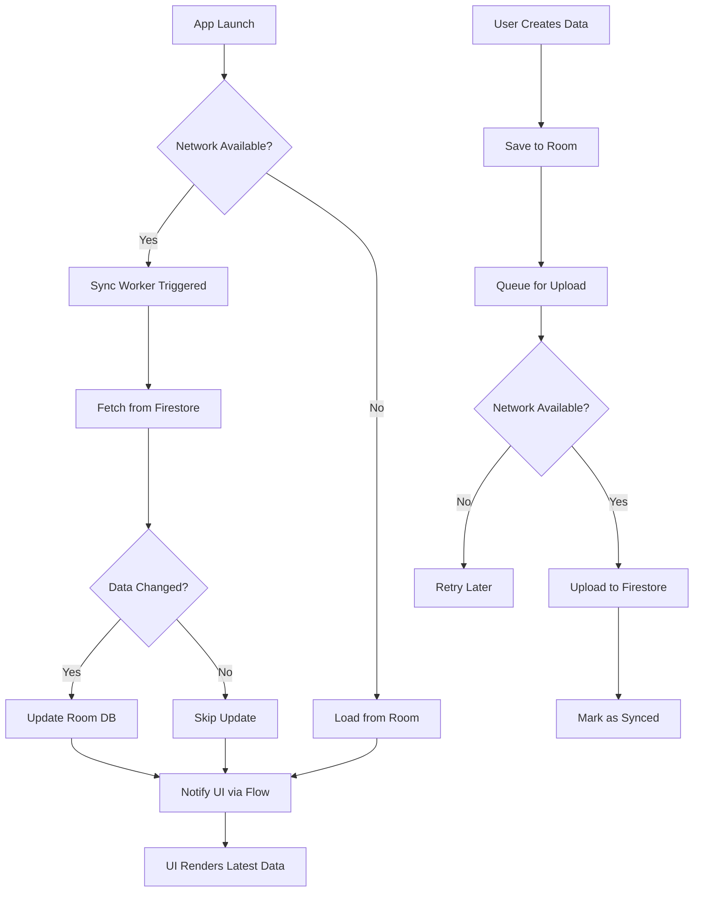
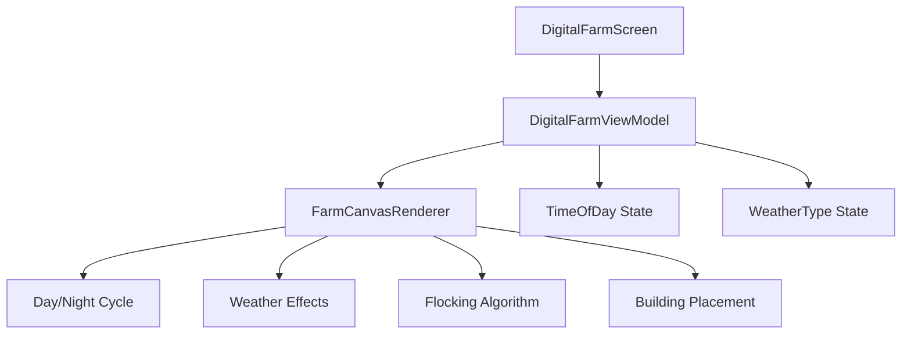
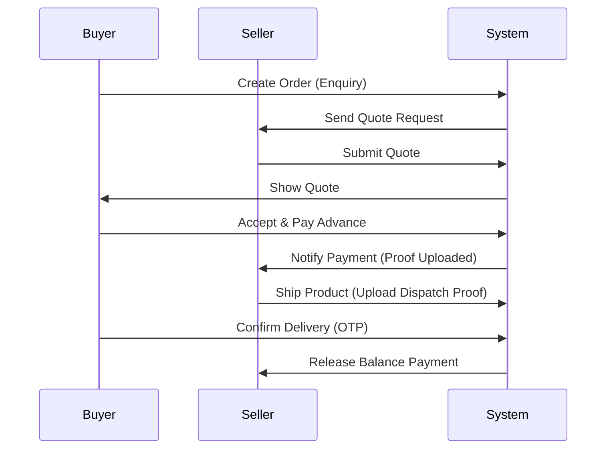
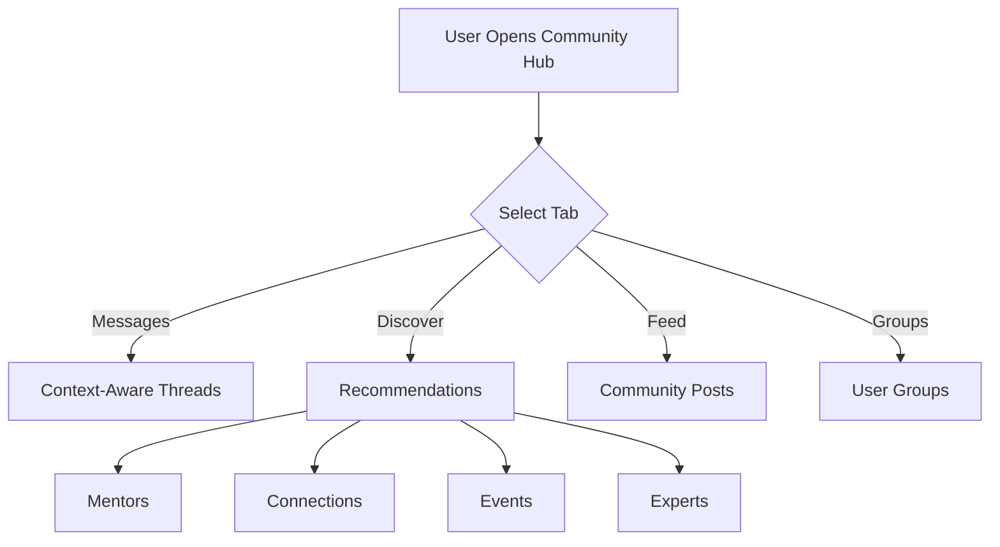

# ROSTRY Architecture Overview

**Version:** 3.0  
**Last Updated:** 2025-12-29  
**Audience:** All developers  
**Related Documentation:**
- [state-management.md](state-management.md) - StateFlow, hoisting, SavedStateHandle, DataStore
- [dependency-injection.md](dependency-injection.md) - Hilt modules, scopes, qualifiers, testing
- [error-handling.md](error-handling.md) - Result pattern, repository/UI mapping, logging, Crashlytics
- [testing-strategy.md](testing-strategy.md) - Testing architecture
- [security-encryption.md](security-encryption.md) - Security architecture
- [performance-optimization.md](performance-optimization.md) - Performance considerations
- [background-jobs.md](background-jobs.md) - Background processing
- [../ROADMAP.md](../ROADMAP.md) - Future architecture plans
- [adrs/adr-001-database-encryption.md](adrs/adr-001-database-encryption.md) - SQLCipher decision
- [adrs/adr-002-offline-first.md](adrs/adr-002-offline-first.md) - Offline-first strategy

---

> This document provides a high-level architecture overview. For implementation details, refer to the focused guides above.

## 1. Solution Snapshot

- **Platform**: Android, Kotlin, Jetpack Compose UI
- **Primary Pattern**: MVVM with distinct UI, ViewModel, Repository, and Data layers
- **State Management**: `StateFlow`/`SharedFlow`, `SavedStateHandle`, DataStore for preferences
- **Dependency Injection**: Hilt modules in `di/` package bind interfaces, provide singletons
- **Persistence**: Room database (SQLCipher encrypted) + Firebase cloud services
- **Architecture Style**: Clean Architecture with offline-first approach

## 2. Layered Architecture
```
┌───────────────┐
│   Compose UI  │  `ui/...`
└───────────────┘
         │
         ▼
┌───────────────┐
│   ViewModels  │  `ui/<feature>/*ViewModel.kt`
└───────────────┘
         │
         ▼
┌───────────────┐
│ Repositories  │  `data/repository/`
└───────────────┘
         │
         ▼
┌───────────────┐
│ Data Sources  │  Room (DAOs), Firebase, Retrofit APIs, utilities
└───────────────┘
```

### UI Layer (`ui/`)
- Composables in feature packages (e.g., `ui/analytics/`, `ui/social/`, `ui/traceability/`).
- `MainActivity.kt` hosts `AppNavHost()` within `ROSTRYTheme`.
- Navigation centralized in `ui/navigation/Routes.kt` and `AppNavHost.kt`. Feature composables use callback parameters (e.g., `onFarmerProfileClick`, `onMessage`) to delegate navigation to the host, ensuring decoupling and testability.

### ViewModel Layer (`ui/...ViewModel.kt`)
- Extend `BaseViewModel` or `ViewModel` with Hilt injection.
- Expose `StateFlow` or `PagingData` streams and navigation events (e.g., `ui/auth/AuthViewModel.kt`).
- Coordinate with repositories and SavedStateHandle for persistence across process death.

### Repository Layer (`data/repository/`)
- Encapsulate business logic, data orchestration, validation, and synchronization.
- Example: `TransferWorkflowRepositoryImpl` manages initiation, verification, disputes, audits, and notifications for transfers.
- Social, analytics, logistics, payments, and marketplace domains each have dedicated repositories.

### Data Layer
- **Room**: Entities and DAOs in `data/database/entity/` and `data/database/dao/`. `AppDatabase` registers over 120 tables.
- **Data Contexts**: Repositories distinguish between marketplace (public-only) and farm management (private+public) contexts via ViewModel filtering (e.g., `ProductEntity.isPublic`).
- **Network**: Retrofit clients, Firebase Auth/Firestore/Storage/Functions/Realtime Database.
- **Utilities**: Validation, analytics, notifications, compression, encryption wrappers (`utils/`).

## 3. Navigation & Session Flow
- `StartViewModel` evaluates session validity via `SessionManager` (`session/SessionManager.kt`) and routes to auth or home destinations based on `UserType`.
- Authentication is phone-OTP driven using Firebase; successful bootstrap caches profile and records session metadata.
- Role-based homes (`HomeGeneralScreen`, `HomeFarmerScreen`, `HomeEnthusiastScreen`) drive feature-specific navigation.
- **Callback-Based Navigation**: 
  - Screens expose lambda parameters for navigation events.
  - `AppNavHost` provides the concrete navigation implementation.
  - Enables easier testing and previewing of screens without MockNavController.

## 4. Background Jobs & Synchronization
- `RostryApp.kt` schedules 26+ workers on startup:
  - **Sync** (`SyncWorker`) every 6 hours for Room/Firebase harmonization.
  - **Lifecycle** (`LifecycleWorker`) for milestone reminders.
  - **Transfer Timeout** (`TransferTimeoutWorker`) for SLA enforcement.
  - **Moderation** (`ModerationWorker`) for content scanning.
  - **Outgoing Messaging** (`OutgoingMessageWorker`) to flush queued DMs.
  - **Analytics Aggregation** & **Reporting** workers for dashboards.
  - **Prefetch** (`PrefetchWorker`) for content caching under safe conditions.
  - **Community Engagement** (`CommunityEngagementWorker`) for personalized recommendations every 12 hours.
  - **Farm Monitoring** (`FarmMonitoringWorker`) for daily health checks and alerts.
  - **Vaccination Reminders** (`VaccinationReminderWorker`) for schedule notifications.
- Workers leverage Hilt WorkManager integration and operate with network/battery constraints and custom WorkRequest cadence defined in each worker file.

See `background-jobs.md` for detailed worker configuration and monitoring.

## 5. External Integrations
- **Firebase**: Auth, Firestore, Storage, Functions, Realtime Database, Cloud Messaging, Crashlytics, Performance Monitoring.
- **Retrofit**: HTTP APIs for marketplace/analytics endpoints (configured in `di/HttpModule.kt`).
- **Coil & ExoPlayer**: Media loading/streaming.
- **WorkManager, Paging, DataStore**: Jetpack libraries for offline-first patterns.
- **SQLCipher & Security Crypto**: Encrypted Room database support.

## 6. Key Cross-Cutting Concerns
- **Analytics**: Aggregation pipeline storing daily metrics in Room (`AnalyticsDailyEntity`) with dashboards under `ui/analytics/`. Includes AI-powered recommendations and export functionality.
- **Traceability**: Graph-based lineage using `FamilyTreeEntity`, `TransferEntity`, and visualization in `FamilyTreeView`.
- **Compliance & Trust**: Verification utilities, audit logs, disputes, and trust scoring in transfer workflows.
- **Notifications**: Abstractions `TransferNotifier` and `SocialNotifier` produce system-level alerts; actual delivery integrates with Firebase Messaging.
- **Community Engagement**: Context-aware messaging with `ThreadMetadata`, intelligent recommendations via `CommunityEngagementService`, and personalized content.
- **UX Enhancements**: Multi-step wizards, filter presets, tooltips, animations, and contextual help components for improved user experience.

## 7. Detailed Diagrams

### 7.1 System Context


### 7.2 Subsystem Interaction


### 7.3 Background Scheduling Lifecycle


### 7.4 Exporting Diagrams
For environments without native Mermaid support, render diagrams to images using:
- **Mermaid CLI**: `npx @mermaid-js/mermaid-cli -i docs/architecture.md -o docs/images/`
- **VS Code Extension**: "Markdown Preview Mermaid Support" → right-click → *Export Diagram*.
Store exports under `docs/images/` and reference them via Markdown ``.

### 7.5 Authentication Flow Diagram



**Legend**:
- **Solid arrows**: Synchronous calls
- **Dashed arrows**: Asynchronous responses
- **Participants**: Key components in auth flow

### 7.6 Data Sync Flow Diagram



**Legend**:
- **Rectangle**: Process/Action
- **Diamond**: Decision point
- **Rounded**: Start/End state

---

## 8. Feature Specific Architectures

### 8.1 Digital Farm Rendering Architecture
The Digital Farm utilizes a canvas-based rendering engine implemented in `FarmCanvasRenderer.kt`.



### 8.2 Evidence-Based Order Flow
The order system ensures trust through immutable evidence collection and state-locked agreements.



### 8.3 Community Engagement Flow
The community hub provides context-aware messaging and intelligent recommendations.



---

## 9. State Management

### StateFlow Pattern

**Why StateFlow**: Type-safe, lifecycle-aware, prevents crashes from race conditions

**Implementation**:
```kotlin
@HiltViewModel
class ProductListViewModel @Inject constructor(
    private val repository: ProductRepository
) : ViewModel() {
    
    // Private mutable state
    private val _uiState = MutableStateFlow(ProductListUiState())
    
    // Public immutable state
    val uiState: StateFlow<ProductListUiState> = _uiState.asStateFlow()
    
    init {
        loadProducts()
    }
    
    private fun loadProducts() {
        viewModelScope.launch {
            _uiState.update { it.copy(isLoading = true) }
            
            repository.getProducts()
                .catch { error ->
                    _uiState.update { 
                        it.copy(isLoading = false, error = error.message)
                    }
                }
                .collect { products ->
                    _uiState.update { 
                        it.copy(isLoading = false, products = products, error = null)
                    }
                }
        }
    }
}

data class ProductListUiState(
    val isLoading: Boolean = false,
    val products: List<Product> = emptyList(),
    val error: String? = null
)
```

### State Hoisting in Compose

**Pattern**: Lift state to common ancestor

```kotlin
@Composable
fun ProductListScreen(
    viewModel: ProductListViewModel = hiltViewModel()
) {
    val uiState by viewModel.uiState.collectAsStateWithLifecycle()
    
    ProductListContent(
        products = uiState.products,
        isLoading = uiState.isLoading,
        onProductClick = viewModel::onProductClick,
        onRefresh = viewModel::refresh
    )
}

@Composable
fun ProductListContent(
    products: List<Product>,
    isLoading: Boolean,
    onProductClick: (Product) -> Unit,
    onRefresh: () -> Unit
) {
    // Stateless composable - easier to test and reuse
}
```

### SavedStateHandle

**Process Death Survival**:
```kotlin
@HiltViewModel
class FilterViewModel @Inject constructor(
    private val savedStateHandle: SavedStateHandle,
    private val repository: ProductRepository
) : ViewModel() {
    
    // Survives process death
    var selectedCategory: String?
        get() = savedStateHandle.get<String>("category")
        set(value) { savedStateHandle["category"] = value }
    
    val filters = savedStateHandle.getStateFlow("filters", FilterState())
}
```

### DataStore for Preferences

**Files**: `data/preferences/UserPreferencesDataStore.kt`

```kotlin
class UserPreferencesDataStore @Inject constructor(
    @ApplicationContext private val context: Context
) {
    private val dataStore = context.dataStore
    
    val userPreferences: Flow<UserPreferences> = dataStore.data
        .catch { exception ->
            if (exception is IOException) {
                emit(emptyPreferences())
            } else {
                throw exception
            }
        }
        .map { preferences ->
            UserPreferences(
                theme = preferences[THEME_KEY] ?: "system",
                notificationsEnabled = preferences[NOTIFICATIONS_KEY] ?: true
            )
        }
    
    suspend fun updateTheme(theme: String) {
        dataStore.edit { preferences ->
            preferences[THEME_KEY] = theme
        }
    }
}
```

---

## 10. Dependency Injection (Hilt)

### Module Organization

**Files in `di/` package**:
- `AppModule.kt` - Application-level dependencies
- `NetworkModule.kt` - Retrofit, Firebase, OkHttp
- `DatabaseModule.kt` - Room database, DAOs
- `RepositoryModule.kt` - Repository bindings
- `WorkerModule.kt` - WorkManager dependencies

### Scopes

| Scope | Lifetime | Use Case |
|-------|----------|----------|
| `@Singleton` | App lifetime | Database, network clients, datastores |
| `@ViewModelScoped` | ViewModel lifetime | Use cases, interactors |
| `@ActivityRetainedScoped` | Activity (survives config changes) | Session managers |

### Module Example

```kotlin
@Module
@InstallIn(SingletonComponent::class)
object DatabaseModule {
    
    @Provides
    @Singleton
    fun provideDatabase(
        @ApplicationContext context: Context
    ): RostryDatabase {
        val passphrase = SQLiteDatabase.getBytes(
            // Load from secure storage
            context.getString(R.string.db_key).toCharArray()
        )
        
        return Room.databaseBuilder(
            context,
            RostryDatabase::class.java,
            "rostry.db"
        )
            .openHelperFactory(SupportFactory(passphrase))
            .addMigrations(*ALL_MIGRATIONS)
            .build()
    }
    
    @Provides
    fun provideProductDao(database: RostryDatabase): ProductDao {
        return database.productDao()
    }
}
```

### Qualifiers

**For multiple implementations**:
```kotlin
@Qualifier
@Retention(AnnotationRetention.BINARY)
annotation class LocalDataSource

@Qualifier
@Retention(AnnotationRetention.BINARY)
annotation class RemoteDataSource

@Module
@InstallIn(SingletonComponent::class)
abstract class DataSourceModule {
    
    @Binds
    @LocalDataSource
    abstract fun bindLocalDataSource(
        impl: RoomDataSource
    ): ProductDataSource
    
    @Binds
    @RemoteDataSource
    abstract fun bindRemoteDataSource(
        impl: FirestoreDataSource
    ): ProductDataSource
}
```

### Testing with Hilt

**Test Module**:
```kotlin
@Module
@TestInstallIn(
    components = [SingletonComponent::class],
    replaces = [RepositoryModule::class]
)
abstract class TestRepositoryModule {
    @Binds
    @Singleton
    abstract fun bindProductRepository(
        fake: FakeProductRepository
    ): ProductRepository
}
```

---

## 11. Error Handling

### Result Type Pattern

**File**: `util/Result.kt`

```kotlin
sealed class Result<out T> {
    data class Success<T>(val data: T) : Result<T>()
    data class Error(val message: String, val exception: Exception? = null) : Result<Nothing>()
    object Loading : Result<Nothing>()
}

// Extension functions
fun <T> Result<T>.onSuccess(action: (T) -> Unit): Result<T> {
    if (this is Result.Success) action(data)
    return this
}

fun <T> Result<T>.onError(action: (String) -> Unit): Result<T> {
    if (this is Result.Error) action(message)
    return this
}
```

### Repository Error Handling

```kotlin
override suspend fun createProduct(product: Product): Result<String> {
    return try {
        // Validate
        if (product.name.isBlank()) {
            return Result.Error("Product name is required")
        }
        
        // Save locally
        val entity = product.toEntity()
        productDao.insert(entity)
        
        // Upload to Firestore
        firestore.collection("products")
            .document(product.id)
            .set(product)
            .await()
        
        Result.Success(product.id)
        
    } catch (e: FirebaseNetworkException) {
        // Network error - data saved locally, will sync later
        Result.Success(product.id)
        
    } catch (e: Exception) {
        Timber.e(e, "Failed to create product")
        Result.Error(
            message = "Failed to create product: ${e.localizedMessage}",
            exception = e
        )
    }
}
```

### User-Facing Messages

**ViewModel**:
```kotlin
private fun handleError(error: String) {
    _uiState.update { 
        it.copy(
            isLoading = false,
            error = when {
                error.contains("network", ignoreCase = true) -> 
                    "No internet connection. Changes saved locally."
                error.contains("permission", ignoreCase = true) -> 
                    "You don't have permission to perform this action."
                else -> 
                    "Something went wrong. Please try again."
            }
        )
    }
}
```

### Logging

**Timber Configuration** (`RostryApp.kt`):
```kotlin
if (BuildConfig.DEBUG) {
    Timber.plant(Timber.DebugTree())
} else {
    Timber.plant(CrashlyticsTree())
}

class CrashlyticsTree : Timber.Tree() {
    override fun log(priority: Int, tag: String?, message: String, t: Throwable?) {
        if (priority >= Log.ERROR) {
            FirebaseCrashlytics.getInstance().apply {
                setCustomKey("priority", priority)
                tag?.let { setCustomKey("tag", it) }
                t?.let { recordException(it) }
                log(message)
            }
        }
    }
}
```

---

## 12. Security Architecture

### Authentication Flow

**Phone Authentication**:
1. User enters phone number
2. Firebase sends SMS with OTP
3. User enters OTP
4. Firebase verifies and issues JWT token
5. Token stored in DataStore (encrypted)
6. Token attached to all API requests

**Implementation**: `data/auth/AuthRepositoryImpl.kt`

### Role-Based Access Control (RBAC)

**Roles**:
- `GENERAL` - Basic app access
- `FARMER` - Farm management features
- `ENTHUSIAST` - Breeding and showing features
- `ADMIN` - Full access

**Check**: `util/RbacManager.kt`
```kotlin
fun hasPermission(user: User, permission: Permission): Boolean {
    return user.role.permissions.contains(permission)
}

// Usage in ViewModel
if (rbacManager.hasPermission(currentUser, Permission.CREATE_TRANSFER)) {
    // Allow action
} else {
    showError("You don't have permission")
}
```

### Data Encryption

**SQLCipher for Room**: See [ADR-001](adrs/adr-001-database-encryption.md)
- All local data encrypted at rest
- Passphrase derived from device keystore
- Re-encryption on passphrase change

**Sensitive Fields**:
```kotlin
@Entity
data class UserEntity(
    @PrimaryKey val id: String,
    val name: String,
    @Encrypted val phoneNumber: String, // Custom converter
    @Encrypted val address: String
)
```

### Secure Communication

**HTTPS Only**:
```kotlin
val okHttpClient = OkHttpClient.Builder()
    .certificatePinner(
        CertificatePinner.Builder()
            .add("api.rostry.com", "sha256/...")
            .build()
    )
    .build()
```

**Firebase Security Rules**: `firebase/firestore.rules`
```javascript
match /products/{productId} {
  allow read: if request.auth != null;
  allow create: if request.auth != null 
    && request.resource.data.sellerId == request.auth.uid;
  allow update, delete: if request.auth != null 
    && resource.data.sellerId == request.auth.uid;
}
```

**Complete Guide**: [security-encryption.md](security-encryption.md)

---

## 13. Performance Considerations

### Caching Strategy

**Multi-Level Cache**:
1. **Memory**: ViewModel StateFlow (in-memory)
2. **Disk**: Room database (persistent)
3. **Network**: Firebase Firestore (cloud)

**Cache Invalidation**:
```kotlin
suspend fun refreshProducts() {
    // Clear stale data
    productDao.deleteOlderThan(System.currentTimeMillis() - CACHE_DURATION)
    
    // Fetch fresh data
    val fresh = firestoreDataSource.getProducts()
    productDao.insertAll(fresh)
}
```

### Pagination

**Paging 3 Integration**:
```kotlin
@Dao
interface ProductDao {
    @Query("SELECT * FROM products ORDER BY created_at DESC")
    fun getProductsPaged(): PagingSource<Int, ProductEntity>
}

// ViewModel
val products: Flow<PagingData<Product>> = Pager(
    config = PagingConfig(pageSize = 20),
    pagingSourceFactory = { productDao.getProductsPaged() }
).flow
    .map { pagingData -> pagingData.map { it.toDomain() } }
    .cachedIn(viewModelScope)
```

### Lazy Loading

**Images with Coil**:
```kotlin
AsyncImage(
    model = ImageRequest.Builder(LocalContext.current)
        .data(product.imageUrl)
        .crossfade(true)
        .memoryCacheKey(product.id)
        .diskCacheKey(product.id)
        .build(),
    contentDescription = product.name
)
```

### Memory Management

**Large Lists**:
- Use `LazyColumn`/`LazyRow` instead of `Column`/`Row`
- Implement proper `key` in `items()` for recomposition optimization
- Release resources in `onDispose`

**Complete Guide**: [performance-optimization.md](performance-optimization.md)

---

## 14. Testing Architecture

### Testing Layers

**Unit Tests** (`test/`):
- ViewModels
- Repositories
- Utilities
- Use cases

**Integration Tests** (`androidTest/`):
- Database migrations
- Repository + DAO integration
- Navigation flows

**UI Tests** (`androidTest/`):
- Compose semantics tests
- User flows
- Accessibility tests

### Test Structure

```
app/src/
├── test/java/com/rio/rostry/
│   ├── ui/
│   │   └── ProductViewModelTest.kt
│   ├── data/repository/
│   │   └── ProductRepositoryTest.kt
│   └── util/
│       └── ValidationUtilsTest.kt
└── androidTest/java/com/rio/rostry/
    ├── ui/
    │   └── ProductListScreenTest.kt
    ├── data/
    │   └── MigrationTest.kt
    └── navigation/
        └── NavigationTest.kt
```

### Test Patterns

**ViewModel Test**:
```kotlin
@ExperimentalCoroutinesTest
class ProductViewModelTest {
    @get:Rule
    val instantExecutorRule = InstantTaskExecutorRule()
    
    private val testDispatcher = StandardTestDispatcher()
    private val repository = mockk<ProductRepository>()
    private lateinit var viewModel: ProductViewModel
    
    @Before
    fun setup() {
        Dispatchers.setMain(testDispatcher)
        viewModel = ProductViewModel(repository)
    }
    
    @Test
    fun `loadProducts success updates state`() = runTest {
        // Given
        val expected = listOf(Product("1", "Test"))
        coEvery { repository.getProducts() } returns flowOf(expected)
        
        // When
        viewModel.loadProducts()
        testDispatcher.scheduler.advanceUntilIdle()
        
        // Then
        assertEquals(expected, viewModel.uiState.value.products)
        assertFalse(viewModel.uiState.value.isLoading)
    }
}
```

**Complete Testing Guide**: [testing-strategy.md](testing-strategy.md)

---

## 14. Recent Major Updates

### Database Migration 15→16 (Community Features)
Added 4 new entities for community engagement:
- `ThreadMetadataEntity` - Context-aware messaging metadata
- `CommunityRecommendationEntity` - Personalized user recommendations
- `UserInterestEntity` - Interest-based personalization data
- `ExpertProfileEntity` - Expert information and availability

See `data-contracts.md` for schema details and `CHANGELOG.md` for migration history.

### UX Component Library
New reusable components in `ui/components/`:
- `FormValidationHelpers.kt` - Validation utilities with builder pattern
- `LoadingStates.kt` - Skeleton loaders, empty states, error states
- `OnboardingTooltips.kt` - First-time user guidance system
- `SuccessAnimations.kt` - Celebration dialogs with haptic feedback
- `HelpComponents.kt` - Contextual help with collapsible design

See `user-experience-guidelines.md` for usage patterns.

## 15. Future Considerations

### Multi-Module Architecture
- Split monolithic app into Gradle feature modules
- Benefits: Improved build times, better encapsulation, parallel builds
- Proposed structure:
  ```
  :app (shell)
  :feature:marketplace
  :feature:social
  :feature:monitoring
  :core:ui
  :core:data
  :core:network
  ```

### Database Optimization
- Split `AppDatabase.kt` into feature-specific databases
- Implement database sharding for large datasets
- Document each migration in dedicated ADRs

### Performance Improvements
- Implement Baseline Profiles for faster startup
- Add Macrobenchmark tests for performance regression detection
- Optimize Compose recomposition with stability annotations

### Architecture Evolution
- Evaluate MVI (Model-View-Intent) for complex flows
- Consider adopting Kotlin Multiplatform for shared logic
- Implement server-driven UI for dynamic features

**See**: [ROADMAP.md](../ROADMAP.md) for detailed future plans

---

**For questions or improvements to this architecture, please open an issue or submit a PR.**
