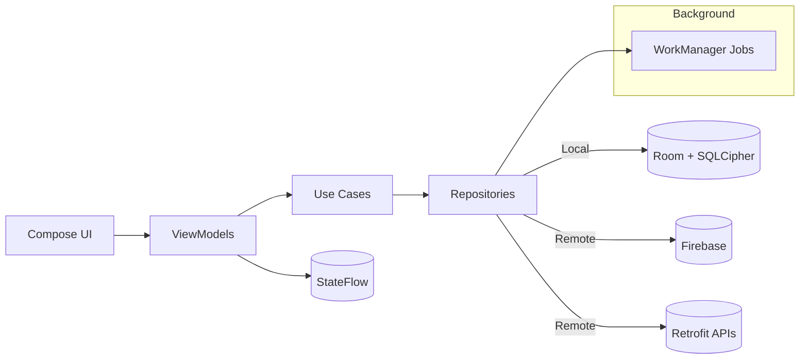
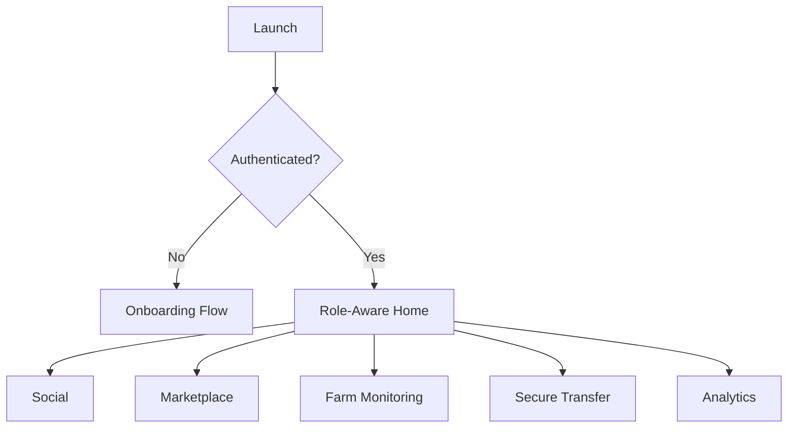

# ROSTRY Blueprint (All-in-One Overview)

Version: 1.0
Last Updated: 2025-10-10
Audience: Maintainers, Contributors, Stakeholders

---

## Quick Links
- Project homepage: `README.md`
- Docs index: `docs/README-docs.md`
- Architecture: `docs/architecture.md`
- Roadmap: `ROADMAP.md`
- ADRs: `docs/adrs/`
- Code style: `CODE_STYLE.md` and `docs/code-style-quick-reference.md`
- Testing: `docs/testing-strategy.md`
- Troubleshooting: `docs/troubleshooting.md`

---

## 1) Executive Summary
ROSTRY is a modern, mobile-first platform for poultry enthusiasts and farmers, combining social networking, marketplace, farm monitoring, secure fowl transfer, and advanced analytics. The app is fully offline-capable with an encrypted Room database and deep Firebase integration.

Outcomes:
- Traceability and transparency across poultry lifecycle
- Community engagement with secure transactions
- Data-driven farm performance and insights

---

## 2) System Architecture (High Level)
- UI: Jetpack Compose (Material 3)
- Presentation: MVVM with ViewModels (StateFlow) and Navigation
- Domain: Use cases and repositories
- Data: Room (SQLCipher), Retrofit/REST, Firebase (Auth, Firestore, Storage, Functions, FCM), DataStore
- DI: Hilt
- Background: WorkManager (scheduled sync, reminders, analytics jobs)

See `docs/architecture.md` for diagrams and deeper details.



---

## 3) Feature Overview (What’s Implemented)
- Social Network: posts, comments, likes, follows, groups, events, messaging
- Marketplace: listings, auctions, bidding, wishlist, cart, payment framework
- Secure Transfers: verified ownership transfer, dispute handling, audit trail
- Traceability: lineage trees, breeding records, lifecycle events
- Farm Monitoring: growth, vaccination, quarantine, mortality, hatching, alerts
- Analytics: dashboards, AI-powered insights, exports

Details per domain: `docs/README-docs.md`.

---

## 4) Data & Persistence
- Room with SQLCipher encryption
- 60+ entities, 15+ migrations (see `docs/database-migrations.md`)
- DataStore for sessions and lightweight preferences
- Conflict strategy: offline-first with background sync and conflict resolution UI

Key patterns:
- Entities ↔ DTOs via mappers (`toEntity()`, `toDomain()`)
- DAOs are interface-based with Flow-returning queries

---

## 5) Security & Privacy
- Encrypted local DB (SQLCipher)
- Firebase Auth with role-based access control (General, Farmer, Enthusiast)
- Firestore security rules (least privilege)
- Cloud Functions for secure operations (e.g., transfers)
- ProGuard/R8 for release; obfuscation and rules for Hilt/Room/Compose/SQLCipher
- Logging: Timber in debug; avoid PII

Refs: `docs/security-encryption.md`, relevant ADRs under `docs/adrs/`.

---

## 6) Background Jobs (WorkManager)
- Daily FarmMonitoringWorker (checks & summaries)
- VaccinationReminderWorker (alerts)
- FarmPerformanceWorker (weekly reports)
- Sync workers for offline-first data

Refs: `docs/background-jobs.md`.

---

## 7) Networking & Integrations
- Firebase: Auth, Firestore, Storage, Functions, FCM
- REST: Retrofit + Gson for auxiliary services
- Payments: Gateway integration framework (UPI/cards/wallets) per `ROADMAP.md`

---

## 8) Analytics & Reporting
- Main dashboard, performance analytics, financial dashboards
- Breeding insights, genealogy visualization, AI recommendations
- Export screens for key reports

Refs: `docs/analytics-dashboard.md` (if split), `README.md` (Recent Major Features), `ROADMAP.md`.

---

## 9) Navigation & UX
- Navigation graph routes per domain; role-aware tabs and flows
- Onboarding flows for General/Farmer/Enthusiast
- Reusable UI components and forms

See navigation overview in `docs/architecture.md` and feature docs.



---

## 10) Build, Test, Release
- Build: Gradle wrapper, Android Studio (JDK 17)
- Lint/Static Analysis: ktlint, detekt
- Tests: unit, instrumentation; coverage via JaCoCo
- Release: minify+ProGuard; mapping upload; release checklist

Commands (see `CHEAT_SHEET.md` for full list):
```bash
./gradlew ktlintCheck detekt test
./gradlew assembleRelease
```

---

## 11) Roadmap Snapshot
- Now: Enhanced Search, Payments, Video (short-form)
- Next: Notifications, Accessibility, Offline Enhancements
- Later: AI Insights, Advanced Analytics, Marketplace upgrades

Visual plan: see Gantt in `ROADMAP.md`.

---

## 12) ADRs (Architectural Decision Records)
- ADR‑001: Database Encryption Strategy (Draft)
- ADR‑002: Offline‑First Strategy (Draft)
- ADR‑003: Background Worker Scheduling (Draft)

Folder: `docs/adrs/`

---

## 13) Diagrams & Assets
- Architecture diagrams: `docs/images/architecture/` (e.g., `system-context.svg`)
- Screenshots: `docs/images/screenshots/` (add `home-screen.png` later)
- Workflows: `docs/images/workflows/`

Guidelines: `docs/images/README.md`

---

## 14) Contribution Guide
- Contribution workflow and PR process: `CONTRIBUTING.md`
- Code style: `CODE_STYLE.md` and `docs/code-style-quick-reference.md`
- Developer onboarding: `docs/developer-onboarding.md`

---

## 15) Known Risks & Mitigations (Concise)
- Third‑party dependencies: abstract, plan migrations
- Platform changes: early adoption of previews; follow best practices
- Security: periodic audits, fast patching

---

## 16) Glossary (Selected)
- Offline‑first: local as source of truth + sync
- RBAC: role-based access control
- FCM: Firebase Cloud Messaging

---

## 17) Checklist (Bring-up)
- Clone and run: `QUICK_START.md`
- Keys and Firebase setup
- Pass `ktlint`, `detekt`, and tests
- Explore each domain via navigation

End of document.
