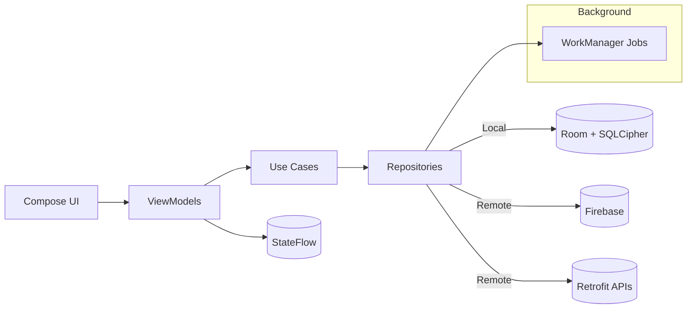
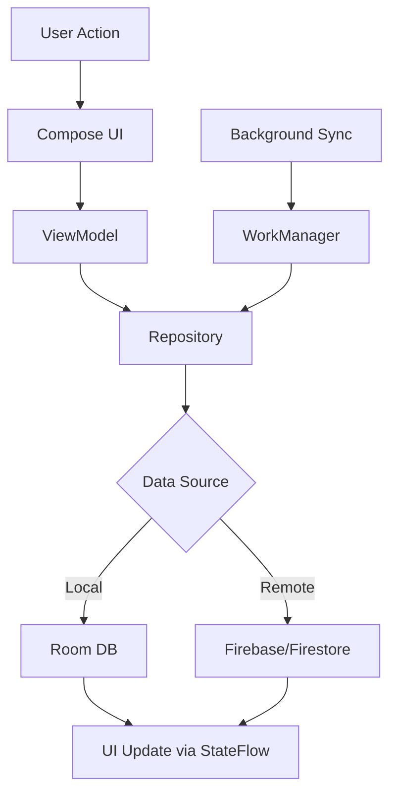
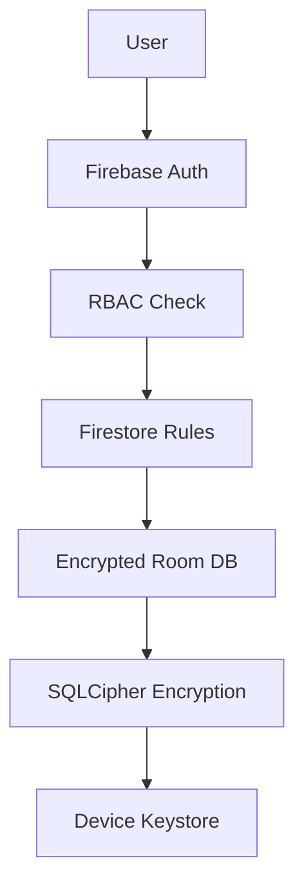
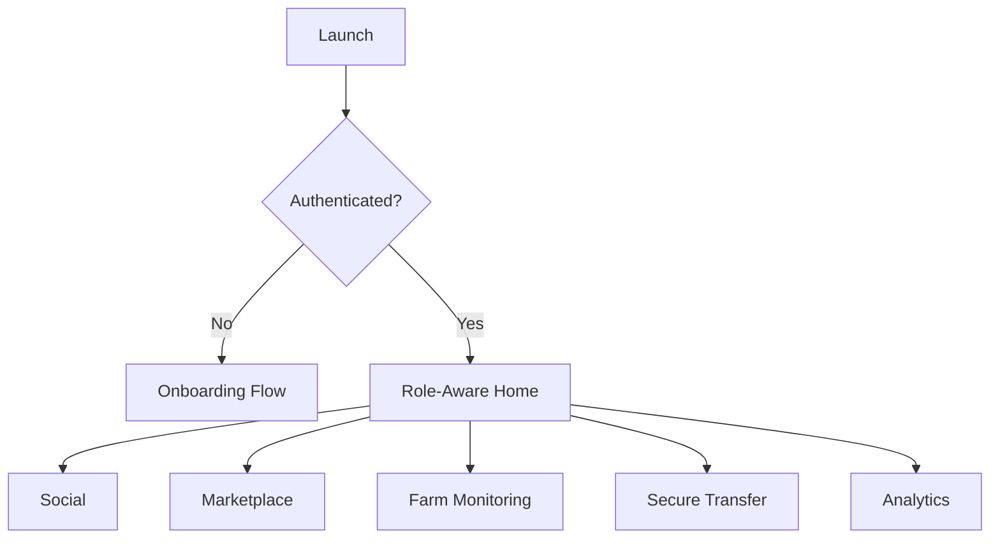

# ROSTRY Blueprint (High-Level System Overview)

Version: 1.0
Last Updated: 2025-10-16
Audience: Stakeholders, Product Managers, Architects

This document provides a high-level system overview and architecture summary for stakeholders and new team members. For detailed documentation navigation, see `docs/README-docs.md`.

---

## Quick Links
- Documentation Index (primary): `docs/README-docs.md`
- Architecture details: `docs/architecture.md`

---

## 1) Executive Summary
ROSTRY is a modern, mobile-first platform for poultry enthusiasts and farmers, combining social networking, marketplace, farm monitoring, secure fowl transfer, and advanced analytics. The app is fully offline-capable with an encrypted Room database and deep Firebase integration.

Outcomes:
- Traceability and transparency across poultry lifecycle
- Community engagement with secure transactions
- Data-driven farm performance and insights

---

## 2) System Architecture (High Level)
ROSTRY follows a clean architecture pattern with MVVM presentation layer, emphasizing offline-first design for reliability in rural areas. The system layers data persistence, business logic, and UI components to ensure scalability and maintainability.

- **UI Layer**: Jetpack Compose (Material 3) for declarative, responsive interfaces
- **Presentation Layer**: MVVM with ViewModels using StateFlow for reactive state management and Navigation for seamless user flows
- **Domain Layer**: Use cases and repositories encapsulating business logic and data orchestration
- **Data Layer**: Encrypted Room database for local persistence, Firebase for cloud sync, and Retrofit for external APIs
- **Infrastructure**: Hilt for dependency injection, WorkManager for background jobs, and DataStore for lightweight preferences

This layered approach enables independent evolution of components while maintaining strong separation of concerns. For implementation details, see `docs/architecture.md`.



**Data Flow Diagram**:


**Security Layers Diagram**:


---

## 3) Feature Overview (What’s Implemented)
ROSTRY's feature set is designed to support the full poultry lifecycle, from breeding to marketplace transactions, with community and analytics capabilities.

- **Social Network**: Comprehensive platform for posts, comments, likes, follows, groups, events, and messaging to foster community engagement
- **Marketplace**: Robust system for listings, auctions, bidding, wishlist, cart, and payment framework enabling secure transactions
- **Secure Transfers**: Verified ownership transfer process with dispute handling and complete audit trail for trust and compliance
- **Traceability**: Advanced lineage trees, breeding records, and lifecycle events for genetic tracking and certification
- **Farm Monitoring**: Real-time monitoring of growth, vaccination, quarantine, mortality, hatching, and automated alerts for operational efficiency
- **Analytics**: Comprehensive dashboards with AI-powered insights, performance analytics, financial reporting, and export capabilities for data-driven decisions

These features integrate seamlessly to provide end-to-end poultry management, with offline-first architecture ensuring functionality in low-connectivity environments.

---

## 4) Data & Persistence
Data management in ROSTRY prioritizes security, performance, and offline reliability through a hybrid local-cloud strategy.

- **Local Persistence**: Room database with SQLCipher encryption for 60+ entities across 15+ migrations, ensuring data integrity and privacy
- **Cloud Sync**: Firebase Firestore for real-time synchronization with conflict resolution UI for seamless offline-online transitions
- **Preferences**: DataStore for session management and lightweight user preferences
- **Conflict Resolution**: Offline-first approach where local data is the source of truth, with background sync handling updates and user-mediated conflict resolution

Key architectural patterns include entity-DTO mapping for clean data transformation and Flow-based reactive queries for efficient UI updates. This design supports complex relationships like family trees and audit trails while maintaining performance.

---

## 5) Security & Privacy
Security is foundational to ROSTRY, protecting sensitive poultry data and user privacy through multi-layered defenses.

- Encrypted local DB (SQLCipher)
- Firebase Auth with role-based access control (General, Farmer, Enthusiast)
- Firestore security rules (least privilege)
- Cloud Functions for secure operations (e.g., transfers)
- ProGuard/R8 for release; obfuscation and rules for Hilt/Room/Compose/SQLCipher
- Logging: Timber in debug; avoid PII

Refs: `docs/security-encryption.md`, relevant ADRs under `docs/adrs/`.

---

## 6) Background Jobs (WorkManager)
- Daily FarmMonitoringWorker (checks & summaries)
- VaccinationReminderWorker (alerts)
- FarmPerformanceWorker (weekly reports)
- Sync workers for offline-first data

Refs: `docs/background-jobs.md`.

---

## 7) Networking & Integrations
- Firebase: Auth, Firestore, Storage, Functions, FCM
- REST: Retrofit + Gson for auxiliary services
- Payments: Gateway integration framework (UPI/cards/wallets) per `ROADMAP.md`

---

## 8) Analytics & Reporting
- Main dashboard, performance analytics, financial dashboards
- Breeding insights, genealogy visualization, AI recommendations
- Export screens for key reports

Refs: `docs/analytics-dashboard.md` (if split), `README.md` (Recent Major Features), `ROADMAP.md`.

---

## 9) Navigation & UX
- Navigation graph routes per domain; role-aware tabs and flows
- Onboarding flows for General/Farmer/Enthusiast
- Reusable UI components and forms

See navigation overview in `docs/architecture.md` and feature docs.



---

## 10) Build, Test, Release
- Build: Gradle wrapper, Android Studio (JDK 17)
- Lint/Static Analysis: ktlint, detekt
- Tests: unit, instrumentation; coverage via JaCoCo
- Release: minify+ProGuard; mapping upload; release checklist

Commands (see `CHEAT_SHEET.md` for full list):
```bash
./gradlew ktlintCheck detekt test
./gradlew assembleRelease
```

---

## 11) Roadmap Snapshot
- Now: Enhanced Search, Payments, Video (short-form)
- Next: Notifications, Accessibility, Offline Enhancements
- Later: AI Insights, Advanced Analytics, Marketplace upgrades

Visual plan: see Gantt in `ROADMAP.md`.

---

## 12) ADRs (Architectural Decision Records)
- ADR‑001: Database Encryption Strategy (Draft)
- ADR‑002: Offline‑First Strategy (Accepted) — see `docs/adrs/adr-002-offline-first-sync.md`
- ADR‑003: Background Worker Scheduling (Draft)

Folder: `docs/adrs/`

---

## 13) Diagrams & Assets
- Architecture diagrams: `docs/images/architecture/` (e.g., `system-context.svg`)
- Screenshots: `docs/images/screenshots/` (add `home-screen.png` later)
- Workflows: `docs/images/workflows/`

Guidelines: `docs/images/README.md`

---

## 14) Contribution Guide
- Contribution workflow and PR process: `CONTRIBUTING.md`
- Code style: `CODE_STYLE.md` and `docs/code-style-quick-reference.md`
- Developer onboarding: `docs/developer-onboarding.md`

---

## 15) Known Risks & Mitigations (Concise)
- Third‑party dependencies: abstract, plan migrations
- Platform changes: early adoption of previews; follow best practices
- Security: periodic audits, fast patching

---

## 16) Glossary (Selected)
- Offline‑first: local as source of truth + sync
- RBAC: role-based access control
- FCM: Firebase Cloud Messaging

---

## 17) Checklist (Bring-up)
- Clone and run: `QUICK_START.md`
- Keys and Firebase setup
- Pass `ktlint`, `detekt`, and tests
- Explore each domain via navigation

For step-by-step guides and detailed documentation, see `docs/README-docs.md` (primary index).

End of document.
