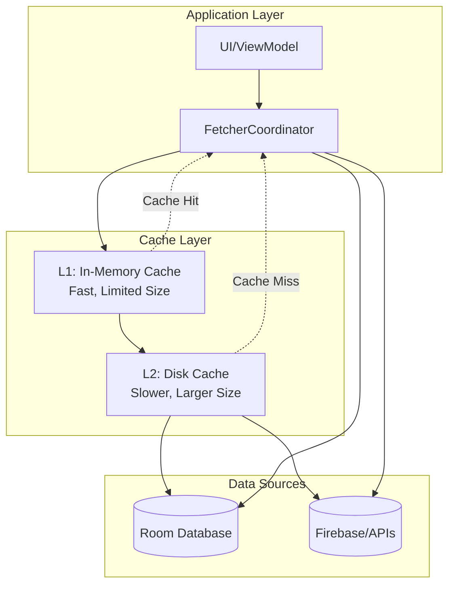

# Cache Management Architecture

**Document Type**: Architecture Guide
**Version**: 1.0
**Last Updated**: 2026-02-26
**Feature Owner**: Data Layer Infrastructure
**Status**: ✅ Fully Implemented

## Overview

ROSTRY implements a comprehensive caching system that provides intelligent data caching with TTL management, health monitoring, and strategic invalidation. The cache system is integral to the application's offline-first architecture and works seamlessly with the Fetcher System to optimize data retrieval performance.

### Key Features

| Feature | Description |
|---------|-------------|
| **Multi-Layer Caching** | In-memory + disk caching for optimal performance |
| **TTL Management** | Time-based expiration with configurable policies |
| **Stale-While-Revalidate** | Serve stale data during background refresh |
| **Health Monitoring** | Cache health tracking and metrics |
| **Smart Invalidation** | Event-based and pattern-based invalidation |
| **Memory Management** | LRU eviction and memory pressure handling |

## Architecture

### Cache Layers



### Component Structure

```
data/cache/
├── CacheManager.kt              # Main cache API
├── CacheHealthMonitor.kt        # Health monitoring
├── CacheInvalidator.kt          # Invalidation logic
├── CachePolicy.kt               # Policy definitions
├── CacheEntry.kt                # Entry metadata
├── MemoryCache.kt               # L1 in-memory cache
├── DiskCache.kt                 # L2 disk cache
└── CacheConfig.kt               # Configuration
```

## CacheManager API

### Core Interface

```kotlin
interface CacheManager {
    /**
     * Get cached data by key
     * @param key Cache key
     * @param type Type of data
     * @return Cached data or null if not found/expired
     */
    suspend fun <T> get(key: String): T?

    /**
     * Get cached data with metadata
     * @param key Cache key
     * @return Cache entry with metadata or null
     */
    suspend fun <T> getWithMetadata(key: String): CacheEntry<T>?

    /**
     * Store data in cache
     * @param key Cache key
     * @param value Data to cache
     * @param config Cache configuration
     */
    suspend fun <T> put(
        key: String,
        value: T,
        config: CacheConfig? = null
    )

    /**
     * Remove cached data by key
     * @param key Cache key
     */
    suspend fun remove(key: String)

    /**
     * Remove cached data by pattern
     * @param pattern Glob pattern (e.g., "products:*")
     */
    suspend fun removePattern(pattern: String)

    /**
     * Clear all cached data
     */
    suspend fun clearAll()

    /**
     * Get cache statistics
     */
    fun getStats(): CacheStats

    /**
     * Check if key exists in cache
     */
    suspend fun contains(key: String): Boolean

    /**
     * Get all cache keys
     */
    fun getAllKeys(): Set<String>
}
```

### Usage Example

```kotlin
class ProductRepositoryImpl @Inject constructor(
    private val cacheManager: CacheManager,
    private val localDataSource: LocalProductDataSource,
    private val remoteDataSource: RemoteProductDataSource
) : ProductRepository {

    override suspend fun getProducts(): Resource<List<Product>> {
        val cacheKey = "products:all"
        
        // Try cache first
        val cached = cacheManager.get<ProductList>(cacheKey)
        if (cached != null) {
            return Resource.Success(cached.products)
        }

        // Fetch from source
        return when (val result = remoteDataSource.fetchProducts()) {
            is Resource.Success -> {
                // Cache the result
                cacheManager.put(
                    key = cacheKey,
                    value = ProductList(result.data),
                    config = CacheConfig(
                        ttl = 5.minutes,
                        staleWhileRevalidate = true
                    )
                )
                Resource.Success(result.data)
            }
            is Resource.Error -> result
            is Resource.Loading -> Resource.Loading
        }
    }
}
```

## Cache Policies

### TTL Strategies

```kotlin
data class CacheConfig(
    /**
     * Time to live - how long data remains valid
     */
    val ttl: Duration = 5.minutes,

    /**
     * Serve stale data while refreshing in background
     */
    val staleWhileRevalidate: Boolean = true,

    /**
     * Maximum age of stale data that can be served
     */
    val maxStale: Duration? = null,

    /**
     * Prefetch before expiry to avoid latency
     */
    val preFetch: Duration? = 1.minute,

    /**
     * Events that should invalidate this cache
     */
    val invalidateOn: List<String> = emptyList(),

    /**
     * Cache priority for eviction decisions
     */
    val priority: CachePriority = CachePriority.NORMAL,

    /**
     * Maximum size for this cache entry
     */
    val maxSize: Long? = null
)

enum class CachePriority {
    CRITICAL,    // Never evict
    HIGH,        // Evict last
    NORMAL,      // Default
    LOW          // Evict first
}
```

### Predefined Configurations

```kotlin
object CacheConfigs {
    /**
     * Product listings - frequently accessed, can be slightly stale
     */
    val PRODUCT_LIST = CacheConfig(
        ttl = 5.minutes,
        staleWhileRevalidate = true,
        maxStale = 15.minutes,
        preFetch = 1.minute,
        invalidateOn = listOf("product_created", "product_updated", "product_deleted"),
        priority = CachePriority.HIGH
    )

    /**
     * User profile - rarely changes, long TTL
     */
    val USER_PROFILE = CacheConfig(
        ttl = 30.minutes,
        staleWhileRevalidate = true,
        maxStale = 1.hour,
        preFetch = 5.minutes,
        invalidateOn = listOf("profile_updated"),
        priority = CachePriority.HIGH
    )

    /**
     * Order status - critical freshness
     */
    val ORDER_STATUS = CacheConfig(
        ttl = 30.seconds,
        staleWhileRevalidate = false,
        maxStale = null,
        preFetch = null,
        invalidateOn = listOf("order_status_changed"),
        priority = CachePriority.CRITICAL
    )

    /**
     * Farm monitoring data - moderate freshness
     */
    val FARM_MONITORING = CacheConfig(
        ttl = 2.minutes,
        staleWhileRevalidate = true,
        maxStale = 5.minutes,
        preFetch = 30.seconds,
        invalidateOn = listOf("alert_created", "metric_updated"),
        priority = CachePriority.NORMAL
    )

    /**
     * Static reference data - very long TTL
     */
    val REFERENCE_DATA = CacheConfig(
        ttl = 24.hours,
        staleWhileRevalidate = true,
        maxStale = 7.days,
        preFetch = 1.hour,
        invalidateOn = emptyList(),
        priority = CachePriority.LOW
    )
}
```

## Stale-While-Revalidate Pattern

### Implementation

```kotlin
class StaleWhileRevalidateCache @Inject constructor(
    private val cacheManager: CacheManager,
    private val fetcherCoordinator: FetcherCoordinator
) {
    /**
     * Get cached data, refresh in background if stale
     */
    suspend fun <T> getOrFetch(
        key: String,
        fetcher: suspend () -> Resource<T>,
        config: CacheConfig
    ): Resource<T> {
        val entry = cacheManager.getWithMetadata<T>(key)

        return when {
            // No cache - fetch fresh
            entry == null -> {
                fetchAndCache(key, fetcher, config)
            }

            // Cache is fresh - return immediately
            !entry.isStale -> {
                Resource.Success(entry.value)
            }

            // Cache is stale but within maxStale - return stale, refresh background
            config.staleWhileRevalidate && entry.isWithinMaxStale -> {
                // Return stale data immediately
                val staleData = entry.value

                // Refresh in background
                CoroutineScope(Dispatchers.IO).launch {
                    try {
                        val freshData = fetcher()
                        if (freshData is Resource.Success) {
                            cacheManager.put(key, freshData.data, config)
                        }
                    } catch (e: Exception) {
                        Timber.w(e, "Background refresh failed")
                    }
                }

                Resource.Success(staleData)
            }

            // Cache is too stale - fetch fresh
            else -> {
                fetchAndCache(key, fetcher, config)
            }
        }
    }

    private suspend fun <T> fetchAndCache(
        key: String,
        fetcher: suspend () -> Resource<T>,
        config: CacheConfig
    ): Resource<T> {
        return when (val result = fetcher()) {
            is Resource.Success -> {
                cacheManager.put(key, result.data, config)
                result
            }
            else -> result
        }
    }
}
```

### Usage Pattern

```kotlin
@HiltViewModel
class ProductListViewModel @Inject constructor(
    private val repository: ProductRepository,
    private val staleCache: StaleWhileRevalidateCache
) : BaseViewModel() {

    private val _uiState = MutableStateFlow<ProductListUiState>(ProductListUiState())
    val uiState: StateFlow<ProductListUiState> = _uiState.asStateFlow()

    init {
        loadProducts()
    }

    private fun loadProducts() {
        viewModelScope.launch {
            _uiState.update { it.copy(isLoading = true) }

            val result = staleCache.getOrFetch(
                key = "products:list",
                fetcher = { repository.getProducts() },
                config = CacheConfigs.PRODUCT_LIST
            )

            _uiState.update { state ->
                when (result) {
                    is Resource.Success -> state.copy(
                        isLoading = false,
                        products = result.data,
                        isRefreshing = false,
                        error = null
                    )
                    is Resource.Error -> state.copy(
                        isLoading = false,
                        error = result.message,
                        isRefreshing = false
                    )
                    is Resource.Loading -> state.copy(
                        isLoading = true,
                        isRefreshing = true
                    )
                }
            }
        }
    }
}
```

## Cache Invalidation

### Invalidation Strategies

```kotlin
class CacheInvalidator @Inject constructor(
    private val cacheManager: CacheManager,
    private val eventBus: EventBus
) {
    init {
        // Subscribe to invalidation events
        eventBus.subscribe { event: DataEvent ->
            when (event) {
                is ProductUpdatedEvent -> invalidateProduct(event.productId)
                is OrderStatusChangedEvent -> invalidateOrder(event.orderId)
                is ProfileUpdatedEvent -> invalidateUserProfile(event.userId)
                // ... more event handlers
            }
        }
    }

    /**
     * Invalidate specific product cache
     */
    suspend fun invalidateProduct(productId: String) {
        cacheManager.remove("products:$productId")
        cacheManager.removePattern("products:*:$productId:*")
    }

    /**
     * Invalidate all product caches
     */
    suspend fun invalidateAllProducts() {
        cacheManager.removePattern("products:*")
    }

    /**
     * Invalidate user-specific caches
     */
    suspend fun invalidateUserCaches(userId: String) {
        cacheManager.removePattern("user:$userId:*")
        cacheManager.removePattern("profile:$userId")
        cacheManager.removePattern("orders:$userId:*")
    }

    /**
     * Invalidate on logout
     */
    suspend fun invalidateOnLogout() {
        cacheManager.removePattern("user:*")
        cacheManager.removePattern("auth:*")
        cacheManager.removePattern("profile:*")
    }

    /**
     * Clear all caches (use sparingly)
     */
    suspend fun clearAll() {
        cacheManager.clearAll()
    }
}
```

### Event-Driven Invalidation

```kotlin
sealed class DataEvent {
    data class ProductUpdatedEvent(val productId: String) : DataEvent()
    data class ProductDeletedEvent(val productId: String) : DataEvent()
    data class OrderStatusChangedEvent(val orderId: String, val newStatus: OrderStatus) : DataEvent()
    data class ProfileUpdatedEvent(val userId: String) : DataEvent()
    data class UserLoggedOutEvent(val userId: String) : DataEvent()
    // ... more events
}

class EventBus @Inject constructor() {
    private val scope = CoroutineScope(Dispatchers.Main + SupervisorJob())
    private val subscribers = ConcurrentHashMap<KClass<*>, MutableList<suspend (Any) -> Unit>>()

    inline fun <reified T : DataEvent> subscribe(crossinline handler: suspend (T) -> Unit) {
        val list = subscribers.getOrPut(T::class) { mutableListOf() }
        list.add { event -> handler(event as T) }
    }

    fun publish(event: DataEvent) {
        scope.launch {
            subscribers[event::class]?.forEach { handler ->
                try {
                    handler(event)
                } catch (e: Exception) {
                    Timber.e(e, "Event handler failed")
                }
            }
        }
    }
}
```

## Cache Health Monitoring

### Health Metrics

```kotlin
data class CacheStats(
    val totalEntries: Int,
    val totalSize: Long,
    val hitCount: Long,
    val missCount: Long,
    val evictionCount: Long,
    val hitRate: Double,
    val averageEntryAge: Duration,
    val staleEntryCount: Int,
    val expiredEntryCount: Int
)

data class CacheHealthMetrics(
    val hitRate: Double,              // Target: > 0.7
    val staleRate: Double,            // Target: < 0.3
    val evictionRate: Double,         // Target: < 0.1 per minute
    val averageLatency: Duration,     // Target: < 10ms (L1), < 100ms (L2)
    val memoryUsage: Double,          // Target: < 0.8
    val diskUsage: Double,            // Target: < 0.9
    val errorRate: Double             // Target: < 0.01
)

enum class CacheHealthStatus {
    HEALTHY,      // All metrics within targets
    DEGRADED,     // Some metrics outside targets
    CRITICAL      // Multiple metrics critical
}
```

### Health Monitor Implementation

```kotlin
class CacheHealthMonitor @Inject constructor(
    private val cacheManager: CacheManager,
    private val metricsCollector: MetricsCollector
) {
    private val healthHistory = ConcurrentLinkedQueue<CacheHealthMetrics>()

    /**
     * Get current cache health
     */
    fun getHealth(): CacheHealthMetrics {
        val stats = cacheManager.getStats()

        return CacheHealthMetrics(
            hitRate = stats.hitCount.toDouble() / (stats.hitCount + stats.missCount),
            staleRate = stats.staleEntryCount.toDouble() / stats.totalEntries,
            evictionRate = stats.evictionCount.toDouble() / TimeUnit.MINUTES.toSeconds(1),
            averageLatency = metricsCollector.getAverageCacheLatency(),
            memoryUsage = getMemoryUsage(),
            diskUsage = getDiskUsage(),
            errorRate = metricsCollector.getCacheErrorRate()
        )
    }

    /**
     * Check and report health status
     */
    suspend fun checkAndReport(): CacheHealthStatus {
        val metrics = getHealth()
        healthHistory.add(metrics)

        // Prune old history
        if (healthHistory.size > 100) {
            healthHistory.poll()
        }

        return when {
            metrics.hitRate < 0.5 || metrics.errorRate > 0.05 -> {
                Timber.e("Cache health CRITICAL: ${formatMetrics(metrics)}")
                CacheHealthStatus.CRITICAL
            }
            metrics.hitRate < 0.7 || metrics.staleRate > 0.3 -> {
                Timber.w("Cache health DEGRADED: ${formatMetrics(metrics)}")
                CacheHealthStatus.DEGRADED
            }
            else -> {
                CacheHealthStatus.HEALTHY
            }
        }
    }

    /**
     * Get health trend
     */
    fun getHealthTrend(): HealthTrend {
        if (healthHistory.size < 10) return HealthTrend.STABLE

        val recent = healthHistory.takeLast(10)
        val hitRateTrend = recent.map { it.hitRate }.average()
        val previous = healthHistory.take(10).map { it.hitRate }.average()

        return when {
            hitRateTrend > previous * 1.1 -> HealthTrend.IMPROVING
            hitRateTrend < previous * 0.9 -> HealthTrend.DECLINING
            else -> HealthTrend.STABLE
        }
    }

    enum class HealthTrend {
        IMPROVING, STABLE, DECLINING
    }

    private fun formatMetrics(metrics: CacheHealthMetrics): String {
        return "hitRate=${metrics.hitRate}, staleRate=${metrics.staleRate}, " +
               "evictionRate=${metrics.evictionRate}, memoryUsage=${metrics.memoryUsage}"
    }

    private fun getMemoryUsage(): Double {
        val runtime = Runtime.getRuntime()
        val used = runtime.totalMemory() - runtime.freeMemory()
        return used.toDouble() / runtime.maxMemory()
    }

    private fun getDiskUsage(): Double {
        val cacheDir = File(CACHE_DIR)
        val total = cacheDir.totalSpace.toDouble()
        val free = cacheDir.freeSpace.toDouble()
        return 1.0 - (free / total)
    }
}
```

## Performance Optimization

### Memory Management

```kotlin
class MemoryCache @Inject constructor(
    private val config: CacheConfig
) {
    private val cache = LruCache<String, CacheEntry<*>>(
        maxSize = calculateMaxSize()
    )

    private fun calculateMaxSize(): Int {
        val maxMemory = Runtime.getRuntime().maxMemory() / 1024
        return (maxMemory / 8).toInt() // Use 1/8 of available heap
    }

    suspend fun <T> get(key: String): T? {
        @Suppress("UNCHECKED_CAST")
        return cache.get(key) as CacheEntry<T>?
    }

    suspend fun <T> put(key: String, value: T, config: CacheConfig) {
        val entry = CacheEntry(
            value = value,
            createdAt = Instant.now(),
            ttl = config.ttl,
            priority = config.priority
        )
        cache.put(key, entry)
    }

    suspend fun remove(key: String) {
        cache.remove(key)
    }

    suspend fun clear() {
        cache.evictAll()
    }

    fun getStats(): MemoryCacheStats {
        return MemoryCacheStats(
            size = cache.size(),
            maxSize = cache.maxSize(),
            hitCount = cache.hitCount(),
            missCount = cache.missCount()
        )
    }
}
```

### Disk Cache

```kotlin
class DiskCache @Inject constructor(
    @ApplicationContext private val context: Context,
    private val dispatcher: CoroutineDispatcher = Dispatchers.IO
) {
    private val cacheDir = File(context.cacheDir, "http").apply {
        mkdirs()
    }

    private val maxSize = 50 * 1024 * 1024L // 50 MB

    suspend fun <T> get(key: String): T? = withContext(dispatcher) {
        try {
            val file = getFileForKey(key)
            if (!file.exists()) return@withContext null

            val entry = readEntry(file)
            if (entry.isExpired) {
                file.delete()
                return@withContext null
            }

            @Suppress("UNCHECKED_CAST")
            entry.value as T
        } catch (e: Exception) {
            Timber.e(e, "Disk cache get failed")
            null
        }
    }

    suspend fun <T> put(key: String, value: T, config: CacheConfig) = withContext(dispatcher) {
        try {
            val file = getFileForKey(key)
            val entry = CacheEntry(
                value = value,
                createdAt = Instant.now(),
                ttl = config.ttl
            )

            writeEntry(file, entry)
            trimToSize(maxSize)
        } catch (e: Exception) {
            Timber.e(e, "Disk cache put failed")
        }
    }

    private fun trimToSize(maxSize: Long) {
        // LRU eviction logic
        val files = cacheDir.listFiles()?.sortedBy { it.lastModified() } ?: return
        var size = files.sumOf { it.length() }

        while (size > maxSize && files.isNotEmpty()) {
            val oldest = files.first()
            size -= oldest.length()
            oldest.delete()
            files.removeAt(0)
        }
    }

    suspend fun clear() = withContext(dispatcher) {
        cacheDir.deleteRecursively()
    }

    fun getStats(): DiskCacheStats {
        val files = cacheDir.listFiles() ?: return DiskCacheStats(0, 0)
        return DiskCacheStats(
            size = files.size,
            totalSize = files.sumOf { it.length() }
        )
    }
}
```

## Testing Cache

### Unit Testing

```kotlin
@ExperimentalCoroutinesApi
class CacheManagerTest {
    @get:Rule
    val instantExecutorRule = InstantTaskExecutorRule()

    private val testDispatcher = StandardTestDispatcher()
    private lateinit var memoryCache: MemoryCache
    private lateinit var diskCache: DiskCache
    private lateinit var cacheManager: CacheManager

    @Before
    fun setup() {
        Dispatchers.setMain(testDispatcher)
        memoryCache = mockk()
        diskCache = mockk()
        cacheManager = CacheManagerImpl(memoryCache, diskCache)
    }

    @Test
    fun `get returns cached data on hit`() = runTest {
        // Given
        val testData = ProductList(products = emptyList())
        coEvery { memoryCache.get<ProductList>("products") } returns testData

        // When
        val result = cacheManager.get<ProductList>("products")

        // Then
        assertThat(result).isEqualTo(testData)
    }

    @Test
    fun `put stores data in memory cache`() = runTest {
        // Given
        val testData = ProductList(products = emptyList())
        val config = CacheConfigs.PRODUCT_LIST
        coEvery { memoryCache.put("products", testData, config) } just Runs

        // When
        cacheManager.put("products", testData, config)

        // Then
        coVerify { memoryCache.put("products", testData, config) }
    }

    @Test
    fun `get falls back to disk cache on memory miss`() = runTest {
        // Given
        val testData = ProductList(products = emptyList())
        coEvery { memoryCache.get<ProductList>("products") } returns null
        coEvery { diskCache.get<ProductList>("products") } returns testData

        // When
        val result = cacheManager.get<ProductList>("products")

        // Then
        assertThat(result).isEqualTo(testData)
    }
}
```

### Integration Testing

```kotlin
@HiltAndroidTest
class CacheIntegrationTest {
    @get:Rule(order = 0)
    val hiltRule = HiltAndroidRule(this)

    @Inject
    lateinit var cacheManager: CacheManager

    @Inject
    lateinit var fetcherCoordinator: FetcherCoordinator

    @Test
    fun `fetcher uses cache correctly`() = runTest {
        // Given
        val testData = ProductList(products = listOf(createTestProduct()))
        cacheManager.put("products", testData, CacheConfigs.PRODUCT_LIST)

        // When
        val request = ClientRequest(
            key = "products",
            fetcher = { throw IllegalStateException("Should not be called") },
            cachePolicy = CachePolicy.CACHE_FIRST
        )
        val result = fetcherCoordinator.fetch(request)

        // Then
        assertThat(result).isInstanceOf(Resource.Success::class.java)
        assertThat((result as Resource.Success).data).isEqualTo(testData.products)
    }
}
```

## Troubleshooting

### Common Issues

**Problem**: Cache not being hit when expected
- **Cause**: Key mismatch, TTL too short, premature invalidation
- **Solution**:
  1. Verify cache key consistency
  2. Check TTL configuration
  3. Review invalidation triggers
  4. Enable cache logging

**Problem**: Memory pressure or OOM errors
- **Cause**: Cache size too large, insufficient eviction
- **Solution**:
  1. Reduce max cache size
  2. Implement stricter LRU eviction
  3. Add memory pressure callbacks
  4. Monitor memory usage metrics

**Problem**: Stale data being served too long
- **Cause**: TTL too long, stale-while-revalidate misconfigured
- **Solution**:
  1. Reduce TTL for dynamic content
  2. Set appropriate maxStale limits
  3. Implement proactive refresh
  4. Add staleness indicators to UI

**Problem**: Cache invalidation not working
- **Cause**: Event not published, pattern mismatch
- **Solution**:
  1. Verify event publication
  2. Check invalidation patterns
  3. Add invalidation logging
  4. Test invalidation scenarios

## Best Practices

### Cache Key Design

```kotlin
// Good: Consistent, hierarchical keys
val keys = listOf(
    "products:all",
    "products:$productId",
    "products:$productId:images",
    "user:$userId:profile",
    "user:$userId:orders:$orderId",
    "farm:$farmId:monitoring:growth"
)

// Bad: Inconsistent keys
val badKeys = listOf(
    "product_list",        // Inconsistent separator
    "product_123",         // Different prefix
    "userProfile_john",    // No separator
    "orders"               // Too generic
)
```

### TTL Guidelines

| Data Type | Recommended TTL | Rationale |
|-----------|----------------|-----------|
| Product listings | 5-15 minutes | Frequently updated, high traffic |
| User profiles | 30 minutes - 1 hour | Rarely changes |
| Order status | 30 seconds - 2 minutes | Critical freshness |
| Farm monitoring | 2-5 minutes | Real-time data |
| Reference data | 24 hours - 7 days | Static content |
| Analytics | 1-6 hours | Aggregated data |

### Invalidation Guidelines

1. **Invalidate on write**: Always invalidate cache after successful write
2. **Use events**: Publish events for cross-module invalidation
3. **Be specific**: Invalidate minimum required keys
4. **Test scenarios**: Test invalidation in unit tests

## Related Documentation

- `fetcher-system.md` - Fetcher System integration
- `data-layer-architecture.md` - Data layer patterns
- `performance-optimization.md` - Performance tuning
- `testing-strategy.md` - Testing approaches

## Appendix: File Locations

```
data/cache/
├── CacheManager.kt              # Main cache API
├── CacheManagerImpl.kt          # Implementation
├── CacheHealthMonitor.kt        # Health monitoring
├── CacheInvalidator.kt          # Invalidation logic
├── CachePolicy.kt               # Policy definitions
├── CacheEntry.kt                # Entry metadata
├── CacheConfig.kt               # Configuration
├── CacheStats.kt                # Statistics
├── MemoryCache.kt               # L1 cache
├── DiskCache.kt                 # L2 cache
└── LruCache.kt                  # LRU implementation
```
