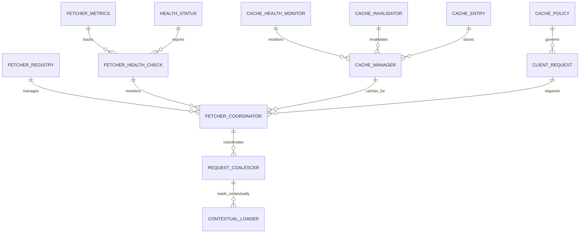
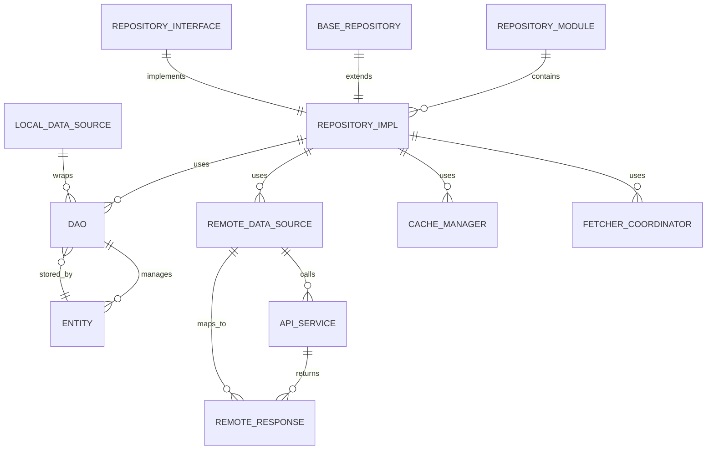
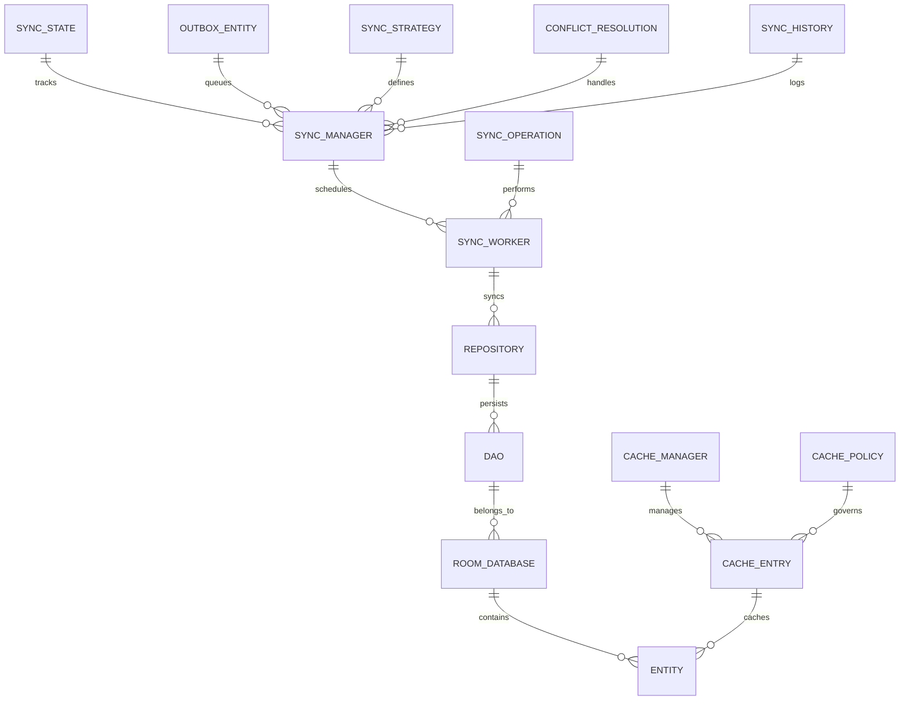

# Data Layer Architecture

## Overview

The ROSTRY data layer implements a comprehensive architecture that combines traditional repository patterns with advanced caching, health monitoring, and resilience mechanisms. The architecture is organized into several key subsystems that work together to provide reliable, performant data access.

## Architecture Components

### 1. Fetcher System

The Fetcher System is a centralized data fetching infrastructure that provides intelligent caching, request deduplication, and health monitoring capabilities.

#### Core Components
- **`FetcherRegistry`**: Central registry for all fetchers with type-safe registration and retrieval
- **`FetcherCoordinator`**: Orchestrates fetch operations, manages cache interactions, and handles request routing
- **`RequestCoalescer`**: Deduplicates concurrent requests for the same data to prevent redundant network calls
- **`ContextualLoader`**: Handles contextual data loading with priority management and smart prefetching
- **`FetcherHealthCheck`**: Monitors fetcher performance, availability, and response times for proactive maintenance

#### Design Pattern
- **Strategy Pattern**: Pluggable fetcher implementations allowing different strategies for different data sources
- **Factory Pattern**: For creating fetcher instances with appropriate configurations
- **Observer Pattern**: For monitoring fetcher health and performance metrics

#### Caching Integration
- **CacheManager**: Integrated with the central cache manager for intelligent caching strategies
- **Cache Strategies**: Supports TTL-based, staleness-aware, and cache-aside patterns
- **Cache Invalidation**: Smart invalidation based on data dependencies and update events

#### Concurrency & Performance
- **Thread-Safe Operations**: All fetcher operations are thread-safe to handle concurrent requests
- **Request Coalescing**: Prevents duplicate network calls for identical requests occurring simultaneously
- **Connection Pooling**: Efficient reuse of network connections to minimize overhead
- **Batching**: Groups similar requests when possible to reduce network round trips

### 2. Cache Management

The cache management system provides intelligent caching with health monitoring and performance optimization.

#### Core Components
- **`CacheManager`**: Central cache management API and usage
- **`CacheHealthMonitor`**: Cache health monitoring and metrics
- **`CachePolicy`**: Cache policies and TTL strategies
- **`CacheInvalidator`**: Cache invalidation strategies

#### Cache Strategies
- **TTL-based**: Time-to-live caching with configurable expiration
- **Stale-While-Revalidate**: Serve stale data while fetching fresh data in background
- **Cache-Aside**: Lazy loading pattern where cache is populated on first access
- **Write-Through**: Synchronous writes to both cache and backing store

#### Performance Metrics
- Cache hit ratios
- Response time improvements
- Memory utilization
- Eviction patterns

### 3. Health Monitoring

The health monitoring system continuously monitors data layer components and provides metrics for proactive maintenance.

#### Core Components
- **`HealthMonitor`**: Overall system health monitoring
- **`DataLayerHealthCheck`**: Data layer health checks
- **`NetworkHealthMonitor`**: Network connectivity health

#### Monitoring Capabilities
- Availability monitoring
- Performance metrics
- Error rate tracking
- Latency measurements
- Resource utilization

### 4. Data Integrity

The data integrity system ensures data validation, consistency, and correctness throughout the data layer.

#### Core Components
- **`DataIntegrityChecker`**: Data integrity validation
- **`ConsistencyValidator`**: Data consistency enforcement
- **`ValidationPipeline`**: Validation pipeline implementation

#### Validation Types
- Input validation
- Schema validation
- Business rule validation
- Cross-reference validation
- Data format validation

### 5. Resilience Patterns

The resilience system implements circuit breakers, retry logic, and fault tolerance mechanisms.

#### Core Components
- **`CircuitBreaker`**: Circuit breaker pattern implementation
- **`RetryMechanism`**: Retry logic with exponential backoff
- **`FallbackHandler`**: Fallback strategies for service failures

#### Resilience Strategies
- Circuit breaker pattern to prevent cascading failures
- Retry mechanisms with exponential backoff
- Fallback strategies for graceful degradation
- Timeout handling
- Bulkhead isolation

## Data Flow Patterns

### Read Operations
1. Request arrives at FetcherCoordinator
2. RequestCoalescer checks for duplicate requests
3. CacheManager checks for cached data
4. If cache miss, fetch from data source
5. Store result in cache
6. Return result to caller

### Write Operations
1. Request validated by DataIntegrityChecker
2. Applied to local data store (Room)
3. Queued for remote synchronization
4. SyncManager processes queue
5. Apply to remote data source (Firebase)
6. Handle conflicts with resolution strategy

### Synchronization Flow
1. SyncManager initiates sync operation
2. Pull changes from remote source
3. Apply local changes to remote
4. Resolve conflicts using timestamp/version
5. Update local cache
6. Notify observers of changes

## Integration Patterns

### Repository Integration
The fetcher system integrates seamlessly with the repository layer:

```kotlin
class ProductRepositoryImpl @Inject constructor(
    private val fetcherCoordinator: FetcherCoordinator,
    private val cacheManager: CacheManager,
    private val localDataSource: LocalProductDataSource,
    private val remoteDataSource: RemoteProductDataSource
) : ProductRepository {
    
    override suspend fun getProducts(): Resource<List<Product>> {
        val request = ClientRequest(
            key = "products",
            fetcher = remoteDataSource::fetchProducts,
            cachePolicy = CachePolicy.CACHE_FIRST,
            ttl = 5.minutes
        )
        
        return fetcherCoordinator.fetch(request)
    }
}
```

### ViewModel Integration
Repositories return Resource wrappers that ViewModels can easily consume:

```kotlin
@HiltViewModel
class ProductViewModel @Inject constructor(
    private val repository: ProductRepository
) : BaseViewModel() {
    
    private val _products = MutableStateFlow<Resource<List<Product>>>(Resource.Loading)
    val products: StateFlow<Resource<List<Product>>> = _products.asStateFlow()
    
    fun loadProducts() {
        viewModelScope.launch {
            _products.value = Resource.Loading
            _products.value = repository.getProducts()
        }
    }
}
```

## Error Handling

### Error Types
- **Network Errors**: Connectivity issues, timeouts, server errors
- **Data Errors**: Validation failures, parsing errors, integrity violations
- **Cache Errors**: Cache corruption, disk space issues
- **Sync Errors**: Conflict resolution failures, partial syncs

### Error Recovery
- Automatic retry with exponential backoff
- Fallback to cached data when remote unavailable
- Circuit breaker to prevent cascading failures
- Graceful degradation of functionality

## Performance Considerations

### Caching Strategy
- Multi-level cache (memory → disk → network)
- Smart prefetching based on usage patterns
- Adaptive TTL based on data volatility
- Cache warming for critical data

### Memory Management
- LRU eviction policies
- Memory pressure handling
- Object pooling for frequently created objects
- Proper resource cleanup

### Network Optimization
- Request batching
- Compression
- Connection reuse
- Bandwidth-adaptive loading

## Testing Strategy

### Unit Testing
- Individual component testing (fetchers, cache, health checks)
- Mock data sources for isolated testing
- Edge case validation

### Integration Testing
- End-to-end data flow testing
- Cache behavior validation
- Error scenario testing
- Performance benchmarking

### Testing Patterns
```kotlin
@Test
fun `fetch with cache miss should fetch from remote and cache result`() = runTest {
    // Given
    coEvery { remoteDataSource.fetchProducts() } returns expectedResult
    every { cacheManager.get<List<Product>>(any()) } returns null
    
    // When
    val result = repository.getProducts()
    
    // Then
    assertEquals(Resource.Success(expectedResult), result)
    coVerify { remoteDataSource.fetchProducts() }
    verify { cacheManager.put(any(), any()) }
}
```

## Migration Strategy

### Database Migrations
- Versioned migration scripts
- Rollback capabilities
- Data validation post-migration
- Zero-downtime migration patterns

### Cache Migration
- Cache format versioning
- Backward compatibility
- Migration during app startup
- Fallback to fresh fetch if migration fails

## Monitoring & Observability

### Metrics Collected
- Cache hit/miss ratios
- Fetch success/failure rates
- Response times
- Error rates
- Resource utilization

### Logging Strategy
- Structured logging with correlation IDs
- Performance markers
- Error context preservation
- Privacy-conscious data handling

## Security Considerations

### Data Encryption
- Cache encryption at rest
- Secure key management
- Memory encryption for sensitive data
- Secure data deletion

### Access Control
- Role-based access to data sources
- Permission validation
- Audit logging
- Secure credential handling

## Database Schema Diagrams

### Core Entity Relationships

```mermaid
erDiagram
    USER ||--o{ PRODUCT : owns
    USER ||--o{ ORDER : places
    USER ||--o{ TRANSFER : initiates
    PRODUCT ||--o{ ORDER_ITEM : included_in
    ORDER ||--o{ ORDER_ITEM : contains
    ORDER ||--o{ PAYMENT : has
    ORDER ||--o{ DELIVERY_CONFIRMATION : confirmed_by
    TRANSFER ||--o{ TRANSFER_VERIFICATION : verified_by
    PRODUCT ||--o{ TRANSFER : transferred
    FAMILY_TREE ||--o{ PRODUCT : parent_of
    VACCINATION_RECORD ||--o{ PRODUCT : belongs_to
    GROWTH_RECORD ||--o{ PRODUCT : belongs_to
    MORTALITY_RECORD ||--o{ PRODUCT : belongs_to
    QUARANTINE_RECORD ||--o{ PRODUCT : belongs_to
    BREEDING_PAIR ||--o{ PRODUCT : parent_in
    HATCHING_BATCH ||--o{ PRODUCT : hatched_from
    POST ||--o{ COMMENT : has
    USER ||--o{ LIKE : creates
    POST ||--o{ LIKE : receives
    USER ||--o{ FOLLOW : follows
    USER ||--o{ MESSAGE : sends
    USER ||o{--|| THREAD : participates_in
    MESSAGE ||--o{ THREAD : belongs_to
    ANALYTICS_DAILY ||--|| USER : tracks
    ANALYTICS_DAILY ||--|| PRODUCT : tracks
    REPORT ||--o{ ANALYTICS_DAILY : aggregates
    FAMILY_TREE ||--|| PRODUCT : connects
    TRACEABILITY_ENTITY ||--o{ PRODUCT : tracks
    EVIDENCE_ORDER_ENTITY ||--o{ ORDER : extends
    EVIDENCE_QUOTE_ENTITY ||--o{ EVIDENCE_ORDER_ENTITY : part_of
    EVIDENCE_PAYMENT_ENTITY ||--o{ EVIDENCE_ORDER_ENTITY : payment_for
    EVIDENCE_DELIVERY_CONFIRMATION_ENTITY ||--o{ EVIDENCE_ORDER_ENTITY : confirms
    EVIDENCE_EVIDENCE_ENTITY ||--o{ EVIDENCE_ORDER_ENTITY : evidences
    EVIDENCE_DISPUTE_ENTITY ||--o{ EVIDENCE_ORDER_ENTITY : disputes
    EVIDENCE_AUDIT_LOG_ENTITY ||--o{ EVIDENCE_ORDER_ENTITY : audits
    FARM_ASSET_ENTITY ||--o{ PRODUCT : manages
    DAILY_LOG_ENTITY ||--o{ FARM_ASSET_ENTITY : logs
    TASK_ENTITY ||--o{ DAILY_LOG_ENTITY : creates
    SOCIAL_ENTITY ||--o{ USER : connects
    COMMUNITY_ENTITY ||--o{ USER : joins
    AUCTION_ENTITY ||--o{ PRODUCT : auctions
    BID_ENTITY ||--o{ AUCTION_ENTITY : bids_on
    CART_ITEM_ENTITY ||--o{ USER : adds_to_cart
    WISHLIST_ENTITY ||--o{ USER : wishes_for
    CHAT_MESSAGE_ENTITY ||--o{ USER : sends
    CHAT_MESSAGE_ENTITY ||--o{ THREAD : belongs_to
    COIN_ENTITY ||--o{ USER : owns
    COIN_LEDGER_ENTITY ||--o{ COIN_ENTITY : tracks
    COMPETITION_ENTRY_ENTITY ||--o{ USER : enters
    DAILY_BIRD_LOG_ENTITY ||--o{ PRODUCT : logs
    DASHBOARD_CACHE_ENTITY ||--o{ USER : caches
    DELIVERY_HUB_ENTITY ||--o{ ORDER : delivers_to
    ENTHUSIAST_BREEDING_ENTITY ||--o{ PRODUCT : breeds
    ENTHUSIAST_VERIFICATION_ENTITY ||--o{ USER : verifies
    EVENT_RSVP_ENTITY ||--o{ USER : attends
    EVENT_RSVP_ENTITY ||--o{ EVENT : attends
    FARM_ACTIVITY_LOG_ENTITY ||--o{ FARM_ASSET_ENTITY : logs
    FARM_MONITORING_ENTITY ||--o{ PRODUCT : monitors
    FARM_PROFILE_ENTITY ||--o{ USER : profiles
    FARM_TIMELINE_EVENT_ENTITY ||--o{ FARM_PROFILE_ENTITY : events
    FARM_VERIFICATION_ENTITY ||--o{ FARM_PROFILE_ENTITY : verifies
    GENETIC_ANALYSIS_ENTITY ||--o{ PRODUCT : analyzes
    INVENTORY_ITEM_ENTITY ||--o{ PRODUCT : inventories
    INVOICE_ENTITY ||--o{ ORDER : invoices
    IOT_DATA_ENTITY ||--o{ PRODUCT : monitors
    IOT_DEVICE_ENTITY ||--o{ USER : owns
    MARKET_LISTING_ENTITY ||--o{ PRODUCT : lists
    MY_VOTES_ENTITY ||--o{ USER : votes
    NEW_FARM_MONITORING_ENTITY ||--o{ PRODUCT : monitors
    NOTIFICATION_ENTITY ||--o{ USER : notifies
    ORDER_TRACKING_EVENT_ENTITY ||--o{ ORDER : tracks
    OUTBOX_ENTITY ||--o{ USER : queues
    PRODUCT_FTS_ENTITY ||--o{ PRODUCT : searches
    RATE_LIMIT_ENTITY ||--o{ USER : limits
    REFUND_ENTITY ||--o{ PAYMENT : refunds
    REVIEW_ENTITY ||--o{ PRODUCT : reviews
    ROLE_MIGRATION_ENTITY ||--o{ USER : migrates
    SHOW_RECORD_ENTITY ||--o{ PRODUCT : records
    STORAGE_QUOTA_ENTITY ||--o{ USER : quotas
    SYNC_STATE_ENTITY ||--o{ USER : syncs
    UPLOAD_TASK_ENTITY ||--o{ USER : uploads
    VERIFICATION_DRAFT_ENTITY ||--o{ USER : drafts
    VERIFICATION_REQUEST_ENTITY ||--o{ USER : requests
    BREED_ENTITY ||--o{ PRODUCT : breeds
    BREEDING_PAIR_ENTITY ||--o{ PRODUCT : pairs
    BATCH_SUMMARY_ENTITY ||--o{ PRODUCT : summarizes
```

### Fetcher System Schema



### Repository Layer Schema



### Sync and Cache Schema



## Future Enhancements

### Planned Improvements
- Distributed caching for multi-device sync
- Machine learning-based prefetching
- Advanced conflict resolution strategies
- Real-time data synchronization
- Enhanced offline capabilities