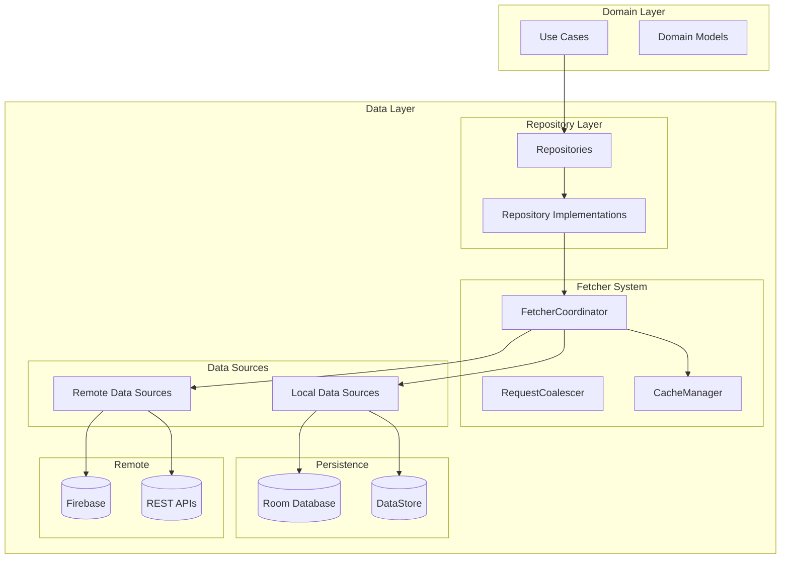

# Data Layer Architecture

**Document Type**: Architecture Guide
**Version**: 1.0
**Last Updated**: 2026-02-26
**Feature Owner**: Data Layer Infrastructure
**Status**: ✅ Fully Implemented

## Overview

The ROSTRY Data Layer provides a robust, scalable, and testable foundation for data management. It implements the repository pattern with offline-first architecture, intelligent caching, and comprehensive health monitoring. This document covers the complete data layer architecture, including repositories, data sources, caching, and integration patterns.

### Key Principles

| Principle | Description |
|-----------|-------------|
| **Single Source of Truth** | Room database as authoritative local source |
| **Offline-First** | App functions without network connectivity |
| **Repository Pattern** | Clean abstraction over data sources |
| **Type Safety** | Sealed classes for result handling |
| **Testability** | Interface-based design for easy mocking |
| **Resilience** | Graceful degradation on failures |

## Architecture

### Layer Structure


```mermaid
graph TB
    subgraph "Domain Layer"
        UC[Use Cases]
        Model[Domain Models]
    end

    subgraph "Data Layer"
        subgraph "Repository Layer"
            Repo[Repositories]
            RepoImpl[Repository Implementations]
        end

        subgraph "Fetcher System"
            FC[FetcherCoordinator]
            RC[RequestCoalescer]
            CM[CacheManager]
        end

        subgraph "Data Sources"
            LocalDS[Local Data Sources]
            RemoteDS[Remote Data Sources]
        end

        subgraph "Persistence"
            Room[(Room Database)]
            DataStore[(DataStore)]
        end

        subgraph "Remote"
            Firebase[(Firebase)]
            API[(REST APIs)]
        end
    end

    UC --> Repo
    Repo --> RepoImpl
    RepoImpl --> FC
    FC --> CM
    FC --> LocalDS
    FC --> RemoteDS
    LocalDS --> Room
    LocalDS --> DataStore
    RemoteDS --> Firebase
    RemoteDS --> API
```

### Package Structure

```
data/
├── fetcher/                    # Fetcher System
│   ├── FetcherRegistry.kt
│   ├── FetcherCoordinator.kt
│   ├── RequestCoalescer.kt
│   ├── ContextualLoader.kt
│   └── FetcherHealthCheck.kt
│
├── cache/                      # Cache Management
│   ├── CacheManager.kt
│   ├── CacheHealthMonitor.kt
│   ├── CacheInvalidator.kt
│   └── CacheConfig.kt
│
├── repository/                 # Repository Implementations
│   ├── UserRepositoryImpl.kt
│   ├── ProductRepositoryImpl.kt
│   ├── OrderRepositoryImpl.kt
│   ├── monitoring/             # Farm Monitoring Repos
│   ├── social/                 # Social Platform Repos
│   └── enthusiast/             # Enthusiast Feature Repos
│
├── local/                      # Local Data Sources
│   ├── LocalUserDataSource.kt
│   ├── LocalProductDataSource.kt
│   └── ...
│
├── remote/                     # Remote Data Sources
│   ├── RemoteUserDataSource.kt
│   ├── RemoteProductDataSource.kt
│   └── ...
│
├── database/                   # Room Database
│   ├── AppDatabase.kt
│   ├── dao/                    # Data Access Objects
│   ├── entity/                 # Entity Classes
│   └── migrations/             # Database Migrations
│
├── preferences/                # DataStore Preferences
│   ├── UserPreferencesDataStore.kt
│   └── AppPreferencesDataStore.kt
│
├── health/                     # Health Monitoring
│   ├── DataLayerHealthCheck.kt
│   ├── NetworkHealthMonitor.kt
│   └── HealthMonitor.kt
│
├── integrity/                  # Data Integrity
│   ├── DataIntegrityChecker.kt
│   ├── ConsistencyValidator.kt
│   └── ValidationPipeline.kt
│
├── resilience/                 # Resilience Patterns
│   ├── CircuitBreaker.kt
│   ├── RetryMechanism.kt
│   └── FallbackHandler.kt
│
├── migration/                  # Data Migration
│   ├── MigrationManager.kt
│   └── VersionedMigration.kt
│
├── mock/                       # Mock Data
│   ├── MockDataProvider.kt
│   └── TestDataFactory.kt
│
└── base/                       # Base Classes
    ├── BaseRepository.kt
    └── BaseDataSource.kt
```

## Repository Pattern

### BaseRepository

All repositories extend `BaseRepository` which provides common functionality:

```kotlin
abstract class BaseRepository {
    /**
     * Execute a network call with error handling
     */
    protected suspend fun <T> safeApiCall(
        apiCall: suspend () -> T
    ): Resource<T> {
        return try {
            val result = apiCall()
            Resource.Success(result)
        } catch (e: HttpException) {
            when (e.code()) {
                401 -> Resource.Error("Unauthorized", e)
                403 -> Resource.Error("Forbidden", e)
                404 -> Resource.Error("Not found", e)
                500 -> Resource.Error("Server error", e)
                else -> Resource.Error("Network error: ${e.message}", e)
            }
        } catch (e: IOException) {
            Resource.Error("Network unavailable", e)
        } catch (e: Exception) {
            Resource.Error("Unexpected error: ${e.message}", e)
        }
    }

    /**
     * Execute a database call with error handling
     */
    protected suspend fun <T> safeDbCall(
        dbCall: suspend () -> T
    ): Resource<T> {
        return try {
            val result = dbCall()
            Resource.Success(result)
        } catch (e: SQLiteException) {
            Resource.Error("Database error", e)
        } catch (e: Exception) {
            Resource.Error("Database operation failed", e)
        }
    }

    /**
     * Safe call with generic error handling
     */
    protected suspend fun <T> safeCall(
        operation: String,
        block: suspend () -> T
    ): Resource<T> {
        return try {
            Resource.Success(block())
        } catch (e: Exception) {
            Timber.e(e, "Operation '$operation' failed")
            Resource.Error("$operation failed: ${e.message}", e)
        }
    }
}
```

### Repository Implementation Pattern

```kotlin
@Singleton
class ProductRepositoryImpl @Inject constructor(
    private val fetcherCoordinator: FetcherCoordinator,
    private val cacheManager: CacheManager,
    private val localDataSource: LocalProductDataSource,
    private val remoteDataSource: RemoteProductDataSource,
    private val healthCheck: DataLayerHealthCheck
) : BaseRepository(), ProductRepository {

    override suspend fun getProducts(): Resource<List<Product>> {
        return safeCall("getProducts") {
            val request = ClientRequest(
                key = "products:all",
                fetcher = remoteDataSource::fetchProducts,
                cachePolicy = CachePolicy.CACHE_FIRST,
                ttl = 5.minutes
            )

            val result = fetcherCoordinator.fetch(request)
            
            when (result) {
                is Resource.Success -> {
                    healthCheck.recordSuccess("getProducts")
                    result
                }
                is Resource.Error -> {
                    healthCheck.recordFailure("getProducts", result.exception)
                    result
                }
                is Resource.Loading -> result
            }
        }
    }

    override suspend fun getProductById(productId: String): Resource<Product> {
        return safeCall("getProductById") {
            // Try cache first
            val cached = cacheManager.get<Product>("product:$productId")
            if (cached != null) {
                return@safeCall Resource.Success(cached)
            }

            // Fetch from local
            val local = localDataSource.getProductById(productId)
            if (local != null) {
                return@safeCall Resource.Success(local)
            }

            // Fetch from remote
            val request = ClientRequest(
                key = "product:$productId",
                fetcher = { remoteDataSource.fetchProduct(productId) },
                cachePolicy = CachePolicy.NETWORK_ONLY,
                ttl = 10.minutes
            )

            fetcherCoordinator.fetch(request)
        }
    }

    override suspend fun createProduct(product: Product): Resource<Unit> {
        return safeCall("createProduct") {
            // Save to local first (offline-first)
            localDataSource.insertProduct(product)

            // Sync to remote
            remoteDataSource.createProduct(product)

            // Invalidate cache
            cacheManager.removePattern("products:*")

            // Record success
            healthCheck.recordSuccess("createProduct")
        }
    }

    override fun getProductsFlow(): Flow<List<Product>> {
        return localDataSource.getProductsFlow()
            .catch { e ->
                Timber.e(e, "Error observing products")
                emit(emptyList())
            }
    }
}
```

### Repository Interfaces

```kotlin
interface ProductRepository {
    suspend fun getProducts(): Resource<List<Product>>
    suspend fun getProductById(productId: String): Resource<Product>
    suspend fun createProduct(product: Product): Resource<Unit>
    suspend fun updateProduct(product: Product): Resource<Unit>
    suspend fun deleteProduct(productId: String): Resource<Unit>
    fun getProductsFlow(): Flow<List<Product>>
    fun getProductFlow(productId: String): Flow<Product?>
}

interface UserRepository {
    suspend fun getCurrentUser(): Resource<User?>
    suspend fun getUserById(userId: String): Resource<User?>
    suspend fun updateUser(user: User): Resource<Unit>
    suspend fun deleteUser(userId: String): Resource<Unit>
    fun getUserFlow(userId: String): Flow<User?>
    suspend fun searchUsers(query: String): Resource<List<User>>
}
```

## Data Sources

### Local Data Sources

Local data sources provide access to Room database and DataStore:

```kotlin
interface LocalProductDataSource {
    suspend fun getProductById(productId: String): Product?
    suspend fun getProducts(): List<Product>
    suspend fun insertProduct(product: Product)
    suspend fun updateProduct(product: Product)
    suspend fun deleteProduct(productId: String)
    fun getProductsFlow(): Flow<List<Product>>
    suspend fun searchProducts(query: String): List<Product>
}

@Singleton
class LocalProductDataSourceImpl @Inject constructor(
    private val productDao: ProductDao,
    private val productMapper: ProductMapper
) : LocalProductDataSource {

    override suspend fun getProductById(productId: String): Product? {
        return productDao.getById(productId)?.let(productMapper::toDomain)
    }

    override suspend fun getProducts(): List<Product> {
        return productDao.getAll().map(productMapper::toDomain)
    }

    override suspend fun insertProduct(product: Product) {
        productDao.insert(productMapper.toEntity(product))
    }

    override fun getProductsFlow(): Flow<List<Product>> {
        return productDao.getAllFlow().map { entities ->
            entities.map(productMapper::toDomain)
        }
    }

    // ... other implementations
}
```

### Remote Data Sources

Remote data sources provide access to Firebase and REST APIs:

```kotlin
interface RemoteProductDataSource {
    suspend fun fetchProducts(): List<Product>
    suspend fun fetchProduct(productId: String): Product
    suspend fun createProduct(product: Product)
    suspend fun updateProduct(product: Product)
    suspend fun deleteProduct(productId: String)
}

@Singleton
class RemoteProductDataSourceImpl @Inject constructor(
    private val firestore: FirebaseFirestore,
    private val apiService: ProductService,
    private val productMapper: ProductMapper
) : RemoteProductDataSource {

    override suspend fun fetchProducts(): List<Product> {
        return firestore.collection("products")
            .whereEqualTo("isActive", true)
            .orderBy("createdAt", Query.Direction.DESCENDING)
            .limit(50)
            .get()
            .await()
            .documents
            .mapNotNull { doc ->
                doc.toObject(ProductEntity::class.java)?.let(productMapper::toDomain)
            }
    }

    override suspend fun fetchProduct(productId: String): Product {
        return firestore.collection("products")
            .document(productId)
            .get()
            .await()
            .toObject(ProductEntity::class.java)
            ?.let(productMapper::toDomain)
            ?: throw ProductNotFoundException(productId)
    }

    override suspend fun createProduct(product: Product) {
        val entity = productMapper.toEntity(product)
        firestore.collection("products")
            .document(product.id)
            .set(entity)
            .await()
    }

    // ... other implementations
}
```

## Offline-First Implementation

### Sync Strategy

```kotlin
class SyncManager @Inject constructor(
    private val syncWorker: SyncWorker,
    private val outboxManager: OutboxManager,
    private val connectivityManager: ConnectivityManager
) {
    /**
     * Sync all data sources
     */
    suspend fun syncAll(): Resource<SyncStats> {
        if (!connectivityManager.isOnline()) {
            return Resource.Error("Network unavailable")
        }

        return try {
            val stats = SyncStats()

            // Process outbox first (pending writes)
            stats.pushed = outboxManager.processPending()

            // Pull remote changes
            stats.pulled = pullAllChanges()

            Resource.Success(stats)
        } catch (e: Exception) {
            Resource.Error("Sync failed: ${e.message}", e)
        }
    }

    /**
     * Queue operation for later sync
     */
    suspend fun queueOperation(operation: OutboxOperation) {
        outboxManager.enqueue(operation)
    }

    private suspend fun pullAllChanges(): Int {
        var count = 0
        count += pullUsers()
        count += pullProducts()
        count += pullOrders()
        // ... more pulls
        return count
    }
}
```

### Outbox Pattern

```kotlin
data class OutboxOperation(
    val id: String = UUID.randomUUID().toString(),
    val type: OperationType,
    val entityType: String,
    val entityId: String,
    val payload: String, // JSON
    val createdAt: Instant = Instant.now(),
    val retryCount: Int = 0,
    val lastAttemptAt: Instant? = null
)

enum class OperationType {
    CREATE, UPDATE, DELETE
}

class OutboxManager @Inject constructor(
    private val outboxDao: OutboxDao,
    private val operationMapper: OperationMapper
) {
    /**
     * Enqueue operation for later sync
     */
    suspend fun enqueue(operation: OutboxOperation) {
        outboxDao.insert(operationMapper.toEntity(operation))
    }

    /**
     * Process all pending operations
     */
    suspend fun processPending(): Int {
        val pending = outboxDao.getPending()
        var successCount = 0

        for (entity in pending) {
            val operation = operationMapper.toDomain(entity)
            try {
                executeOperation(operation)
                outboxDao.delete(entity)
                successCount++
            } catch (e: Exception) {
                handleOperationFailure(operation, e)
            }
        }

        return successCount
    }

    private suspend fun executeOperation(operation: OutboxOperation) {
        when (operation.type) {
            OperationType.CREATE -> executeCreate(operation)
            OperationType.UPDATE -> executeUpdate(operation)
            OperationType.DELETE -> executeDelete(operation)
        }
    }

    private suspend fun handleOperationFailure(
        operation: OutboxOperation,
        error: Exception
    ) {
        if (operation.retryCount >= MAX_RETRIES) {
            // Move to failed queue
            Timber.e(error, "Operation failed permanently: ${operation.id}")
        } else {
            // Schedule retry
            outboxDao.incrementRetry(operation.id)
        }
    }
}
```

### Conflict Resolution

```kotlin
sealed class ConflictResolution {
    object UseLocal : ConflictResolution()
    object UseRemote : ConflictResolution()
    data class Merge(val merged: JsonElement) : ConflictResolution()
    object Manual : ConflictResolution()
}

class ConflictResolver @Inject constructor(
    private val gson: Gson
) {
    /**
     * Resolve conflict between local and remote data
     */
    suspend fun resolve(
        local: JsonElement,
        remote: JsonElement,
        entityType: String
    ): ConflictResolution {
        return when (entityType) {
            "product" -> resolveProductConflict(local, remote)
            "order" -> resolveOrderConflict(local, remote)
            "user" -> resolveUserConflict(local, remote)
            else -> ConflictResolution.UseRemote // Default
        }
    }

    private fun resolveProductConflict(
        local: JsonElement,
        remote: JsonElement
    ): ConflictResolution {
        val localObj = local.asJsonObject
        val remoteObj = remote.asJsonObject

        // Use server timestamp to determine winner
        val localTime = localObj.get("updatedAt")?.asLong ?: 0L
        val remoteTime = remoteObj.get("updatedAt")?.asLong ?: 0L

        return if (localTime > remoteTime) {
            ConflictResolution.UseLocal
        } else {
            ConflictResolution.UseRemote
        }
    }

    private fun resolveOrderConflict(
        local: JsonElement,
        remote: JsonElement
    ): ConflictResolution {
        // Orders use merge strategy for status updates
        val localObj = local.asJsonObject
        val remoteObj = remote.asJsonObject

        val merged = JsonObject()

        // Take latest status from remote
        merged.add("status", remoteObj.get("status"))

        // Merge other fields intelligently
        // ... merge logic

        return ConflictResolution.Merge(merged)
    }
}
```

## Health Monitoring

### Data Layer Health Check

```kotlin
class DataLayerHealthCheck @Inject constructor(
    private val networkMonitor: NetworkHealthMonitor,
    private val databaseMonitor: DatabaseHealthMonitor,
    private val firebaseMonitor: FirebaseHealthMonitor
) {
    private val operationMetrics = ConcurrentHashMap<String, OperationMetrics>()

    data class OperationMetrics(
        var successCount: Long = 0,
        var failureCount: Long = 0,
        var totalLatency: Long = 0,
        var lastSuccessTime: Instant? = null,
        var lastFailureTime: Instant? = null,
        var lastError: String? = null
    )

    /**
     * Record successful operation
     */
    fun recordSuccess(operation: String, latency: Long = 0) {
        val metrics = operationMetrics.getOrPut(operation) { OperationMetrics() }
        synchronized(metrics) {
            metrics.successCount++
            metrics.totalLatency += latency
            metrics.lastSuccessTime = Instant.now()
        }
    }

    /**
     * Record failed operation
     */
    fun recordFailure(operation: String, error: Throwable?, latency: Long = 0) {
        val metrics = operationMetrics.getOrPut(operation) { OperationMetrics() }
        synchronized(metrics) {
            metrics.failureCount++
            metrics.totalLatency += latency
            metrics.lastFailureTime = Instant.now()
            metrics.lastError = error?.message
        }
    }

    /**
     * Get health status for operation
     */
    fun getOperationHealth(operation: String): OperationHealth {
        val metrics = operationMetrics[operation] ?: return OperationHealth.UNKNOWN

        val total = metrics.successCount + metrics.failureCount
        val successRate = if (total > 0) {
            metrics.successCount.toDouble() / total
        } else {
            0.0
        }

        val avgLatency = if (metrics.successCount > 0) {
            metrics.totalLatency / metrics.successCount
        } else {
            0L
        }

        return OperationHealth(
            successRate = successRate,
            averageLatency = avgLatency,
            lastSuccessTime = metrics.lastSuccessTime,
            lastFailureTime = metrics.lastFailureTime,
            lastError = metrics.lastError
        )
    }

    /**
     * Get overall data layer health
     */
    fun getOverallHealth(): DataLayerHealth {
        return DataLayerHealth(
            networkHealth = networkMonitor.getHealth(),
            databaseHealth = databaseMonitor.getHealth(),
            firebaseHealth = firebaseMonitor.getHealth(),
            operationMetrics = operationMetrics.mapValues { (_, metrics) ->
                OperationHealth(
                    successRate = metrics.successCount.toDouble() / 
                        (metrics.successCount + metrics.failureCount),
                    averageLatency = metrics.totalLatency / 
                        maxOf(1, metrics.successCount),
                    lastSuccessTime = metrics.lastSuccessTime,
                    lastFailureTime = metrics.lastFailureTime,
                    lastError = metrics.lastError
                )
            }
        )
    }
}
```

## Testing

### Repository Testing

```kotlin
@ExperimentalCoroutinesApi
class ProductRepositoryTest {
    @get:Rule
    val instantExecutorRule = InstantTaskExecutorRule()

    private val testDispatcher = StandardTestDispatcher()
    private lateinit var repository: ProductRepositoryImpl
    private lateinit var fetcherCoordinator: FetcherCoordinator
    private lateinit var cacheManager: CacheManager
    private lateinit var localDataSource: LocalProductDataSource
    private lateinit var remoteDataSource: RemoteProductDataSource

    @Before
    fun setup() {
        Dispatchers.setMain(testDispatcher)
        fetcherCoordinator = mockk()
        cacheManager = mockk()
        localDataSource = mockk()
        remoteDataSource = mockk()
        repository = ProductRepositoryImpl(
            fetcherCoordinator, cacheManager, localDataSource, remoteDataSource, mockk()
        )
    }

    @Test
    fun `getProducts returns cached data when available`() = runTest {
        // Given
        val cachedProducts = listOf(createTestProduct())
        coEvery { cacheManager.get<ProductList>("products:all") } returns ProductList(cachedProducts)

        // When
        val result = repository.getProducts()

        // Then
        assertThat(result).isInstanceOf(Resource.Success::class.java)
        assertThat((result as Resource.Success).data).isEqualTo(cachedProducts)
    }

    @Test
    fun `getProducts fetches from remote when cache miss`() = runTest {
        // Given
        coEvery { cacheManager.get<ProductList>("products:all") } returns null
        coEvery { fetcherCoordinator.fetch(any()) } returns Resource.Success(listOf(createTestProduct()))

        // When
        val result = repository.getProducts()

        // Then
        assertThat(result).isInstanceOf(Resource.Success::class.java)
        coVerify { fetcherCoordinator.fetch(any()) }
    }
}
```

## Best Practices

### Repository Guidelines

1. **Always use Resource wrapper**: Return `Resource<T>` for all operations
2. **Handle errors gracefully**: Use `safeCall`, `safeApiCall`, `safeDbCall`
3. **Invalidate caches**: After write operations
4. **Record health metrics**: Use `healthCheck.recordSuccess/Failure`
5. **Support offline**: Queue operations when offline
6. **Provide Flow APIs**: For reactive UI updates

### Data Source Guidelines

1. **Single responsibility**: Each data source handles one entity type
2. **Type conversion**: Use mappers for entity/domain conversion
3. **Error propagation**: Throw specific exceptions for error handling
4. **Transaction support**: Use transactions for multi-step operations

### Caching Guidelines

1. **Cache on read**: Store fetched data in cache
2. **Invalidate on write**: Clear cache after modifications
3. **Use appropriate TTL**: Based on data freshness requirements
4. **Monitor cache health**: Track hit rates and eviction

## Related Documentation

- `fetcher-system.md` - Fetcher System details
- `cache-management.md` - Cache management strategies
- `data-contracts.md` - Data models and schemas
- `testing-strategy.md` - Testing approaches

## Appendix: File Locations

```
data/
├── base/
│   ├── BaseRepository.kt
│   └── BaseDataSource.kt
├── repository/
│   ├── ProductRepositoryImpl.kt
│   ├── UserRepositoryImpl.kt
│   └── ...
├── local/
│   ├── LocalProductDataSource.kt
│   └── ...
├── remote/
│   ├── RemoteProductDataSource.kt
│   └── ...
├── database/
│   ├── dao/
│   ├── entity/
│   └── AppDatabase.kt
└── health/
    ├── DataLayerHealthCheck.kt
    └── ...
```
