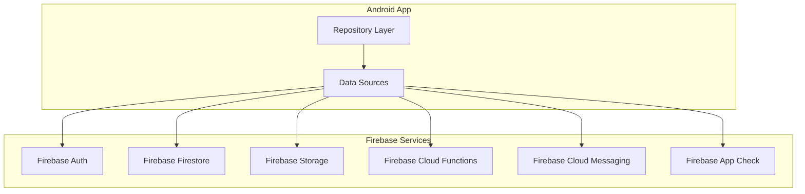

# Data Sources Integration Guide

**Document Type**: Integration Guide
**Version**: 1.0
**Last Updated**: 2026-02-26
**Feature Owner**: Data Layer Infrastructure
**Status**: ✅ Fully Implemented

## Overview

ROSTRY integrates with multiple data sources including Firebase services, external APIs, and local storage. This guide covers integration patterns, configuration, error handling, and best practices for each data source.

### Data Source Categories

| Category | Data Sources | Purpose |
|----------|-------------|---------|
| **Local** | Room Database, DataStore | Offline storage, caching, preferences |
| **Firebase** | Firestore, Auth, Storage, Functions, FCM | Backend services, authentication, messaging |
| **External APIs** | Weather API, Google Maps, Places | Third-party integrations |
| **Services** | VoiceLogService, BackupService | Internal services |

## Firebase Integration

### Firebase Services Architecture



### Firebase Configuration

**Module**: `di/FirebaseModule.kt`

```kotlin
@Module
@InstallIn(SingletonComponent::class)
object FirebaseModule {

    @Provides
    @Singleton
    fun provideFirebaseAuth(): FirebaseAuth {
        return FirebaseAuth.getInstance()
    }

    @Provides
    @Singleton
    fun provideFirebaseFirestore(): FirebaseFirestore {
        return FirebaseFirestore.getInstance().apply {
            firestoreSettings = FirestoreSettings.Builder()
                .setPersistenceEnabled(true)
                .build()
        }
    }

    @Provides
    @Singleton
    fun provideFirebaseStorage(): FirebaseStorage {
        return FirebaseStorage.getInstance()
    }

    @Provides
    @Singleton
    fun provideFirebaseMessaging(): FirebaseMessaging {
        return FirebaseMessaging.getInstance()
    }
}
```

### Firestore Integration Pattern

```kotlin
@Singleton
class RemoteUserDataSourceImpl @Inject constructor(
    private val firestore: FirebaseFirestore,
    private val userMapper: UserMapper,
    private val dispatcher: CoroutineDispatcher = Dispatchers.IO
) : RemoteUserDataSource {

    override suspend fun getUser(userId: String): User? {
        return withContext(dispatcher) {
            try {
                val snapshot = firestore.collection("users")
                    .document(userId)
                    .get()
                    .await()

                snapshot.toObject(UserEntity::class.java)
                    ?.let(userMapper::toDomain)
            } catch (e: Exception) {
                Timber.e(e, "Failed to fetch user $userId")
                null
            }
        }
    }

    override suspend fun updateUser(user: User) {
        withContext(dispatcher) {
            try {
                val entity = userMapper.toEntity(user)
                firestore.collection("users")
                    .document(user.id)
                    .set(entity)
                    .await()
            } catch (e: Exception) {
                Timber.e(e, "Failed to update user ${user.id}")
                throw e
            }
        }
    }

    override fun observeUser(userId: String): Flow<User?> {
        return callbackFlow {
            val registration = firestore.collection("users")
                .document(userId)
                .addSnapshotListener { snapshot, error ->
                    if (error != null) {
                        Timber.e(error, "Error observing user")
                        close(error)
                        return@addSnapshotListener
                    }

                    val user = snapshot?.toObject(UserEntity::class.java)
                        ?.let(userMapper::toDomain)
                    trySend(user)
                }

            awaitClose { registration.remove() }
        }.flowOn(dispatcher)
    }
}
```

### Firebase Storage Integration

```kotlin
@Singleton
class StorageRepositoryImpl @Inject constructor(
    private val storage: FirebaseStorage,
    private val auth: FirebaseAuth
) : BaseRepository(), StorageRepository {

    override suspend fun uploadProfileImage(
        userId: String,
        uri: Uri
    ): Resource<String> {
        return safeCall("uploadProfileImage") {
            val ref = storage.reference
                .child("users")
                .child(userId)
                .child("profile")
                .child("image.jpg")

            // Upload with metadata
            val metadata = storageMetadata {
                contentType = "image/jpeg"
                setCustomMetadata("userId", userId)
            }

            val uploadTask = ref.putFile(uri, metadata).await()

            // Get download URL
            ref.downloadUrl.await().toString()
        }
    }

    override suspend fun uploadProductImages(
        productId: String,
        uris: List<Uri>
    ): Resource<List<String>> {
        return safeCall("uploadProductImages") {
            uris.mapIndexed { index, uri ->
                val ref = storage.reference
                    .child("products")
                    .child(productId)
                    .child("image_$index.jpg")

                ref.putFile(uri).await()
                ref.downloadUrl.await().toString()
            }
        }
    }

    override suspend fun deleteFile(path: String): Resource<Unit> {
        return safeCall("deleteFile") {
            storage.reference.child(path).delete().await()
        }
    }
}
```

### Cloud Functions Integration

```kotlin
@Singleton
class CloudFunctionsManager @Inject constructor(
    private val firebaseFunctions: FirebaseFunctions
) {
    /**
     * Verify transfer via Cloud Function
     */
    suspend fun verifyTransfer(
        transferId: String,
        verificationCode: String
    ): Resource<TransferVerificationResult> {
        return try {
            val data = hashMapOf(
                "transferId" to transferId,
                "verificationCode" to verificationCode
            )

            val result = firebaseFunctions
                .getHttpsCallable("verifyTransfer")
                .call(data)
                .await()

            val response = Gson().fromJson(
                Gson().toJson(result.data),
                TransferVerificationResult::class.java
            )

            Resource.Success(response)
        } catch (e: Exception) {
            Resource.Error("Verification failed: ${e.message}", e)
        }
    }

    /**
     * Process payment via Cloud Function
     */
    suspend fun processPayment(
        orderId: String,
        paymentMethod: String
    ): Resource<PaymentResult> {
        return try {
            val data = hashMapOf(
                "orderId" to orderId,
                "paymentMethod" to paymentMethod
            )

            val result = firebaseFunctions
                .getHttpsCallable("processPayment")
                .call(data)
                .await()

            val response = Gson().fromJson(
                Gson().toJson(result.data),
                PaymentResult::class.java
            )

            Resource.Success(response)
        } catch (e: Exception) {
            Resource.Error("Payment failed: ${e.message}", e)
        }
    }

    /**
     * Upgrade user role via Cloud Function
     */
    suspend fun upgradeRole(
        userId: String,
        newRole: String,
        reason: String
    ): Resource<Unit> {
        return try {
            val data = hashMapOf(
                "userId" to userId,
                "newRole" to newRole,
                "reason" to reason
            )

            firebaseFunctions
                .getHttpsCallable("upgradeRole")
                .call(data)
                .await()

            Resource.Success(Unit)
        } catch (e: Exception) {
            Resource.Error("Role upgrade failed: ${e.message}", e)
        }
    }
}
```

### Firebase Cloud Messaging Integration

```kotlin
@Singleton
class NotificationManager @Inject constructor(
    private val messaging: FirebaseMessaging,
    private val notificationManagerCompat: NotificationManagerCompat
) {
    /**
     * Subscribe to topic
     */
    suspend fun subscribeToTopic(topic: String) {
        try {
            messaging.subscribeToTopic(topic).await()
            Timber.d("Subscribed to topic: $topic")
        } catch (e: Exception) {
            Timber.e(e, "Failed to subscribe to topic: $topic")
        }
    }

    /**
     * Unsubscribe from topic
     */
    suspend fun unsubscribeFromTopic(topic: String) {
        try {
            messaging.unsubscribeFromTopic(topic).await()
            Timber.d("Unsubscribed from topic: $topic")
        } catch (e: Exception) {
            Timber.e(e, "Failed to unsubscribe from topic: $topic")
        }
    }

    /**
     * Get FCM token
     */
    suspend fun getToken(): String? {
        return try {
            messaging.token.await()
        } catch (e: Exception) {
            Timber.e(e, "Failed to get FCM token")
            null
        }
    }

    /**
     * Handle incoming notification
     */
    fun handleNotification(remoteMessage: RemoteMessage) {
        val notification = remoteMessage.notification
        val data = remoteMessage.data

        if (notification != null) {
            showNotification(
                title = notification.title ?: "",
                body = notification.body ?: "",
                data = data
            )
        } else if (data.isNotEmpty()) {
            // Data message - handle in background
            handleDataMessage(data)
        }
    }

    private fun showNotification(
        title: String,
        body: String,
        data: Map<String, String>
    ) {
        val channelId = when (data["type"]) {
            "transfer" -> "transfers"
            "order" -> "orders"
            "message" -> "messages"
            else -> "general"
        }

        val notification = NotificationCompat.Builder(applicationContext, channelId)
            .setSmallIcon(R.drawable.ic_notification)
            .setContentTitle(title)
            .setContentText(body)
            .setPriority(NotificationCompat.PRIORITY_HIGH)
            .setAutoCancel(true)
            .setContentIntent(createPendingIntent(data))
            .build()

        notificationManagerCompat.notify(
            System.currentTimeMillis().toInt(),
            notification
        )
    }
}
```

## External API Integration

### Weather API Integration

**Repository**: `WeatherRepositoryImpl.kt`

```kotlin
@Singleton
class WeatherRepositoryImpl @Inject constructor(
    private val weatherApi: WeatherApi,
    private val weatherDao: WeatherDao,
    private val weatherMapper: WeatherMapper
) : BaseRepository(), WeatherRepository {

    override suspend fun getCurrentWeather(location: Location): Resource<Weather> {
        return safeCall("getCurrentWeather") {
            // Try cache first
            val cached = weatherDao.getCachedWeather(location.latitude, location.longitude)
            if (cached != null && !cached.isExpired()) {
                return@safeCall weatherMapper.toDomain(cached)
            }

            // Fetch from API
            val response = weatherApi.getCurrentWeather(
                lat = location.latitude,
                lon = location.longitude,
                appId = BuildConfig.WEATHER_API_KEY
            )

            val weather = weatherMapper.toDomain(response)

            // Cache the result
            weatherDao.insertWeather(
                WeatherEntity(
                    latitude = location.latitude,
                    longitude = location.longitude,
                    temperature = weather.temperature,
                    condition = weather.condition,
                    humidity = weather.humidity,
                    windSpeed = weather.windSpeed,
                    fetchedAt = Instant.now()
                )
            )

            weather
        }
    }

    override suspend fun getWeatherForecast(
        location: Location,
        days: Int
    ): Resource<List<WeatherForecast>> {
        return safeCall("getWeatherForecast") {
            val response = weatherApi.getWeatherForecast(
                lat = location.latitude,
                lon = location.longitude,
                cnt = days,
                appId = BuildConfig.WEATHER_API_KEY
            )

            response.list.map(weatherMapper::toForecastDomain)
        }
    }
}
```

### Google Maps Integration

**Module**: `di/LocationModule.kt`

```kotlin
@Module
@InstallIn(SingletonComponent::class)
object LocationModule {

    @Provides
    @Singleton
    fun provideFusedLocationProviderClient(
        @ApplicationContext context: Context
    ): FusedLocationProviderClient {
        return LocationServices.getFusedLocationProviderClient(context)
    }

    @Provides
    @Singleton
    fun provideGeocoder(@ApplicationContext context: Context): Geocoder {
        return Geocoder(context, Locale.getDefault())
    }
}
```

**Repository**: `LocationRepositoryImpl.kt`

```kotlin
@Singleton
class LocationRepositoryImpl @Inject constructor(
    private val fusedLocationClient: FusedLocationProviderClient,
    private val geocoder: Geocoder,
    private val placesClient: PlacesClient
) : BaseRepository(), LocationRepository {

    @SuppressLint("MissingPermission")
    override suspend fun getCurrentLocation(): Resource<Location> {
        return safeCall("getCurrentLocation") {
            val locationResult = fusedLocationClient.lastLocation.await()
            locationResult ?: throw LocationNotFoundException()
        }
    }

    override suspend fun getAddressFromLocation(location: Location): Resource<String> {
        return safeCall("getAddressFromLocation") {
            val addresses = geocoder.getFromLocation(
                location.latitude,
                location.longitude,
                1
            )

            addresses?.firstOrNull()?.getAddressLine(0)
                ?: throw AddressNotFoundException()
        }
    }

    override suspend fun searchPlaces(query: String): Resource<List<Place>> {
        return safeCall("searchPlaces") {
            val request = FindCurrentPlaceRequest.builder(listOf("establishment"))
                .setSessionToken(PlaceSessionToken())
                .build()

            val response = placesClient.findCurrentPlace(request).await()
            response.placeLikelihoods.map { it.place.toDomain() }
        }
    }
}
```

### Payment Gateway Integration

**Module**: `di/PaymentModule.kt`

```kotlin
@Module
@InstallIn(SingletonComponent::class)
object PaymentModule {

    @Provides
    @Singleton
    fun providePaymentGateway(): PaymentGateway {
        return DefaultPaymentGateway(
            apiKey = BuildConfig.PAYMENT_API_KEY,
            environment = if (BuildConfig.DEBUG) {
                PaymentEnvironment.SANDBOX
            } else {
                PaymentEnvironment.PRODUCTION
            }
        )
    }

    @Provides
    @Singleton
    fun providePaymentRepository(
        paymentGateway: PaymentGateway,
        paymentDao: PaymentDao
    ): PaymentRepository {
        return PaymentRepositoryImpl(paymentGateway, paymentDao)
    }
}
```

**Repository**: `PaymentRepositoryImpl.kt`

```kotlin
@Singleton
class PaymentRepositoryImpl @Inject constructor(
    private val paymentGateway: PaymentGateway,
    private val paymentDao: PaymentDao
) : BaseRepository(), PaymentRepository {

    override suspend fun initiatePayment(
        orderId: String,
        amount: Double,
        currency: String
    ): Resource<PaymentIntent> {
        return safeCall("initiatePayment") {
            val intent = paymentGateway.createPaymentIntent(
                amount = amount,
                currency = currency,
                metadata = mapOf("orderId" to orderId)
            )

            // Store locally
            paymentDao.insertPayment(
                PaymentEntity(
                    id = intent.id,
                    orderId = orderId,
                    amount = amount,
                    currency = currency,
                    status = PaymentStatus.PENDING,
                    createdAt = Instant.now()
                )
            )

            intent
        }
    }

    override suspend fun verifyPayment(
        paymentId: String,
        signature: String
    ): Resource<PaymentVerification> {
        return safeCall("verifyPayment") {
            val verification = paymentGateway.verifyPaymentSignature(
                paymentId = paymentId,
                signature = signature
            )

            if (verification.success) {
                // Update local record
                paymentDao.updatePaymentStatus(
                    paymentId = paymentId,
                    status = PaymentStatus.COMPLETED
                )
            }

            verification
        }
    }

    override suspend fun refundPayment(
        paymentId: String,
        amount: Double?,
        reason: String
    ): Resource<Refund> {
        return safeCall("refundPayment") {
            val refund = paymentGateway.createRefund(
                paymentId = paymentId,
                amount = amount,
                reason = reason
            )

            // Update local record
            paymentDao.insertRefund(
                RefundEntity(
                    id = refund.id,
                    paymentId = paymentId,
                    amount = refund.amount,
                    reason = reason,
                    status = refund.status,
                    createdAt = Instant.now()
                )
            )

            refund
        }
    }
}
```

## Service Integration

### VoiceLogService

```kotlin
@Singleton
class VoiceLogService @Inject constructor(
    private val firestore: FirebaseFirestore,
    private val auth: FirebaseAuth
) {
    /**
     * Log voice activity
     */
    suspend fun logVoiceActivity(
        activityType: String,
        metadata: Map<String, Any>
    ): Resource<Unit> {
        return try {
            val userId = auth.currentUser?.uid
                ?: return Resource.Error("User not authenticated")

            val log = hashMapOf(
                "userId" to userId,
                "activityType" to activityType,
                "metadata" to metadata,
                "timestamp" to FieldValue.serverTimestamp()
            )

            firestore.collection("voice_logs")
                .add(log)
                .await()

            Resource.Success(Unit)
        } catch (e: Exception) {
            Resource.Error("Voice logging failed: ${e.message}", e)
        }
    }

    /**
     * Get voice activity history
     */
    suspend fun getVoiceHistory(
        limit: Int = 50
    ): Resource<List<VoiceLog>> {
        return try {
            val userId = auth.currentUser?.uid
                ?: return Resource.Error("User not authenticated")

            val snapshot = firestore.collection("voice_logs")
                .whereEqualTo("userId", userId)
                .orderBy("timestamp", Query.Direction.DESCENDING)
                .limit(limit.toLong())
                .get()
                .await()

            val logs = snapshot.documents.mapNotNull { doc ->
                doc.toObject(VoiceLog::class.java)
            }

            Resource.Success(logs)
        } catch (e: Exception) {
            Resource.Error("Failed to fetch voice history: ${e.message}", e)
        }
    }
}
```

### BackupService

```kotlin
@Singleton
class BackupService @Inject constructor(
    private val storage: FirebaseStorage,
    private val firestore: FirebaseFirestore,
    private val auth: FirebaseAuth,
    private val gson: Gson
) {
    /**
     * Backup user data
     */
    suspend fun backupUserData(): Resource<String> {
        return safeCall("backupUserData") {
            val userId = auth.currentUser?.uid
                ?: throw UnauthenticatedException()

            // Collect all user data
            val backupData = BackupData(
                user = getUserData(userId),
                products = getUserProducts(userId),
                orders = getUserOrders(userId),
                transfers = getUserTransfers(userId),
                backupAt = Instant.now()
            )

            // Serialize to JSON
            val json = gson.toJson(backupData)

            // Upload to Storage
            val backupRef = storage.reference
                .child("backups")
                .child(userId)
                .child("backup_${System.currentTimeMillis()}.json")

            val bytes = json.toByteArray(Charsets.UTF_8)
            val uploadTask = backupRef.putBytes(bytes).await()

            // Get download URL
            backupRef.downloadUrl.await().toString()
        }
    }

    /**
     * Restore user data from backup
     */
    suspend fun restoreUserData(backupUrl: String): Resource<Unit> {
        return safeCall("restoreUserData") {
            val userId = auth.currentUser?.uid
                ?: throw UnauthenticatedException()

            // Download backup file
            val backupRef = FirebaseStorage.getInstance().getReferenceFromUrl(backupUrl)
            val bytes = backupRef.getBytes(Long.MAX_VALUE).await()
            val json = String(bytes, Charsets.UTF_8)

            // Parse backup data
            val backupData = gson.fromJson(json, BackupData::class.java)

            // Restore data to Firestore
            restoreUserData(userId, backupData)
        }
    }

    private suspend fun restoreUserData(userId: String, backupData: BackupData) {
        val batch = firestore.batch()

        // Restore user document
        val userRef = firestore.collection("users").document(userId)
        batch.set(userRef, backupData.user)

        // Restore products
        backupData.products.forEach { product ->
            val productRef = firestore.collection("products").document(product.id)
            batch.set(productRef, product)
        }

        // Restore orders
        backupData.orders.forEach { order ->
            val orderRef = firestore.collection("orders").document(order.id)
            batch.set(orderRef, order)
        }

        // Commit batch
        batch.commit().await()
    }
}
```

## Error Handling

### API Error Handling

```kotlin
sealed class ApiError(
    val message: String,
    val code: Int? = null,
    val cause: Throwable? = null
) : Exception(message, cause) {

    class Unauthorized(message: String = "Unauthorized") : ApiError(message, 401)
    class Forbidden(message: String = "Forbidden") : ApiError(message, 403)
    class NotFound(message: String = "Not found") : ApiError(message, 404)
    class ServerError(message: String = "Server error", code: Int) : ApiError(message, code)
    class NetworkError(message: String = "Network error", cause: Throwable) : ApiError(message, null, cause)
    class TimeoutError(message: String = "Request timeout") : ApiError(message, 408)
    class RateLimitExceeded(message: String = "Rate limit exceeded") : ApiError(message, 429)
    class UnknownError(message: String = "Unknown error", cause: Throwable?) : ApiError(message, null, cause)

    companion object {
        fun fromThrowable(throwable: Throwable): ApiError {
            return when (throwable) {
                is ApiError -> throwable
                is HttpException -> {
                    when (throwable.code()) {
                        401 -> Unauthorized()
                        403 -> Forbidden()
                        404 -> NotFound()
                        408 -> TimeoutError()
                        429 -> RateLimitExceeded()
                        in 500..599 -> ServerError("Server error", throwable.code())
                        else -> UnknownError(throwable.message, throwable)
                    }
                }
                is IOException -> NetworkError("Network error", throwable)
                is TimeoutCancellationException -> TimeoutError()
                else -> UnknownError(throwable.message, throwable)
            }
        }
    }
}
```

### Retry Mechanism

```kotlin
class RetryHandler @Inject constructor(
    private val networkMonitor: NetworkHealthMonitor
) {
    /**
     * Execute with retry
     */
    suspend fun <T> executeWithRetry(
        operation: String,
        maxRetries: Int = 3,
        initialDelay: Long = 1000,
        maxDelay: Long = 30000,
        factor: Double = 2.0,
        block: suspend () -> T
    ): T {
        var currentDelay = initialDelay
        var lastException: Exception? = null

        repeat(maxRetries) { attempt ->
            try {
                return block()
            } catch (e: Exception) {
                lastException = e

                // Don't retry on certain errors
                if (e is ApiError.Unauthorized || e is ApiError.Forbidden) {
                    throw e
                }

                // Check network status
                if (!networkMonitor.isOnline()) {
                    Timber.w("Network unavailable, waiting...")
                }

                // Wait before retry
                if (attempt < maxRetries - 1) {
                    Timber.w(e, "$operation failed (attempt ${attempt + 1}/$maxRetries), retrying in ${currentDelay}ms")
                    delay(currentDelay)
                    currentDelay = (currentDelay * factor).toLong().coerceAtMost(maxDelay)
                }
            }
        }

        throw lastException ?: IllegalStateException("Unknown error")
    }
}
```

## Best Practices

### Data Source Selection

1. **Read operations**: Cache → Local → Remote
2. **Write operations**: Local → Queue → Remote
3. **Critical data**: Remote with local fallback
4. **Static data**: Cache with long TTL

### Error Recovery

1. **Network errors**: Retry with exponential backoff
2. **Auth errors**: Refresh token or re-authenticate
3. **Server errors**: Fallback to cache
4. **Rate limits**: Queue and retry later

### Security

1. **API keys**: Store in BuildConfig, never in code
2. **Tokens**: Store in encrypted DataStore
3. **Sensitive data**: Encrypt before storage
4. **Network**: Use HTTPS only, certificate pinning for production

## Related Documentation

- `firebase-setup.md` - Firebase configuration and setup
- `api-integration-guide.md` - API integration patterns
- `data-layer-architecture.md` - Data layer architecture
- `security-encryption.md` - Security and encryption

## Appendix: File Locations

```
data/remote/
├── RemoteUserDataSource.kt
├── RemoteProductDataSource.kt
├── RemoteOrderDataSource.kt
└── ...

data/local/
├── LocalUserDataSource.kt
├── LocalProductDataSource.kt
├── LocalOrderDataSource.kt
└── ...

data/service/
├── VoiceLogService.kt
├── BackupService.kt
└── ...

di/
├── FirebaseModule.kt
├── NetworkModule.kt
├── LocationModule.kt
├── PaymentModule.kt
└── ...
```
