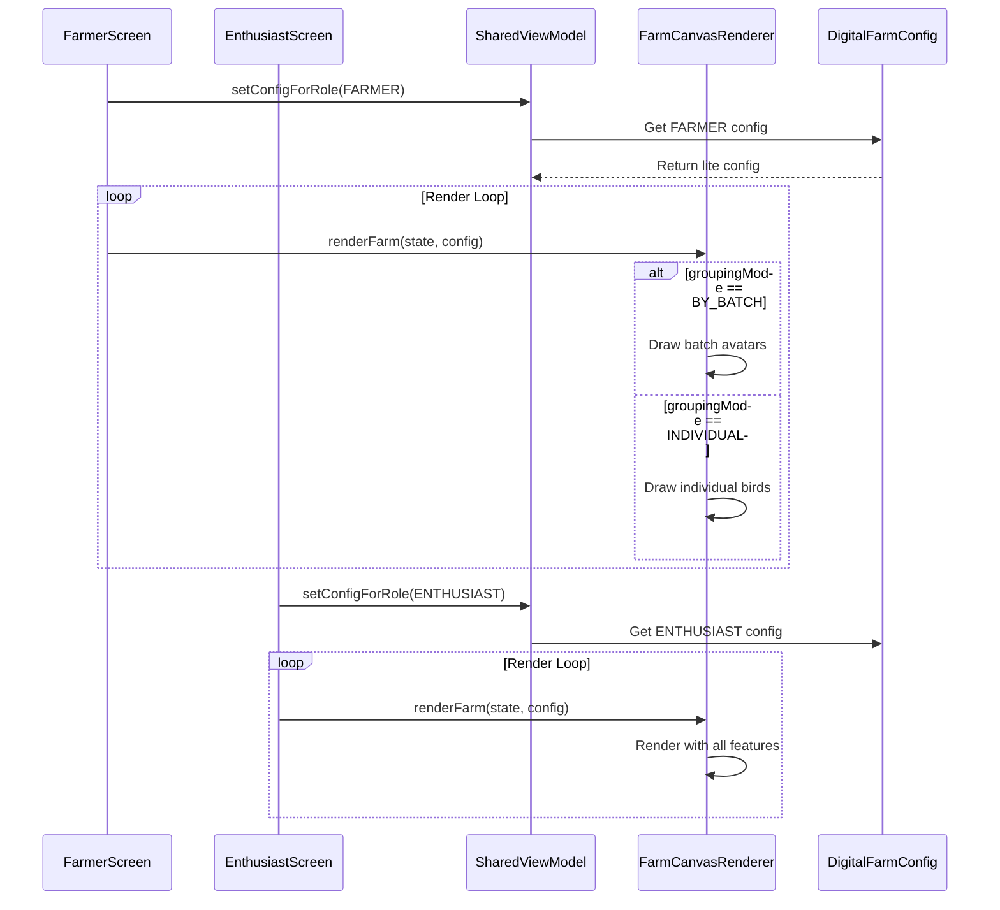

# Digital Farm Architecture

## Overview

The Digital Farm uses a **unified config-based renderer** that adapts to different user personas (FARMER vs ENTHUSIAST) through `DigitalFarmConfig` flags.

## Architecture Diagram



## Components

### Domain Layer
- **`DigitalFarmConfig`**: Defines persona-specific behavior
  - `FARMER`: Lite mode (batch rendering, static, no particles)
  - `ENTHUSIAST`: Premium mode (individual birds, animations, effects)
- **`DigitalFarmModels`**: Shared data models for zones, birds, stats

### Presentation Layer

| Component | Location | Purpose |
|-----------|----------|---------|
| **Shared ViewModel** | `ui/enthusiast/digitalfarm/DigitalFarmViewModel.kt` | Used by BOTH personas |
| **Shared Renderer** | `ui/enthusiast/digitalfarm/FarmCanvasRenderer.kt` | 2280-line renderer with config-based branching |
| **Farmer Screen** | `ui/farmer/DigitalFarmScreen.kt` | Farmer UI with operational metrics |
| **Enthusiast Screen** | `ui/enthusiast/digitalfarm/DigitalFarmScreen.kt` | Enthusiast UI with genetics focus |

## Performance Characteristics

| Feature | Farmer (Lite) | Enthusiast (Premium) |
|---------|---------------|----------------------|
| Rendering | Batch avatars | Individual sprites |
| Animation | Static | 60fps continuous |
| Particles | Disabled | Enabled |
| Day/Night | Static | Dynamic |
| Memory | ~50-100MB | ~200-400MB |
| Draw Calls | ~10-20 | ~500+ |

## Config Flags Applied

### FARMER Config
```kotlin
enableParticles = false      // No clouds, rain, wind
enableDayNightCycle = false  // Static afternoon lighting  
enableFlocking = false       // No animation loop
groupingMode = BY_BATCH      // One avatar per zone
renderRate = STATIC          // Render only on data changes
```

### ENTHUSIAST Config
```kotlin
enableParticles = true       // All weather effects
enableDayNightCycle = true   // Dynamic sky
enableFlocking = true        // Bird movement animations
groupingMode = INDIVIDUAL    // Each bird rendered
renderRate = DYNAMIC         // 60fps animation loop
```

## Stats Bar Metrics

| Farmer | Enthusiast |
|--------|------------|
| 🐔 Total Birds | 🐔 Total Birds |
| 📦 Batches | 🥚 Eggs Today |
| ⭐ Ready for Sale | ⭐ Ready for Sale |
| 🌾 Feed Usage | ₹ Coins |

## Adding New Features

When adding features, consider:
1. Should it be persona-specific? Add to `DigitalFarmConfig`
2. Performance impact? Add config flag for lite mode
3. Update both screen implementations if UI differs
