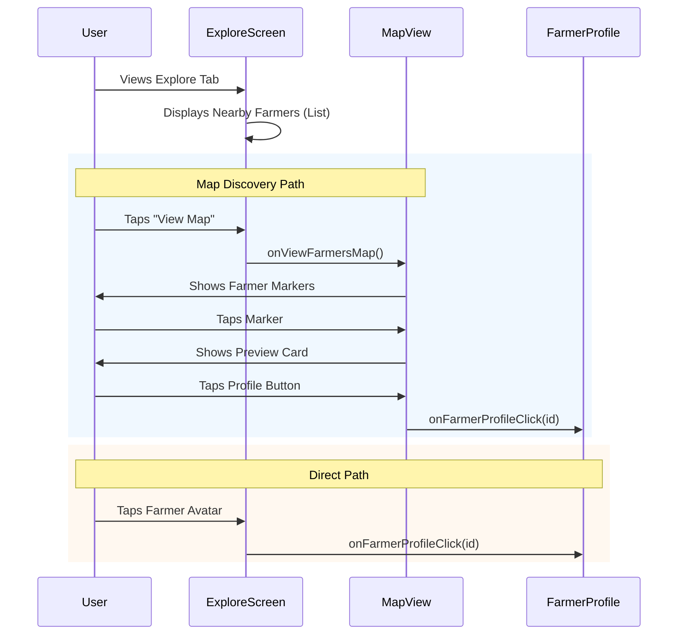

# Explore Features Documentation

## Overview
The Explore feature is the central hub for discovery in ROSTRY, serving both General users and Enthusiasts. It facilitates the discovery of farmers, educational content, and decision-making tools.

## Core Components

### 1. Nearby Farmers Section
A location-aware section that helps users find local poultry farmers.
- **Display**: Horizontal scroll of `FarmerAvatarCard` items.
- **Data**: Fetches farmers within a specific radius (default 50km).
- **Interactions**:
  - Tap Avatar: Navigates to Farmer Profile.
  - "View Map": Opens the geographical map view.

### 2. Map View Integration
Visualizes farmer distribution on an interactive map.
- **Access**: Via the "View Map" button in the Nearby Farmers section.
- **Features**:
  - Clustered markers for farmer locations.
  - User's current location indicator.
  - Tap marker to see farmer preview card.
  - Tap preview card to navigate to full profile.

### 3. Educational Content
Curated articles and guides for poultry management.
- **Structure**: Categorized feeds (e.g., "Getting Started", "Health", "Nutrition").
- **Content Type**: Rich text with thumbnail images.

### 4. Help Me Choose Wizard
An interactive decision support tool for selecting bird breeds.
- **Flow**: Questionnaire -> Recommendation Engine -> Suggested Breeds.

## Navigation Flow



## Integration Details

The `GeneralExploreRoute` uses a callback-based navigation pattern to maintain decoupling:

```kotlin
@Composable
fun GeneralExploreRoute(
    viewModel: GeneralExploreViewModel = hiltViewModel(),
    onFarmerProfileClick: (String) -> Unit,
    onViewFarmersMap: () -> Unit,
    onContentClick: (String) -> Unit
) {
    // Implementation
}
```
