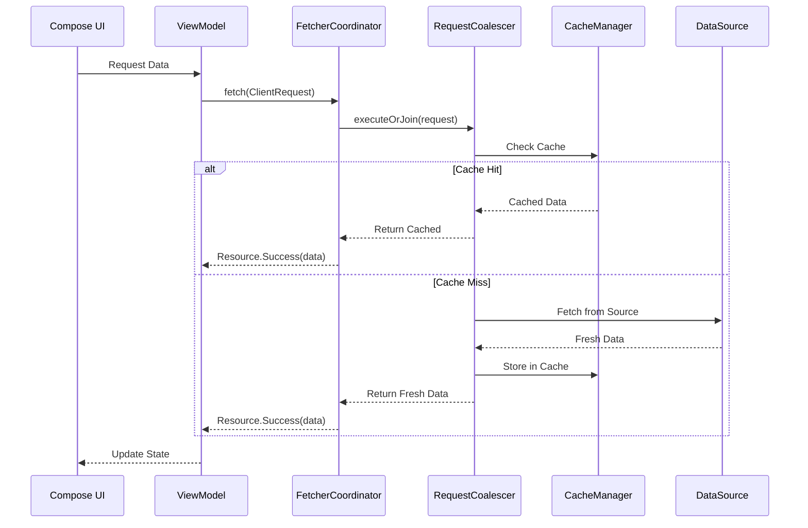
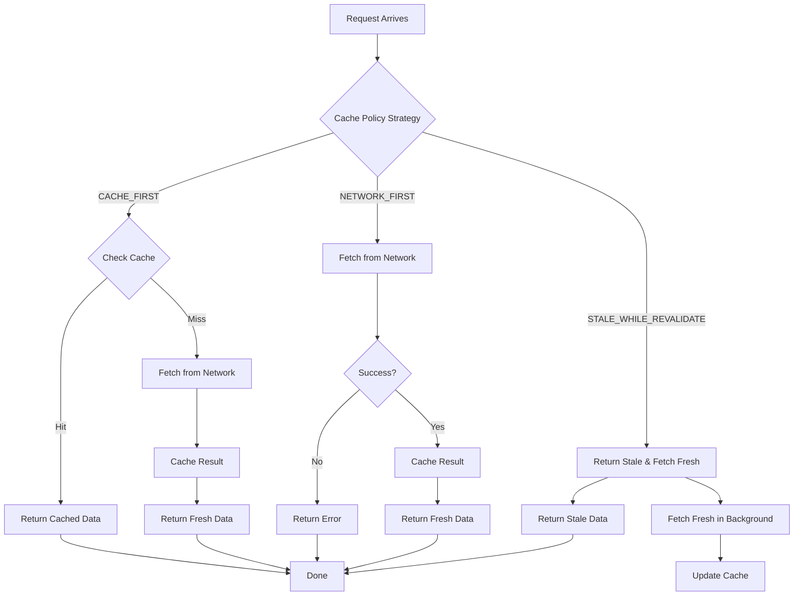
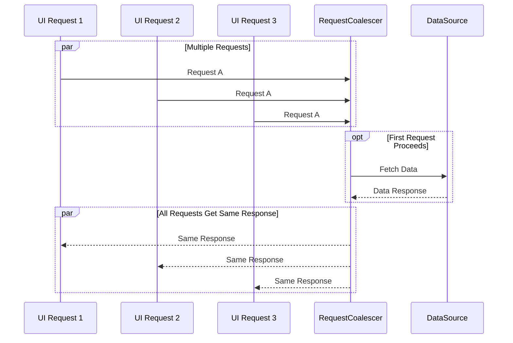
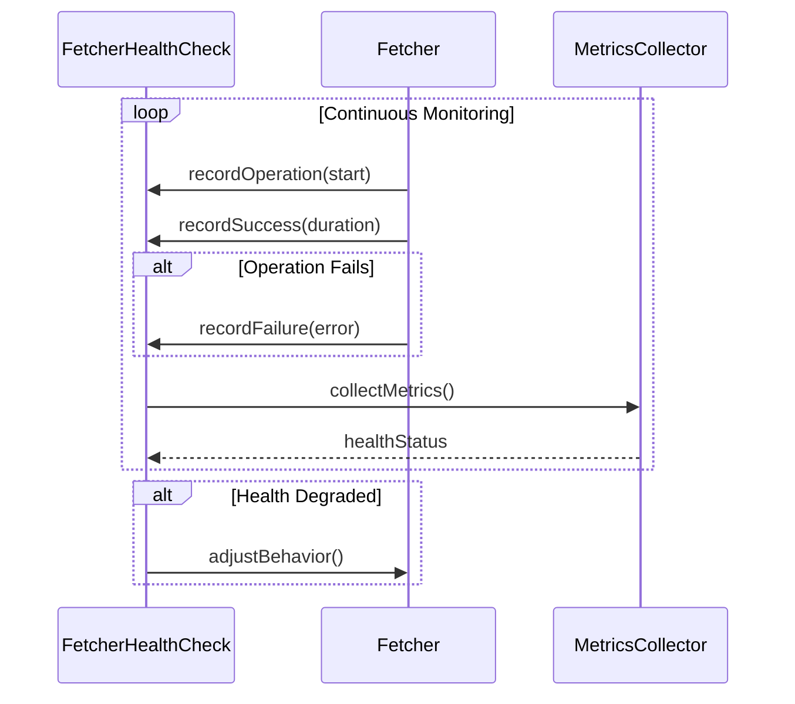
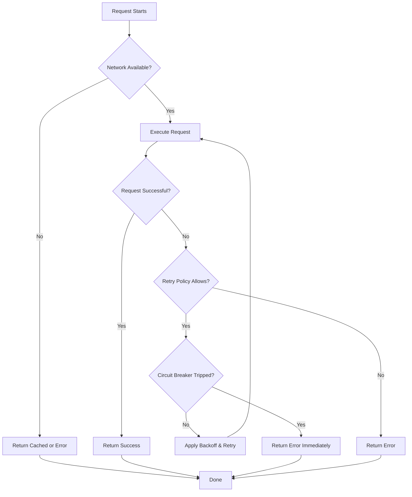

# Fetcher System Documentation

## Overview

The Fetcher System is a centralized data fetching infrastructure that provides intelligent caching, request deduplication, and health monitoring capabilities. It serves as the primary mechanism for retrieving data from various sources while optimizing performance and reliability.

## Architecture

### Core Components

#### 1. FetcherRegistry
The central registry for all fetchers with type-safe registration and retrieval.

- **Purpose**: Manages all available fetchers and provides a way to retrieve them by type
- **Key Features**:
  - Type-safe fetcher registration
  - Centralized fetcher management
  - Runtime fetcher discovery

#### 2. FetcherCoordinator
Orchestrates fetch operations, manages cache interactions, and handles request routing.

- **Purpose**: Coordinates the entire fetch process, including cache checks and data retrieval
- **Key Features**:
  - Cache-first or network-first strategies
  - Request routing to appropriate fetchers
  - Cache interaction management
  - Error handling coordination

#### 3. RequestCoalescer
Deduplicates concurrent requests for the same data to prevent redundant network calls.

- **Purpose**: Prevents multiple identical requests from being processed simultaneously
- **Key Features**:
  - Thread-safe request deduplication
  - Concurrent request handling
  - Performance optimization
  - Resource conservation

#### 4. ContextualLoader
Handles contextual data loading with priority management and smart prefetching.

- **Purpose**: Loads data based on context and usage patterns
- **Key Features**:
  - Context-aware loading
  - Priority-based fetching
  - Smart prefetching
  - Resource optimization

#### 5. FetcherHealthCheck
Monitors fetcher performance, availability, and response times for proactive maintenance.

- **Purpose**: Tracks the health and performance of fetchers
- **Key Features**:
  - Performance metrics collection
  - Availability monitoring
  - Response time tracking
  - Proactive maintenance alerts

## Design Patterns

### Strategy Pattern
The fetcher system implements the Strategy pattern to allow different fetching strategies for different data sources:

```kotlin
interface Fetcher<T> {
    suspend fun fetch(request: ClientRequest<T>): Resource<T>
    fun supports(request: ClientRequest<T>): Boolean
}

class UserFetcher : Fetcher<User> {
    override suspend fun fetch(request: ClientRequest<User>): Resource<User> {
        // Implementation
    }
    
    override fun supports(request: ClientRequest<User>): Boolean {
        return request.type == RequestType.USER
    }
}
```

### Factory Pattern
For creating fetcher instances with appropriate configurations:

```kotlin
class FetcherFactory {
    fun createFetcher(type: FetchType): Fetcher<*> {
        return when (type) {
            FetchType.USER -> UserFetcher()
            FetchType.PRODUCT -> ProductFetcher()
            FetchType.ORDER -> OrderFetcher()
            else -> DefaultFetcher()
        }
    }
}
```

### Observer Pattern
For monitoring fetcher health and performance metrics:

```kotlin
interface FetcherHealthObserver {
    fun onHealthChanged(fetcherId: String, healthStatus: HealthStatus)
    fun onPerformanceMetric(metric: PerformanceMetric)
}
```

## Caching Integration

### Cache Strategies
The fetcher system supports multiple caching strategies:

1. **Cache First**: Return cached data if available, otherwise fetch from network
2. **Network First**: Always fetch from network, update cache with response
3. **Stale While Revalidate**: Return stale cache while fetching fresh data in background
4. **Cache Only**: Only return cached data, no network requests
5. **Network Only**: Skip cache, always fetch from network

### Cache Policy Configuration
```kotlin
data class CachePolicy(
    val strategy: CacheStrategy,
    val ttl: Duration,
    val maxSize: Int,
    val evictionPolicy: EvictionPolicy
)
```

### Cache Invalidation
Smart invalidation based on data dependencies and update events:

```kotlin
interface CacheInvalidator {
    suspend fun invalidate(key: String)
    suspend fun invalidateByPattern(pattern: String)
    suspend fun invalidateByTag(tag: String)
    suspend fun clear()
}
```

## Concurrency & Performance

### Thread Safety
All fetcher operations are thread-safe to handle concurrent requests:

```kotlin
class ThreadSafeFetcher<T> : Fetcher<T> {
    private val mutex = Mutex()
    
    override suspend fun fetch(request: ClientRequest<T>): Resource<T> {
        return mutex.withLock {
            // Thread-safe fetch implementation
        }
    }
}
```

### Request Coalescing
Prevents duplicate network calls for identical requests occurring simultaneously:

```kotlin
class RequestCoalescer {
    private val activeRequests = mutableMapOf<String, Deferred<Resource<*>>>()
    
    suspend fun <T> executeOrJoin(request: ClientRequest<T>, fetcher: Fetcher<T>): Resource<T> {
        val key = generateRequestKey(request)
        
        return activeRequests[key]?.let { 
            // Join existing request
            @Suppress("UNCHECKED_CAST")
            it.await() as Resource<T>
        } ?: run {
            // Create new request
            val deferred = async {
                try {
                    fetcher.fetch(request)
                } finally {
                    activeRequests.remove(key)
                }
            }
            
            activeRequests[key] = deferred
            deferred.await() as Resource<T>
        }
    }
}
```

## Error Handling & Resilience

### Retry Mechanisms
Configurable retry policies with exponential backoff:

```kotlin
data class RetryPolicy(
    val maxAttempts: Int,
    val initialDelay: Duration,
    val multiplier: Float,
    val maxDelay: Duration
)

class RetryMechanism {
    suspend fun <T> executeWithRetry(
        retryPolicy: RetryPolicy,
        operation: suspend () -> Resource<T>
    ): Resource<T> {
        var attempt = 0
        var currentDelay = retryPolicy.initialDelay
        
        while (attempt < retryPolicy.maxAttempts) {
            val result = operation()
            
            if (result is Resource.Success) {
                return result
            }
            
            if (attempt == retryPolicy.maxAttempts - 1) {
                return result
            }
            
            delay(currentDelay.inWholeMilliseconds)
            currentDelay = minOf(
                currentDelay * retryPolicy.multiplier,
                retryPolicy.maxDelay
            )
            
            attempt++
        }
        
        return Resource.Error("Max retry attempts exceeded")
    }
}
```

### Circuit Breaker Pattern
Prevents cascading failures during service outages:

```kotlin
class CircuitBreaker(
    private val failureThreshold: Int,
    private val timeout: Duration
) {
    enum class State { CLOSED, OPEN, HALF_OPEN }
    
    private var state = State.CLOSED
    private var failureCount = 0
    private var lastFailureTime: Instant? = null
    
    suspend fun <T> execute(operation: suspend () -> Resource<T>): Resource<T> {
        return when (state) {
            State.OPEN -> {
                if (isTimeoutElapsed()) {
                    state = State.HALF_OPEN
                    attemptCall(operation)
                } else {
                    Resource.Error("Circuit breaker is OPEN")
                }
            }
            State.HALF_OPEN -> attemptCall(operation)
            State.CLOSED -> attemptCall(operation)
        }
    }
    
    private suspend fun <T> attemptCall(operation: suspend () -> Resource<T>): Resource<T> {
        return try {
            val result = operation()
            if (result is Resource.Success) {
                onSuccess()
            } else {
                onFailure()
            }
            result
        } catch (e: Exception) {
            onFailure()
            Resource.Error(e.message ?: "Unknown error")
        }
    }
    
    private fun onSuccess() {
        failureCount = 0
        state = State.CLOSED
    }
    
    private fun onFailure() {
        failureCount++
        if (failureCount >= failureThreshold) {
            state = State.OPEN
            lastFailureTime = Clock.System.now()
        }
    }
    
    private fun isTimeoutElapsed(): Boolean {
        val lastFailure = lastFailureTime ?: return true
        return Clock.System.now() - lastFailure > timeout
    }
}
```

## Integration with Repository Layer

### Repository Integration Pattern
The fetcher system integrates seamlessly with the repository layer:

```kotlin
@Singleton
class ProductRepositoryImpl @Inject constructor(
    private val fetcherCoordinator: FetcherCoordinator,
    private val cacheManager: CacheManager,
    private val localDataSource: LocalProductDataSource,
    private val remoteDataSource: RemoteProductDataSource
) : ProductRepository {
    
    override suspend fun getProducts(): Resource<List<Product>> {
        val request = ClientRequest(
            key = "products",
            fetcher = remoteDataSource::fetchProducts,
            cachePolicy = CachePolicy(
                strategy = CacheStrategy.CACHE_FIRST,
                ttl = 5.minutes,
                maxSize = 100,
                evictionPolicy = EvictionPolicy.LRU
            ),
            ttl = 5.minutes
        )
        
        return fetcherCoordinator.fetch(request)
    }
    
    override suspend fun getProduct(id: String): Resource<Product> {
        val request = ClientRequest(
            key = "product:$id",
            fetcher = { remoteDataSource.fetchProduct(id) },
            cachePolicy = CachePolicy(
                strategy = CacheStrategy.CACHE_FIRST,
                ttl = 10.minutes,
                maxSize = 500,
                evictionPolicy = EvictionPolicy.LRU
            ),
            ttl = 10.minutes
        )
        
        return fetcherCoordinator.fetch(request)
    }
}
```

### Resource Wrapper Pattern
Returns data wrapped in Resource sealed class for consistent error handling:

```kotlin
sealed class Resource<out T> {
    data class Success<T>(val data: T) : Resource<T>()
    data class Error(val message: String, val exception: Exception? = null) : Resource<Nothing>()
    object Loading : Resource<Nothing>()
}
```

## Usage Examples

### Basic Fetch Operation
```kotlin
class ProductService @Inject constructor(
    private val fetcherCoordinator: FetcherCoordinator
) {
    suspend fun fetchProduct(productId: String): Resource<Product> {
        val request = ClientRequest(
            key = "product_$productId",
            fetcher = { fetchProductFromApi(productId) },
            cachePolicy = CachePolicy.default()
        )
        
        return fetcherCoordinator.fetch(request)
    }
    
    private suspend fun fetchProductFromApi(id: String): Product {
        // Implementation
    }
}
```

### Fetch with Custom Cache Policy
```kotlin
suspend fun fetchUserProfile(userId: String): Resource<User> {
    val request = ClientRequest(
        key = "user_$userId",
        fetcher = { fetchUserFromRemote(userId) },
        cachePolicy = CachePolicy(
            strategy = CacheStrategy.STALE_WHILE_REVALIDATE,
            ttl = 30.minutes,
            maxSize = 200,
            evictionPolicy = EvictionPolicy.LRU
        )
    )
    
    return fetcherCoordinator.fetch(request)
}
```

### Batch Fetch Operation
```kotlin
suspend fun fetchMultipleProducts(ids: List<String>): Resource<List<Product>> {
    val requests = ids.map { id ->
        ClientRequest(
            key = "product_$id",
            fetcher = { fetchProductById(id) },
            cachePolicy = CachePolicy.default()
        )
    }
    
    return fetcherCoordinator.batchFetch(requests)
}
```

## Testing Fetchers

### Unit Testing Pattern
```kotlin
@Test
fun `fetch with cache miss should fetch from remote and cache result`() = runTest {
    // Given
    val mockRemoteDataSource = mockk<RemoteProductDataSource>()
    coEvery { mockRemoteDataSource.fetchProducts() } returns expectedResult
    
    val fetcher = ProductFetcher(mockRemoteDataSource)
    val request = ClientRequest(
        key = "products",
        fetcher = { mockRemoteDataSource.fetchProducts() },
        cachePolicy = CachePolicy(CacheStrategy.CACHE_ONLY)
    )
    
    // When
    val result = fetcher.fetch(request)
    
    // Then
    assertIs<Resource.Success<List<Product>>>(result)
    assertEquals(expectedResult, result.data)
}
```

### Integration Testing
```kotlin
@HiltTest
class FetcherIntegrationTest {
    @get:Rule
    val hiltRule = HiltAndroidRule(this)
    
    @Inject
    lateinit var fetcherCoordinator: FetcherCoordinator
    
    @Inject
    lateinit var cacheManager: CacheManager
    
    @Test
    fun `fetch with cache hit should return cached data`() = runTest {
        // Given
        val testData = listOf(Product("1", "Test Product"))
        cacheManager.put("test-key", testData)
        
        val request = ClientRequest(
            key = "test-key",
            fetcher = { /* This shouldn't be called */ },
            cachePolicy = CachePolicy(CacheStrategy.CACHE_ONLY)
        )
        
        // When
        val result = fetcherCoordinator.fetch(request)
        
        // Then
        assertIs<Resource.Success<List<Product>>>(result)
        assertEquals(testData, result.data)
    }
}
```

## Performance Considerations

### Caching Strategy Selection
Choose the appropriate cache strategy based on data characteristics:

- **CACHE_FIRST**: For static or slowly changing data
- **NETWORK_FIRST**: For frequently updated data
- **STALE_WHILE_REVALIDATE**: For data that can tolerate slightly stale content
- **CACHE_ONLY**: For offline-first scenarios
- **NETWORK_ONLY**: For real-time data requirements

### Memory Management
- Configure appropriate cache sizes to balance performance and memory usage
- Use LRU eviction policy to remove least recently used items
- Monitor cache hit ratios to optimize performance

### Network Optimization
- Implement request batching where appropriate
- Use compression for large payloads
- Implement smart prefetching based on usage patterns

## Monitoring & Observability

### Metrics Collected
- Cache hit/miss ratios
- Fetch success/failure rates
- Response times
- Error rates
- Active request counts

### Logging Strategy
- Log request keys and timing for performance analysis
- Track cache operations for debugging
- Monitor health check results
- Record circuit breaker state changes

## Security Considerations

### Data Encryption
- Encrypt cached sensitive data at rest
- Use secure key management for encryption keys
- Sanitize data before caching to remove sensitive information

### Access Control
- Validate permissions before fetching data
- Implement role-based access controls
- Audit data access patterns

## Troubleshooting

### Common Issues
- **Cache Inconsistency**: Ensure proper cache invalidation strategies
- **Memory Leaks**: Monitor cache sizes and implement proper cleanup
- **Network Failures**: Implement robust retry and fallback mechanisms
- **Thread Safety**: Ensure all operations are properly synchronized

### Debugging Tips
- Enable detailed logging for fetch operations
- Monitor cache hit ratios to identify performance issues
- Use health check endpoints to verify fetcher status
- Implement circuit breaker dashboards for monitoring

## Feature Flow Diagrams

### Fetch Request Flow



### Cache Strategy Flow



### Request Coalescing Flow



### Health Monitoring Flow



### Error Handling & Retry Flow

