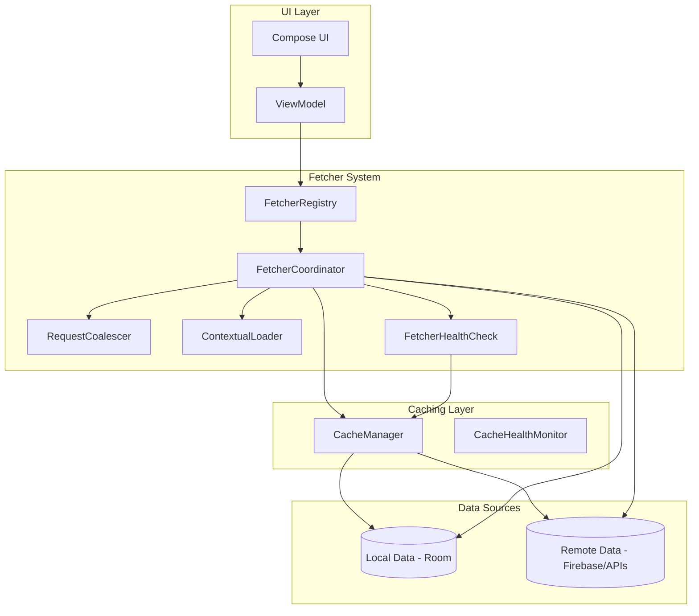
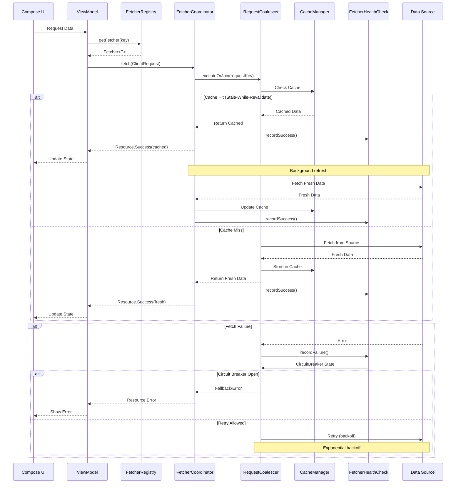
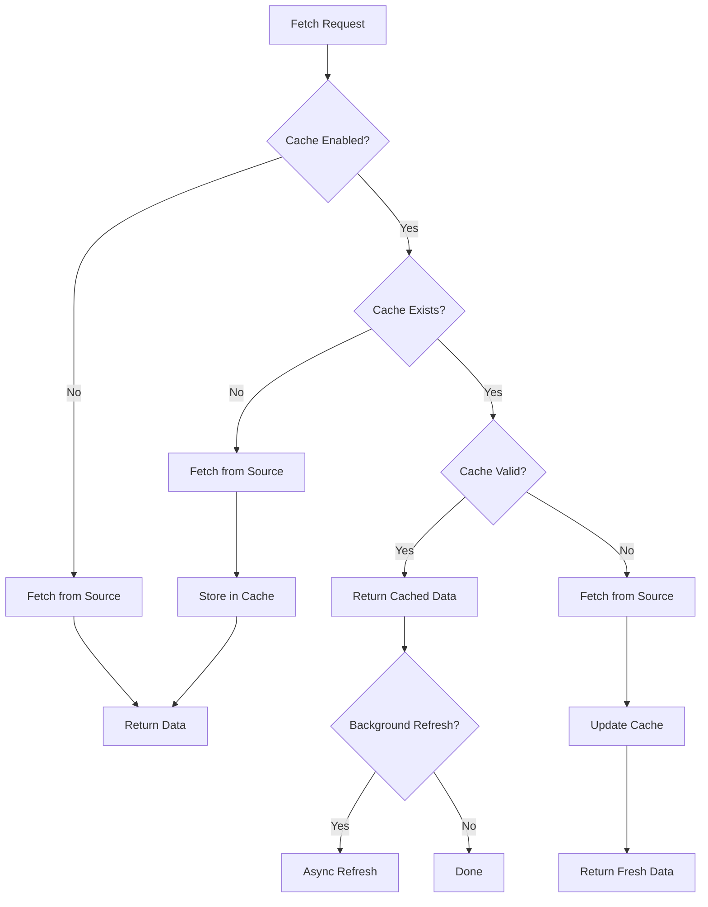

# Fetcher System Architecture

**Document Type**: Architecture Guide
**Version**: 1.0
**Last Updated**: 2026-02-26
**Feature Owner**: Data Layer Infrastructure
**Status**: ✅ Fully Implemented

## Overview

The **Fetcher System** is a centralized data fetching infrastructure that provides intelligent caching, request deduplication, and health monitoring capabilities. It serves as the backbone for ROSTRY's data retrieval operations, ensuring optimal performance and reliability across all data sources.

### Key Benefits

| Benefit | Description |
|---------|-------------|
| **Reduced Network Overhead** | Minimizes redundant requests through intelligent caching and coalescing |
| **Improved Performance** | Faster response times through strategic caching and prefetching |
| **Enhanced Reliability** | Better fault tolerance and graceful degradation during service issues |
| **Centralized Management** | Single point of control for all data fetching operations |
| **Consistent Behavior** | Uniform error handling and caching behavior across the application |

## Architecture

### Core Components

The Fetcher System consists of five primary components working together to provide efficient data retrieval:


```mermaid
graph TB
    subgraph "UI Layer"
        UI[Compose UI]
        VM[ViewModel]
    end

    subgraph "Fetcher System"
        FR[FetcherRegistry]
        FC[FetcherCoordinator]
        RC[RequestCoalescer]
        CL[ContextualLoader]
        HC[FetcherHealthCheck]
    end

    subgraph "Caching Layer"
        CM[CacheManager]
        CH[CacheHealthMonitor]
    end

    subgraph "Data Sources"
        Local[(Local Data - Room)]
        Remote[(Remote Data - Firebase/APIs)]
    end

    UI --> VM
    VM --> FR
    FR --> FC
    FC --> RC
    FC --> CL
    FC --> HC
    FC --> CM
    CM --> Local
    CM --> Remote
    FC --> Local
    FC --> Remote
    HC --> CM
```

### Component Responsibilities

#### 1. FetcherRegistry

**Purpose**: Central registry for all fetchers with type-safe registration and retrieval

**Location**: `data/fetcher/FetcherRegistry.kt`

**Responsibilities**:
- Type-safe registration of fetcher implementations
- Runtime retrieval of registered fetchers
- Fetcher metadata management
- Fetcher lifecycle tracking

**Usage Pattern**:
```kotlin
// Register a fetcher
fetcherRegistry.register(
    key = "products",
    fetcher = ProductFetcher(remoteDataSource, localDataSource),
    metadata = FetcherMetadata(
        ttl = 5.minutes,
        cachePolicy = CachePolicy.CACHE_FIRST,
        priority = Priority.HIGH
    )
)

// Retrieve a fetcher
val fetcher = fetcherRegistry.getFetcher<ProductRequest, ProductResponse>("products")
```

#### 2. FetcherCoordinator

**Purpose**: Orchestrates fetch operations, manages cache interactions, and handles request routing

**Location**: `data/fetcher/FetcherCoordinator.kt`

**Responsibilities**:
- Request validation and normalization
- Cache interaction management
- Data source routing (local vs remote)
- Response transformation and wrapping
- Error handling and retry coordination

**Core API**:
```kotlin
class FetcherCoordinator @Inject constructor(
    private val registry: FetcherRegistry,
    private val cacheManager: CacheManager,
    private val requestCoalescer: RequestCoalescer,
    private val healthCheck: FetcherHealthCheck
) {
    suspend fun <T, R> fetch(request: ClientRequest<T, R>): Resource<R>
    suspend fun <T, R> fetchWithRetry(request: ClientRequest<T, R>, maxRetries: Int): Resource<R>
}
```

#### 3. RequestCoalescer

**Purpose**: Deduplicates concurrent requests for the same data to prevent redundant network calls

**Location**: `data/fetcher/RequestCoalescer.kt`

**Responsibilities**:
- Request key generation and normalization
- Concurrent request tracking
- Result sharing across duplicate requests
- Memory management for pending requests
- Timeout handling for stalled requests

**Deduplication Logic**:
```kotlin
class RequestCoalescer @Inject constructor() {
    private val pendingRequests = ConcurrentHashMap<String, CompletableDeferred<Any>>()

    suspend fun <T> executeOrJoin(
        key: String,
        operation: suspend () -> T
    ): T {
        // Check if request is already in flight
        val existing = pendingRequests[key]
        if (existing != null) {
            // Join existing request
            @Suppress("UNCHECKED_CAST")
            return existing.await() as T
        }

        // Create new deferred
        val deferred = CompletableDeferred<Any>()
        pendingRequests[key] = deferred

        return try {
            val result = operation()
            deferred.complete(result)
            result
        } catch (e: Exception) {
            deferred.completeExceptionally(e)
            throw e
        } finally {
            pendingRequests.remove(key)
        }
    }
}
```

#### 4. ContextualLoader

**Purpose**: Handles contextual data loading with priority management and smart prefetching

**Location**: `data/fetcher/ContextualLoader.kt`

**Responsibilities**:
- Context-aware data loading
- Priority-based request scheduling
- Prefetching based on usage patterns
- Memory pressure adaptation
- Loading state management

**Priority Levels**:
```kotlin
enum class LoadPriority {
    CRITICAL,    // Immediate loading (user waiting)
    HIGH,        // Load as soon as possible
    NORMAL,      // Default priority
    LOW,         // Load when resources available
    PREFETCH     // Background prefetching
}
```

#### 5. FetcherHealthCheck

**Purpose**: Monitors fetcher performance, availability, and response times for proactive maintenance

**Location**: `data/fetcher/FetcherHealthCheck.kt`

**Responsibilities**:
- Success/failure rate tracking
- Response time monitoring
- Circuit breaker state management
- Health metric collection
- Degradation detection and reporting

**Metrics Collected**:
```kotlin
data class FetcherHealthMetrics(
    val successRate: Double,           // 0.0 to 1.0
    val averageResponseTime: Long,     // milliseconds
    val requestsPerMinute: Int,
    val failureRate: Double,           // 0.0 to 1.0
    val circuitBreakerState: CircuitBreakerState,
    val lastSuccessTime: Instant?,
    val lastFailureTime: Instant?,
    val consecutiveFailures: Int
)

enum class CircuitBreakerState {
    CLOSED,      // Normal operation
    OPEN,        // Failing, reject requests
    HALF_OPEN    // Testing if recovered
}
```

## Request Flow

### Complete Fetch Flow


```mermaid
sequenceDiagram
    participant UI as Compose UI
    participant VM as ViewModel
    participant FR as FetcherRegistry
    participant FC as FetcherCoordinator
    participant RC as RequestCoalescer
    participant CM as CacheManager
    participant HC as FetcherHealthCheck
    participant DS as Data Source

    UI->>VM: Request Data
    VM->>FR: getFetcher(key)
    FR-->>VM: Fetcher<T>
    VM->>FC: fetch(ClientRequest)
    FC->>RC: executeOrJoin(requestKey)
    RC->>CM: Check Cache
    
    alt Cache Hit (Stale-While-Revalidate)
        CM-->>RC: Cached Data
        RC-->>FC: Return Cached
        FC->>HC: recordSuccess()
        FC-->>VM: Resource.Success(cached)
        VM-->>UI: Update State
        
        Note over FC,DS: Background refresh
        FC->>DS: Fetch Fresh Data
        DS-->>FC: Fresh Data
        FC->>CM: Update Cache
        FC->>HC: recordSuccess()
    else Cache Miss
        RC->>DS: Fetch from Source
        DS-->>RC: Fresh Data
        RC->>CM: Store in Cache
        RC-->>FC: Return Fresh Data
        FC->>HC: recordSuccess()
        FC-->>VM: Resource.Success(fresh)
        VM-->>UI: Update State
    end
    
    alt Fetch Failure
        DS-->>RC: Error
        RC->>HC: recordFailure()
        HC->>RC: CircuitBreaker State
        
        alt Circuit Breaker Open
            RC-->>FC: Fallback/Error
            FC-->>VM: Resource.Error
            VM-->>UI: Show Error
        else Retry Allowed
            RC->>DS: Retry (backoff)
            Note over RC,DS: Exponential backoff
        end
    end
```

### Cache Strategy Flow


```mermaid
flowchart TD
    A[Fetch Request] --> B{Cache Enabled?}
    B -->|No| C[Fetch from Source]
    B -->|Yes| D{Cache Exists?}
    
    D -->|No| E[Fetch from Source]
    E --> F[Store in Cache]
    F --> G[Return Data]
    
    D -->|Yes| H{Cache Valid?}
    H -->|Yes| I[Return Cached Data]
    I --> J{Background Refresh?}
    J -->|Yes| K[Async Refresh]
    J -->|No| L[Done]
    
    H -->|No| M[Fetch from Source]
    M --> N[Update Cache]
    N --> O[Return Fresh Data]
    
    C --> G
```

## Caching Integration

### Cache Policies

The Fetcher System integrates with `CacheManager` to provide multiple caching strategies:

```kotlin
enum class CachePolicy {
    /**
     * Fetch from cache first, then refresh from source in background
     * Best for: Content that can be stale briefly (feeds, lists)
     */
    CACHE_FIRST,
    
    /**
     * Fetch from source only, update cache
     * Best for: Critical data requiring freshness (orders, payments)
     */
    NETWORK_ONLY,
    
    /**
     * Return cache if available, otherwise fetch from source
     * Best for: Static or slowly changing data (profiles, settings)
     */
    CACHE_ELSE_NETWORK,
    
    /**
     * Fetch from both sources in parallel, return first response
     * Best for: Latency-critical operations
     */
    CACHE_AND_NETWORK,
    
    /**
     * Return cache only, never fetch from source
     * Best for: Offline mode, historical data
     */
    CACHE_ONLY
}
```

### TTL Strategies

```kotlin
data class CacheConfig(
    val ttl: Duration,                    // Time to live
    val staleWhileRevalidate: Boolean,    // Serve stale during refresh
    val maxStale: Duration?,              // Maximum staleness allowed
    val preFetch: Duration?,              // Prefetch before expiry
    val invalidateOn: List<String>        // Events that invalidate cache
)

// Example configurations
val ProductCacheConfig = CacheConfig(
    ttl = 5.minutes,
    staleWhileRevalidate = true,
    maxStale = 15.minutes,
    preFetch = 1.minute,
    invalidateOn = listOf("product_updated", "product_deleted")
)

val OrderCacheConfig = CacheConfig(
    ttl = 30.seconds,
    staleWhileRevalidate = false,
    maxStale = null,
    preFetch = null,
    invalidateOn = listOf("order_status_changed")
)
```

### Cache Invalidation

```kotlin
class CacheInvalidator @Inject constructor(
    private val cacheManager: CacheManager
) {
    /**
     * Invalidate cache by key
     */
    suspend fun invalidate(key: String)
    
    /**
     * Invalidate cache by pattern
     */
    suspend fun invalidatePattern(pattern: String)
    
    /**
     * Invalidate on event
     */
    suspend fun invalidateOnEvent(event: String)
    
    /**
     * Clear all caches
     */
    suspend fun clearAll()
}
```

## Error Handling & Resilience

### Retry Mechanism

```kotlin
sealed class RetryPolicy {
    object NoRetry : RetryPolicy()
    data class Fixed(
        val maxRetries: Int,
        val delay: Duration
    ) : RetryPolicy()
    data class ExponentialBackoff(
        val maxRetries: Int,
        val initialDelay: Duration,
        val maxDelay: Duration,
        val factor: Double = 2.0
    ) : RetryPolicy()
}

// Usage
val retryPolicy = ExponentialBackoff(
    maxRetries = 3,
    initialDelay = 1.seconds,
    maxDelay = 30.seconds,
    factor = 2.0
)
```

### Circuit Breaker Pattern

```kotlin
class CircuitBreaker(
    private val failureThreshold: Int = 5,
    private val successThreshold: Int = 3,
    private val openTimeout: Duration = 30.seconds
) {
    private var state = CircuitBreakerState.CLOSED
    private var failureCount = 0
    private var successCount = 0
    private var openTime: Instant? = null

    suspend fun <T> execute(operation: suspend () -> T): T {
        when (state) {
            CircuitBreakerState.OPEN -> {
                if (shouldTryHalfOpen()) {
                    state = CircuitBreakerState.HALF_OPEN
                } else {
                    throw CircuitBreakerOpenException()
                }
            }
            CircuitBreakerState.HALF_OPEN -> {
                // Allow one request to test
            }
            CircuitBreakerState.CLOSED -> {
                // Normal operation
            }
        }

        return try {
            val result = operation()
            onSuccess()
            result
        } catch (e: Exception) {
            onFailure()
            throw e
        }
    }

    private fun onSuccess() {
        if (state == CircuitBreakerState.HALF_OPEN) {
            successCount++
            if (successCount >= successThreshold) {
                reset()
            }
        }
    }

    private fun onFailure() {
        failureCount++
        if (failureCount >= failureThreshold) {
            state = CircuitBreakerState.OPEN
            openTime = Instant.now()
        }
    }

    private fun reset() {
        state = CircuitBreakerState.CLOSED
        failureCount = 0
        successCount = 0
        openTime = null
    }

    private fun shouldTryHalfOpen(): Boolean {
        return openTime?.let {
            Duration.between(it, Instant.now()) >= openTimeout
        } ?: true
    }
}
```

### Fallback Strategies

```kotlin
sealed class FallbackStrategy<T> {
    object None : FallbackStrategy<Nothing>()
    data class DefaultValue<T>(val value: T) : FallbackStrategy<T>()
    data class FromCache<T>(val staleOk: Boolean = true) : FallbackStrategy<T>()
    data class Custom<T>(val handler: suspend (Exception) -> T?) : FallbackStrategy<T>()
}

// Usage
val fallback = FallbackStrategy.FromCache<ProductList>(staleOk = true)
```

## Performance Optimization

### Connection Pooling

```kotlin
// Configured in HttpModule
val okHttpClient = OkHttpClient.Builder()
    .connectionPool(ConnectionPool(
        maxIdleConnections = 5,
        keepAliveDuration = 5,
        TimeUnit.MINUTES
    ))
    .build()
```

### Request Batching

```kotlin
class BatchFetcher @Inject constructor(
    private val coordinator: FetcherCoordinator
) {
    /**
     * Batch multiple requests together
     */
    suspend fun <T> batch(
        requests: List<ClientRequest<*, T>>,
        maxBatchSize: Int = 10
    ): List<Resource<T>> {
        // Group requests by type
        val grouped = requests.groupBy { it.type }
        
        // Execute batches
        return grouped.flatMap { (_, batch) ->
            batch.chunked(maxBatchSize).map { chunk ->
                executeBatch(chunk)
            }
        }
    }
}
```

### Adaptive Strategies

```kotlin
class AdaptiveFetcher @Inject constructor(
    private val healthCheck: FetcherHealthCheck
) {
    suspend fun <T> fetch(request: ClientRequest<T>): Resource<T> {
        val metrics = healthCheck.getMetrics(request.key)
        
        // Adapt based on health
        return when {
            metrics.successRate < 0.5 -> {
                // High failure rate: use cache aggressively
                fetchWithCacheFallback(request)
            }
            metrics.averageResponseTime > 5000 -> {
                // Slow response: prefetch aggressively
                fetchWithPrefetch(request)
            }
            else -> {
                // Normal: standard fetch
                fetcherCoordinator.fetch(request)
            }
        }
    }
}
```

## Testing Fetchers

### FetcherTestUtils

```kotlin
object FetcherTestUtils {
    /**
     * Create a mock fetcher
     */
    fun <T, R> createMockFetcher(
        response: R,
        delay: Duration = 0.milliseconds
    ): Fetcher<T, R> {
        return object : Fetcher<T, R> {
            override suspend fun fetch(request: T): R {
                if (delay > Duration.ZERO) {
                    kotlinx.coroutines.delay(delay)
                }
                return response
            }
        }
    }

    /**
     * Create a failing fetcher
     */
    fun <T, R> createFailingFetcher(
        exception: Exception,
        failureCount: Int = Int.MAX_VALUE
    ): Fetcher<T, R> {
        var count = 0
        return object : Fetcher<T, R> {
            override suspend fun fetch(request: T): R {
                count++
                if (count <= failureCount) {
                    throw exception
                }
                throw IllegalStateException("Should not reach here")
            }
        }
    }

    /**
     * Test fetcher with coalescer
     */
    suspend fun testCoalescing(
        coalescer: RequestCoalescer,
        requestCount: Int,
        operation: suspend () -> String
    ): List<String> {
        return coroutineScope {
            (1..requestCount).map {
                async {
                    coalescer.executeOrJoin("test-key", operation)
                }
            }.awaitAll()
        }
    }
}
```

### Unit Testing Pattern

```kotlin
@ExperimentalCoroutinesApi
class FetcherCoordinatorTest {
    @get:Rule
    val instantExecutorRule = InstantTaskExecutorRule()

    private val testDispatcher = StandardTestDispatcher()
    private lateinit var registry: FetcherRegistry
    private lateinit var cacheManager: CacheManager
    private lateinit var coalescer: RequestCoalescer
    private lateinit var healthCheck: FetcherHealthCheck
    private lateinit var coordinator: FetcherCoordinator

    @Before
    fun setup() {
        Dispatchers.setMain(testDispatcher)
        registry = mockk()
        cacheManager = mockk()
        coalescer = RequestCoalescer()
        healthCheck = mockk()
        coordinator = FetcherCoordinator(
            registry, cacheManager, coalescer, healthCheck
        )
    }

    @Test
    fun `fetch returns cached data on cache hit`() = runTest {
        // Given
        val cachedData = ProductList(products = emptyList())
        every { cacheManager.get<ProductList>(any()) } returns cachedData

        // When
        val result = coordinator.fetch(testRequest)

        // Then
        assertThat(result).isInstanceOf(Resource.Success::class.java)
        assertThat((result as Resource.Success).data).isEqualTo(cachedData)
    }

    @Test
    fun `fetch coalesces concurrent requests`() = runTest {
        // Given
        var fetchCount = 0
        val fetcher = FetcherTestUtils.createMockFetcher(
            ProductList(products = emptyList()),
            100.milliseconds
        )

        // When
        val results = coroutineScope {
            (1..5).map {
                async {
                    coordinator.fetch(testRequest.copy(fetcher = fetcher))
                }
            }.awaitAll()
        }

        // Then
        assertThat(results).hasSize(5)
        // All results should be from same fetch
    }
}
```

## Monitoring & Metrics

### Performance Metrics

```kotlin
data class FetcherPerformanceMetrics(
    val totalRequests: Long,
    val cacheHitRate: Double,
    val averageLatency: Duration,
    val p95Latency: Duration,
    val p99Latency: Duration,
    val errorRate: Double,
    val requestsPerSecond: Double
)

interface FetcherMetricsCollector {
    fun recordRequest(
        key: String,
        latency: Duration,
        cacheHit: Boolean,
        success: Boolean
    )

    fun recordError(
        key: String,
        error: Throwable
    )

    fun getMetrics(key: String): FetcherPerformanceMetrics
}
```

### Health Monitoring

```kotlin
class FetcherHealthMonitor @Inject constructor(
    private val healthCheck: FetcherHealthCheck,
    private val metricsCollector: FetcherMetricsCollector
) {
    /**
     * Get health status for all fetchers
     */
    fun getOverallHealth(): FetcherHealthStatus {
        val fetcherKeys = healthCheck.getAllFetcherKeys()
        val metrics = fetcherKeys.map { key ->
            key to healthCheck.getMetrics(key)
        }.toMap()

        val unhealthy = metrics.filterValues { it.successRate < 0.9 }
        val degraded = metrics.filterValues { 
            it.successRate in 0.9..0.95 || it.averageResponseTime > 3000 
        }

        return FetcherHealthStatus(
            healthy = metrics.size - unhealthy.size - degraded.size,
            degraded = degraded.size,
            unhealthy = unhealthy.size,
            details = metrics
        )
    }

    /**
     * Alert on degraded health
     */
    suspend fun checkAndAlert() {
        val status = getOverallHealth()
        if (status.unhealthy > 0) {
            Timber.e("Fetcher health degraded: ${status.unhealthy} unhealthy")
            // Send alert
        }
    }
}
```

## Best Practices

### When to Use Fetcher System

✅ **Use Fetcher System for**:
- Network data fetching with caching
- Data sources that benefit from deduplication
- Operations requiring health monitoring
- Multi-source data retrieval (cache + network)
- Critical data paths needing resilience

❌ **Don't use Fetcher System for**:
- Simple local database queries
- One-off operations without caching needs
- Real-time streaming data
- File uploads/downloads

### Configuration Guidelines

1. **Set appropriate TTL**:
   - Dynamic content: 30s - 5m
   - Semi-static content: 5m - 30m
   - Static content: 30m - 24h

2. **Choose right cache policy**:
   - Feeds/lists: `CACHE_FIRST`
   - Critical data: `NETWORK_ONLY`
   - Profiles: `CACHE_ELSE_NETWORK`

3. **Configure retry wisely**:
   - Transient errors: Exponential backoff
   - Permanent errors: No retry
   - Rate limits: Fixed delay

4. **Monitor health**:
   - Set up alerts for success rate < 90%
   - Track p95 latency trends
   - Monitor cache hit rates

## Troubleshooting

### Common Issues

**Problem**: Fetch requests failing with network errors
- **Cause**: Network connectivity, coalescer conflicts, cache misconfiguration
- **Solution**:
  1. Verify network connectivity
  2. Check RequestCoalescer for duplicate handling
  3. Review CachePolicy configuration
  4. Enable detailed fetcher logging

**Problem**: Cache misses when data should be available
- **Cause**: TTL expiration, incorrect cache key, invalidation
- **Solution**:
  1. Verify cache key generation
  2. Check TTL settings
  3. Review invalidation triggers
  4. Inspect CacheManager storage

**Problem**: Duplicate network requests despite coalescing
- **Cause**: Different request keys, timing issues
- **Solution**:
  1. Ensure identical requests use same cache key
  2. Verify RequestCoalescer singleton
  3. Check for race conditions

**Problem**: Health check reporting degraded status
- **Cause**: High failure rate, slow responses, service unavailability
- **Solution**:
  1. Review health metrics
  2. Check downstream service availability
  3. Adjust thresholds if appropriate
  4. Investigate specific fetcher implementations

## Related Documentation

- `cache-management.md` - Cache Manager implementation details
- `data-layer-architecture.md` - Data layer patterns and structure
- `testing-strategy.md` - Testing approaches for data layer
- `performance-optimization.md` - Performance tuning guide

## Appendix: File Locations

```
data/fetcher/
├── FetcherRegistry.kt          # Central fetcher registry
├── FetcherCoordinator.kt       # Fetch orchestration
├── RequestCoalescer.kt         # Request deduplication
├── ContextualLoader.kt         # Context-aware loading
├── FetcherHealthCheck.kt       # Health monitoring
├── Fetcher.kt                  # Fetcher interface
├── ClientRequest.kt            # Request definition
├── CachePolicy.kt              # Cache policies
└── CircuitBreaker.kt           # Circuit breaker implementation

data/cache/
├── CacheManager.kt             # Cache management
├── CacheHealthMonitor.kt       # Cache health
├── CacheInvalidator.kt         # Cache invalidation
└── CacheConfig.kt              # Cache configuration
```
