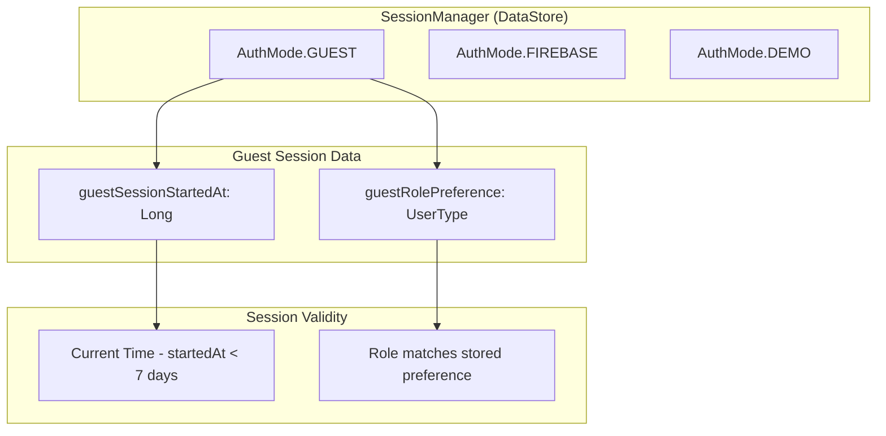
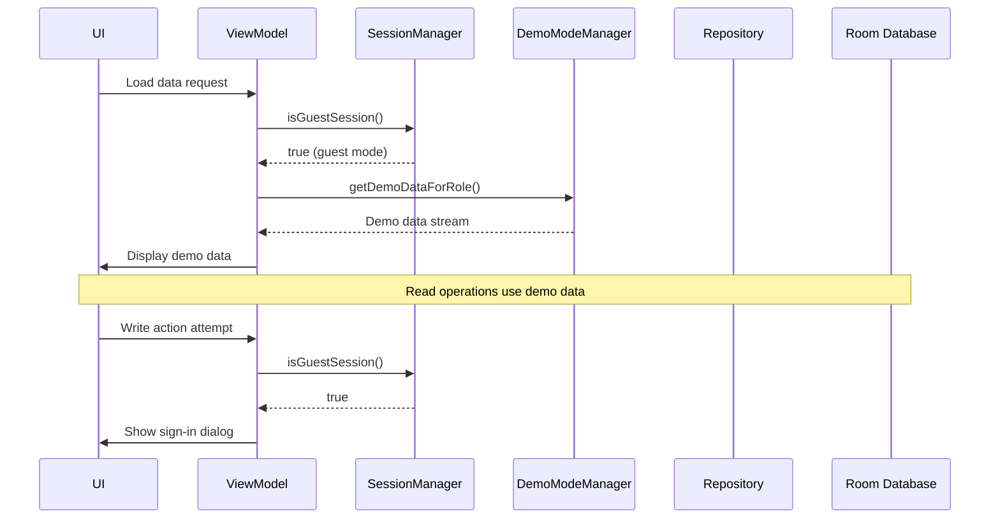
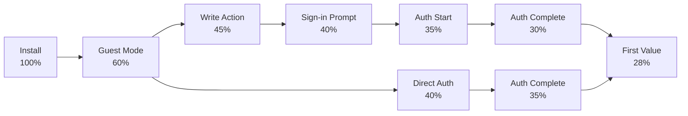

flowchart TD
    A[App Install] --> B{First Launch}
    B --> C[StartViewModel.decide()]
    C --> D{Guest Session?}
    D -->|Yes| E{Valid Session?}
    D -->|No| F[AuthWelcomeScreen]
    
    E -->|Valid| G[Role Home with Demo Data]
    E -->|Expired| F
    
    F --> H[Select Role: Farmer/Enthusiast/General]
    H --> I{Choice}
    I -->|Preview as Role| J[Mark Guest Session]
    I -->|Sign in as Role| K[MultiProviderAuthScreen]
    
    J --> G
    K --> L[Firebase Auth Flow]
    L --> M{Auth Success}
    M -->|Yes| N[Role Home with Real Data]
    M -->|No| O[Error Handling]
    
    G --> P[Explore Features]
    P --> Q{Write Action?}
    Q -->|No| P
    Q -->|Yes| R["Sign in to continue" Dialog]
    R --> S{User Choice}
    S -->|Sign In| K
    S -->|Cancel| P
    
    N --> T[Full App Access]
```

### Detailed Flow Description

#### 1. First Launch Experience
- User installs app and opens it
- `StartViewModel.decide()` checks for existing sessions
- No authenticated session → Navigate to `AuthWelcomeScreen`

#### 2. Role Selection Screen
- Clean welcome screen with role cards
- Each role shows:
  - Icon and title
  - Brief description of features
  - "Preview as [Role]" button (guest mode)
  - "Sign in as [Role]" button (direct auth)

#### 3. Guest Mode Entry
- User taps "Preview as [Role]"
- `SessionManager.markGuestSession(role, timestamp)` creates guest session
- Navigate to role-specific home screen with demo data flag

#### 4. Guest Experience
- Full read-only access to relevant features
- Demo data populated from `DemoAccounts.kt`
- Persistent banner: "You're browsing as a guest. Sign in to unlock all features."
- "Sign In" button in top bar for easy upgrade

#### 5. Feature Gating
- Read actions work normally (browse marketplace, view analytics)
- Write actions (create listing, transfer, post) show dialog: "Sign in to continue"
- Dialog includes role context and quick auth flow

#### 6. Session Management
- Guest sessions expire after 7 days
- On expiry, redirect to `AuthWelcomeScreen`
- Users can upgrade anytime via banner or gating dialogs

#### 7. Conversion to Authenticated
- Auth flow starts with pre-selected role
- Phone verification deferred until first write action
- Successful auth upgrades guest session to authenticated
- Preserves navigation context (e.g., return to viewed product)

### Edge Cases

- **Network Offline**: Guest mode works offline with cached demo data
- **Deep Links**: Guest users see "Sign in to continue" for deep-linked write actions
- **Session Conflicts**: Authenticated users can't access guest mode
- **Role Changes**: Guests can't change roles mid-session (must start new session)

---

## 3. Technical Architecture

### Session Management



### Data Flow Architecture



### Key Components

#### SessionManager Extensions
- **AuthMode.GUEST**: New enum value alongside FIREBASE and DEMO
- **Guest Session Keys**: DataStore keys for role and timestamp
- **Validity Checks**: 7-day expiry, role consistency
- **Upgrade Logic**: Convert guest to authenticated session

#### DemoModeManager Integration
- **Role-Aware Data**: Different demo datasets for Farmer vs. Enthusiast vs. General
- **Realistic Samples**: `DemoAccounts.kt` provides sample users, products, transfers
- **Offline Support**: Demo data cached locally for offline browsing

#### Navigation Changes
- **AuthWelcomeScreen**: New entry point before authentication
- **RoleNavScaffold**: Guest mode flag for banners and write-action blocking
- **Deep Link Handling**: Guest-safe routing with upgrade prompts

### Data Sources

#### Demo Data Structure
```kotlin
// DemoAccounts.kt structure
object DemoAccounts {
    val farmerDemo = DemoUser(
        role = UserType.FARMER,
        products = listOf(
            DemoProduct(name = "Rhode Island Red Chicks", price = 150.0),
            DemoProduct(name = "Layer Feed - 50kg", price = 2500.0)
        ),
        transfers = listOf(
            DemoTransfer(from = "Demo Farm A", to = "Demo Farm B")
        )
    )
    
    val enthusiastDemo = DemoUser(
        role = UserType.ENTHUSIAST,
        bloodlines = listOf(/* demo bloodline data */),
        breedingRecords = listOf(/* demo breeding data */)
    )
}
```

#### Feature Availability Matrix

| Feature | Guest Access | Auth Required | Notes |
|---------|-------------|---------------|-------|
| Browse Marketplace | ✅ | ✅ | Demo products shown |
| View Product Details | ✅ | ✅ | Full details available |
| Search Products | ✅ | ✅ | Works with demo data |
| View Farm Analytics | ✅ | ✅ | Demo KPIs and charts |
| Create Listing | ❌ | ✅ | Gated with sign-in prompt |
| Initiate Transfer | ❌ | ✅ | Gated with sign-in prompt |
| Post to Community | ❌ | ✅ | Gated with sign-in prompt |
| Edit Profile | ❌ | ✅ | Gated with sign-in prompt |

---

## 4. Implementation Details

### Key Classes and Files

#### SessionManager.kt (Modified)
```kotlin
enum class AuthMode {
    FIREBASE, DEMO, GUEST  // Added GUEST
}

class SessionManager @Inject constructor(
    @ApplicationContext private val context: Context
) {
    private val dataStore = context.dataStore
    
    // New guest session keys
    companion object {
        val GUEST_ROLE_KEY = stringPreferencesKey("guest_role_preference")
        val GUEST_STARTED_AT_KEY = longPreferencesKey("guest_session_started_at")
    }
    
    // New methods
    suspend fun markGuestSession(role: UserType, nowMillis: Long) {
        dataStore.edit { preferences ->
            preferences[GUEST_ROLE_KEY] = role.name
            preferences[GUEST_STARTED_AT_KEY] = nowMillis
            preferences[AUTH_MODE_KEY] = AuthMode.GUEST.name
        }
    }
    
    fun isGuestSession(): Flow<Boolean> = dataStore.data.map { preferences ->
        preferences[AUTH_MODE_KEY] == AuthMode.GUEST.name
    }
    
    fun getGuestRole(): Flow<UserType?> = dataStore.data.map { preferences ->
        preferences[GUEST_ROLE_KEY]?.let { UserType.valueOf(it) }
    }
    
    suspend fun upgradeGuestToAuthenticated(userType: UserType, nowMillis: Long) {
        // Convert guest session to authenticated
        dataStore.edit { preferences ->
            preferences[AUTH_MODE_KEY] = AuthMode.FIREBASE.name
            preferences[USER_TYPE_KEY] = userType.name
            preferences[SESSION_STARTED_AT_KEY] = nowMillis
            // Clear guest keys
            preferences.remove(GUEST_ROLE_KEY)
            preferences.remove(GUEST_STARTED_AT_KEY)
        }
    }
}
```

#### AuthWelcomeScreen.kt (New)
```kotlin
@Composable
fun AuthWelcomeScreen(
    viewModel: AuthWelcomeViewModel = hiltViewModel(),
    onNavigateToGuest: (UserType) -> Unit,
    onNavigateToAuth: (UserType) -> Unit
) {
    val state by viewModel.uiState.collectAsStateWithLifecycle()
    
    Column(
        modifier = Modifier
            .fillMaxSize()
            .padding(24.dp),
        horizontalAlignment = Alignment.CenterHorizontally,
        verticalArrangement = Arrangement.Center
    ) {
        // Welcome header
        Text(
            "Welcome to ROSTRY",
            style = MaterialTheme.typography.headlineMedium,
            textAlign = TextAlign.Center
        )
        
        Spacer(Modifier.height(32.dp))
        
        // Role selection cards
        UserType.values().forEach { role ->
            RoleSelectionCard(
                role = role,
                onPreviewClick = { viewModel.startGuestMode(role) },
                onSignInClick = { viewModel.startAuthentication(role) },
                modifier = Modifier.fillMaxWidth()
            )
        }
        
        // Analytics tracking
        LaunchedEffect(state.selectedRole) {
            state.selectedRole?.let { role ->
                viewModel.trackRoleSelection(role)
            }
        }
    }
}
```

#### RoleNavScaffold.kt (Modified)
```kotlin
@Composable
fun RoleNavScaffold(
    isGuestMode: Boolean,  // New parameter
    role: UserType,
    // ... existing parameters
) {
    Scaffold(
        topBar = {
            TopAppBar(
                title = { Text(getTitleForRole(role)) },
                actions = {
                    if (isGuestMode) {
                        TextButton(onClick = { /* navigate to auth */ }) {
                            Text("Sign In")
                        }
                    }
                }
            )
        }
    ) { padding ->
        Column(modifier = Modifier.padding(padding)) {
            // Guest mode banner
            if (isGuestMode) {
                GuestModeBanner(
                    onSignInClick = { /* navigate to auth */ }
                )
            }
            
            // Content with write action blocking
            Box {
                // Main content
                RoleNavGraph(
                    role = role,
                    isGuestMode = isGuestMode,
                    onWriteActionBlocked = { /* show sign-in dialog */ }
                )
                
                // Sign-in prompt overlay (when needed)
                if (showSignInPrompt) {
                    SignInPromptDialog(
                        onSignIn = { /* navigate to auth */ },
                        onDismiss = { showSignInPrompt = false }
                    )
                }
            }
        }
    }
}
```

### Data Flow Patterns

#### Guest-Safe Repository Pattern
```kotlin
class ProductRepository @Inject constructor(
    private val productDao: ProductDao,
    private val firestoreDataSource: FirestoreDataSource,
    private val demoModeManager: DemoModeManager,
    private val sessionManager: SessionManager
) {
    
    fun getProducts(): Flow<List<Product>> = sessionManager.isGuestSession()
        .flatMapLatest { isGuest ->
            if (isGuest) {
                sessionManager.getGuestRole().flatMapLatest { role ->
                    demoModeManager.getDemoProductsForRole(role ?: UserType.GENERAL)
                }
            } else {
                // Normal authenticated flow
                combine(
                    productDao.getAllProducts(),
                    firestoreDataSource.getProducts()
                ) { local, remote ->
                    // Sync logic
                }
            }
        }
}
```

#### Write Action Blocking
```kotlin
// In ViewModel
fun createProduct(product: Product) {
    viewModelScope.launch {
        val isGuest = sessionManager.isGuestSession().first()
        if (isGuest) {
            _uiState.update { it.copy(showSignInPrompt = true) }
        } else {
            // Proceed with creation
            repository.createProduct(product)
        }
    }
}
```

### Navigation Integration

#### AppNavHost.kt Changes
```kotlin
@Composable
fun AppNavHost(navController: NavHostController) {
    NavHost(navController = navController, startDestination = Routes.START) {
        // ... existing routes
        
        composable(Routes.AUTH_WELCOME) {
            AuthWelcomeScreen(
                onNavigateToGuest = { role ->
                    navController.navigate(Routes.roleHome(role)) {
                        popUpTo(Routes.AUTH_WELCOME) { inclusive = true }
                    }
                },
                onNavigateToAuth = { role ->
                    navController.navigate(Routes.authWithRole(role)) {
                        popUpTo(Routes.AUTH_WELCOME) { inclusive = true }
                    }
                }
            )
        }
        
        // Role-specific homes with guest flag
        composable(
            Routes.FARMER_HOME,
            arguments = listOf(navArgument("isGuest") { defaultValue = false })
        ) { backStackEntry ->
            val isGuest = backStackEntry.arguments?.getBoolean("isGuest") ?: false
            RoleNavScaffold(
                isGuestMode = isGuest,
                role = UserType.FARMER
            ) {
                FarmerHomeScreen(isGuestMode = isGuest)
            }
        }
    }
}
```

---

## 5. Testing

### Test Scenarios

#### Unit Tests

**SessionManagerTest.kt**
```kotlin
@ExperimentalCoroutinesTest
class SessionManagerTest {
    
    @Test
    fun `markGuestSession stores role and timestamp`() = runTest {
        val sessionManager = SessionManager(FakeDataStore())
        
        sessionManager.markGuestSession(UserType.FARMER, 1000L)
        
        assertTrue(sessionManager.isGuestSession().first())
        assertEquals(UserType.FARMER, sessionManager.getGuestRole().first())
    }
    
    @Test
    fun `guest session expires after 7 days`() = runTest {
        val sessionManager = SessionManager(FakeDataStore())
        
        // Start session 8 days ago
        val eightDaysAgo = System.currentTimeMillis() - (8 * 24 * 60 * 60 * 1000)
        sessionManager.markGuestSession(UserType.FARMER, eightDaysAgo)
        
        assertFalse(sessionManager.isGuestSessionValid().first())
    }
}
```

**AuthWelcomeViewModelTest.kt**
```kotlin
@ExperimentalCoroutinesTest
class AuthWelcomeViewModelTest {
    
    @Test
    fun `startGuestMode marks session and navigates`() = runTest {
        val sessionManager = mockk<SessionManager>()
        val analytics = mockk<FlowAnalyticsTracker>()
        val viewModel = AuthWelcomeViewModel(sessionManager, analytics)
        
        viewModel.startGuestMode(UserType.FARMER)
        
        coVerify { sessionManager.markGuestSession(UserType.FARMER, any()) }
        assertEquals(UserType.FARMER, viewModel.uiState.value.selectedRole)
        // Verify navigation event emitted
    }
}
```

#### Integration Tests

**GuestModeIntegrationTest.kt**
```kotlin
@RunWith(AndroidJUnit4::class)
class GuestModeIntegrationTest {
    
    @get:Rule
    val hiltRule = HiltAndroidRule(this)
    
    @Test
    fun `guest can browse marketplace but not create listings`() {
        // Launch app in guest mode
        // Navigate to marketplace
        // Verify demo products shown
        // Attempt to create listing
        // Verify sign-in prompt appears
    }
    
    @Test
    fun `guest session persists across app restarts`() {
        // Start guest session
        // Kill and restart app
        // Verify still in guest mode
        // Verify role preference maintained
    }
}
```

#### UI Tests

**AuthWelcomeScreenTest.kt**
```kotlin
@RunWith(AndroidJUnit4::class)
class AuthWelcomeScreenTest {
    
    @get:Rule
    val composeTestRule = createComposeRule()
    
    @Test
    fun `role selection cards are displayed and clickable`() {
        composeTestRule.setContent {
            AuthWelcomeScreen(
                viewModel = FakeAuthWelcomeViewModel(),
                onNavigateToGuest = {},
                onNavigateToAuth = {}
            )
        }
        
        // Verify all role cards present
        composeTestRule.onNodeWithText("Farmer").assertExists()
        composeTestRule.onNodeWithText("Enthusiast").assertExists()
        composeTestRule.onNodeWithText("General User").assertExists()
        
        // Test preview button
        composeTestRule.onNodeWithText("Preview as Farmer").performClick()
        // Verify navigation called
    }
}
```

### Edge Cases to Test

- **Session Expiry**: Test behavior when guest session expires during use
- **Network Offline**: Verify guest mode works without internet
- **Deep Links**: Test deep linking to write actions in guest mode
- **Role Switching**: Attempt to change roles mid-session (should not be allowed)
- **Auth Interruption**: Test partial auth flow then return to guest
- **Data Conflicts**: Authenticated user data vs. demo data separation
- **Memory Pressure**: Test with low memory conditions
- **Large Demo Data**: Performance with extensive demo datasets

### Test Data Setup

**DemoDataTestHelper.kt**
```kotlin
object DemoDataTestHelper {
    fun createTestDemoAccounts(): DemoAccounts {
        return DemoAccounts(
            farmerDemo = DemoUser(
                products = listOf(
                    TestProduct(id = "test_1", name = "Test Product"),
                    // More test products
                ),
                transfers = listOf(
                    TestTransfer(id = "transfer_1", status = TransferStatus.PENDING)
                )
            )
        )
    }
}
```

### Performance Testing

- **Startup Time**: Measure time to load guest mode vs. authenticated
- **Memory Usage**: Monitor memory footprint with demo data loaded
- **Scroll Performance**: Test smooth scrolling in demo data lists
- **Network Efficiency**: Verify minimal network calls in guest mode

---

## 6. Analytics

### Events Tracked

#### Guest Mode Events
```kotlin
// FlowAnalyticsTracker.kt additions
fun trackGuestModeStarted(role: String)
fun trackGuestModeUpgraded(role: String, durationSeconds: Long)
fun trackGuestModeAbandoned(role: String, durationSeconds: Long)
fun trackGuestModeExpired(role: String, durationSeconds: Long)
fun trackGuestModeWriteActionAttempted(feature: String, role: String)
fun trackGuestModeSignInPromptShown(role: String)
fun trackGuestModeSignInPromptAccepted(role: String)
fun trackGuestModeSignInPromptDismissed(role: String)
```

#### Onboarding Funnel Events
```kotlin
fun trackOnboardingFunnelStep(step: String, role: String)
// Steps: "install", "splash", "welcome", "role_select", "auth_start", "auth_complete", "phone_verify", "onboarding", "first_value"

fun trackTimeToFirstValue(durationSeconds: Long, role: String, valueType: String)
// valueType: "browse_marketplace", "view_analytics", "view_farm_dashboard"

fun trackOnboardingDropOff(step: String, role: String, reason: String?)
```

### Funnel Metrics

#### Primary Success Metrics
- **Guest Mode Adoption Rate**: % of users who enter guest mode vs. direct auth
- **Time to First Value**: Average time from install to meaningful interaction
- **Conversion Rate**: % of guest users who complete authentication
- **Session Duration**: Average time spent in guest mode before conversion/abandonment

#### Secondary Metrics
- **Feature Engagement**: Which features guests interact with most
- **Write Action Attempts**: Frequency of gated action attempts
- **Sign-in Prompt CTR**: Click-through rate on sign-in prompts
- **Role Distribution**: Breakdown of selected roles in guest mode

### Success Criteria

**Quantitative Targets:**
- 60% of new users enter guest mode
- 40% conversion rate from guest to authenticated
- < 30 seconds average time to first value
- < 5% abandonment rate during guest sessions

**Qualitative Targets:**
- Positive user feedback on preview experience
- Reduced support tickets about "what does this app do?"
- Improved app store ratings and reviews

### Analytics Implementation

#### Firebase Analytics Integration
```kotlin
// FlowAnalyticsTrackerImpl.kt
override fun trackGuestModeStarted(role: String) {
    firebaseAnalytics.logEvent("guest_mode_started") {
        param("role", role)
        param("timestamp", System.currentTimeMillis())
    }
}

override fun trackTimeToFirstValue(durationSeconds: Long, role: String, valueType: String) {
    firebaseAnalytics.logEvent("time_to_first_value") {
        param("duration_seconds", durationSeconds.toDouble())
        param("role", role)
        param("value_type", valueType)
    }
}
```

#### Custom Dashboards

**Key Funnel Visualization:**


---

## 7. Limitations

### What Guests Can't Do

#### Write Operations (All Roles)
- Create product listings
- Initiate transfers
- Post to community forums
- Edit profile information
- Upload photos or documents
- Send direct messages
- Rate or review products/users

#### Farmer-Specific Restrictions
- Access real farm monitoring data
- Create vaccination schedules
- Manage inventory
- Generate reports
- Connect IoT devices

#### Enthusiast-Specific Restrictions
- Access breeding records
- Track bloodlines
- Join breeding communities
- Participate in shows/competitions

#### General User Restrictions
- Save favorite products
- Create wishlists
- Access purchase history
- Leave reviews

### Feature Gating Logic

#### Runtime Checks
```kotlin
// In ViewModels
fun performWriteAction() {
    if (isGuestMode) {
        showSignInDialog()
        trackWriteActionAttempted()
    } else {
        executeAction()
    }
}
```

#### UI-Level Gating
```kotlin
@Composable
fun CreateButton(isGuestMode: Boolean, onClick: () -> Unit) {
    Button(
        onClick = onClick,
        enabled = !isGuestMode
    ) {
        Text(if (isGuestMode) "Sign in to Create" else "Create")
    }
    
    if (isGuestMode) {
        // Show tooltip or hint
        TooltipAnchor(
            tooltipId = "guest_create_button",
            title = "Sign in Required",
            description = "Create your own listings by signing in"
        ) {
            // Button content
        }
    }
}
```

### Technical Limitations

#### Data Isolation
- Demo data is static and doesn't reflect real market conditions
- No personalization based on user behavior
- Limited dataset size for performance

#### Offline Constraints
- Demo data must be bundled with app (increased APK size)
- No real-time updates to demo content
- Cannot sync changes made in other sessions

#### Session Management
- 7-day expiry cannot be extended
- No way to "pause" session expiry
- Single role per session (cannot switch mid-session)

---

## 8. Conversion Strategy

### Psychological Triggers

#### Value Demonstration
- **Progressive Value**: Show increasingly valuable features as user explores
- **Social Proof**: Demo data includes "popular" items and "verified" sellers
- **Scarcity**: Limited-time offers visible in demo marketplace
- **Authority**: Show expert-verified content and trusted seller badges

#### Friction Reduction
- **One-Click Upgrade**: Single tap from any sign-in prompt
- **Context Preservation**: Return to exact location after auth
- **Deferred Verification**: Phone verification only when needed
- **Quick Auth**: Streamlined Firebase UI with role pre-selection

### Conversion Touchpoints

#### Proactive Prompts
- **Welcome Banner**: Persistent but dismissible sign-in encouragement
- **Feature Teasers**: "Unlock full access to create your own listings"
- **Progress Indicators**: "Complete sign-in to save your favorites"
- **Social Features**: "Join the community to connect with other farmers"

#### Reactive Prompts
- **Write Action Blocks**: Immediate sign-in dialog when attempting restricted actions
- **Deep Link Access**: Prompt when accessing write-required deep links
- **Content Limits**: "View more by signing in" for truncated demo content

### A/B Testing Framework

#### Test Variables
- **Prompt Timing**: Immediate vs. delayed sign-in prompts
- **Prompt Copy**: Different messaging variations
- **Banner Design**: Various banner styles and placements
- **Demo Data Quality**: Different levels of demo content richness

#### Success Metrics
- **Conversion Rate**: Primary metric for prompt effectiveness
- **Time to Convert**: How quickly users convert after prompts
- **Feature Usage**: Post-conversion engagement levels
- **Retention**: User retention after conversion

### Personalization Strategy

#### Role-Based Conversion
```kotlin
// AuthWelcomeViewModel.kt
fun getConversionMessage(role: UserType): String {
    return when (role) {
        UserType.FARMER -> "Join 10,000+ farmers managing their operations with ROSTRY"
        UserType.ENTHUSIAST -> "Connect with breeders worldwide and track your bloodlines"
        UserType.GENERAL -> "Access exclusive deals and trusted poultry products"
    }
}
```

#### Behavioral Triggers
- **Engagement Thresholds**: Prompt after viewing X products or spending Y time
- **Feature Discovery**: Convert when user discovers high-value features
- **Content Completion**: Prompt after consuming significant demo content

---

## 9. Security Considerations

### Data Isolation

#### Demo Data Containment
- Demo data stored separately from user data
- No mixing of demo and real user information
- Clear labeling of demo content in UI

#### Session Security
```kotlin
// SessionManager.kt - Security measures
suspend fun validateGuestSession(): Boolean {
    val preferences = dataStore.data.first()
    
    // Check session hasn't been tampered with
    val storedRole = preferences[GUEST_ROLE_KEY]
    val storedTimestamp = preferences[GUEST_STARTED_AT_KEY]
    
    return storedRole != null && 
           storedTimestamp != null && 
           storedTimestamp > 0 &&
           (System.currentTimeMillis() - storedTimestamp) < MAX_GUEST_DURATION
}
```

### Permission Checks

#### Runtime Permissions
- Guest mode requires no additional permissions
- Location permission requested only for authenticated users
- Camera access gated behind authentication

#### Feature Access Control
```kotlin
// PermissionManager.kt
fun canAccessFeature(feature: Feature, userType: UserType?, isGuest: Boolean): Boolean {
    return when (feature) {
        Feature.CREATE_LISTING -> !isGuest
        Feature.VIEW_ANALYTICS -> true // Available to all
        Feature.UPLOAD_PHOTOS -> !isGuest
        Feature.SEND_MESSAGES -> !isGuest && userType != null
    }
}
```

### Privacy Protection

#### Data Collection
- No personal data collected in guest mode
- Analytics tracking anonymized for guest users
- No device identifiers stored for guests

#### Content Security
- Demo data sanitized of real user information
- No sensitive business data in demo datasets
- Regular audits of demo content for appropriateness

### Audit Trail

#### Session Logging
```kotlin
// Analytics tracking for security
fun trackGuestSessionEvent(event: String, role: String, metadata: Map<String, Any>) {
    firebaseAnalytics.logEvent("guest_session_${event}") {
        param("role", role)
        param("session_id", generateSessionId())
        metadata.forEach { (key, value) -> 
            param(key, value.toString())
        }
    }
}