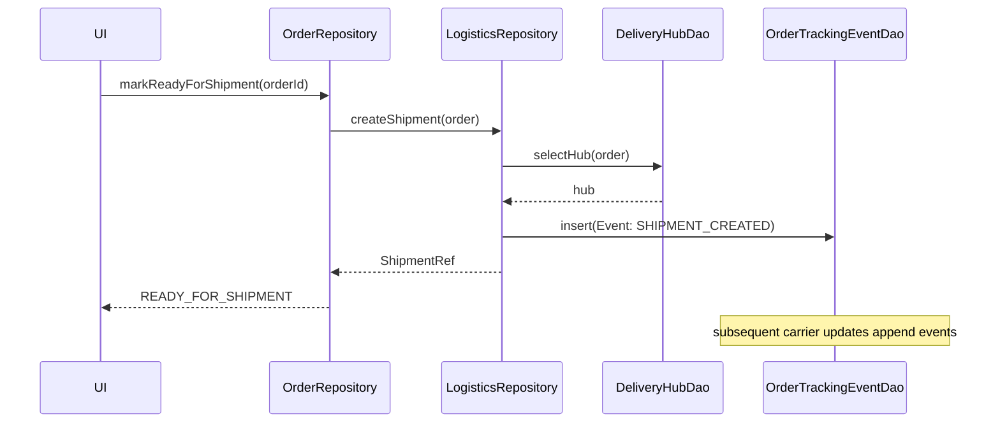

# Logistics & Order Tracking

This guide documents order lifecycle, delivery hubs, and real-time tracking.

## Architecture

- **Repositories**:
  - `OrderRepository.kt` manages order creation, status changes, and fulfillment.
  - `LogisticsRepository.kt` coordinates shipments, carrier updates, and hub assignments.
- **Persistence**:
  - `DeliveryHubDao` and `DeliveryHubEntity` define hub metadata, capacity, and geo info.
  - `OrderTrackingEventDao` and `OrderTrackingEventEntity` store chronological tracking events.

## Order Lifecycle

1. Order created (PENDING) → payment authorized.
2. READY_FOR_SHIPMENT → hub assignment and label creation.
3. IN_TRANSIT with live updates.
4. OUT_FOR_DELIVERY → DELIVERED or RETURNED.

## Real-Time Updates & Notifications

- Tracking events appended via `OrderTrackingEventDao`.
- Push notifications on status transitions and significant events.
- UI subscribes to Flow for live timeline rendering.

## Hub Assignment & Routing

- Constraints: capacity, proximity, SLA.
- Strategy: weighted scoring across hubs with tie-breakers.
- Rebalancing: re-route when hub capacity thresholds are breached.

## Transfer Integration

- Livestock movement links shipment IDs to transfer IDs for custody chain.
- Quarantine/health docs attached as tracking event metadata.

## Sync & Performance

- Append-only tracking events with indexed orderId and timestamp.
- Batch fetch recent events for timeline; paginate older ones.
- Use WorkManager for periodic carrier poll in low-quality networks.

## Mobile UI

- Order detail shows timeline, map snippet, and contact actions.
- Failure/reschedule flows exposed for support.
