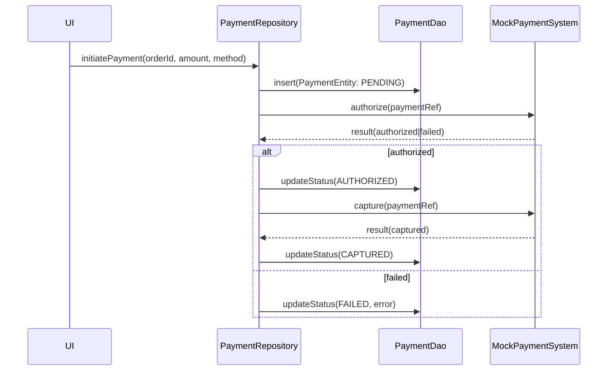

# Payments & Refunds

This document covers the payments and refunds system in ROSTRY, including data flow, storage, testing, and integration points.

## Architecture Overview

- **Repository Layer**: `PaymentRepository.kt` orchestrates payment initiation, verification, capture, and refund requests.
- **Persistence**:
  - `PaymentEntity` persists payment attempts, status, metadata, and linkage to orders/transfers.
  - `PaymentDao` provides CRUD and query operations for status updates, idempotency checks, and reconciliation.
- **Testing & Demo**:
  - `MockPaymentSystem.kt` provides deterministic in-memory flows for sandbox usage.
  - Demo mode controller (e.g., `DemoModeManager.kt`) toggles demo flows and scenarios for local/dev.
- **UPI Integration**: `UpiUtils.kt` provides helpers to build UPI intents, validate VPA formats, and parse responses.

## Payment Flow

1. Client initiates payment via `PaymentRepository.initiatePayment(orderId, method, amount)`.
2. A `PaymentEntity` is created with `PENDING` status via `PaymentDao`.
3. For demo/testing, `MockPaymentSystem` simulates authorization or failure.
4. On success, repository transitions to `AUTHORIZED` and then `CAPTURED` if immediate capture.
5. On failure, repository records `FAILED` with error metadata for analysis and retries.

## Refunds

- Refunds use `RefundDao` and `RefundEntity` to persist refund requests, amounts, and states (REQUESTED, PROCESSING, COMPLETED, FAILED).
- Typical flow: `requestRefund(paymentId, amount)` → create `RefundEntity: REQUESTED` → gateway simulation → update state.
- Idempotency: use unique refund keys per paymentId+amount to avoid duplicates.

## UPI Integration

- `UpiUtils.kt` helpers:
  - Build `upi://pay` intents with payee VPA, name, amount, txnRef.
  - Validate VPA regex and sanitize inputs.
  - Parse app callback results to status enums and message strings.
- Best practices:
  - Always handle user cancellation distinctly from failure.
  - Provide retry with different UPI apps.

## Validation & Security

- Input validation for amounts, currency, and beneficiary data.
- Idempotency keys at repository boundaries to avoid duplicate charges.
- Record gateway response signatures (for real gateways) and verify.
- Persist minimal PII; encrypt sensitive fields at rest.

## Demo Scenarios & Testing

- Happy path: authorized → captured.
- Declined card / UPI failure.
- Network timeout → retry with backoff.
- Refund partial and full.
- Reconciliation job verifies captured vs recorded.

## Integrations

- Orders: link `PaymentEntity.orderId` for fulfillment gating.
- Transfer workflows: capture on transfer approval; refund on cancellation under policy.
- Notifications: send payment success/failure updates.

## Error Handling & Retries

- Use exponential backoff for network-bound steps.
- Persist terminal errors with codes for analytics.
- UI shows actionable states (retry, change method, contact support).

## Configuration

- Demo mode: use `MockPaymentManager` and demo services.
- Real gateways: configure credentials via secure storage; enable webhooks for capture/refund confirmations.
- Dokka API docs: see `docs/api/` for repository and DAO signatures.
