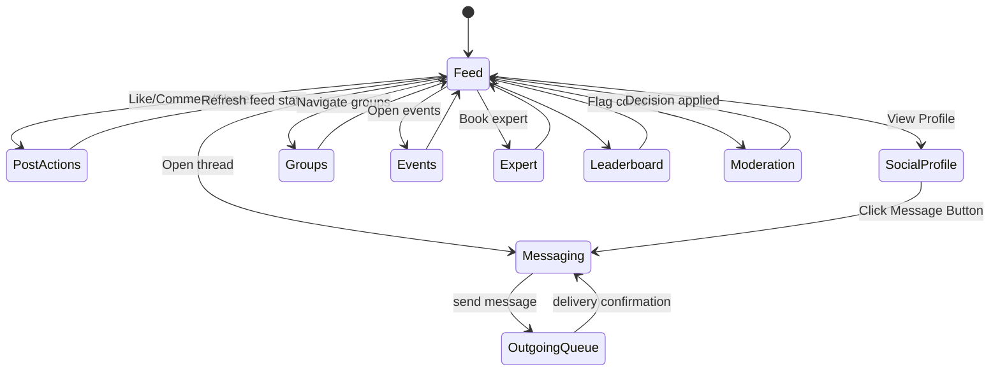

# Social Platform Guide

## Overview
The social subsystem enables community engagement through feeds, messaging, groups, events, expert sessions, moderation, and reputation tracking. Recently enhanced with a messenger-like community hub featuring context-aware messaging and intelligent recommendations.

## Feature Modules

### Core Social Features
- `ui/social/`: Feed, leaderboard, video player components.
- `ui/social/SocialFeedScreen.kt`: Main social feed with posts, images, and videos
- `ui/social/LeaderboardScreen.kt`: Community engagement rankings
- `ui/social/profile/SocialProfileScreen.kt`: Enhanced user profiles with stats and tabs
- `ui/social/profile/SocialProfileViewModel.kt`: Profile data management
- `ui/social/stories/StoryViewerScreen.kt`: Full-screen story viewing
- `ui/social/stories/StoryCreatorScreen.kt`: Story creation interface
- `ui/social/stories/StoryCreatorViewModel.kt`: Story creation logic
- `ui/social/discussion/DiscussionDetailScreen.kt`: Twitter-style threaded discussions
- `ui/social/discussion/DiscussionDetailViewModel.kt`: Discussion management

### Messaging System
- `ui/messaging/`: Direct and group chat screens with queued sending, thread metadata.
- `ui/messaging/ThreadScreen.kt`: Direct messaging interface
- `ui/messaging/ThreadViewModel.kt`: Thread management and message handling
- `ui/messaging/GroupChatScreen.kt`: Group chat functionality
- `ui/messaging/GroupChatViewModel.kt`: Group chat management

### Community Hub
- `ui/community/`: Community hub with multi-tab interface (Messages, Discover, Feed, My Groups).
- `ui/community/CommunityHubScreen.kt`: Main community hub interface
- `ui/community/CommunityHubViewModel.kt`: Community hub state management
- `ui/community/CommunityEngagementService.kt`: Recommendation and engagement logic

### Farmer-Specific Features
- `ui/farmer/`: Farmer-specific community features and expert consultation.
- `ui/farmer/FarmerCommunityScreen.kt`: Farmer-focused community features
- `ui/farmer/FarmerCommunityViewModel.kt`: Farmer community management

### Supporting UIs
- `ui/events/`: Event management and RSVP functionality
- `ui/expert/`: Expert booking and consultation features
- `ui/moderation/`: Content moderation workflows
- `ui/gamification/`: Achievement and badge systems
- `ui/insights/`: Community insights and analytics
- `ui/feedback/`: Feedback and rating systems
- `ui/support/`: Community support features

## Data Model

### Core Social Entities
Room entities defined in `data/database/entity/SocialEntities.kt` include:
- Posts, comments, likes.
- Follows, groups, group members.
- Events, RSVPs, expert bookings.
- Moderation reports, badges, reputation scores.
- Outgoing messages for queued delivery.

### Community Engagement Entities
Additional entities in `data/database/entity/CommunityEntities.kt` (added in migration 15→16):
- **ThreadMetadataEntity**: Thread context tracking with types (PRODUCT_INQUIRY, EXPERT_CONSULT, BREEDING_DISCUSSION, GENERAL).
- **CommunityRecommendationEntity**: Personalized recommendations (mentors, connections, groups, events, experts, posts).
- **UserInterestEntity**: Interest-based personalization data for content filtering.
- **ExpertProfileEntity**: Expert specialties, ratings, availability, and hourly rates.

DAOs reside in `data/database/dao/` (e.g., `PostsDao`, `CommentsDao`, `GroupsDao`, `EventRsvpsDao`, `ThreadMetadataDao`, `CommunityRecommendationDao`).

## Repository Layer
`data/repository/social/RepositoriesSocial.kt` provides:
- `SocialRepositoryImpl`: Paging feed, ranking, likes/comments, share counts, and moderation entrypoints.
- `MessagingRepositoryImpl`: Thread retrieval, message queue management, delivery state updates, context-aware thread creation.
- `CommunityRepository`: Groups, events, membership management, RSVP handling.
- `LikesRepositoryImpl`: Social likes and reactions management
- `ChatRepositoryImpl`: Chat messaging and conversation management
- `CommunityRepositoryImpl`: Community features and engagement
- `ModerationRepositoryImpl`: Content moderation and reporting
- `ReputationRepositoryImpl`: Reputation scoring and badge management
- Reputation and badge services for leaderboard and user trust signals.

## Service Layer
`community/CommunityEngagementService.kt` provides:
- **Data Aggregation**: 20+ methods for trending posts, suggested groups, upcoming events, available experts, active threads.
- **Intelligent Recommendations**: Mentor matching, connection suggestions, expert matching by topic.
- **Context-Aware Messaging**: Thread creation with business context (product inquiries, expert consultations, breeding discussions).
- **Community Metrics**: Engagement scoring, community statistics, user activity tracking.

### Additional Social Services
- `data/service/ExternalServiceConnector.kt`: External service integration patterns
- `data/service/ApiServiceWrapper.kt`: API service wrapper implementations
- `utils/preferences/UserPreferencesRepository.kt`: User preference management for social features
- `data/repository/CoinRepository.kt`: Coin wallet system for social rewards
- `data/repository/WishlistRepository.kt`: Wishlist functionality for social sharing
- `data/repository/ReviewRepository.kt`: Review and rating systems
- `data/repository/AuctionRepository.kt`: Auction functionality with social bidding
- `data/repository/CartRepository.kt`: Shopping cart with social sharing features

## UI Flow

### Traditional Social Features
1. `SocialFeedScreen` collects `PagingData<PostEntity>` from `SocialFeedViewModel` and renders cards with images or `VideoPlayer` (ExoPlayer).
2. Users like/comment/share posts; actions call repository methods through the ViewModel.
3. Navigation to groups/events/experts is handled via `AppNavHost.kt` routes.
4. `ThreadScreen` binds to message streams with context badges, while `OutgoingMessageWorker` flushes queued messages in the background.
5. `LeaderboardScreen` displays reputation standings computed in repositories.
6. `ModerationScreen` provides admin-level review of submitted reports.

### Community Hub Experience
1. `CommunityHubScreen` provides 4-tab interface:
   - **Messages**: Active threads with context badges and unread counts
   - **Discover**: Personalized recommendations (mentors, connections, groups, experts)
   - **Feed**: Trending posts with engagement metrics
   - **My Groups**: User's joined groups with activity indicators
2. `FarmerCommunityScreen` shows farmer-specific features:
   - Upcoming farming events with RSVP
   - Available agricultural experts with booking
3. Context-aware thread creation:
   - Select context type (product inquiry, expert consult, breeding discussion)
   - System adds metadata for intelligent routing and recommendations
   - Visual badges show thread context throughout UI

### Enhanced Social Features
1. **Social Profile**: `SocialProfileScreen` replaces the basic profile, offering:
   - Rich header with stats (followers, following, posts).
   - Tabbed content view (Grid, Tagged).
   - Follow/Unfollow and Message actions.
   - **Messaging Integration**: "Message" button navigates to direct messaging (`onMessage` callback) with pre-populated recipient.
2. **Stories**: `StoryViewerScreen` and `StoryCreatorScreen` enable ephemeral content:
   - 24-hour expiration.
   - Immersive full-screen viewer with progress bars.
   - Simple creation flow.
3. **Discussions**: `DiscussionDetailScreen` provides Twitter-style threading:
   - Text-focused post rendering in feed.
   - Threaded replies view.
   - Quick reply input.

### Additional Social Features
4. **Gamification**: `AchievementsScreen` and `HallOfFameScreen` with:
   - Bronze/Silver/Gold milestone badges
   - Pulsing animations for achievements
   - Competitive rankings
5. **Live Broadcasting**: Real-time community events with:
   - Live streaming capabilities
   - Real-time audience interaction
   - Viewer count tracking
6. **Coin Wallet System**: `CoinRepository` and `CoinLedgerEntity` for:
   - Social rewards and incentives
   - Transaction tracking
   - Social engagement monetization
7. **Wishlist and Sharing**: `WishlistRepository` for:
   - Social sharing of desired items
   - Collaborative wish lists
   - Social notifications for wishlist items
8. **Reviews and Ratings**: `ReviewRepository` for:
   - Social feedback on products and services
   - Rating aggregation
   - Review verification
9. **Auction Participation**: `AuctionRepository` for:
   - Social bidding experiences
   - Real-time bid notifications
   - Community auction participation
10. **Shopping Cart Integration**: `CartRepository` with:
    - Social sharing of cart items
    - Collaborative shopping
    - Social recommendations based on cart contents

### Diagram

## Background Automation
- **OutgoingMessageWorker**: Periodically sends queued messages (`OutgoingMessageEntity`), updating delivery timestamps and notifying recipients.
- **ModerationWorker**: Scans reports every 6 hours, auto-resolving low-risk cases and escalating serious ones.
- **CommunityEngagementWorker**: Runs every 12 hours to generate personalized recommendations:
  - Mentor matching based on reputation and expertise
  - Connection suggestions based on user type and interests
  - Group recommendations based on activity and topics
  - Event suggestions based on location and calendar
  - Expert matching based on specialties and availability
  - Cached recommendations expire after 24 hours

## Notifications
`utils/notif/SocialNotifier` abstractions deliver local/FCM notifications for likes, comments, mentions, and messages. Configured in `di/AppModule.kt`.

## Integration Points
- Firebase Realtime Database / Functions for real-time messaging (configurable via repositories).
- Analytics pipelines feed social engagement metrics into `AnalyticsDailyEntity` for dashboards.
- RBAC controls can leverage `domain/rbac/` to restrict moderator/admin actions.

## User Type Personalization

The community hub adapts to user roles:

### FARMER
- Emphasizes buyer inquiries and sales-related threads
- Recommends regional farming groups
- Highlights expert consultations for farm health
- Prioritizes equipment and supply connections

### ENTHUSIAST
- Focuses on breeding discussions and genetics
- Recommends show event groups
- Highlights champion bloodline tracking
- Prioritizes breeding pair connections

### GENERAL
- Emphasizes marketplace inquiries
- Recommends general community groups
- Highlights basic poultry care resources
- Prioritizes learning and education content

## Extensibility
- Introduce rich content (polls, attachments) by augmenting entities and UI composables.
- Enforce content guidelines with advanced ML moderation in `ModerationWorker`.
- Add WebRTC calling once dependencies are finalized.
- Create admin dashboards using analytics infrastructure.
- Implement real-time presence indicators for online users.
- Add typing indicators and message read receipts.

## Testing
- Use Paging test artifacts to validate `SocialRepositoryImpl` feed ordering.
- Mock repositories when testing UI composables for deterministic states.
- Exercise workers with WorkManager test APIs to confirm scheduling and retry logic.
- Test context-aware thread creation with different metadata types.
- Validate recommendation algorithm with various user profiles and interests.
