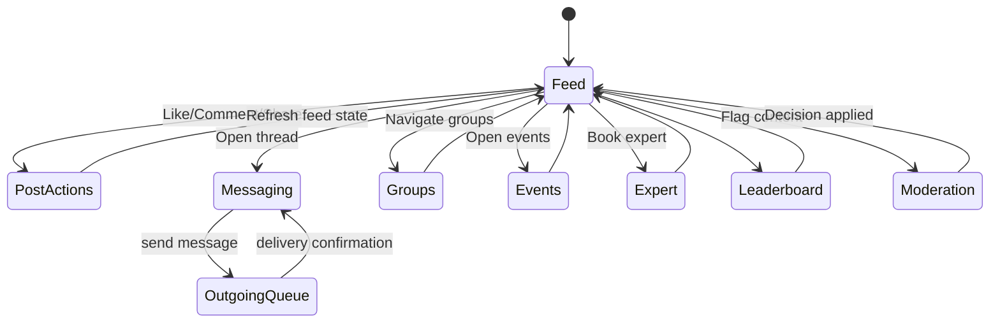

# Social Platform Guide

## Overview
The social subsystem enables community engagement through feeds, messaging, groups, events, expert sessions, moderation, and reputation tracking.

## Feature Modules
- `ui/social/`: Feed, leaderboard, video player components.
- `ui/messaging/`: Direct and group chat screens with queued sending.
- `ui/events/`, `ui/expert/`, `ui/moderation/`: Supporting UIs for events, expert booking, moderation workflows.

## Data Model
Room entities defined in `data/database/entity/SocialEntities.kt` include:
- Posts, comments, likes.
- Follows, groups, group members.
- Events, RSVPs, expert bookings.
- Moderation reports, badges, reputation scores.
- Outgoing messages for queued delivery.

DAOs reside in `data/database/dao/` (for example, `PostsDao`, `CommentsDao`, `GroupsDao`, `EventRsvpsDao`).

## Repository Layer
`data/repository/social/RepositoriesSocial.kt` provides:
- `SocialRepositoryImpl`: Paging feed, ranking, likes/comments, share counts, and moderation entrypoints.
- `MessagingRepositoryImpl`: Thread retrieval, message queue management, delivery state updates.
- Reputation and badge services for leaderboard and user trust signals.

## UI Flow
1. `SocialFeedScreen` collects `PagingData<PostEntity>` from `SocialFeedViewModel` and renders cards with images or `VideoPlayer` (ExoPlayer).
2. Users like/comment/share posts; actions call repository methods through the ViewModel.
3. Navigation to groups/events/experts is handled via `AppNavHost.kt` routes.
4. `ThreadScreen` binds to message streams, while `OutgoingMessageWorker` flushes queued messages in the background.
5. `LeaderboardScreen` displays reputation standings computed in repositories.
6. `ModerationScreen` provides admin-level review of submitted reports.

### Diagram

## Background Automation
- **OutgoingMessageWorker**: Periodically sends queued messages (`OutgoingMessageEntity`), updating delivery timestamps and notifying recipients.
- **ModerationWorker**: Scans reports every 6 hours, auto-resolving low-risk cases and escalating serious ones.

## Notifications
`utils/notif/SocialNotifier` abstractions deliver local/FCM notifications for likes, comments, mentions, and messages. Configured in `di/AppModule.kt`.

## Integration Points
- Firebase Realtime Database / Functions for real-time messaging (configurable via repositories).
- Analytics pipelines feed social engagement metrics into `AnalyticsDailyEntity` for dashboards.
- RBAC controls can leverage `domain/rbac/` to restrict moderator/admin actions.

## Extensibility
- Introduce rich content (polls, attachments) by augmenting entities and UI composables.
- Enforce content guidelines with advanced ML moderation in `ModerationWorker`.
- Add WebRTC calling once dependencies are finalized.
- Create admin dashboards using analytics infrastructure.

## Testing
- Use Paging test artifacts to validate `SocialRepositoryImpl` feed ordering.
- Mock repositories when testing UI composables for deterministic states.
- Exercise workers with WorkManager test APIs to confirm scheduling and retry logic.
