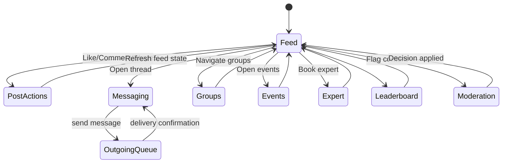

# Social Platform Guide

## Overview
The social subsystem enables community engagement through feeds, messaging, groups, events, expert sessions, moderation, and reputation tracking. Recently enhanced with a messenger-like community hub featuring context-aware messaging and intelligent recommendations.

## Feature Modules
- `ui/social/`: Feed, leaderboard, video player components.
- `ui/messaging/`: Direct and group chat screens with queued sending, thread metadata.
- `ui/community/`: Community hub with multi-tab interface (Messages, Discover, Feed, My Groups).
- `ui/farmer/`: Farmer-specific community features and expert consultation.
- `ui/events/`, `ui/expert/`, `ui/moderation/`: Supporting UIs for events, expert booking, moderation workflows.

## Data Model

### Core Social Entities
Room entities defined in `data/database/entity/SocialEntities.kt` include:
- Posts, comments, likes.
- Follows, groups, group members.
- Events, RSVPs, expert bookings.
- Moderation reports, badges, reputation scores.
- Outgoing messages for queued delivery.

### Community Engagement Entities
Additional entities in `data/database/entity/CommunityEntities.kt` (added in migration 15→16):
- **ThreadMetadataEntity**: Thread context tracking with types (PRODUCT_INQUIRY, EXPERT_CONSULT, BREEDING_DISCUSSION, GENERAL).
- **CommunityRecommendationEntity**: Personalized recommendations (mentors, connections, groups, events, experts, posts).
- **UserInterestEntity**: Interest-based personalization data for content filtering.
- **ExpertProfileEntity**: Expert specialties, ratings, availability, and hourly rates.

DAOs reside in `data/database/dao/` (e.g., `PostsDao`, `CommentsDao`, `GroupsDao`, `EventRsvpsDao`, `ThreadMetadataDao`, `CommunityRecommendationDao`).

## Repository Layer
`data/repository/social/RepositoriesSocial.kt` provides:
- `SocialRepositoryImpl`: Paging feed, ranking, likes/comments, share counts, and moderation entrypoints.
- `MessagingRepositoryImpl`: Thread retrieval, message queue management, delivery state updates, context-aware thread creation.
- `CommunityRepository`: Groups, events, membership management, RSVP handling.
- Reputation and badge services for leaderboard and user trust signals.

## Service Layer
`community/CommunityEngagementService.kt` provides:
- **Data Aggregation**: 20+ methods for trending posts, suggested groups, upcoming events, available experts, active threads.
- **Intelligent Recommendations**: Mentor matching, connection suggestions, expert matching by topic.
- **Context-Aware Messaging**: Thread creation with business context (product inquiries, expert consultations, breeding discussions).
- **Community Metrics**: Engagement scoring, community statistics, user activity tracking.

## UI Flow

### Traditional Social Features
1. `SocialFeedScreen` collects `PagingData<PostEntity>` from `SocialFeedViewModel` and renders cards with images or `VideoPlayer` (ExoPlayer).
2. Users like/comment/share posts; actions call repository methods through the ViewModel.
3. Navigation to groups/events/experts is handled via `AppNavHost.kt` routes.
4. `ThreadScreen` binds to message streams with context badges, while `OutgoingMessageWorker` flushes queued messages in the background.
5. `LeaderboardScreen` displays reputation standings computed in repositories.
6. `ModerationScreen` provides admin-level review of submitted reports.

### Community Hub Experience
1. `CommunityHubScreen` provides 4-tab interface:
   - **Messages**: Active threads with context badges and unread counts
   - **Discover**: Personalized recommendations (mentors, connections, groups, experts)
   - **Feed**: Trending posts with engagement metrics
   - **My Groups**: User's joined groups with activity indicators
2. `FarmerCommunityScreen` shows farmer-specific features:
   - Active threads with business context
   - Suggested groups for regional farmers
   - Upcoming farming events with RSVP
   - Available agricultural experts with booking
3. Context-aware thread creation:
   - Select context type (product inquiry, expert consult, breeding discussion)
   - System adds metadata for intelligent routing and recommendations
   - Visual badges show thread context throughout UI

### Diagram

## Background Automation
- **OutgoingMessageWorker**: Periodically sends queued messages (`OutgoingMessageEntity`), updating delivery timestamps and notifying recipients.
- **ModerationWorker**: Scans reports every 6 hours, auto-resolving low-risk cases and escalating serious ones.
- **CommunityEngagementWorker**: Runs every 12 hours to generate personalized recommendations:
  - Mentor matching based on reputation and expertise
  - Connection suggestions based on user type and interests
  - Group recommendations based on activity and topics
  - Event suggestions based on location and calendar
  - Expert matching based on specialties and availability
  - Cached recommendations expire after 24 hours

## Notifications
`utils/notif/SocialNotifier` abstractions deliver local/FCM notifications for likes, comments, mentions, and messages. Configured in `di/AppModule.kt`.

## Integration Points
- Firebase Realtime Database / Functions for real-time messaging (configurable via repositories).
- Analytics pipelines feed social engagement metrics into `AnalyticsDailyEntity` for dashboards.
- RBAC controls can leverage `domain/rbac/` to restrict moderator/admin actions.

## User Type Personalization

The community hub adapts to user roles:

### FARMER
- Emphasizes buyer inquiries and sales-related threads
- Recommends regional farming groups
- Highlights expert consultations for farm health
- Prioritizes equipment and supply connections

### ENTHUSIAST
- Focuses on breeding discussions and genetics
- Recommends show event groups
- Highlights champion bloodline tracking
- Prioritizes breeding pair connections

### GENERAL
- Emphasizes marketplace inquiries
- Recommends general community groups
- Highlights basic poultry care resources
- Prioritizes learning and education content

## Extensibility
- Introduce rich content (polls, attachments) by augmenting entities and UI composables.
- Enforce content guidelines with advanced ML moderation in `ModerationWorker`.
- Add WebRTC calling once dependencies are finalized.
- Create admin dashboards using analytics infrastructure.
- Implement real-time presence indicators for online users.
- Add typing indicators and message read receipts.

## Testing
- Use Paging test artifacts to validate `SocialRepositoryImpl` feed ordering.
- Mock repositories when testing UI composables for deterministic states.
- Exercise workers with WorkManager test APIs to confirm scheduling and retry logic.
- Test context-aware thread creation with different metadata types.
- Validate recommendation algorithm with various user profiles and interests.
