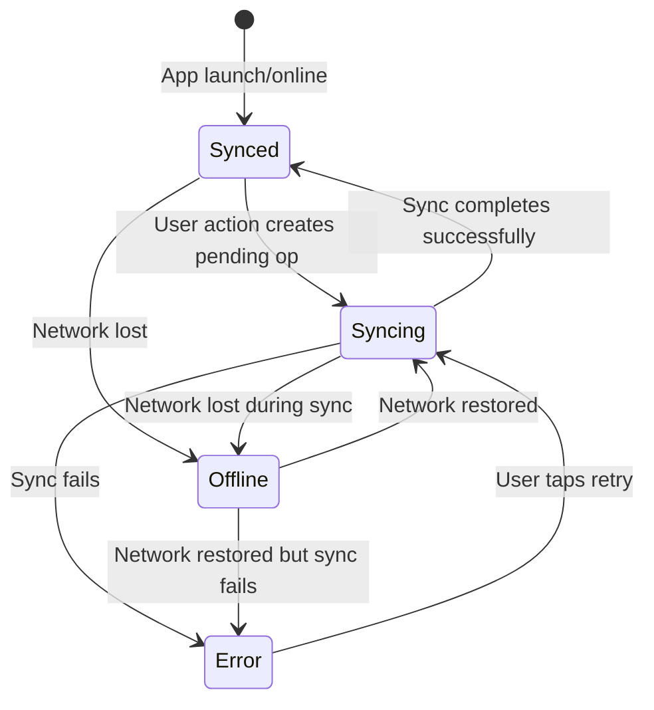
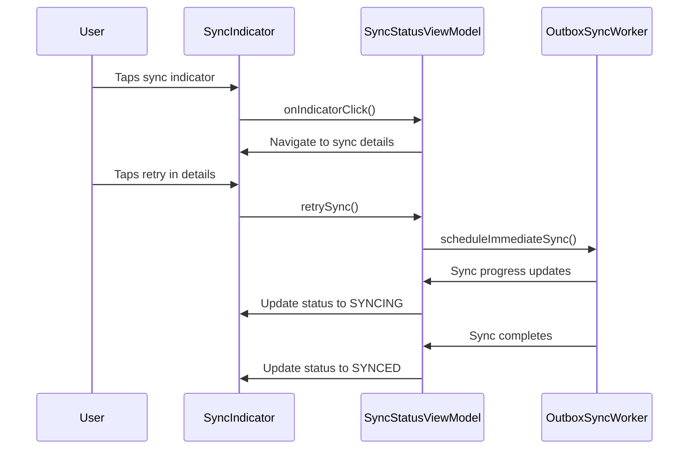
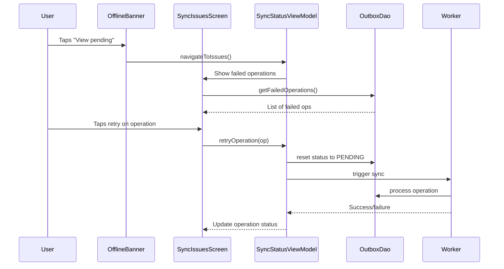

# Sync Transparency Guide

**Version:** 1.0  
**Last Updated:** 2025-01-15  
**Audience:** Developers, UX Designers, Product Managers  
**Related Documentation:**
- [architecture.md](architecture.md) - Overall app architecture
- [background-jobs.md](background-jobs.md) - Background processing and workers
- [user-experience-guidelines.md](user-experience-guidelines.md) - UX patterns and components

---

> This guide covers the implementation of transparent offline/sync UX in ROSTRY, ensuring users understand what's happening with their data and can recover from issues.

## 1. Overview

### Why Sync Transparency Matters

In offline-first apps like ROSTRY, users expect their actions to work even without internet. However, silent background syncing can lead to confusion and frustration when:

- Changes appear to "disappear" due to sync failures
- Users don't know if their data is safe
- Errors occur without clear recovery paths
- Offline state isn't communicated effectively

**Business Impact:**
- Reduces support tickets about "lost" data
- Increases user confidence in offline functionality
- Improves conversion from guest to authenticated users
- Enhances overall app reliability perception

### User Pain Points Addressed

**Before (Pain Points):**
- "I added a product but it's gone now"
- "The app says it's working but nothing happens"
- "I don't know if my changes saved"
- "Sync errors with no way to fix them"

**After (Solutions):**
- Clear visual indicators of sync status
- Offline banners with pending operation counts
- "Issues to fix" screen for failed operations
- Proactive error recovery options

## 2. Sync States

The app exposes four primary sync states to users, each with distinct visual cues and behaviors:

### Synced (✓)
**Visual:** Green checkmark icon  
**Text:** "All changes synced"  
**Condition:** Online + no pending operations + recent successful sync  
**Behavior:** No action needed, user can proceed normally

### Syncing (⏳)
**Visual:** Animated progress indicator  
**Text:** "Syncing X items..."  
**Condition:** Online + pending operations > 0  
**Behavior:** Shows progress, prevents conflicting actions

### Offline (⚠️)
**Visual:** Orange warning icon  
**Text:** "You're offline. X pending"  
**Condition:** Offline (network unavailable)  
**Behavior:** Shows pending count, offers "View pending" action

### Error (❌)
**Visual:** Red error icon with shake animation  
**Text:** "Sync failed. Tap to retry"  
**Condition:** Sync attempt failed + retryable error  
**Behavior:** Tap triggers immediate retry, links to issues screen

**State Transitions:**


## 3. UI Components

### SyncStatusIndicator

Reusable composable for top bar sync status display:

```kotlin
@Composable
fun SyncStatusIndicator(
    syncState: SyncState,
    onClick: () -> Unit,
    modifier: Modifier = Modifier
) {
    val icon = when (syncState.status) {
        SyncStatus.SYNCED -> Icons.Default.CheckCircle
        SyncStatus.SYNCING -> Icons.Default.Sync
        SyncStatus.OFFLINE -> Icons.Default.CloudOff
        SyncStatus.ERROR -> Icons.Default.Error
    }
    
    val tint = when (syncState.status) {
        SyncStatus.SYNCED -> MaterialTheme.colorScheme.primary
        SyncStatus.SYNCING -> MaterialTheme.colorScheme.secondary
        SyncStatus.OFFLINE -> MaterialTheme.colorScheme.tertiary
        SyncStatus.ERROR -> MaterialTheme.colorScheme.error
    }
    
    IconButton(onClick = onClick) {
        Icon(
            imageVector = icon,
            contentDescription = syncState.description,
            tint = tint,
            modifier = modifier
                .size(24.dp)
                .then(
                    if (syncState.status == SyncStatus.SYNCING) {
                        Modifier.rotate(AnimatedRotation())
                    } else Modifier
                )
        )
    }
}
```

**Integration:** Added to `RoleNavScaffold` top bar, observes `SyncStatusViewModel.syncState`.

### OfflineBanner

Persistent banner shown when offline with pending operations:

```kotlin
@Composable
fun OfflineBanner(
    pendingCount: Int,
    onViewPending: () -> Unit,
    onDismiss: () -> Unit,
    modifier: Modifier = Modifier
) {
    var dismissed by remember { mutableStateOf(false) }
    
    AnimatedVisibility(
        visible = !dismissed,
        enter = slideInVertically(),
        exit = slideOutVertically()
    ) {
        Card(
            colors = CardDefaults.cardColors(
                containerColor = MaterialTheme.colorScheme.secondaryContainer
            ),
            modifier = modifier.fillMaxWidth()
        ) {
            Row(
                modifier = Modifier.padding(16.dp),
                verticalAlignment = Alignment.CenterVertically
            ) {
                Icon(
                    Icons.Default.CloudOff,
                    contentDescription = null,
                    tint = MaterialTheme.colorScheme.onSecondaryContainer
                )
                Spacer(Modifier.width(12.dp))
                Text(
                    text = "You're offline. $pendingCount updates pending sync.",
                    style = MaterialTheme.typography.bodyMedium,
                    color = MaterialTheme.colorScheme.onSecondaryContainer,
                    modifier = Modifier.weight(1f)
                )
                TextButton(onClick = onViewPending) {
                    Text("View pending")
                }
                IconButton(onClick = { dismissed = true }) {
                    Icon(Icons.Default.Close, contentDescription = "Dismiss")
                }
            }
        }
    }
}
```

**Integration:** Added to `RoleNavScaffold` above content, dismiss state persisted per session.

### SyncIssuesScreen

Full-screen component for viewing and fixing failed sync operations:

```kotlin
@Composable
fun SyncIssuesScreen(
    failedOperations: List<FailedOperation>,
    onRetry: (FailedOperation) -> Unit,
    onDelete: (FailedOperation) -> Unit,
    onRetryAll: () -> Unit,
    modifier: Modifier = Modifier
) {
    Scaffold(
        topBar = {
            TopAppBar(
                title = { Text("Sync Issues") },
                actions = {
                    TextButton(onClick = onRetryAll) {
                        Text("Retry All")
                    }
                }
            )
        }
    ) { padding ->
        if (failedOperations.isEmpty()) {
            EmptyState(
                icon = Icons.Default.CheckCircle,
                title = "All synced!",
                message = "No issues to fix."
            )
        } else {
            LazyColumn(
                modifier = modifier.padding(padding)
            ) {
                items(failedOperations) { operation ->
                    FailedOperationCard(
                        operation = operation,
                        onRetry = { onRetry(operation) },
                        onDelete = { onDelete(operation) }
                    )
                }
            }
        }
    }
}
```

**Integration:** Navigated to from sync status indicator, uses `OutboxDao.getFailedOperations()`.

## 4. User Flows

### Sync Status Interaction Flow



### Error Recovery Flow



### Offline to Online Transition

1. **Offline State:** Banner shows "You're offline. 3 updates pending sync."
2. **Network Restored:** Banner hides, status changes to "Syncing 3 items..."
3. **Sync Progress:** Progress indicator animates, count decreases
4. **Completion:** Status shows "All changes synced" with green checkmark
5. **Error Handling:** If sync fails, shows error state with retry option

## 5. Technical Implementation

### SyncStatusViewModel

Manages sync state and exposes to UI:

```kotlin
@HiltViewModel
class SyncStatusViewModel @Inject constructor(
    private val connectivityManager: ConnectivityManager,
    private val outboxDao: OutboxDao,
    private val syncManager: SyncManager,
    private val workManager: WorkManager
) : ViewModel() {

    val syncState: StateFlow<SyncState> = combine(
        connectivityManager.observeNetworkState(),
        outboxDao.getPendingCount(),
        outboxDao.getFailedCount(),
        syncManager.syncProgress
    ) { network, pending, failed, progress ->
        determineSyncState(network, pending, failed, progress)
    }.stateIn(viewModelScope, SharingStarted.Lazily, SyncState())

    fun retrySync() {
        OutboxSyncWorker.scheduleImmediateSync(workManager)
    }

    private fun determineSyncState(
        network: NetworkState,
        pending: Int,
        failed: Int,
        progress: SyncProgress?
    ): SyncState {
        return when {
            network is NetworkState.Unavailable -> 
                SyncState(OFFLINE, pending, null, null, false)
            failed > 0 -> 
                SyncState(ERROR, pending, null, "Sync failed", false)
            progress?.isActive == true -> 
                SyncState(SYNCING, pending, null, null, false)
            pending > 0 -> 
                SyncState(SYNCING, pending, null, null, false)
            else -> 
                SyncState(SYNCED, 0, System.currentTimeMillis(), null, false)
        }
    }
}
```

### OutboxDao Queries

New queries for sync transparency:

```kotlin
@Dao
interface OutboxDao {
    
    @Query("SELECT COUNT(*) FROM outbox WHERE status IN ('PENDING', 'RETRYING')")
    fun getPendingCount(): Flow<Int>
    
    @Query("SELECT COUNT(*) FROM outbox WHERE status = 'FAILED'")
    fun getFailedCount(): Flow<Int>
    
    @Query("""
        SELECT * FROM outbox 
        WHERE status = 'FAILED' 
        ORDER BY created_at DESC 
        LIMIT 10
    """)
    fun getFailedOperations(): Flow<List<OutboxEntity>>
    
    @Query("UPDATE outbox SET status = 'PENDING', retry_count = 0 WHERE id = :id")
    suspend fun resetOperationStatus(id: String)
    
    @Delete
    suspend fun deleteOperation(operation: OutboxEntity)
}
```

### WorkManager Integration

Immediate sync scheduling for user-triggered retries:

```kotlin
object OutboxSyncWorker {
    
    fun scheduleImmediateSync(workManager: WorkManager) {
        val constraints = Constraints.Builder()
            .setRequiredNetworkType(NetworkType.CONNECTED)
            .build()
        
        val workRequest = OneTimeWorkRequestBuilder<OutboxSyncWorker>()
            .setConstraints(constraints)
            .setExpedited(OutOfQuotaPolicy.RUN_AS_NON_EXPEDITED_WORK_REQUEST)
            .build()
        
        workManager.enqueueUniqueWork(
            IMMEDIATE_SYNC_WORK_NAME,
            ExistingWorkPolicy.REPLACE,
            workRequest
        )
    }
}
```

## 6. Error Handling

### Error Types and User Messages

**Network Errors:**
- **FirebaseNetworkException** → "Couldn't connect. Check your internet."
- **TimeoutException** → "Connection timed out. Will retry automatically."

**Data Validation Errors:**
- **InvalidDataException** → "Some information is missing or incorrect."
- **PermissionDeniedException** → "You don't have permission for this action."

**Server Errors:**
- **InternalServerError** → "Server error. Our team has been notified."
- **ServiceUnavailable** → "Service temporarily unavailable. Try again later."

### Retry Logic

**Automatic Retries:**
- Exponential backoff: 30s, 1m, 2m, 4m, 8m (max 5 attempts)
- Only for network-related failures
- Stops on validation or permission errors

**User-Initiated Retries:**
- "Retry" button on individual operations
- "Retry All" button for batch retry
- Immediate scheduling with expedited WorkManager

**Error Recovery UI:**
```kotlin
@Composable
fun FailedOperationCard(
    operation: FailedOperation,
    onRetry: () -> Unit,
    onDelete: () -> Unit
) {
    Card(modifier = Modifier.fillMaxWidth()) {
        Column(modifier = Modifier.padding(16.dp)) {
            Text(
                text = operation.type.displayName,
                style = MaterialTheme.typography.titleMedium
            )
            Text(
                text = operation.errorMessage,
                style = MaterialTheme.typography.bodyMedium,
                color = MaterialTheme.colorScheme.error
            )
            Text(
                text = "Failed ${operation.timestamp.formatRelative()}",
                style = MaterialTheme.typography.bodySmall
            )
            Row(
                modifier = Modifier.fillMaxWidth(),
                horizontalArrangement = Arrangement.End
            ) {
                TextButton(onClick = onDelete) {
                    Text("Delete")
                }
                Button(onClick = onRetry) {
                    Text("Retry")
                }
            }
        }
    }
}
```

## 7. Testing

### Offline Scenarios Testing

**Network Interception:**
```kotlin
@Test
fun `sync status shows offline when network unavailable`() = runTest {
    // Given
    val connectivityManager = mockk<ConnectivityManager>()
    every { connectivityManager.observeNetworkState() } returns 
        flowOf(NetworkState.Unavailable)
    
    val viewModel = SyncStatusViewModel(
        connectivityManager, outboxDao, syncManager, workManager
    )
    
    // When
    val state = viewModel.syncState.first()
    
    // Then
    assertEquals(SyncStatus.OFFLINE, state.status)
}
```

**WorkManager Testing:**
```kotlin
@Test
fun `retry sync schedules immediate work`() {
    // Given
    val workManager = mockk<WorkManager>()
    val captor = slot<OneTimeWorkRequest>()
    
    // When
    OutboxSyncWorker.scheduleImmediateSync(workManager)
    
    // Then
    verify { workManager.enqueueUniqueWork(any(), any(), capture(captor)) }
    assertTrue(captor.captured.workSpec.constraints.requiresNetwork())
}
```

### Sync Failure Testing

**Failed Operations:**
```kotlin
@Test
fun `failed operations displayed in issues screen`() = runTest {
    // Given
    val failedOps = listOf(
        FailedOperation("create_listing", "Network error", timestamp)
    )
    val dao = mockk<OutboxDao>()
    every { dao.getFailedOperations() } returns flowOf(failedOps)
    
    // When
    val operations = dao.getFailedOperations().first()
    
    // Then
    assertEquals(1, operations.size)
    assertEquals("Network error", operations[0].errorMessage)
}
```

### Edge Cases

**Rapid State Changes:**
- Network flapping (online→offline→online)
- Multiple concurrent sync operations
- App backgrounded during sync

**Large Pending Counts:**
- 100+ pending operations
- Memory usage with large operation lists
- UI performance with many failed operations

**Permission Changes:**
- Network permission revoked
- Storage permission for large syncs
- Background processing restrictions

## 8. Analytics

### Events Tracked

**Sync Status Events:**
```kotlin
fun trackSyncStatusChanged(status: SyncStatus, pendingCount: Int) {
    analytics.logEvent("sync_status_changed") {
        param("status", status.name)
        param("pending_count", pendingCount)
    }
}

fun trackSyncError(errorType: String, operationType: String) {
    analytics.logEvent("sync_error") {
        param("error_type", errorType)
        param("operation_type", operationType)
    }
}

fun trackSyncRetry(trigger: String) { // "auto", "user_manual", "user_batch"
    analytics.logEvent("sync_retry") {
        param("trigger", trigger)
    }
}
```

### Metrics to Monitor

**Success Rates:**
- Sync success rate (>95% target)
- Error recovery rate (users who fix failed operations)
- Time to sync completion (median <30s)

**User Behavior:**
- Sync indicator tap rate
- Offline banner dismissal rate
- Issues screen usage

**Performance:**
- Battery impact of sync operations
- Network usage per sync
- Worker execution times

## 9. Performance

### Battery Optimization

**Constraints Applied:**
- `setRequiresBatteryNotLow(true)` for non-urgent syncs
- Expedited work only for user-initiated retries
- Batch operations to reduce wake-ups

**Background Processing:**
- Respects device idle state for heavy operations
- Uses `JobScheduler` compatibility for pre-Android 6.0
- Implements doze mode awareness

### Network Usage Optimization

**Efficient Sync:**
- Delta syncing (only changed data)
- Compression for large payloads
- Pagination for large datasets

**User Control:**
- "Sync only on WiFi" preference
- Manual sync pause/resume
- Data usage warnings for large syncs

### Memory Management

**Large Operation Lists:**
- Pagination in `SyncIssuesScreen` (50 items per page)
- Lazy loading for operation details
- Cleanup of completed operations after 7 days

**Image Handling:**
- Thumbnail generation for media operations
- Progressive loading for sync previews
- Cache management for offline media

## 10. Future Enhancements

### Conflict Resolution UI

**Merge Conflicts:**
- Side-by-side comparison of conflicting changes
- User choice: "Keep local", "Use server", "Merge manually"
- Conflict history for audit trails

**Implementation Sketch:**
```kotlin
@Composable
fun ConflictResolutionDialog(
    local: Product,
    server: Product,
    onResolve: (Resolution) -> Unit
) {
    // Show diff view
    // Allow field-by-field resolution
    // Track resolution analytics
}
```

### Sync History

**Operation Timeline:**
- Chronological list of sync operations
- Success/failure status with timestamps
- Detailed error logs for debugging

**Export Functionality:**
- CSV export of sync history
- Share with support for troubleshooting
- GDPR-compliant data retention

### Advanced Settings

**Sync Preferences:**
- Sync frequency (15min, 30min, 1hr, manual)
- Conflict resolution policy (auto-merge, always ask, prefer local/server)
- Data type toggles (disable image sync on slow networks)

**Debug Tools:**
- Force sync states for testing
- Detailed logging toggle
- Performance metrics dashboard

---

**For questions or improvements to sync transparency, please open an issue or submit a PR.**