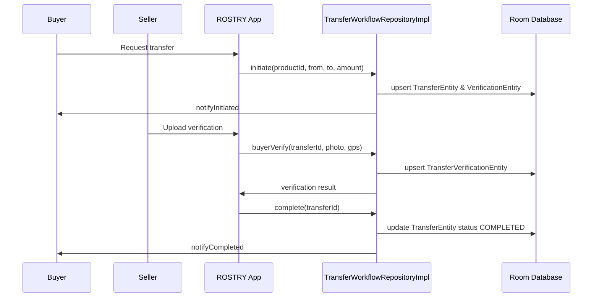

# Transfer Workflow Guide

## Core Responsibilities
- Capture ownership transfer requests and maintain lifecycle state (`PENDING`, `APPROVED`, `COMPLETED`, etc.).
- Enforce verification steps with GPS, photo, and identity checks.
- Track audit logs, disputes, and trust scoring to maintain platform integrity.
- Integrate with traceability to provide downstream provenance updates.

## Key Modules
- **Repository**: `data/repository/TransferWorkflowRepository.kt`
  - `TransferWorkflowRepositoryImpl` encapsulates initiation, buyer verification, platform approvals, completion, cancellation, dispute handling, trust score computation, and documentation export.
- **Entities** (Room):
  - `data/database/entity/TransferEntity.kt`
  - `data/database/entity/TransferVerificationEntity.kt`
  - `data/database/entity/DisputeEntity.kt`
  - `data/database/entity/AuditLogEntity.kt`
- **DAOs**: `TransferDao`, `TransferVerificationDao`, `DisputeDao`, `AuditLogDao`.
- **Utilities & Notifiers**: `utils/VerificationUtils.kt` for geofencing, `utils/notif/TransferNotifier.kt` for user alerts.
- **UI**: `ui/transfer/TransferDetailsViewModel.kt` and inline Composable in `ui/navigation/AppNavHost.kt` for transfer detail screen.

## Lifecycle Steps
1. **Initiation** (`initiate`):
   - De-duplicates recent requests via `TransferDao.countRecentPending`.
   - Persists a new `TransferEntity` (type = `OWNERSHIP`, status = `PENDING`).
   - Inserts audit log entry and initial `TransferVerificationEntity` (seller step).
   - Sends notification to buyer through `TransferNotifier.notifyInitiated`.
2. **Buyer Verification** (`buyerVerify`):
   - Validates GPS proximity using `VerificationUtils.withinRadius`.
   - Persists verification record and updates transfer with buyer photo metadata.
   - Records audit log and triggers `notifyBuyerVerified`.
3. **Platform Approval** (`platformApproveIfNeeded`):
   - If amount exceeds threshold (₹10,000), creates additional verification step (`PLATFORM_REVIEW`).
   - Hook for lineage checks via `TraceabilityRepository`.
4. **Completion** (`complete`):
   - Updates transfer status to `COMPLETED` and writes audit event.
   - Potential integration point with ownership updates (e.g., `TraceabilityRepository` or Cloud Function).
5. **Cancellation** (`cancel`):
   - Marks transfer `CANCELLED`, logs reason, triggers `notifyCancelled`.
6. **Dispute Handling**:
   - `raiseDispute` inserts `DisputeEntity` and logs `DISPUTE_RAISED`.
   - `resolveDispute` updates dispute status, marks transfer outcome (RESOLVED/ESCALATED) with logs.
7. **Trust Score** (`computeTrustScore`):
   - Aggregates verifications, disputes, and lineage compliance to calculate integer trust score.
8. **Documentation** (`generateDocumentation`):
   - Produces JSON package containing transfer, verifications, disputes, and audit logs for external reporting.

### Sequence Diagram

## Background Automation
- **`TransferTimeoutWorker`** (`workers/TransferTimeoutWorker.kt`):
  - Runs ~15 min cadence to cancel transfers exceeding `timeoutAt` threshold.
  - Uses `TransferDao.findExpiredPending` and `TransferWorkflowRepository.cancel`.
- **Ownership Updates**: Additional automation via Firebase Cloud Functions (`functions/onTransferStatusChange`) described in codebase memories, ensuring product ownership shifts on completion.

## Notifications & Messaging
- `TransferNotifier` interface (default `TransferNotifierImpl`) integrates with system notification channels and optionally FCM for real-time alerts.
- Notifications triggered on initiation, buyer verification, approval, completion, cancellation, dispute events.

## Compliance & Audit
- All critical actions logged via `AuditLogDao.insert(AuditLogEntity)` with actor, action type, and JSON payload.
- `VerificationUtils` ensures identities and GPS coordinates align with compliance requirements.
- Dispute resolution flow provides governance, with `AuditLogEntity` enabling audit trails.

## Extension Points
- Integrate third-party KYC/AML checks by enhancing `platformApproveIfNeeded`.
- Add attachments for dispute resolution (photos/documents) in `DisputeEntity`.
- Hook into `TraceabilityRepository` to auto-sync lineage updates after completion.
- Provide UI wizards for multi-step approvals in `TransferDetailsViewModel`.

## Testing Suggestions
- Unit test `TransferWorkflowRepositoryImpl` with in-memory Room using `kotlinx-coroutines-test`.
- Mock `TransferNotifier` to assert notifications.
- Simulate GPS edge cases and dispute resolution flows.
