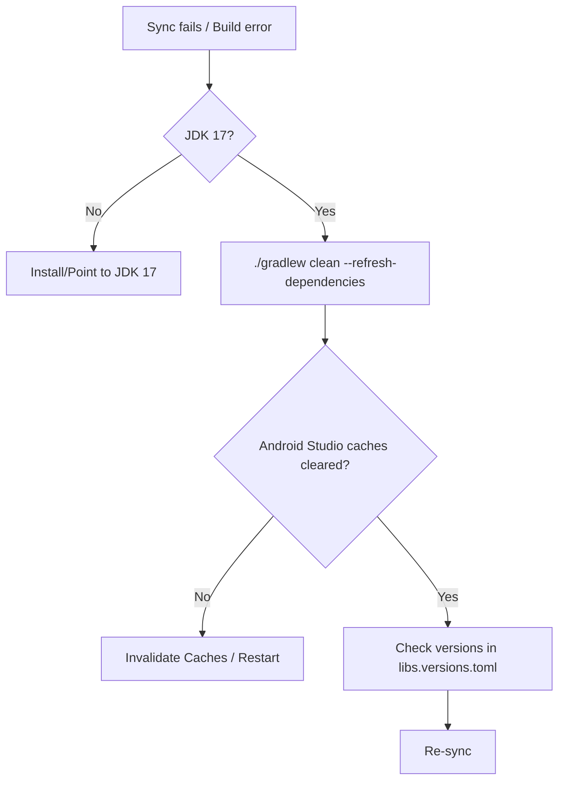
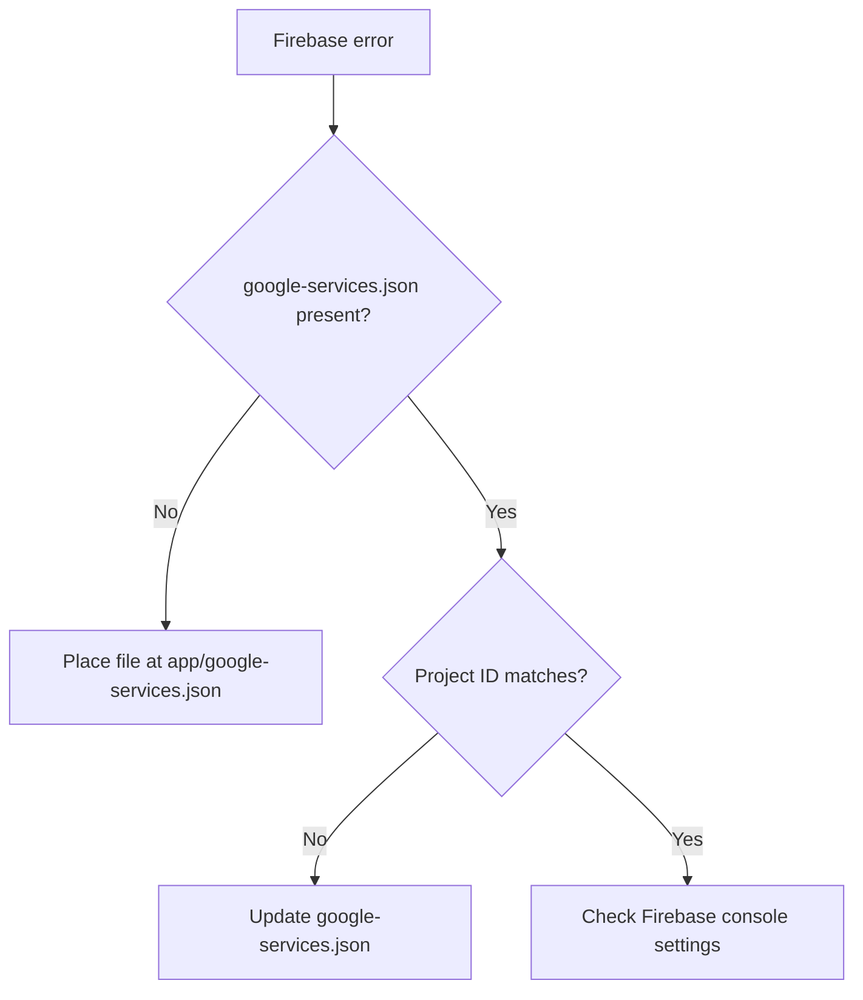
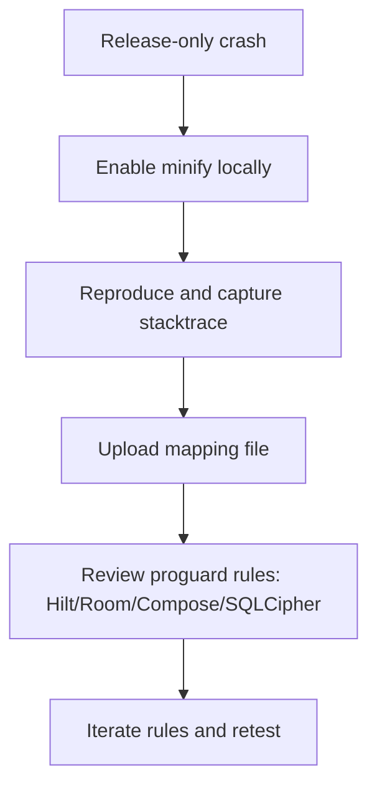

# Troubleshooting Guide

Actionable fixes for common issues. For environment setup see `../QUICK_START.md` and `developer-onboarding.md`.

---

## Build & Gradle

- Problem: Sync fails or build errors
  - Cause: Plugin/version mismatch, stale caches, wrong JDK
  - Solution:
    1. Ensure JDK 17 (`java -version`)
    2. Gradle clean and refresh deps:
       ```bash
       ./gradlew clean --refresh-dependencies
       ```
    3. Android Studio → File → Invalidate Caches / Restart
  - Prevention: Pin versions via `gradle/libs.versions.toml`

Flowchart:


- Problem: KSP/Room "Cannot figure out how to save this field"
  - Cause: Missing `@TypeConverters` import on `@Database`
  - Solution: Import the converters class in the database file and rebuild

## Firebase

- Problem: `File google-services.json is missing`
  - Solution: Place file at `app/google-services.json` and sync Gradle
  - Also check Firebase project ID matches

Flowchart:


## Database (Room/SQLCipher)

- Problem: Migration crashes on launch
  - Solution: Add/verify migration specs; run migration tests; log schema

Flowchart:
```mermaid
flowchart TD
    A[Crash on launch after schema change] --> B[Increment DB version]
    B --> C[Create Migration object]
    C --> D[Add to Room.databaseBuilder(..., addMigrations)]
    D --> E[Write MigrationTest with helper]
    E --> F[Run tests and retry]
```

- Problem: Encryption errors
  - Solution: Verify SQLCipher factory and passphrase; keep ProGuard rules for SQLCipher

## Network

- Problem: Timeouts/403/SSL
  - Solution: Check base URL (https), interceptors, auth headers; certificate pinning only in release; try mock source

## WorkManager

- Problem: Jobs not running
  - Solution: Validate constraints, battery optimizations, unique names; inspect `adb shell dumpsys activity service WorkManager`

Cross-links: `background-jobs.md`, `architecture.md`

## UI/Compose

- Problem: Excess recompositions or jank
  - Solution: Use `Lazy*` lists with keys, hoist state, avoid heavy work in composables, leverage `remember`

## Auth/Session

- Problem: Token or demo mode issues
  - Solution: Verify auth mode in `SessionManager`; re-login; check Firebase Auth settings and test numbers

## Testing

- Problem: Emulator flakiness
  - Solution: Cold boot or switch images; use CI images; prefer in-memory DB for tests

## Release/ProGuard

- Problem: Crash only in release
  - Solution: Upload mapping, review keep rules for Hilt/Room/Compose/SQLCipher; reproduce with minify enabled

Flowchart:


---

## Debug Tools
- Logcat filters, Database Inspector, Network Inspector
- Timing and traces via Firebase Performance

## Still Stuck?
- Open an issue with:
  - Steps to reproduce
  - Expected vs actual behavior
  - Device/Android version, app version, build type
  - Relevant logs/stack traces

Related docs: `../CODE_STYLE.md`, `code-style-quick-reference.md`, `testing-strategy.md`, `security-encryption.md`, `background-jobs.md`, `architecture.md`
