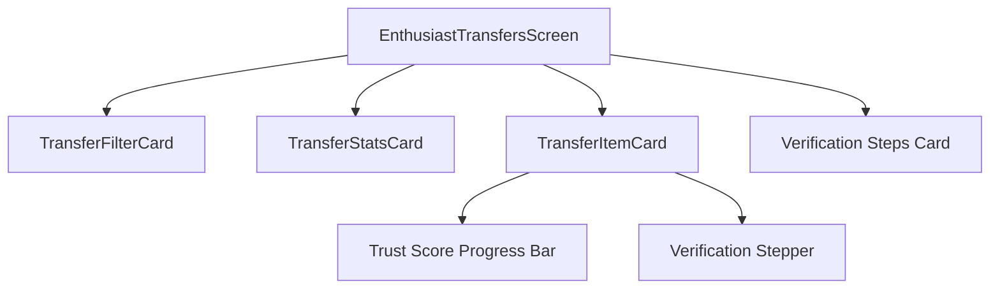

# Transfer Screen Improvements

## Overview
The transfer screen enhancements introduce modular, reusable components that improve the user experience and provide better maintainability. This document outlines the changes, design decisions, and implementation details.

## Original Issues
The original transfer screen implementation had several issues:
- Excessive scrolling with multiple fixed-height LazyColumns
- Poor UX due to nested scrolling
- Inflexible filter and stats components hard-coded in the main screen
- Repetitive transfer item rendering logic
- Limited customization and reusability across different parts of the app

## New Component Architecture

### Component Structure
The new architecture breaks down the monolithic transfer screen into several reusable components:

### TransferFilterCard
- Self-contained filter component with expandable sections
- Handles status, type, and date range filters
- Includes date validation and quick date range presets
- Manages its own expanded/collapsed state

### TransferStatsCard
- Displays key metrics: total, pending, disputed, and completed transfers
- Responsive layout with visual indicators
- Interactive elements that trigger status-based filtering
- Tooltips for enhanced accessibility

### TransferItemCard
- Unified transfer display component for both pending and historical transfers
- Supports selection, verification, traceability, and export functionality
- Displays trust score and verification progress
- Optimized for both touch and accessibility use

## Design and Theming
- Consistent Material 3 design language
- Adaptive color schemes based on transfer status
- Responsive layouts for different screen sizes
- Proper typography hierarchy for information density

## Accessibility Considerations
- Semantic descriptions for screen readers
- Proper touch targets and spacing
- Color contrast compliance
- Keyboard navigation support where applicable

## Testing Checklist
- [ ] Filter functionality works correctly across all filter types
- [ ] Stats card accurately reflects transfer counts
- [ ] Transfer item cards display properly with all data types
- [ ] Trust score computation works as expected
- [ ] Date filtering works with various date ranges
- [ ] Selection and bulk actions work properly
- [ ] Verification flows work as expected
- [ ] Export functionality produces correct documentation
- [ ] Screen performs well with large numbers of transfers
- [ ] Responsive design works on different screen sizes