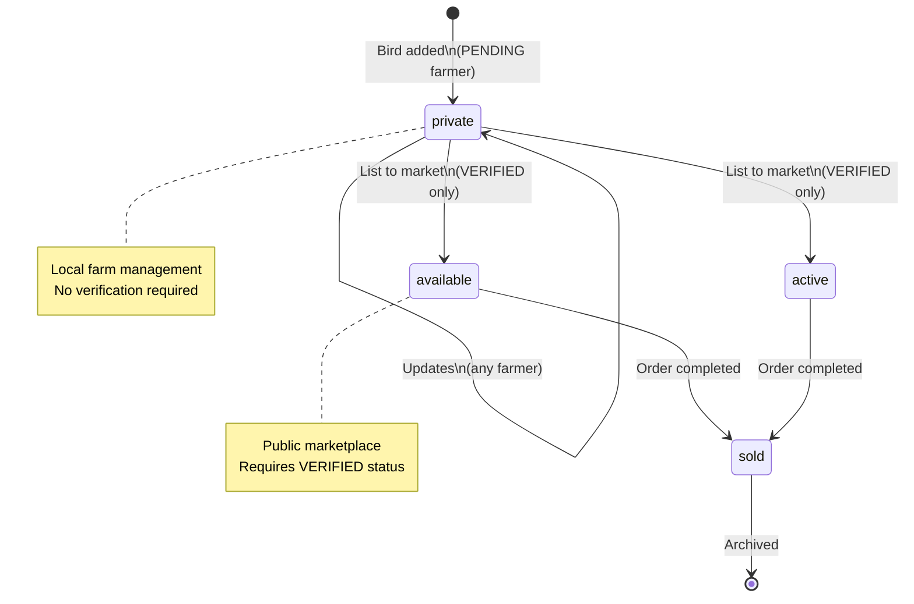

# Verification System

## Overview
- **Purpose:** Increase trust and compliance. Two tracks: Farmer Location Verification and Enthusiast KYC.
- **Lifecycle:** UNVERIFIED → PENDING → VERIFIED/REJECTED. Resubmission allowed after rejection.

## Farmer Location Verification
- **Requirements:** GPS coordinates (lat/lng), farm photos, optional land ownership docs.
- **Validation:**
  - Image/document format and size checks (JPEG/PNG/PDF ≤ 5MB)
  - EXIF GPS within 500m of claimed location (warning if mismatch)
  - Photo recency (warn if > 30 days)
- **Review:** Admin confirms location on map, inspects photos/docs.
- **Benefits:** Enables market listing creation. Other farmer features (breeding, monitoring, transfers, lineage) are available during PENDING status.

## Enthusiast KYC
- **Requirements:** Government ID (Aadhaar/PAN/DL/Passport), selfie, address proof.
- **Validation:** Format/size checks, presence of required categories.
- **Review:** Admin verifies ID authenticity, address proof, and selfie.
- **Benefits:** Enables market listing creation. Other enthusiast features are available during PENDING status.

## Feature Access by Verification Status
- **UNVERIFIED:** No farmer/enthusiast features
- **PENDING:** All farmer/enthusiast features including local farm management (bird onboarding, batch creation, daily logging, vaccination tracking, breeding records, growth monitoring, etc.) but EXCEPT public market listing creation
  - Can add birds/batches locally with status="private"
  - Cannot create public market listings (products with status="active" or other public statuses)
- **VERIFIED:** All features including both local farm management and public market listings
- **REJECTED:** Same as UNVERIFIED (can resubmit verification)

## Product Status Values and Lifecycle

### Private vs Public Products
- **Private Products** (`status="private"`):
  - For local farm management only
  - Not visible in the public marketplace
  - Can be created by PENDING farmers
  - Used for tracking birds, batches, breeding records, etc.

- **Public Products** (any status except "private"):
  - Listed in the public marketplace
  - Visible to all users
  - Require VERIFIED status to create or transition to
  - Examples: "available", "active", "reserved", "sold", etc.

### Status Lifecycle
1. Bird added locally: `status="private"`
2. Farmer gets verified: Can transition to `status="available"`
3. Product listed to market: `status="active"` or `status="available"`
4. Product sold: `status="sold"`

### Status Transition Diagram



### Code Example
```kotlin
// PENDING farmer adding a bird locally
val bird = ProductEntity(
    productId = UUID.randomUUID().toString(),
    sellerId = currentUserId,
    name = "My Chicken",
    status = "private",  // Key: private status for local management
    category = "BIRD",
    // ... other fields
)
productRepository.addProduct(bird)  // ✅ Allowed for PENDING farmers
```

### ⚠️ Important: Status Transitions
Updating a product from `status="private"` to any public status (e.g., "available", "active") requires VERIFIED status. The system enforces this in both `addProduct()` and `updateProduct()` methods.

### Status Value Reference

| Status | Visibility | Verification Required | Description |
|--------|------------|----------------------|-------------|
| `private` | Local only | No | For farm management and tracking |
| `available` | Public | Yes | Listed in marketplace, ready for purchase |
| `active` | Public | Yes | Listed and actively promoted |
| `reserved` | Public | Yes | Temporarily held for a buyer |
| `sold` | Public | Yes | Transaction completed |

### Edge Cases & Special Scenarios

- **Verification revoked**: If a farmer's verification is revoked after creating public listings, existing listings remain visible but cannot be updated to other public statuses. They can only be updated to "private" or deleted.
- **Mid-transaction status**: Products involved in active orders cannot have their status changed until the order is completed or cancelled.
- **Concurrent updates**: The system uses optimistic locking (dirty flag + lastModifiedAt) to handle concurrent updates. Last write wins.

### Status Troubleshooting

- **"Complete KYC verification" error when adding bird**: Ensure you're using the bird onboarding flow (not marketplace listing). Birds should be created with `status="private"`.
- **Cannot update bird to "available"**: Verify your farm location first. Go to Profile → Verification.
- **Bird stuck in "private" status**: This is normal for PENDING farmers. Complete verification to list to marketplace.

## Technical Architecture
- **Flow:** UI (Compose) → `VerificationViewModel` → `VerificationValidationService` → `MediaUploadManager` → `FirebaseStorageUploader` → Firebase Storage → `UserRepository` → Firestore.
- **Notifications:** `VerificationNotificationService` posts local notifications and stores to Room via `NotificationDao`.
- **Outbox:** `UploadTaskEntity` persisted via `UploadTaskDao`; `MediaUploadWorker` processes uploads with retries and progress.

### Key Components
- `utils/validation/VerificationValidationService.kt` — centralized validation (files, EXIF, submissions, duplicate checks).
- `utils/media/FirebaseStorageUploader.kt` — real Storage uploads with progress/compression.
- `utils/media/MediaUploadManager.kt` — events API, retry, cancel, outbox scheduling.
- `workers/MediaUploadWorker.kt` — background processing and progress persistence.
- `ui/verification/VerificationViewModel.kt` — validation hooks, duplicate prevention, submission flags, event handling.
- `notifications/VerificationNotificationService.kt` — local notifications for pending/approved/rejected.
- `di/VerificationModule.kt` — Hilt providers.

## Admin Workflow
- **Screen:** `ui/moderation/ModerationScreen.kt` has a "Verifications" tab (basic list now).
- **ViewModel:** `ui/moderation/ModerationViewModel.kt` exposes `pendingVerifications` and approve/reject methods that call `UserRepository.updateVerificationStatus(...)` and notify users.
- **Next steps:** Add Firestore queries for pending verifications and detailed document viewers.

## Security
- **Rules (`firebase/firestore.rules`):**
  - Added `isAdmin()` helper.
  - Users may not self-approve. Admin-only updates for `verificationStatus`, `kycVerifiedAt`, `locationVerified`, `kycRejectionReason`.
  - 24h rate-limit on `kycUploadedAt` between submissions.
  - Basic JSON-array checks for `kycDocumentUrls`/`kycImageUrls`.
  - `verification_audits` collection read-only to admins and no writes from clients.

## Testing Guide
- **Unit tests (suggested):**
  - File validation: valid/invalid MIME, missing, oversized.
  - EXIF validation: matching/mismatching GPS, old photos.
  - Submission validation: missing pieces and invalid coordinates.
  - Duplicate detection: pending/verified/recent submissions.
- **Instrumentation (suggested):**
  - Full farmer flow (pick map/current location, upload photos/docs, submit, success dialog).
  - Full enthusiast flow (select types, upload, submit, success dialog).
  - Upload progress, retry, cancellation.

## Troubleshooting
- **Uploads fail:** Check connectivity, permissions, Firebase Storage rules.
- **No EXIF GPS:** Allowed with warning; encourage photos taken on-site.
- **Duplicate error:** Wait 24 hours or until current review completes.
- **Permissions:** Ensure location and media read permissions are granted.

## Future Enhancements
- OCR for ID verification, face match selfie ↔ ID.
- Reverse geocoding and satellite imagery checks for farm locations.
- Batch moderation actions with bulk notifications.
